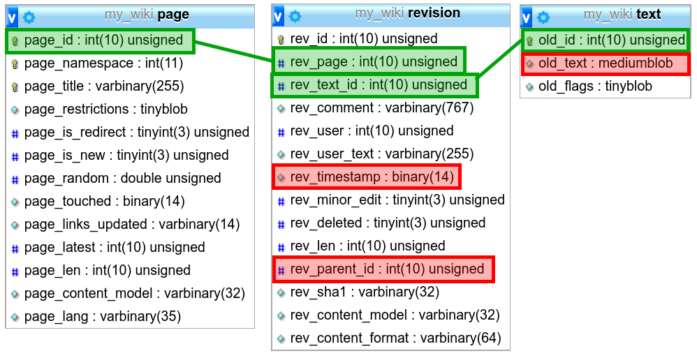
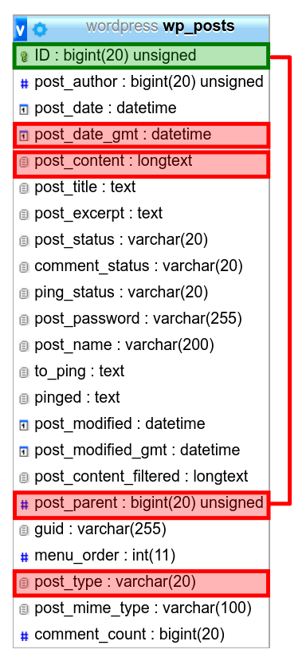
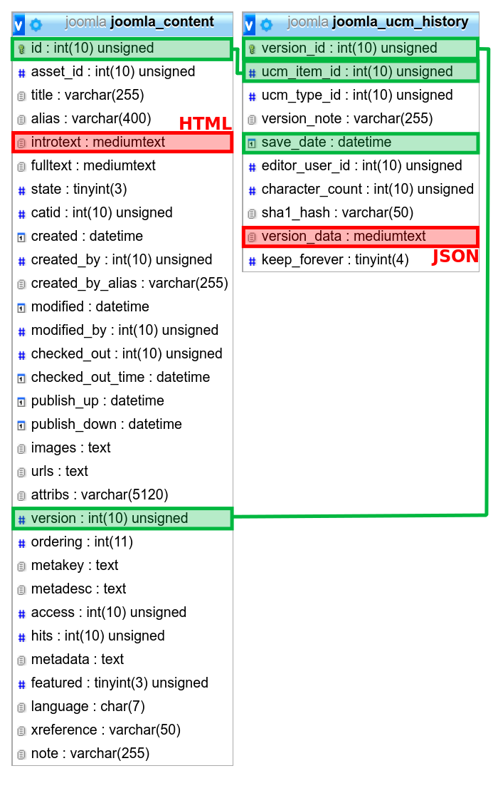

I'm currently building a service which contains a CMS. So I have pages of which
I want to store the history how they changed over time. I wonder what the
advantages / disadvantages of different options are.

I've looked at a couple of well-known CMS systems to see what they are doing
and to get a clearer picture about the different options.

## MediaWiki: Separate data from metadata

MediaWiki stores the bulk of information in a separate table called "text". The page-metadata is stored in "page", the revision metadata in "revision".

<figure class="wp-caption aligncenter img-thumbnail">
    
    <figcaption class="text-center">How MediaWiki stores page versions</figcaption>
</figure>

If they want to get the current text of a page, they have to do something like

    SELECT *
    FROM revision
    JOIN text ON text.old_id = revision.rev_text_id
    WHERE revision.rev_page = 1
    ORDER BY revision.rev_timestamp DESC LIMIT 1

If a page is edited, they have to insert to `revision` and to `text`. And there are some things like the title where changes are not tracked.

If one wants to revert edits, one creates a new revision. The text does not have to be duplicated, though. So one text entry can belong to multiple revisions.

Creating backups can be done separately for text and all other tables. This can be of advantage if the amount of data is huge. Also, the [`text.old_flags`](https://www.mediawiki.org/wiki/Manual:Text_table#old_flags) can contain compression flags - meaning old revisions can be compressed for more storage efficiency while the current one can be text for being able to show it quickly.

## Wordpress: One Table

Wordpress seems to have only one table where all revisions are stored. They decided to make the `post_type` either "post" or "revision" - meaning they always duplicate the current version, but they store all revisions and have a super easy time going back.

I wonder if backups would be more complicated if the amount of data reached the level Wikipedia has.

<figure class="wp-caption aligncenter img-thumbnail">
    
    <figcaption class="text-center">How Wordpress stores page versions</figcaption>
</figure>

## Joomla

Joomla seems to take an approach similar to Wordpress, but moving the versions
in another table. The current revision is always in `joomla_content`

<figure class="wp-caption aligncenter img-thumbnail">
    
    <figcaption class="text-center">How Joomla stores page versions</figcaption>
</figure>
