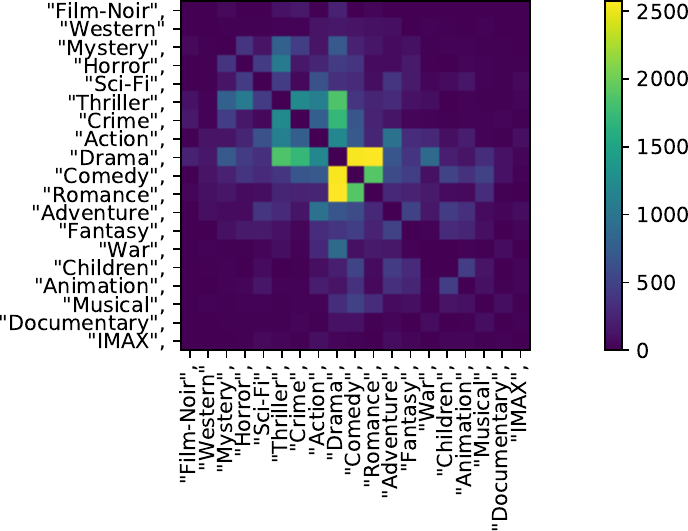

Exploratory Data Analysis (EDA) is nice and easy, if the entities you look at
are of one of the typical levels of measurement (see below). But if one feature
is a set, it becomes harder. In this post, I want to show a couple of
possibilities.


## Level of measurement

If you have features of this [level of measurement](https://en.wikipedia.org/wiki/Level_of_measurement).

<table border="1">
    <tr>
        <th rowspan="3">&nbsp;</th>
        <th colspan="5">Scale</th>
    </tr>
    <tr>
        <th colspan="2">Qualitative (categorical)</th>
        <th colspan="3">Quantitative (metric)</th>
    </tr>
    <tr>
        <th>Nominal-</th>
        <th>Ordinal-</th>
        <th>Intervall-</th>
        <th>Ratio-</th>
        <th>Absolute</th>
    </tr>
    <tr>
        <th>Empirical relations</th>
        <td>Equivalence</td>
        <td>Equivalence<br/>order</td>
        <td>Equivalence<br/>order<br/>emp. addition</td>
        <td>Equivalence<br/>order<br/>emp. addition<br/>emp. multipliation</td>
        <td>Equivalence<br/>order<br/>emp. addition<br/>emp. multipliation</td>
    </tr>
    <tr>
        <th>Allowed transformationen</th>
        <td>m' = f(m)<br/>f bijektive</td>
        <td>m' = f(m)<br/>f strictly monotonous</td>
        <td>m' = am+b<br/>with a&gt;0</td>
        <td>m' = am<br/>with a&gt;0</td>
        <td>m' = m</td>
    </tr>
    <tr>
        <th>Examples of this scale</th>
        <td>Telephone numbers, license plates, types, postal codes, gender</td>
        <td>Grades, Degrees of hardness, wind force</td>
        <td>Temp. in &deg;C, &deg;F, calendar time, geographic height</td>
        <td>Mass, length, el. current</td>
        <td>Number of particles, number of errors</td>
    </tr>
    <tr>
        <th>Values of m</th>
        <td>numbers, names, symbols</td>
        <td>usually natural numbers</td>
        <td>usually real numbers</td>
        <td>usually real numbers &gt; 0</td>
        <td>usually natural numbers</td>
    </tr>
</table>

## Datasets

### dblp

[dblp](https://en.wikipedia.org/wiki/DBLP) is a bibliography website which
contains publication data from almost 2 million publications.

Use [DBLPParser](https://github.com/IsaacChanghau/DBLPParser) to create a CSV
file.

```
from collections import Counter
import numpy as np
import pandas as pd
import progressbar
import networkx as nx
from itertools import combinations

import clana.io
import clana.visualize_cm

# Load the data
df = pd.read_csv('articles.csv')
df['author'] = df['author'].str.split('::')

# Analyze the data
df = df[~df['author'].isna()]
authors = [author
           for authorset in df['author'].tolist()
           for author in authorset]
author_count = Counter(authors)

print('* Publications: {}'.format(len(df)))
print('* Unique elements: {}'.format(len(author_count)))
print('* Most common:')
most_common = sorted(author_count.items(), key=lambda n: n[1], reverse=True)
for name, count in most_common[:10]:
    print('    {:>4}x {}'.format(count, name))

unique_authors = sorted(list(author_count.keys()))


def get_biggest_clusters(edges, n=10):
    G = nx.Graph()
    for authorset in edges.tolist():
        for author in authorset:
            G.add_node(author)

    for authorset in progressbar.progressbar(df['author'].tolist()[:10_000]):
        for author1, author2 in combinations(authorset, 2):
            G.add_edge(author1, author2)

    print("Edges were added")

    components = [c
                  for c in sorted(nx.connected_components(G),
                                  key=len,
                                  reverse=True)]
    return components[:n]


def create_matrix(nodes, edges):
    n2i = dict([(node, i) for i, node in enumerate(sorted(nodes))])
    # node to index
    mat = np.zeros((len(nodes), len(nodes)), dtype=np.int32)
    for edge in edges:
        for a, b in combinations(edge, 2):
            if a not in n2i or b not in n2i:
                continue
            mat[n2i[a]][n2i[b]] += 1
            if a != b:
                mat[n2i[b]][n2i[a]] += 1
    return mat, sorted(nodes)


components = get_biggest_clusters(df['author'])
print('* Biggest clusters: {}'.format([len(el) for el in components]))

component_w_publications = [(author, author_count[author])
                            for author in components[0]]
component_w_publications = sorted(component_w_publications,
                                  key=lambda n: n[1],
                                  reverse=True)
authors = [author for author, count in component_w_publications[:1_00]]
mat, labels = create_matrix(authors, df['author'].tolist())

clana.visualize_cm.main('coauthors.json',
                        perm_file='',
                        steps=1_000_000,
                        labels_file='labels.json',
                        zero_diagonal=False,
                        output='cm-ordered.pdf')
clana.io.write_cm('coauthors.json', mat)
clana.io.write_labels('labels.json', labels)
```

Results:

```
* Publications: 2,054,474
* Unique elements: 1,475,717
* Most common
    1181x H. Vincent Poor
     789x Lajos Hanzo
     767x Witold Pedrycz
     747x Mohamed-Slim Alouini
     615x Chin-Chen Chang 0001
     607x Dacheng Tao
     591x Victor C. M. Leung
     570x Wei Zhang
     562x Wei Li
     554x Wei Wang
* Biggest clusters (under first 10^6 publications): [761987, 52, 45, 44, 32, 31, 29, 28, 28, 28]
```

Then you can apply confusion matrix ordering to find authors who often work
together (click on it to see large version):

<figure class="wp-caption aligncenter img-thumbnail">
    <a href="../pdf/dblp-1000-cmo.pdf"></a>
    <figcaption class="text-center">Similar Authors found with CMO</figcaption>
</figure>

The CMO technique is described in

> Thoma, Martin. "Analysis and optimization of convolutional neural network architectures." [arXiv preprint arXiv:1707.09725](https://arxiv.org/pdf/1707.09725.pdf) (2017). Chapter 5.2.


## MovieLens 20M

```
from collections import Counter
import numpy as np
import pandas as pd
import progressbar
import networkx as nx
from itertools import combinations

import clana.io
import clana.visualize_cm

# Load the data
df = pd.read_csv('movies.csv')
df['genres'] = df['genres'].str.split('|')

# Analyze the data
list_values = [value
               for valueset in df['genres'].tolist()
               for value in valueset]
value_count = Counter(list_values)

print('* Movies: {}'.format(len(df)))
print('* Unique genres: {}'.format(len(value_count)))
print('* Most common:')
most_common = sorted(value_count.items(), key=lambda n: n[1], reverse=True)
for name, count in most_common[:10]:
    print('    {:>4}x {}'.format(count, name))

unique_genres = sorted(list(value_count.keys()))


def get_biggest_clusters(edges, n=10):
    G = nx.Graph()
    for authorset in edges.tolist():
        for author in authorset:
            G.add_node(author)

    for authorset in progressbar.progressbar(df['genres'].tolist()[:10_000]):
        for author1, author2 in combinations(authorset, 2):
            G.add_edge(author1, author2)

    print("Edges were added")

    components = [c
                  for c in sorted(nx.connected_components(G),
                                  key=len,
                                  reverse=True)]
    return components[:n]


def create_matrix(nodes, edges):
    n2i = dict([(node, i) for i, node in enumerate(sorted(nodes))])
    # node to index
    mat = np.zeros((len(nodes), len(nodes)), dtype=np.int32)
    for edge in edges:
        for a, b in combinations(edge, 2):
            if a not in n2i or b not in n2i:
                continue
            mat[n2i[a]][n2i[b]] += 1
            if a != b:
                mat[n2i[b]][n2i[a]] += 1
    return mat, sorted(nodes)


components = get_biggest_clusters(df['genres'])
print('* Biggest clusters: {}'.format([len(el) for el in components]))

component_w_publications = [(author, value_count[author])
                            for author in components[0]]
component_w_publications = sorted(component_w_publications,
                                  key=lambda n: n[1],
                                  reverse=True)
authors = [author for author, count in component_w_publications[:1_00]]
mat, labels = create_matrix(authors, df['genres'].tolist())

clana.io.write_cm('genre-combinations.json', mat)
clana.io.write_labels('labels.json', labels)
clana.visualize_cm.main('genre-combinations.json',
                        perm_file='',
                        steps=1_000_000,
                        labels_file='labels.json',
                        zero_diagonal=False,
                        output='cm-genre-combinations.pdf')
```

Results:

```
* Movies: 27278
* Unique genres: 20
* Most common:
    13344x Drama
     8374x Comedy
     4178x Thriller
     4127x Romance
     3520x Action
     2939x Crime
     2611x Horror
     2471x Documentary
     2329x Adventure
     1743x Sci-Fi
```


CMO:

<figure class="wp-caption aligncenter img-thumbnail">
    <a href="../images/2019/07/cmo-genre-combinations.png"></a>
    <figcaption class="text-center">Genre-Combinations</figcaption>
</figure>


## See also

* [What is the level of measurement / name of the scale of list-features?](https://datascience.stackexchange.com/q/55181/8820)
