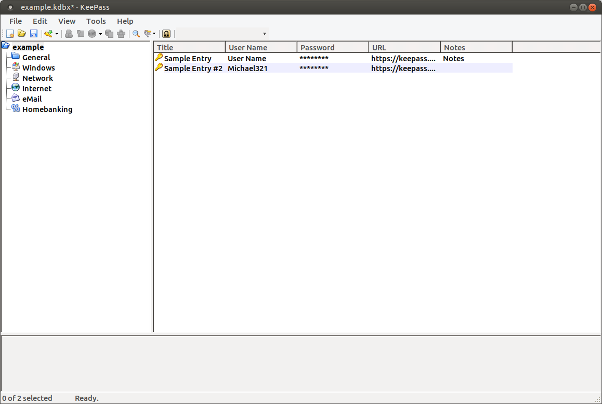

I recently thought about good solutions for passwords
in general. I have found one with which I was ok for a while, but more and more
services get compromised. Try [haveibeenpwned.com](https://haveibeenpwned.com/) or [Firefox Monitor](https://monitor.firefox.com/) to see if you are affected. One easy way
to keep the damage small is not to re-use passwords. It is impractical to have
strong passwords for every web service I use. I have to either use a password
service or note things down.

A good way of creating a single strong password is [diceware](https://www.youtube.com/watch?v=Pe_3cFuSw1E). Once you have this, you should create a new password for
every single service and keep it in your password manager.

This article focuses on what a good password manager is. I will judge them in
three categories:

* **Security**: Are the passwords locally encrypted strong enough? How many
  incidents happened so far? Does it support 2FA / MFA?
* **Usability**: Is it convenient to use? Is it available on Linux and Android?
  Can I use it outside of the browser (e.g. if the password field is not
  detected). Does it have an UI for generating strong random passwords when
  creating a new account?
* **Long-Term Support**: Is this backed by a (bigger) company / a team of
  developers? Is there vendor-locking?

## Google Smart Lock

[Google Smart Lock](https://support.google.com/accounts/answer/6197437?hl=en&visit_id=637048670466644275-4172869288&rd=1) is another password manager. If you use Google Chrome, chances are high that you are already using it.

## LastPass

[LastPass](https://en.wikipedia.org/wiki/LastPass) is developed by LogMeIn
since 2015. The initial release was in 2008.

### Security

The wikipedia page lists four security incidents and one security breach:

* 2011: Network anomaly; unclear if anything actually happened.
* 2015: LastPass account email addresses, password reminders, server per user
  salts, and authentication hashes were compromised; however, encrypted user
  vault data had not been affected.
* 2016: Detectify and Google Security found an issue in URL parsing
* 2016: Hardcoded Master Key in LastPass Password Manager ([SIK-2016-022](https://team-sik.org/sik-2016-022/))
* 2016: Privacy, Data leakage in LastPass Browser Search ([SIK-2016-023](https://team-sik.org/sik-2016-023/))
* 2016: Read Private Date (Stored Masterpassword) from LastPass Password Manager ([SIK-2016-024](https://team-sik.org/sik-2016-024/))
* 2017: [Tavis Ormandy](https://en.wikipedia.org/wiki/Tavis_Ormandy) (Google Security / Project Zero) found another issue in the browser extension
* 2019: [Password-exposing bug purged from LastPass extensions](https://arstechnica.com/information-technology/2019/09/lastpass-fixes-bug-that-leaked-the-password-of-last-logged-in-account/), [Tweet](https://twitter.com/taviso/status/1173401754257375232)

## KeePass

[KeePass](https://en.wikipedia.org/wiki/KeePass) is developed by Dominik Reichl.
It is free and open source.

<figure class="wp-caption aligncenter img-thumbnail">
    
    <figcaption class="text-center">Keepass 2.38 on Ubuntu 18.04</figcaption>
</figure>

## KeePassX

[KeePassX](https://en.wikipedia.org/wiki/KeePassX) started in 2016 as a port of KeePass to Linux. The [code is on Github](https://github.com/keepassx/keepassx) and it has
4063&nbsp;stars and 591&nbsp;forks. It's mostly C++.

The last version was released in 2016, so about 3 years ago. **KeePassX is not maintained**.[^2]

## KeePassXC

[KeePassXC](https://en.wikipedia.org/wiki/KeePassXC) is a fork of KeePassX.

## Dashlane

[Dashlane](https://en.wikipedia.org/wiki/Dashlane) was initially released in 2012.

Dashlane supports secure file storage.

### Security

* [SIK-2016-028](https://team-sik.org/sik-2016-028/): Read Private Data From App Folder in Dashlane Password Manager
* [SIK-2016-029](https://team-sik.org/sik-2016-029/): Google Search Information Leakage in Dashlane Password Manager Browser
* [SIK-2016-030](https://team-sik.org/sik-2016-030/): Residue Attack Extracting Masterpassword From Dashlane Password Manager
* [SIK-2016-031](https://team-sik.org/sik-2016-031/): Subdomain Password Leakage in Internal Dashlane Password Manager Browser

## 1Password

[1Password](https://en.wikipedia.org/wiki/1Password) was initially released in 2006 by [AgileBits Inc](https://www.linkedin.com/company/agilebits-inc/about/).

### Security

* [SIK-2016-038](https://team-sik.org/sik-2016-038/): Subdomain Password Leakage in 1Password Internal Browser
* [SIK-2016-039](https://team-sik.org/sik-2016-039/): Https downgrade to http URL by default in 1Password Internal Browser
* [SIK-2016-040](https://team-sik.org/sik-2016-040/): Titles and URLs Not Encrypted in 1Password Database
* [SIK-2016-041](https://team-sik.org/sik-2016-041/): Read Private Data From App Folder in 1Password Manager
* [SIK-2016-042](https://team-sik.org/sik-2016-042/): Privacy Issue, Information Leaked to Vendor 1Password Manager

## Comparison

### Functionality

<table class="table">
    <thead>
    <tr>
        <th>&nbsp;</th>
        <th><a href="https://www.lastpass.com">LastPass</a></th>
        <th><a href="https://www.dashlane.com">Dashlane</a></th>
        <th><a href="https://1password.com">1Password</a></th>
        <th><a href="https://keepass.info/">KeePass</a></th>
        <th><a href="https://keepassxc.org/">KeePassXC</a></th>
    </tr>
    </thead>
    <tbody>
    <tr>
        <th title="The password can be stored in the cloud">Online</th>
        <td class="text-center" style="background-color: #c0f4c0; color: green;">✓</td>
        <td class="text-center" style="background-color: #c0f4c0; color: green;">✓</td>
        <td class="text-center" style="background-color: #c0f4c0; color: green;" title="Confirmed by Sören">✓</td>
        <td class="text-center" style="background-color: #ffaeae; color: red;">✗</td>
        <td class="text-center">?</td>
    </tr>
    <tr>
        <th title="The password can be stored offline">Offline</th>
        <td class="text-center" style="background-color: #ffaeae; color: red;">✗</td>
        <td class="text-center" style="background-color: #c0f4c0; color: green;">✓</td>
        <td class="text-center" style="background-color: #c0f4c0; color: green;">✓</td>
        <td class="text-center" style="background-color: #c0f4c0; color: green;">✓</td>
        <td class="text-center">?</td>
    </tr>
    <tr>
        <th title="Two-Factor Authentication">2FA</th>
        <td class="text-center" style="background-color: #c0f4c0; color: green;"><a href="https://www.lastpass.com/de/products/multifactor-authentication">✓</a></td>
        <td class="text-center" style="background-color: #c0f4c0; color: green;"><a href="https://support.dashlane.com/hc/de/articles/202625042-Schutz-Ihres-Kontos-durch-Zwei-Faktor-Authentifizierung">✓</a></td>
        <td class="text-center" style="background-color: #c0f4c0; color: green;"><a href="https://support.1password.com/two-factor-authentication/">✓</a></td>
        <td class="text-center" style="background-color: #c0f4c0; color: green;"><a href="https://www.heise.de/ratgeber/Zwei-Faktor-Authentifizierung-mit-dem-Passwortmanager-KeePass-4239579.html">✓</a></td>
        <td class="text-center" style="background-color: #c0f4c0; color: green;"><a href="https://keepassxc.org/project/" title="YubiKey">✓</a></td>
    </tr>
    <tr>
        <th title="Is a newly entered password automatically captured?">Password Capture</th>
        <td class="text-center">?</td>
        <td class="text-center">?</td>
        <td class="text-center" style="background-color: #c0f4c0; color: green;" title="Confirmed by Sören">✓</td>
        <td class="text-center" style="background-color: #ffaeae; color: red;">✗</td>
        <td class="text-center"></td>
    </tr>
    <tr>
        <th title="Can the password manager direct you to the page where you can change your password?">Password Changes</th>
        <td class="text-center">?</td>
        <td class="text-center">?</td>
        <td class="text-center" style="background-color: #c0f4c0; color: green;" title="Confirmed by Sören">✓</td>
        <td class="text-center" style="background-color: #ffaeae; color: red;">✗</td>
        <td class="text-center"></td>
    </tr>
    <tr>
        <th title="Does the password manager send a security alert in case of a breach?">Security Alerts</th>
        <td class="text-center" style="color: green;"><a href="https://support.logmeininc.com/lastpass/help/add-an-email-address-for-security-alerts-lp030007">✓</a></td>
        <td class="text-center" style="color: green;"><a href="https://support.dashlane.com/hc/de/articles/360000038180-Was-sind-Sicherheitswarnungen-und-Dark-Web-Warnungen-und-wie-soll-ich-darauf-reagieren-">✓</a></td>
        <td class="text-center" style="color: green;"><a href="https://watchtower.1password.com/">✓</a></td>
        <td class="text-center"><a href="https://keepass.info/help/kb/sec_issues.html">~</a></td>
        <td class="text-center" style="color: red;">✗</td>
    </tr>
    <tr>
        <th>Password Generator</th>
        <td class="text-center">?</td>
        <td class="text-center">?</td>
        <td class="text-center" style="background-color: #c0f4c0; color: green;" title="Confirmed by Sören">✓</td>
        <td class="text-center" style="background-color: #c0f4c0; color: green;">✓</td>
        <td></td>
    </tr>
    <tr>
        <th title="This includes weak passwords and reused passwords">Insecure Password warnings</th>
        <td class="text-center" style="background-color: #c0f4c0; color: green;"><a href="https://blog.lastpass.com/2013/03/lastpass-now-warns-you-when-youre-using-a-weak-or-duplicate-password.html/">✓</a></td>
        <td class="text-center" style="background-color: #c0f4c0; color: green;"><a href="https://support.dashlane.com/hc/en-us/articles/202699411-How-to-use-Dashlane-to-find-out-how-secure-you-are">✓</a></td>
        <td class="text-center" style="background-color: #c0f4c0; color: green;"><a href="https://discussions.agilebits.com/discussion/95438/reused-password-warning">✓</a></td>
        <td class="text-center" style="background-color: #ffaeae; color: red;">✗</td>
        <td class="text-center"></td>
    </tr>
    <tr>
        <th>Import</th>
        <td class="text-center" style="background-color: #c0f4c0; color: green;"><a href="https://support.logmeininc.com/lastpass/help/import-passwords-from-other-sources-lp040003">✓</a></td>
        <td class="text-center" style="background-color: #c0f4c0; color: green;"><a href="https://support.dashlane.com/hc/de/sections/200961042-Daten-in-Dashlane-importieren">✓</a></td>
        <td class="text-center" style="background-color: #c0f4c0; color: green;"><a href="https://support.1password.com/import/">✓</a></td>
        <td class="text-center" style="background-color: #c0f4c0; color: green;"><a href="https://keepass.info/help/base/importexport.html">✓</a></td>
        <td class="text-center" style="background-color: #c0f4c0; color: green;"><a href="https://keepass.info/help/base/importexport.html">✓</a></td>
    </tr>
    <tr>
        <th>Export</th>
        <td class="text-center" style="background-color: #c0f4c0; color: green;"><a href="https://support.logmeininc.com/lastpass/help/export-your-passwords-and-secure-notes-lp040004">✓</a></td>
        <td class="text-center" style="background-color: #c0f4c0; color: green;"><a href="https://support.dashlane.com/hc/de/articles/202625252">✓</a></td>
        <td class="text-center" style="background-color: #c0f4c0; color: green;"><a href="https://support.1password.com/export/">✓</a></td>
        <td class="text-center" style="background-color: #c0f4c0; color: green;"><a href="https://keepass.info/help/base/importexport.html">✓</a></td>
        <td class="text-center" style="background-color: #c0f4c0; color: green;"><a href="https://keepass.info/help/base/importexport.html">✓</a></td>
    </tr>
    <tr>
        <th>Secure File Storage</th>
        <td class="text-center" ></td>
        <td class="text-center" style="background-color: #c0f4c0; color: green;"><a href="https://support.dashlane.com/hc/en-us/articles/360001152965-How-to-use-Secure-File-Storage">✓</a></td>
        <td class="text-center" style="background-color: #c0f4c0; color: green;"><a href="https://support.1password.com/files/">✓</a></td>
        <td class="text-center" ></td>
        <td class="text-center" ></td>
    </tr>
    </tbody>
</table>

### Usability

<table class="table">
    <thead>
    <tr>
        <th>&nbsp;</th>
        <th><a href="https://www.lastpass.com">LastPass</a></th>
        <th><a href="https://www.dashlane.com">Dashlane</a></th>
        <th><a href="https://1password.com">1Password</a></th>
        <th><a href="https://keepass.info/">KeePass</a></th>
        <th><a href="https://keepassxc.org/">KeePassXC</a></th>
    </tr>
    </thead>
    <tbody>
    <tr>
        <th>Chrome Integration</th>
        <td class="text-center" style="background-color: #c0f4c0; color: green;"><a href="https://chrome.google.com/webstore/detail/lastpass-free-password-ma/hdokiejnpimakedhajhdlcegeplioahd?hl=de">4.6 🟊</a>, *</td>
        <td class="text-center" style="background-color: #c0f4c0; color: green;"><a href="https://chrome.google.com/webstore/detail/dashlane-password-manager/fdjamakpfbbddfjaooikfcpapjohcfmg?hl=de">3.6 🟊</a></td>
        <td class="text-center" style="background-color: #c0f4c0; color: green;"><a href="https://chrome.google.com/webstore/detail/1password-extension-deskt/aomjjhallfgjeglblehebfpbcfeobpgk?hl=de">3.5 🟊</a></td>
        <td class="text-center" style="background-color: #ffaeae; color: red;">✗</td>
        <td class="text-center" style="background-color: #c0f4c0; color: green;"><a href="https://chrome.google.com/webstore/detail/keepassxc-browser/oboonakemofpalcgghocfoadofidjkkk?hl=de">3.5 🟊</a></td>
    </tr>
    <tr>
        <th>Firefox Integration</th>
        <td class="text-center">?</td>
        <td class="text-center">?</td>
        <td class="text-center" style="background-color: #c0f4c0; color: green;"><a href="https://addons.mozilla.org/de/firefox/addon/1password-x-password-manager/?src=search">4.2 🟊</a></td>
        <td class="text-center">?</td>
        <td class="text-center">?</td>
    </tr>
    <tr>
        <th>Android Application</th>
        <td class="text-center" style="background-color: #c0f4c0; color: green;"><a href="https://play.google.com/store/apps/details?id=com.lastpass.lpandroid&hl=de">4.4 🟊</a></td>
        <td class="text-center" style="background-color: #c0f4c0; color: green;"><a href="https://play.google.com/store/apps/details?id=com.dashlane&hl=de">4.6 🟊</a></td>
        <td class="text-center" style="background-color: #c0f4c0; color: green;"><a href="https://play.google.com/store/apps/details?id=com.agilebits.onepassword&hl=de">4.1 🟊</a></td>
        <td class="text-center"><a href="https://play.google.com/store/search?q=keepass&c=apps&hl=de">?</a></td>
        <td class="text-center"><a href="https://play.google.com/store/search?q=keepass&c=apps&hl=de">?</a></td>
    </tr>
    <tr>
        <th>iOS Application</th>
        <td class="text-center" style="background-color: #c0f4c0; color: green;"><a href="https://apps.apple.com/de/app/lastpass-passwort-manager/id324613447">4.4 🟊</a></td>
        <td class="text-center" style="background-color: #c0f4c0; color: green;"><a href="https://apps.apple.com/de/app/dashlane/id552383089?mt=12">4.6 🟊</a></td>
        <td class="text-center" style="background-color: #c0f4c0; color: green;" title="Confirmed by my colleague Romeo"><a href="https://apps.apple.com/de/app/1password-password-manager/id568903335">4.3 🟊</a></td>
        <td class="text-center" style="background-color: #ffaeae; color: red;">✗</td>
        <td class="text-center" style="background-color: #ffaeae; color: red;">✗</td>
    </tr>
    <tr>
        <th>Windows</th>
        <td class="text-center" style="background-color: #c0f4c0; color: green;"><a href="https://lastpass.com/misc_download2.php?tab=windows&anchor=cr&lang=de">✓</a></td>
        <td class="text-center" style="background-color: #c0f4c0; color: green;"><a href="https://support.dashlane.com/hc/de/articles/202637722-Dashlane-unter-Windows-installieren">✓</a></td>
        <td class="text-center" style="background-color: #c0f4c0; color: green;"><a href="https://1password.com/de/downloads/windows/">✓</a></td>
        <td class="text-center" style="background-color: #c0f4c0; color: green;"><a href="https://keepass.info/download.html">✓</a></td>
        <td class="text-center" style="background-color: #c0f4c0; color: green;"><a href="https://keepassxc.org/download/#windows">✓</a></td>
    </tr>
    <tr>
        <th>Linux</th>
        <td class="text-center" style="background-color: #c0f4c0; color: green;"><a href="https://lastpass.com/misc_download2.php?tab=windows&anchor=cr&lang=de">✓</a></td>
        <td class="text-center" style="background-color: #c0f4c0; color: green;"><a href="https://support.dashlane.com/hc/de/articles/115005432325-Ein-Dashlane-Konto-f%C3%BCr-Linux-und-Chromebook-anlegen">✓</a></td>
        <td class="text-center" style="background-color: #c0f4c0; color: green;"><a href="https://1password.com/de/downloads/linux/">✓</a></td>
        <td class="text-center" style="background-color: #c0f4c0; color: green;"><a href="https://packages.ubuntu.com/disco/keepass2">✓</a></td>
        <td class="text-center" style="background-color: #c0f4c0; color: green;"><a href="https://packages.ubuntu.com/disco/keepassxc">✓</a></td>
    </tr>
    <tr>
        <th>Mac</th>
        <td class="text-center" style="background-color: #c0f4c0; color: green;"><a href="https://helpdesk.lastpass.com/de/mac-app/">✓</a></td>
        <td class="text-center" >?</td>
        <td class="text-center" style="background-color: #c0f4c0; color: green;" title="Confirmed by my colleague Romeo"><a href="https://1password.com/de/downloads/mac/">✓</a></td>
        <td class="text-center" >?</td>
        <td class="text-center" style="background-color: #c0f4c0; color: green;"><a href="https://keepassxc.org/download/#mac">✓</a></td>
    </tr>
    </tbody>
</table>

### Long-Term Support

<table class="table">
    <thead>
    <tr>
        <th>&nbsp;</th>
        <th><a href="https://www.lastpass.com">LastPass</a></th>
        <th><a href="https://www.dashlane.com">Dashlane</a></th>
        <th><a href="https://1password.com">1Password</a></th>
        <th><a href="https://keepass.info/">KeePass</a></th>
        <th><a href="https://keepassxc.org/">KeePassXC</a></th>
    </tr>
    </thead>
    <tbody>
    <tr>
        <th>Users</th>
        <td><a href="https://blog.lastpass.com/2018/07/celebrating-10-years-lastpass.html/">16.8&nbsp;million</a></td>
        <td><a href="https://www.dashlane.com/de/about">11&nbsp;million</a></td>
        <td><a href="https://www.quora.com/How-many-users-does-1Password-have/answer/Khad-Young">millions</a></td>
        <td>?</td>
        <td>?</td>
    </tr>
    <tr>
        <th>Companies</th>
        <td><a href="https://www.lastpass.com/de/pricing">58000</a></td>
        <td>?</td>
        <td>?</td>
        <td>?</td>
        <td>?</td>
    </tr>
    <tr>
        <th>Developer(s)</th>
        <td><a href="https://en.wikipedia.org/wiki/LogMeIn">LogMeIn</a></td>
        <td><a href="https://en.wikipedia.org/wiki/Dashlane">Dashlane</a></td>
        <td><a href="https://www.linkedin.com/company/agilebits-inc/about/">AgileBits, Inc.</a></td>
        <td><a href="https://www.dominik-reichl.de/index.html">Dominik Reichl</a></td>
        <td><a href="https://en.wikipedia.org/wiki/KeePassXC">KeePassXC</a></td>
    </tr>
    <tr>
        <th>Employees</th>
        <td>2778</td>
        <td><a href="https://www.dashlane.com/de/about/team">181</a></td>
        <td><a href="https://1password.com/de/company/">155</a></td>
        <td>1</td>
        <td>6 / <a href="https://github.com/keepassxreboot/keepassxc">190</a></td>
    </tr>
    <tr>
        <th>Price</th>
        <td><a href="https://www.lastpass.com/de/pricing">2.67 EUR/month</a></td>
        <td><a href="https://www.dashlane.com/de/plans">3.33 EUR/month</a></td>
        <td><a href="https://1password.com/de/sign-up/">2.72 EUR/month</a></td>
        <td>free</td>
        <td>free</td>
    </tr>
    <tr>
        <th>Revenue</th>
        <td><a href="https://www.globenewswire.com/news-release/2018/02/15/1349176/0/en/LogMeIn-Announces-Fourth-Quarter-and-Fiscal-Year-2017-Results.html">$1024M</a></td>
        <td><a href="https://www.owler.com/company/dashlane">$21M</a><a href="https://techcrunch.com/2019/04/12/password-manager-dashlane-closes-on-30m-adds-former-spotify-cmo-to-board/">1</a></td>
        <td><a href="https://www.owler.com/company/1password">$30M</a></td>
        <td>-</td>
        <td>-</td>
    </tr>
    </tbody>
</table>

## TL;DR

* Google Chromes internal password manager + [Firefox Monitor](https://monitor.firefox.com/) + <a href="https://passwordsgenerator.net/">passwordsgenerator.net</a> works quite fine.
* LastPass and 1Password look ok. A colleague used both on Mac and prefered 1Password.
* KeePass is free software, but the design doesn't look good and the
  integrations might make it hard to use

## See also

* [Keeper](https://en.wikipedia.org/wiki/Keeper_(password_manager)): [Security incident](https://twitter.com/taviso/status/941710362717470720)
* Martin Monperrus: [What's the difference between KeePass and KeePassX?](https://superuser.com/q/878902/64857), February 2017.
* Wikipedia: [List of password managers](https://en.wikipedia.org/wiki/List_of_password_managers)
* [KeeWeb](https://keeweb.info/)
* Thomas Claburn: [Security slip-ups in 1Password and other password managers 'extremely worrying'](https://www.theregister.co.uk/2017/02/28/flaws_in_password_management_apps/), 2017.
* Mac: MacPass and [Keychain](https://en.wikipedia.org/wiki/Keychain_(software))
* [pass](https://www.passwordstore.org/)

## Footnotes

[^2]: Reddit: [KeePass vs KeePassX](https://www.reddit.com/r/privacy/comments/6inegj/keepass_vs_keepassx/), 2017.
