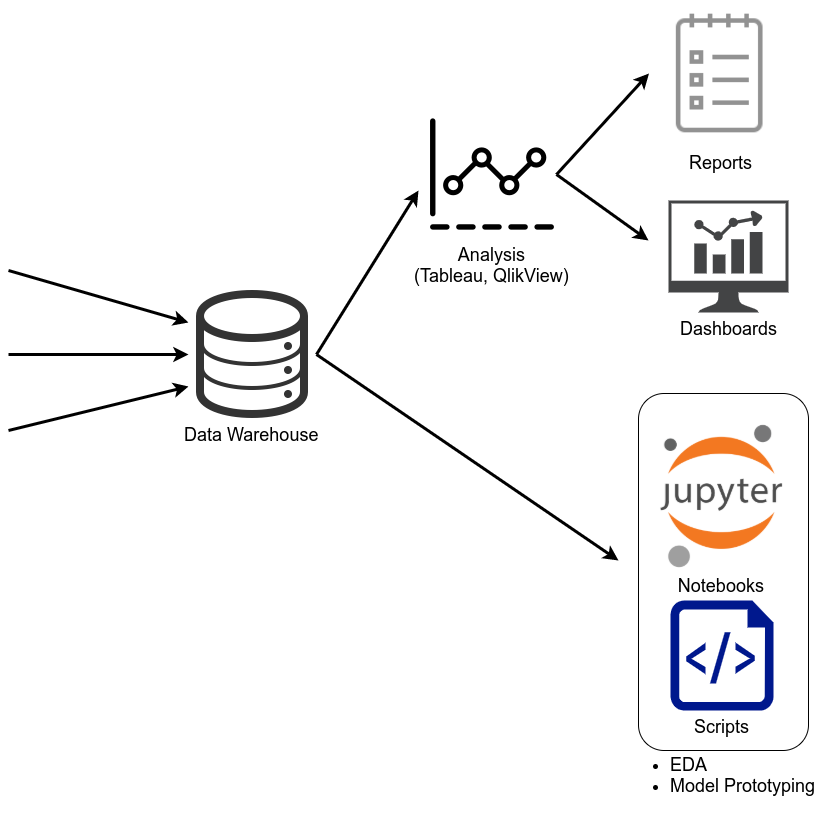

"Data is the new oil", "we need to be data driven",
"we need to apply AI to keep being competitive" are some of the prashes I hear
a lot. As I haven't seen yet a clear article pointing out what is done with
the data ... here you are 🙂

## Why it's complicated

Coorporations have a lot of data which is analyzed under different aspects
all the time. Micro services are built which have their own data flows,
applications and services are updated while they are running. Bugs get fixed.
All of this makes the data very heterogenous.

Data quality problems include:

* **Mixed attribute availability**: Changes and bugs lead to NULL values.
* **Semantic Changes**: The applications which produce the data might change.
  Maybe you have "price" column somewhere. At one point it included tax, at
  another it doesn't. Time might be local, server and UTC. Durations might be
  seconds and milliseconds.
* **Consistency**: The data format might change. Maybe the user name is sometimes "FIRSTNAME
  LASTNAME" and in other cases "LASTNAME, FIRSTNAME".
* **Duplicates**: Some entries might be duplicated, e.g. multiple form submission.

Engineering problems include:

* **Big Data**: The amount of data might be bigger than what fits into memory.
  Maybe even bigger than what fits on a single machine.
* **Fast Data**: The incoming data might need to be processed in a few
  milliseconds.
* **Privacy**: How do we make the platform GDPR complient?
* **Security**: Authentifiction and Authorization

<!--

Buzz-Words: label label-warning
Technologies: label label-primary
Roles: label label-info
    --->

## Data Warehouse

If you have many different data sources and you want to analyze them often, you
want a [Data Warehouse](https://en.wikipedia.org/wiki/Data_warehouse) (DWH). A
central place where the data lives. It is likely not completely recent, but
should not be too old either. One Data Warehousing solution as a service
is [Snowflake](https://en.wikipedia.org/wiki/Snowflake_Inc.).
[Amazon Redshift](https://en.wikipedia.org/wiki/Amazon_Redshift) is another one
([promo video](https://www.youtube.com/watch?v=_qKm6o1zK3U)).
You can execute SQL queries in those warehouses. So you can already make use of
that data to answer simple questions.

## Reports and Dashboards

Sometimes a table as a result is not enough. You need graphics. The first step
might be Excel, but very often this is cumbersome as the data load is too big,
as one needs to download the data from the warehouse. Then
[Tableau](https://en.wikipedia.org/wiki/Tableau_Software)
([promo&nbsp;video](https://www.youtube.com/watch?v=VUVqj7YsWmU)) and
[QlikView](https://en.wikipedia.org/wiki/Qlik)
([promo&nbsp;video](https://www.youtube.com/watch?v=sqILcEwlHSI)) come into
play. The Buzzword here are data driven and self-service BI. People using
this software are often called Business
Analysts and work in an <i>BI department</i>. They usually create
dashboards and reports which drive business decisions.

If the company has a lot of very different data, a
data dictionary might help. In the
simplest case, it could be a word document. A bit more advanced would be to
use the comment attribute for columns in databases. Then there are tools
like <a href="https://dataedo.com/">dataedo</a> as well.

## POC: Model creation

Sometimes, analysis of the past behavior is not enough. You need a predictive
model for future cases. Maybe even have it as a part of a customer-facing
product. Now you need a Data Scientist.
The work starts at the warehouse. As the warehouses and QlikView / Tableaus
options are too limited, the data scientist gets a dump of the relevant parts.
This might include some aggregtions, filtering and unions in the warehouse
before, but at some point it will likely be imported in an environment where
Python can be used. The Data Scientist analyzes the data, e.g. with a
[Jupyter&nbsp;Notebook](https://en.wikipedia.org/wiki/Project_Jupyter). Usually
the data contains many problems like unrealistic values or missing data (NULL
values). Then the model creation part starts. This could still happen in the
Notebook. To solve the prediction task, the data scientist might use models
such as <a href="https://en.wikipedia.org/wiki/Support-vector_machine" class="label label-danger">SVMs</a>, <a href="https://en.wikipedia.org/wiki/Artificial_neural_network" class="label label-danger">neural networks</a> or <a href="https://en.wikipedia.org/wiki/Random_forest" class="label label-danger">Random Forests</a>.

The data scientists create a <dfn>Proof of Concept (PoC)</dfn>. The model is
not in a state to be used directly in production, because a lot of the cables
might not be connected. But it should be clear from the PoC if the data allows
building the kind of model you want to have. A valid outcome of the PoC is that
it is (currently) not possible.

The two parts that can consume arbitrary much time are data cleaning and model
optimization. Even after the PoC. If you're interested in that topic, ping me
in the comments.

<figure class="wp-caption aligncenter img-thumbnail">
    
    <figcaption class="text-center">Relationship between Data Warehouse, Reports, Dashboards and Notebooks</figcaption>
</figure>

## From POC to MVP

There might be a "prototype" step in between. It might be that the data science work looks promising, but too many questions are still unclear from the look-and-feel of the product. For the real product one needs a lot of developer time for making sure it scales well, having a nice design and making sure to get the security parts right. Instead of investing that time right away, one might create a prototype which cuts corners and gives internal stakeholders a better impression of the end product. They can then decide if they want to invest the money to create an MVP.

Once the model is ready and seems to work well enough for practice, a Data&nbsp;Engineer gets involved. The mentioned
delay a Data Warehouse often has and the different kind of workload the model
typically requires makes it necessary to get the data from a different source.
If it should be event-based, it might be <a
href="https://en.wikipedia.org/wiki/Apache_Kafka" class="label label-primary">Apache&nbsp;Kafka</a> for
messaging or <a
href="https://en.wikipedia.org/wiki/Apache_Flink" class="label label-primary">Apache&nbsp;Flink</a>.
The important point to notice here is that machine learning models typically
contain two seperate phases: Model training and model inference. At training
time, one needs to process a lot of data and needs a lot of computational
power. At inference time, each requests data is tiny. The amount of computation
necessary is small. So it is a mixed execution mode: Regularly re-train a model
in a batch-way and have a continuously running service for inference.
They might build things like <a href="https://milinda.pathirage.org/kappa-architecture.com/" class="label label-danger">Kappa Architectures</a> or <a href="https://en.wikipedia.org/wiki/Lambda_architecture" class="label label-danger">Lambda Architectures</a>. To
do so, many cloud technologies can be used (see "Cloud Service Overview").

If you wish to get more information about this part, ping me in the comments.

## Cloud Service Overview

The following cloud services might be used to create services which run in
the cloud:

<dl>
    <dt><dfn>AWS Lambda</dfn> Compute</dt>
    <dd>Running small and short scripts after a triggering event. Has a delay of a couple of seconds. Provides Computational Resources.</dd>
    <dt><dfn>AWS Cloudformation</dfn></dt>
    <dd>Infrastructure as Code (IaC) Tool</dd>
    <dt><dfn>AWS EC2</dfn> Compute (<a href="https://docs.aws.amazon.com/AWSEC2/latest/UserGuide/concepts.html">AWS</a>)</dt>
    <dd>provides scalable computing capacity; </dd>
    <dt><dfn>AWS S3</dfn> Storage</dt>
    <dd>Store Files</dd>
    <dt><dfn>AWS InnoDB</dfn> Storage</dt>
    <dd>Key-Value Store</dd>
    <dt><dfn>AWS SSM</dfn> Storage</dt>
    <dd>Store Passwords and configuration</dd>
    <dt><dfn>AWS Athena</dfn></dt>
    <dd>run interactive queries directly against data in Amazon S3</dd>
    <dt><dfn>AWS Kinesis</dfn></dt>
    <dd>a real-time data processing platform</dd>
    <dt><dfn>AWS Redshift</dfn></dt>
    <dd>fully managed, petabyte-scale data warehouse to run complex queries on collections of structured data</dd>
    <dt><dfn>Amazon EMR</dfn></dt>
    <dd>deploy open source, big data frameworks like Apache Hadoop, Spark, Presto, HBase, and Flink</dd>
</dl>

## See also

There are a couple of follow-up topics which might result in:

* How to deploy machine learning models

Stuff I would like to share / look into for enhancing this article:

* [Top 20 Free, Open Source and Premium Stream Analytics Platforms](https://www.predictiveanalyticstoday.com/top-open-source-commercial-stream-analytics-platforms/)
* PyBay2018: [How to Instantly Publish Data to the Internet with Datasette](https://www.youtube.com/watch?v=lmP75mp3-Rg)
* [Reproducibility in Machine Learning](https://martin-thoma.com/ml-reproducibility/)
* Carl Anderson: [Data Dictionary: a how to and best practices](https://medium.com/@leapingllamas/data-dictionary-a-how-to-and-best-practices-a09a685dcd61)
* [Connecting Scientific Models across Scales & Languages w/ Python](https://www.youtube.com/watch?v=Vv6Ksqitfc8), SciPy 2018.
* Mark Keinhörster: [Production ready Data-Science with Python and Luigi](https://www.youtube.com/watch?v=jRkW5Uf58K4), PyData 2018.
* Dr. Benjamin Weigel: [Deploying a machine learning model to the cloud using AWS Lambda](https://www.youtube.com/watch?v=4ocbx9IeBMU), PyData 2018.
* Dmitry Petrov: [Data versioning in machine learning projects](https://www.youtube.com/watch?v=BneW7jgB298) PyData 2018.
* [Why Not Airflow?](https://medium.com/the-prefect-blog/why-not-airflow-4cfa423299c4)
* [How to deploy a Docker app to Amazon ECS using AWS Fargate](https://medium.com/containers-on-aws/deploy-the-voting-app-to-aws-ecs-with-fargate-cb75f226408f), 2018.
* [Deploying on AWS Fargate using Cloudformation](https://medium.com/@anupam.ncsu/deploying-on-aws-fargate-using-cloudformation-3bf33cefbf18), 2018.
* Jen Underwood: [Why You Need a Data Catalog and How to Select One](https://www.jenunderwood.com/2017/08/30/need-data-catalog-select-one/)
* Nick Schrock: [Introducing Dagster](https://medium.com/dagster-io/introducing-dagster-dbd28442b2b7), 2019.
* Github Issue: [Dagster vs. Rest](https://github.com/dagster-io/dagster/issues/1593), 2019.
