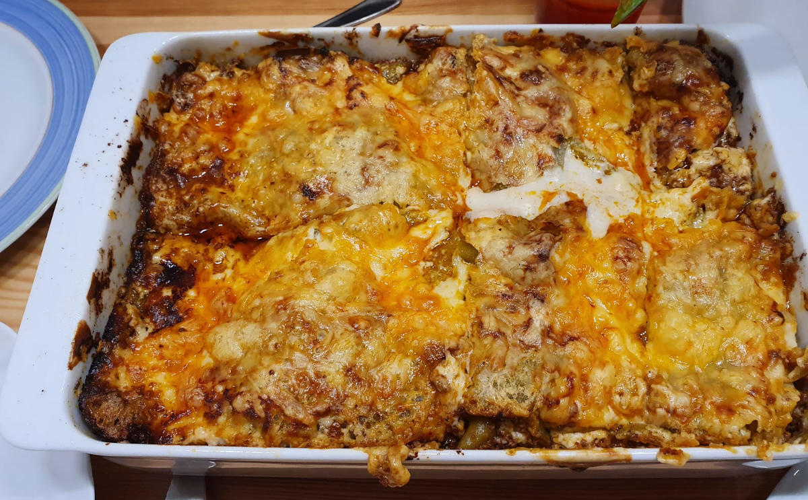

[Lasagne](https://en.wikipedia.org/wiki/Lasagne) is an Italian dish which consists
of layers of pasta, [Béchamel sauce](https://en.wikipedia.org/wiki/B%C3%A9chamel_sauce) and meet.

<figure class="wp-caption aligncenter img-thumbnail">
    
    <figcaption class="text-center">Finished Lasagne</figcaption>
</figure>

It takes about 30 minutes to prepare and 40 minutes in the oven. So 1h 10min in
total.

## Ingredients

The following is for 4 people.

* Lasagne plates

Meat sauce:

* Sunflower Oil
* 500g [ground beef](https://en.wikipedia.org/wiki/Ground_beef)
* 1 onion
* 2 cloves of garlic (Knoblauchzehe)
* 1 soup spoon of tomato puree (Tomatenmark)
* 800g peeled tomato (you can buy that in a can)
* Some red wine
* Salt
* Pepper
* Paprika spice

Bechamel sauce:

* 0.5 L milk
* 40g butter
* 40g flour
* salt and pepper
* Nutmeg (Muskat)
* Lemon juice

## Tools

* [Kitchen Stove](https://en.wikipedia.org/wiki/Kitchen_stove) with two hotplates
* Oven
* Deep pan for the oven (Auflaufform)
* Big Pot (for the bolognese)
* [Fish slice](https://en.wikipedia.org/wiki/Fish_slice_(kitchen_utensil))
* Small Pot (Bechamel Sauce)
* Whisk
* [Cutting Board](https://en.wikipedia.org/wiki/Cutting_board)
* Knife

## Preparation

### Bolognese

1. Cut the onions and the garlic into small pieces.
2. Put some oil in the pot and heat it.
3. Fry the ground meat until it is brown.
4. Add the onions.
5. Add the garlic and the tomato puree.
6. Add the peeled tomato, salt, paprika spice until you like the taste
7. Let it cook for 30 minutes.

### Bechamel Sauce

1. Put butter in the small pot
2. Put the flour in and whisk it until it has a bright yellow color and is creamy.
3. Let it cook for 30 min at a low temperature so that the flavor of the flour
   goes away
4. Add salt, pepper, nutmeg and lemon juice until you like the flavor

### Lasagne

1. Put butter in the deep pan
2. Put Bologese in the pan
3. Put Lasagne plates on it
4. Put Bolognese in the pan
5. Put Bechamel Sauce in the pan
6. Lasagne plates, Blognese, Bechamel
7. Add grated Cheese on top
8. Put at 180°C (circulating air, Umluft) for 40 minutes in the oven until it
   has a nice color at the top.
