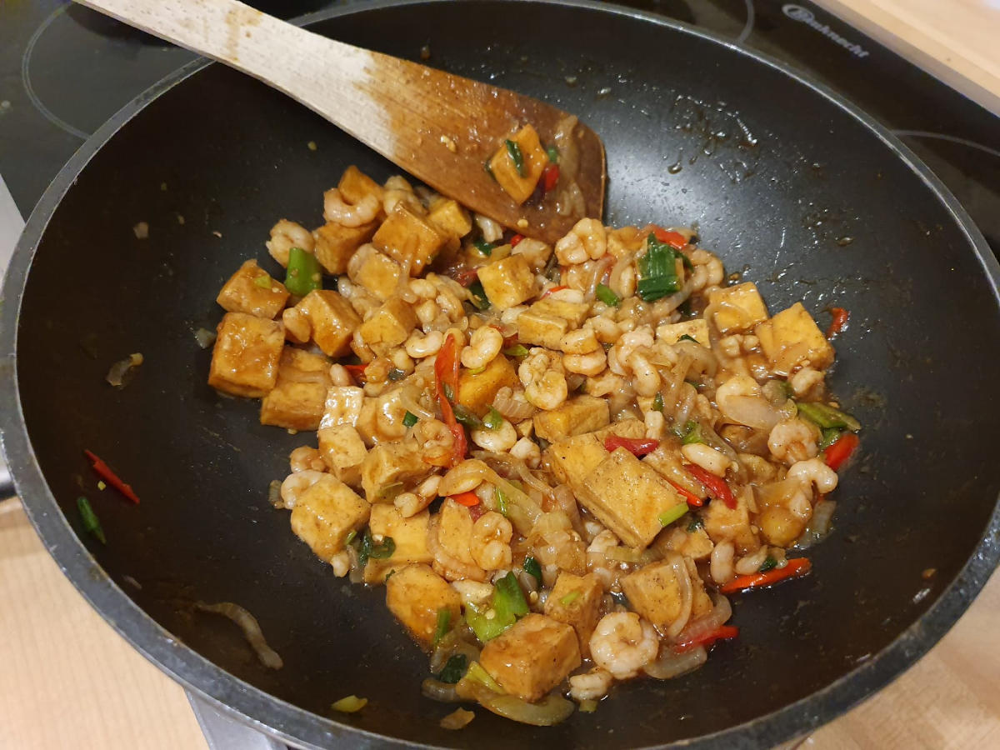
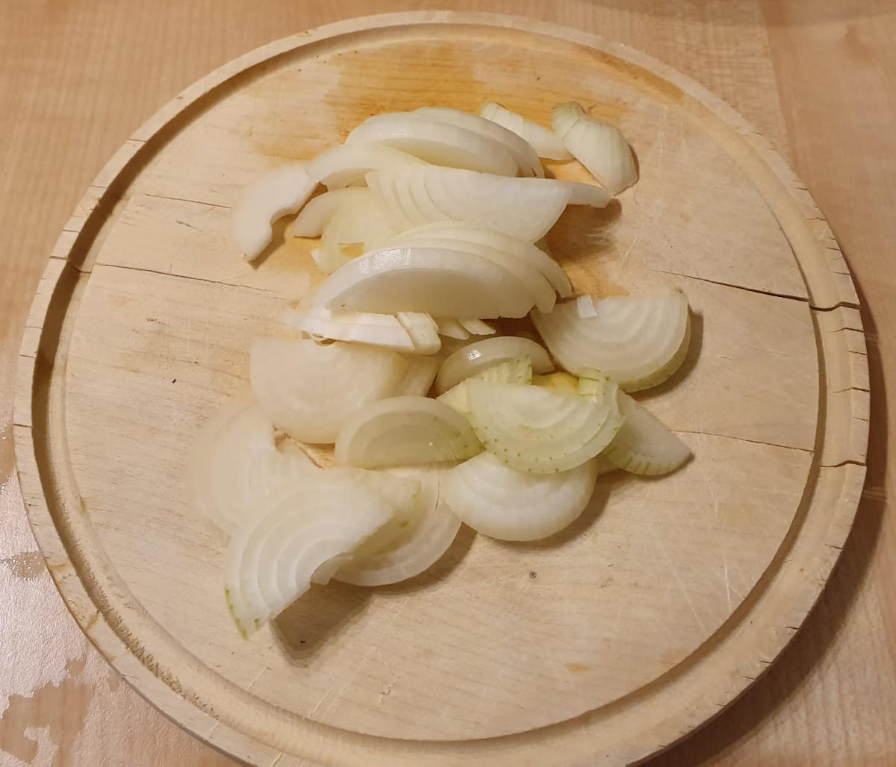
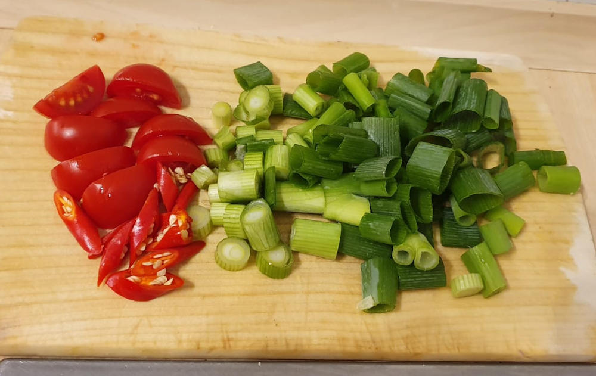
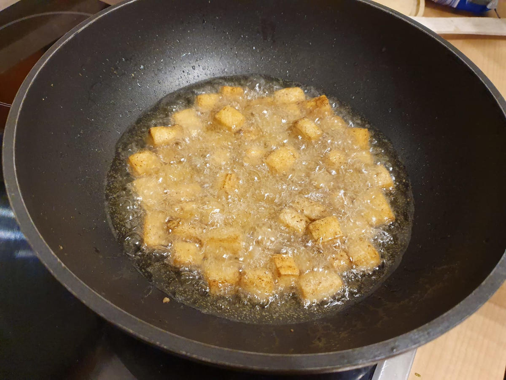
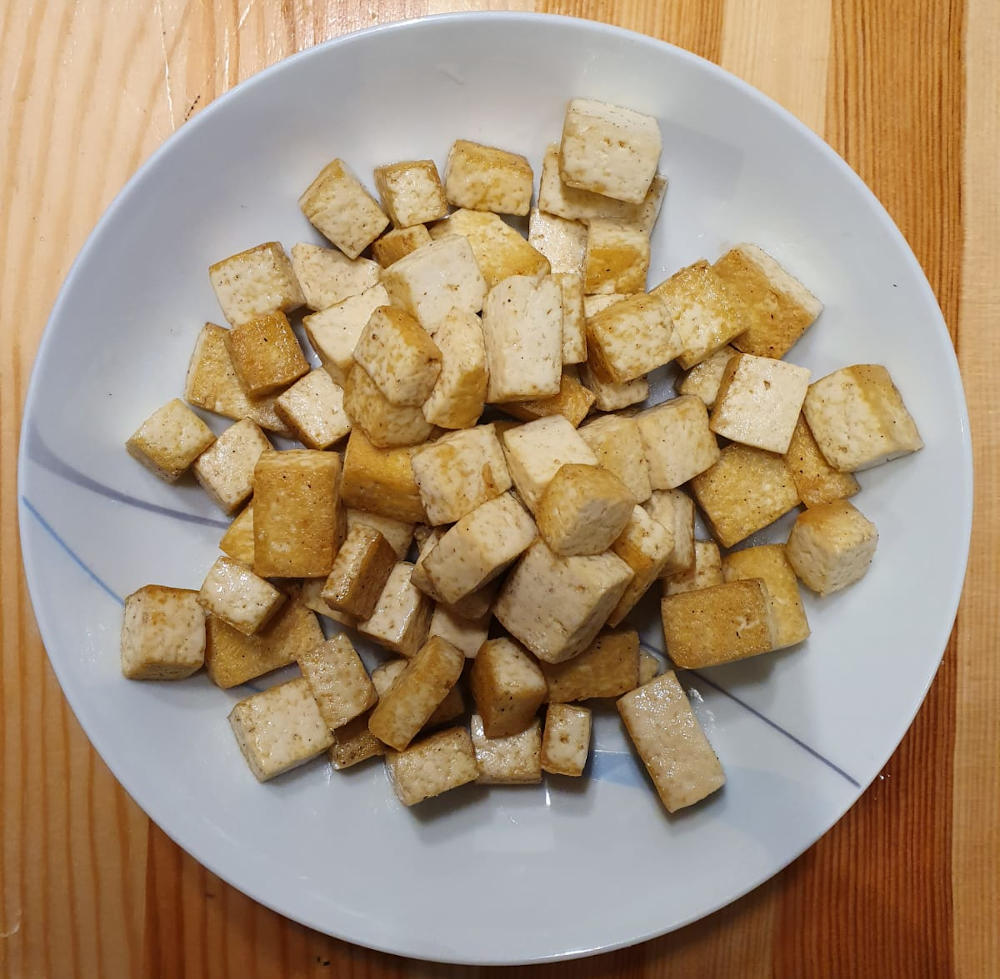
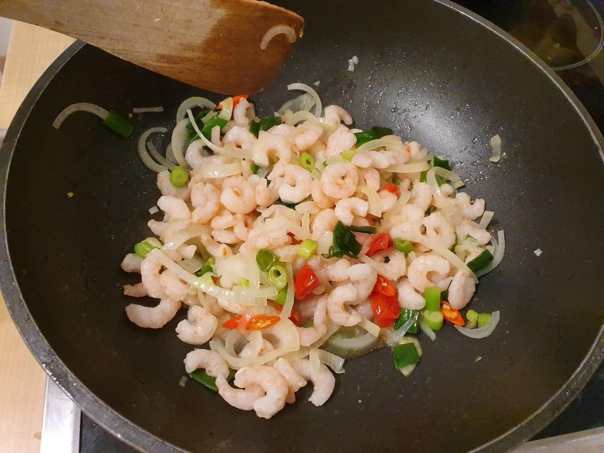

A nice dish which takes about 30 minutes to cook.

<figure class="wp-caption aligncenter img-thumbnail">
    
    <figcaption class="text-center">Finished tofu and shrimps</figcaption>
</figure>

## Ingredients

* Shrimps (prawns are also fine)
* [Tofu](https://en.wikipedia.org/wiki/Tofu)
* 3 spring onions
* 2 small chili peppers
* 1 big onion (or two small ones)
* Garlic powder
* Salt
* Pepper
* [Oyster sauce](https://en.wikipedia.org/wiki/Oyster_sauce)
* Optional: Kecap Manis
* Optional: 3 small tomatos

## Tools

* [Kitchen Stove](https://en.wikipedia.org/wiki/Kitchen_stove) with one hotplate
* [Wok](https://en.wikipedia.org/wiki/Wok)
* [Cutting Board](https://en.wikipedia.org/wiki/Cutting_board)
* Knife

## Preparation

1. Cut onions, spring onions and tomatos. Cut the chili peppers slightly diagonal.

<figure class="wp-caption aligncenter img-thumbnail">
    
    <figcaption class="text-center">Cut onions</figcaption>
</figure>

<figure class="wp-caption aligncenter img-thumbnail">
    
    <figcaption class="text-center">Tomato, chili peppers and spring onion</figcaption>
</figure>

2. Cut Tofu into cubes of edge length 1.5 cm - something that is comfortable to eat.
3. Marinade tofu with salt, pepper and garlic powder. Let it rest for 10 minutes.
4. Put oil into the wok and fry the tofu in it. Put the tofu out after it is fried.

<figure class="wp-caption aligncenter img-thumbnail">
    
    <figcaption class="text-center">Frying the tofu</figcaption>
</figure>

<figure class="wp-caption aligncenter img-thumbnail">
    
    <figcaption class="text-center">Fried tofu</figcaption>
</figure>

5. Fry the onions until they smell well. Add chili peppers and spring onions.
6. Add tomatos if you want.
7. Add shrimps. They are ready when they have a nice pink color.
8. Add oyster sauce and kecap manis. If you want a thicker sauce, add a small
   spoon of wheat.

<figure class="wp-caption aligncenter img-thumbnail">
    
    <figcaption class="text-center">Shrimps in the wok</figcaption>
</figure>

<figure class="wp-caption aligncenter img-thumbnail">
    
    <figcaption class="text-center">Finished tofu and shrimps</figcaption>
</figure>

## See also

* [What is the difference between a prawn and a shrimp?](https://cooking.stackexchange.com/a/45228/78627)
