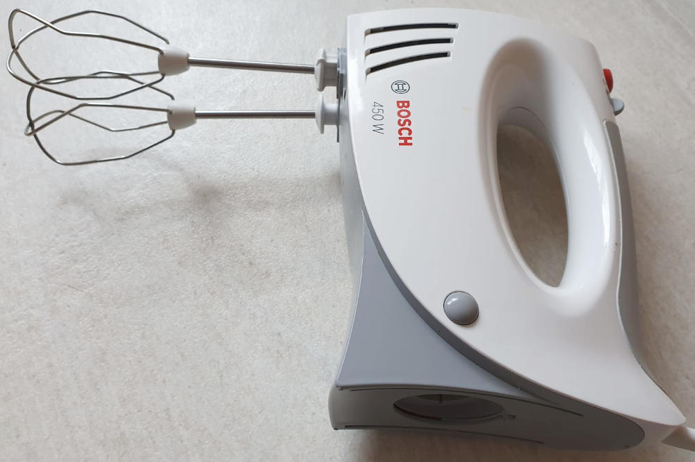

Apple Pancakes are a sweet main dish. Yes, I know, for most people outside of
Germany this sounds superweird. If you are used to US pancakes, be aware that
the following pancakes taste way different. No need for maple syrup as my apple
pancakes have a nice flavour on their own.

It takes about 30 minutes.

## Ingredients

The following is for 4 people (or very hungry 2.5 people).

* 4&thinsp;eggs
* 400&thinsp;g flour
* 100&thinsp;ml sparkling water
* 400&thinsp;ml milk
* 8&thinsp;g (1 package) of vanilla sugar
* 200&thinsp;g sugar
* 1&thinsp;apple
* a tiny bit of salt
* oil

As side-dishes, you might want one of the following:

* apple sauce (recommended)
* sugar with lemon
* Whipped cream
* Nutella or maple syrup ... but then you don't have the nice taste of the
  pancake 🙄

## Tools

* [Kitchen Stove](https://en.wikipedia.org/wiki/Kitchen_stove) with one hotplates
* Pan
* Mixing bowl
* Whisker or hand mixer (I have the Bosch MFQ3540 for 4 years now and I'm quite happy with it)
* Small bowl for the egg white where you can easily mix it (hand mixer highly recommended)
* [Peeler](https://en.wikipedia.org/wiki/Peeler) to cut away the skin of the apple
* [Grater](https://en.wikipedia.org/wiki/Grater) (for cutting the apple into thin slices)

<figure class="wp-caption aligncenter img-thumbnail">
    
    <figcaption class="text-center">Hand mixer</figcaption>
</figure>

## Preparation

1. Separate [egg white](https://en.wikipedia.org/wiki/Egg_white) and [yolk](https://en.wikipedia.org/wiki/Yolk)
2. Beat the egg white until it is foamy. When you put the bowl upside down, it should stick in there
3. Add all other ingredients except for the apple
4. Fold in the egg foam (Eischnee unterheben)
5. Peel the apple, cut it into small slices and add them to the dough.
6. Put oil in the pan and fry the pancakes.
