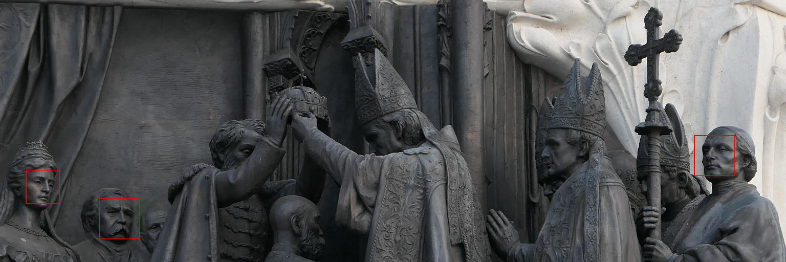

This is an article I had for quite a while as a draft. As part of my yearly cleanup, I've published it without finishing it. It might not be finished or have other problems.

A few days ago, I took a flight from Nepal back to Germany. I was 3 weeks
trekking. Of course, I did not take my beard trimmer with me. So what is
usually a three-day beard became a 3 week beard. And when I tried to get through
those automatic face recognition entries for EU citicenz, the machine spent like
one minute trying to recognize me (usually it takes about 5 seconds).

That was when I started wondering what the current state of face recognition is.
Not only the state of the art techniques, but more what is currently available
in free software.

## Face Recognition Tasks

There are four main tasks in face recognition:

* **Face Detection**: Given an image, draw an axis-aligned bounding box around each face
* **Face Alignment**: Transform a face to be in a canonical pose
* **Face Representation**: Find a representation for a face which is suitable for follow-up tasks
* **Face Verification**: Given two face representations, decide if they are the same

## Important papers

<ul>
    <li><a href="https://www.cs.toronto.edu/~ranzato/publications/taigman_cvpr14.pdf">Deep Face: closing the gap to human level performance</a> (<a href="http://www.shortscience.org/paper?bibtexKey=conf/cvpr/TaigmanYRW14#martinthoma">summary</a>)</li>
    <li><a href="https://arxiv.org/abs/1503.03832">FaceNet: A unified embedding for face recognition and clustering</a> (<a href="http://www.shortscience.org/paper?bibtexKey=journals/corr/1503.03832">summary</a>)</li>
    <li><a href="https://www.robots.ox.ac.uk/~vgg/publications/2015/Parkhi15/parkhi15.pdf">Deep Face recognition</a> (<a href="http://www.shortscience.org/paper?bibtexKey=conf/bmvc/ParkhiVZ15">summary</a>)</li>
</ul>

## Problems

<figure class="wp-caption aligncenter img-thumbnail">
    
    <figcaption class="text-center">A face, but not a human</figcaption>
</figure>

<figure class="wp-caption aligncenter img-thumbnail">
    
    <figcaption class="text-center">Again a couple of faces, but not human faces</figcaption>
</figure>

<figure class="wp-caption aligncenter img-thumbnail">
    
    <figcaption class="text-center">No face at all - not even close</figcaption>
</figure>

## See also

* PyPI: [`face_recognition`](https://pypi.org/project/face_recognition/) uses [dlib](http://dlib.net/). It's fast, it's good. Use it.
