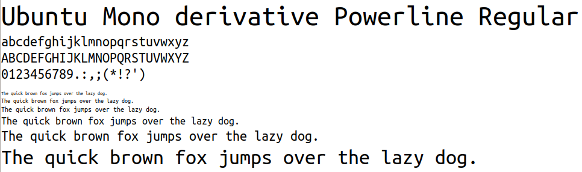
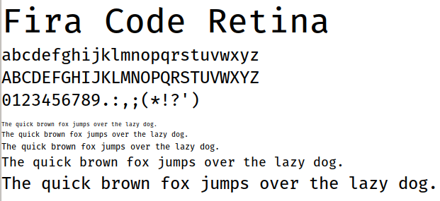

The font choice for developing software is important. Developers read code all
the time.

This is an article I had for quite a while as a draft. As part of my yearly cleanup, I've published it without finishing it. It might not be finished or have other problems.

## Powerline Fonts

The Ubuntu [Powerline font](https://github.com/powerline/fonts) is what I use:

<figure class="wp-caption aligncenter img-thumbnail">
    
    <figcaption class="text-center">Ubuntu Mono Powerline</figcaption>
</figure>

## Ligatures

[Ligatures](https://en.wikipedia.org/wiki/Orthographic_ligature) are a design
method of combining two characters (graphemes) to get a nicer way of printing
them together. Historically, this has been done with "ff", "fi", "fl". For
code, other options are possible. I'm not saying any of those are a good idea:

<table class="table">
    <thead>
        <tr>
            <th>Original</th>
            <th>Unicode</th>
            <th>Screenshot</th>
            <th>Comment</th>
        </tr>
    </thead>
    <tbody>
        <tr>
            <td>!=</td>
            <td>≠</td>
            <td></td>
            <td></td>
        </tr>
        <tr>
            <td>-&gt;</td>
            <td>→</td>
            <td></td>
            <td></td>
        </tr>
        <tr>
            <td>=&gt;</td>
            <td>⇒</td>
            <td></td>
            <td></td>
        </tr>
        <tr>
            <td>&gt;=</td>
            <td>≥</td>
            <td></td>
            <td></td>
        </tr>
        <tr>
            <td>&lt;=</td>
            <td>≤</td>
            <td></td>
            <td></td>
        </tr>
        <tr>
            <td>==</td>
            <td>=</td>
            <td></td>
            <td></td>
        </tr>
        <tr>
            <td>++</td>
            <td>++</td>
            <td></td>
            <td></td>
        </tr>
    </tbody>
</table>

How to Enable Ligatures:

* [Sublime Text](https://www.sublimetext.com/docs/3/ligatures.html)

## Ubuntu Mono

[Google Fonts page](https://fonts.google.com/specimen/Ubuntu+Mono)

## Fira Code

<figure class="wp-caption aligncenter img-thumbnail">
    
    <figcaption class="text-center">A jellyfish</figcaption>
</figure>

[FiraCode](https://github.com/tonsky/FiraCode) is licensed under SIL Open Font License 1.1.
It is a Monospaced font with programming ligatures.

[Google Fonts Page](https://fonts.google.com/specimen/Fira+Code?query=fira)

## Cascadia Code

* [Microsoft releases new open source font Cascadia Code](https://www.ghacks.net/2019/09/19/microsoft-releases-new-open-source-font-cascadia-code/), 2019
* GitHub: [microsoft / cascadia-code](https://github.com/microsoft/cascadia-code)
* [Microsoft releases Cascadia Code version 1909.16](https://hub.packtpub.com/microsoft-releases-cascadia-code-version-1909-16-it-is-the-latest-monospaced-font-for-windows-terminal-and-visual-studio-code/), 2019.
* Kayla: [Cascadia Code](https://devblogs.microsoft.com/commandline/cascadia-code/), 2019.
