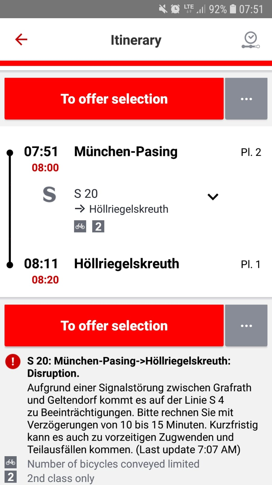

It's about time for a rant article about Deutsche Bahn (DB). DB is
the company with the monopoly for public transportation by train.

My key complaints are:

* DB is unreliable
* DB is expensive
* DB is not flexible

On top of that, there are some other complains:

* **Information mismanagement**
    * They are lying about being late
    * Information about past delays are not publicly available.
* **Comfort**: Trains are super crowded. It is impossible in such a crowded
  train to read or to work.

## Notes from the past

* 2019-02-04
    * 08:25: Meridian, Abfahrt 8:20, 10 min später
    * 08:29: S7, Anfahrt 8:26, 5 min später
    * 08:30: Meridian 15 min später
    * 08:31: S7 arrived
* 2019-02-06
    * 07:52 Uhr: S20 voraussichtlich 5 min später
    * 07:54 Uhr: Abfahrt 7:51, um 7:53 sagen sie eine Verspätung um 5 min an
* 2019-02-07 17:31: S7, Abfahrt 17:25: Weiterfahrt verzögert sich um unbestimmte Zeit.
* 2019-02-11:
    * 07:50 Uhr: S20 - "Problem at train crossing: On the route München-Pasing - Geltendorf between München-Aubing and Puchheim. There are delays in both directions in the commuter rail transport of the Deutsche Bahn"
    * 07:55 Uhr: S20 fällt aus (info nur in der App, keine Info am Bahnsteig)
    * 08:47 Uhr: Ich bin in Höllriegelskreuth. 36 minutes delay.
    * 17:05 Uhr: S20 fällt aus (App), no information at the station. Train is still shown on the terminal.
    * 17:37 Uhr: One additional change of train. 5 minutes delay, but only because I know this happens all the time. If I stayed at the station, I would have 30+ minutes delay.
* 2019-02-12:
    * 07:51: S20 is on time
* 2019-02-14:
    * 07:29: S20 got cancelled
    * 07:57: S3 is 3 minutes delayed
    * 08:01: S7 is 4 minutes delayed at Donnersberger Brücke
* 2019-02-18:
    * 07:54 Uhr: S20 is 3 minutes delayed
* 2019-02-19:
    * 07:51 Uhr: S20 is on time
* 2019-02-20:
    * 07:51 Uhr: S20 is on time
    * 17:57 Uhr: S7, Abfahrt and arrival at 19:00 at home (delay: 34 min)
    *

## Contradicting Information

Please have a look at the "last update" in the following:

<figure class="wp-caption aligncenter img-thumbnail">
    
    <figcaption class="text-center">Laut Ansage voraussichtlich 5 min später, laut App 9 min später</figcaption>
</figure>

<figure class="wp-caption aligncenter img-thumbnail">
    
    <figcaption class="text-center">6 min später kommen nochmals 2 min hinzu - hier ist die Bahnsteigsansage schon offensichtlich falsch</figcaption>
</figure>

<figure class="wp-caption aligncenter img-thumbnail">
    
    <figcaption class="text-center">Nochmals 4 min später kommen nochmals 2 min hinzu</figcaption>
</figure>

That's why I feel they screw with me. They pretend that they were sending
consistent messages, when they are not.

## My Delays

I am commuting roughly an 19km distance within Munich. I start roughly at
Pasing. Most of my commute is through the "Stammstrecke", the main route within
Munich. Here are some of my delays.

* 2019-02-07, 17:29: Expected arrival at 18:06. Real arrival at 19:22. A delay of 1h 16min.

## Suggestions

A couple of things come to my mind:

* Fix the shit
* More roofs / places to sit at the big train stops - so in case you're stuck, at least you don't get sick
* Free WiFi for trains on the "Stammstrecke"

## Responsibilities

There are other providers for public transportation by train,
such as [Bayerische Oberlandbahn](https://en.wikipedia.org/wiki/Bayerische_Oberlandbahn).
But about 87.5% of the rails are managed by [DB Netz](https://en.wikipedia.org/wiki/DB_Netz) and [DB Regio](https://en.wikipedia.org/wiki/DB_Regio) is by far the biggest provider. DB Regio
is also responsible for [S-Bahn München](https://de.wikipedia.org/wiki/S-Bahn_M%C3%BCnchen)

MVG is responsible for underground, trams and busses.

The [Bayerische Eisenbahngesellschaft](https://de.wikipedia.org/wiki/Bayerische_Eisenbahngesellschaft)
seems to be responsible for the train network within Bavaria. Hence [Hans Reichhart](https://de.wikipedia.org/wiki/Hans_Reichhart) (CSV) is responsible.
