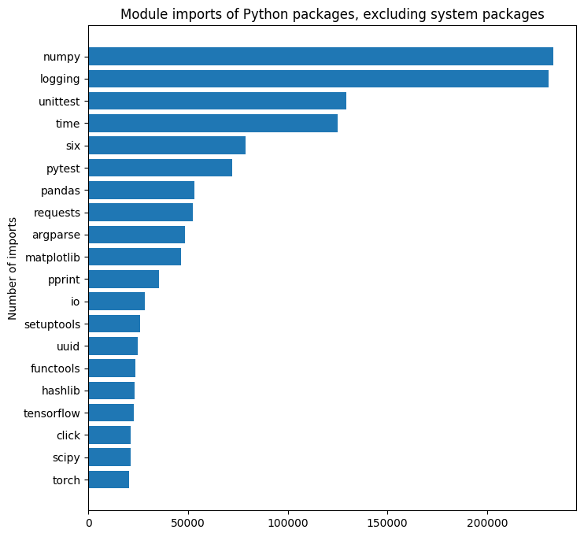

I've created an [introductory post](https://martin-thoma.com/analyzing-pypi-metadata/)
where I looked at the packages meta data in a very superficial way.

In the [second post](https://martin-thoma.com/analyzing-pypi-metadata-2/) I
analyzed the relationships between packages by looking at a dependency graph.

Now, in the beginning of 2020, I've updated the code and ran my analysis again.
Have fun 🙂

Out of 208&thinsp;492 packages, only 176&thinsp;107 packages are used.

There are 90,682 authors of Python packages. The ten
most active authors are:

<table class="table">
    <thead>
        <tr>
            <th>Author</th>
            <th>Created packages</th>
        </tr>
    </thead>
    <tbody>
        <tr>
            <td></td>
            <td>8948</td>
        </tr>
        <tr>
            <td>UNKNOWN</td>
            <td>1399</td>
        </tr>
        <tr>
            <td>The Guardians</td>
            <td>1140</td>
        </tr>
        <tr>
            <td>Tecnativa, Odoo Community Association (OCA)</td>
            <td>554</td>
        </tr>
        <tr>
            <td>OpenStack</td>
            <td>466</td>
        </tr>
        <tr>
            <td>hfpython</td>
            <td>460</td>
        </tr>
        <tr>
            <td>Paul Sokolovsky</td>
            <td>450</td>
        </tr>
        <tr>
            <td>Microsoft Corporation</td>
            <td>394</td>
        </tr>
        <tr>
            <td>Eficent, Odoo Community Association (OCA)</td>
            <td>329</td>
        </tr>
        <tr>
            <td>Akretion,Odoo Community Association (OCA)</td>
            <td>290</td>
        </tr>
    </tbody>
</table>

## Maximum length

<table class="table">
    <thead>
        <tr>
            <th>Column</th>
            <th>NULL values</th>
            <th>Maximum Length</th>
            <th>Entry</th>
        </tr>
    </thead>
    <tbody>
        <tr>
            <td>name</td>
            <td>0</td>
            <td>80</td>
            <td>Aaaaaaaaaaaaaaaaaaa-aaaaaaaaa-aaaaaaasa-aaaaaaasa-aaaaasaa-aaaaaaasa-bbbbbbbbbbb</td>
        </tr>
        <tr>
            <td>version</td>
            <td>560</td>
            <td>70</td>
            <td><a href="https://pypi.org/project/softwarefabrica.django.utils/">1.0dev-BZR-r115-panta-elasticworld.org-20100520155735-sf3yrsr0pvyvlm8m</a></td>
        </tr>
        <tr>
            <td>stable_version</td>
            <td>560</td>
            <td>7</td>
            <td>UNKNOWN</td>
        </tr>
        <tr>
            <td>release_url</td>
            <td>560</td>
            <td>128</td>
            <td>https://pypi.org/project/softwarefabrica.django.appserver/1.0dev-BZR-r10-panta-elasticworld.org-20091023132843-vitk6k7e5qlvhej5/</td>
        </tr>
        <tr>
            <td>package_url</td>
            <td>560</td>
            <td>106</td>
            <td><a href="https://pypi.org/project/Aaaaaaaaaaaaaaaaaaa-aaaaaaaaa-aaaaaaasa-aaaaaaasa-aaaaasaa-aaaaaaasa-bbbbbbbbbbb/">https://pypi.org/project/Aaaaaaaaaaaaaaaaaaa-aaaaaaaaa-aaaaaaasa-aaaaaaasa-aaaaasaa-aaaaaaasa-bbbbbbbbbbb/</a></td>
        </tr>
        <tr>
            <td>bugtrack_url</td>
            <td>560</td>
            <td>4</td>
            <td>None</td>
        </tr>
        <tr>
            <td>summary</td>
            <td>7717</td>
            <td>210</td>
            <td>采集百度手机卫士 360手机卫士 搜狗号码通三个平台对手机号码的标注信息. 1.1.0: 加入搜狗API采集方式，但与从网页采集结果是一致的。 1.2.0：采用多线程，将不同源分开采集，避免互相影响。 1.3.1：加入命令行工具，加入对IP的处理工具。 1.3.3：可以使用--file xxx.csv 命令指定文件。 1.3.4：改用百度和360手机版本，减少下载量；尝试遇到反爬退出。 1.3.5：完善使用代理下载。</td>
        </tr>
        <tr>
            <td>home_page</td>
            <td>17927</td>
            <td>150</td>
            <td><a href="http://127.0.0.1:8888/USK@~osOPnNLdMLVrYVNTahLufdwOuMhhC4GkpIHulnSm04,bwAmjkK-BZZnj-bujBQehwgGqUM1AUFhzTW4hcDGXQ0,AQACAAE/infocalypse_and_pyFreenet/5/">http://127.0.0.1:8888 ...</a></td>
        </tr>
        <tr>
            <td>author</td>
            <td>8948</td>
            <td>255</td>
            <td>[&#39;Diemer, Jens&#39;, &#39;Hall, Dave&#39;, &#39;van der Boor, Diederik&#39;, &#39;Chainz, Adam&#39;, &#39;Cornehl, Denis&#39;, &#39;Fahed, Sami&#39;, &#39;Hoppe, Johannes&#39;, &#39;Iakovlev, Maksim&#39;, &#39;Lagovas&#39;, &#39;Larin, Nikita&#39;, &#39;Lavin, Mark&#39;, &#39;Lisák, Peter&#39;, &#39;Marques de Araújo, Rodrigo Pinheiro&#39;, &#39;Mihelac, Bo</td>
        </tr>
        <tr>
            <td>author_email</td>
            <td>16619</td>
            <td>255</td>
            <td>jan-gerd.tenberge@uni-muenster.de, cuihtlauac.alvarado@orange.com, juan@grigera.com.ar, lyj7694@gmail.com, pi8027@gmail.com, zhuyanzi@gmail.com, sree314@gmail.com, jochen.schroeder@chalmers.se, alex.fu27@gmail.com, hi@xiangji.me, hakon.j.d.johnsen@ntnu.no</td>
        </tr>
        <tr>
            <td>license</td>
            <td>44374</td>
            <td>255</td>
            <td>Copyright © 2012 Kenan Yildirim.[...]</td>
        </tr>
        <tr>
            <td>keywords</td>
            <td>92634</td>
            <td>4033</td>
            <td>algorithmic,algotrading,altcoin,altcoins,api,arbitrage,backtest,backtesting,bitcoin,bot,...</td>
        </tr>
        <tr>
            <td>requires_python</td>
            <td>112090</td>
            <td>94</td>
            <td>&gt;=2.7, &gt;=2.7.1, !=3.0, !=3.0.*, !=3.1, !=3.1.*, !=3.2, !=3.2.*, !=3.3, !=3.3.*, !=3.4, !=3.4.*</td>
        </tr>
        <tr>
            <td>maintainer</td>
            <td>140232</td>
            <td>145</td>
            <td>Brian Drawert, Kevin Sanft, Sean Matthew, George Hall, Dalton Nickerson, Samuel Hodges, Emma Weisgerber, Eliot Dixon, Ghilman Brock, W.R. Jackson</td>
        </tr>
        <tr>
            <td>maintainer_email</td>
            <td>140745</td>
            <td>137</td>
            <td>xgzhao0201@gmail.com,                  fuyuhaoy@gmail.com,                  guangrenna@gmail.com,                  shulinluo999@gmail.com</td>
        </tr>
        <tr>
            <td>platform</td>
            <td>126048</td>
            <td>255</td>
            <td>[spam]</td>
        </tr>
        <tr>
            <td>download_url</td>
            <td>129479</td>
            <td>183</td>
            <td><a href="http://pypi.python.org/packages/source/s/softwarefabrica.django.appserver/softwarefabrica.django.appserver-1.0dev-BZR-r10-panta-elasticworld.org-20091023132843-vitk6k7e5qlvhej5.tar.gz">softwarefabrica.django.appserver</a></td>
        </tr>
    </tbody>
</table>

## Platforms

I recommend to use the [`Operating System ::` and `Environment ::` Trove Classifiers](https://pypi.org/classifiers/).
Goes in line with [PEP 345](https://www.python.org/dev/peps/pep-0345/#platform-multiple-use)

<table class="table">
    <thead>
        <tr>
            <th>Platform</th>
            <th>Count</th>
        </tr>
    </thead>
    <tbody>
        <tr>
            <td></td>
            <td>126048</td>
        </tr>
        <tr>
            <td>UNKNOWN</td>
            <td>61530</td>
        </tr>
        <tr>
            <td>ANY</td>
            <td>12163</td>
        </tr>
        <tr>
            <td>LINUX</td>
            <td>1644</td>
        </tr>
        <tr>
            <td>ALL</td>
            <td>1146</td>
        </tr>
        <tr>
            <td>OS Independent</td>
            <td>1018</td>
        </tr>
        <tr>
            <td>None</td>
            <td>494</td>
        </tr>
        <tr>
            <td>Windows</td>
            <td>493</td>
        </tr>
        <tr>
            <td>POSIX</td>
            <td>458</td>
        </tr>
        <tr>
            <td>Posix; MacOS X; Windows</td>
            <td>340</td>
        </tr>
        <tr>
            <td>UNIX</td>
            <td>238</td>
        </tr>
        <tr>
            <td>Aix</td>
            <td>152</td>
        </tr>
        <tr>
            <td>Platform Independent</td>
            <td>130</td>
        </tr>
        <tr>
            <td>MacOS X</td>
            <td>102</td>
        </tr>
        <tr>
            <td>POSIX,Windows</td>
            <td>71</td>
        </tr>
        <tr>
            <td>WIN32</td>
            <td>61</td>
        </tr>
        <tr>
            <td>Cross Platform</td>
            <td>53</td>
        </tr>
        <tr>
            <td>GNU/Linux</td>
            <td>51</td>
        </tr>
        <tr>
            <td>Independent</td>
            <td>49</td>
        </tr>
        <tr>
            <td>Posix; MacOS X</td>
            <td>46</td>
        </tr>
    </tbody>
</table>

## Licenses

<table class="table">
    <thead>
        <tr>
            <th>License</th>
            <th>Count</th>
        </tr>
    </thead>
    <tbody>
        <tr>
            <td>MIT</td>
            <td>53876</td>
        </tr>
        <tr>
            <td></td>
            <td>44374</td>
        </tr>
        <tr>
            <td>UNKNOWN</td>
            <td>17531</td>
        </tr>
        <tr>
            <td>BSD</td>
            <td>14056</td>
        </tr>
        <tr>
            <td>MIT LICENSE</td>
            <td>8221</td>
        </tr>
        <tr>
            <td>GPL</td>
            <td>5720</td>
        </tr>
        <tr>
            <td>AGPL-3</td>
            <td>5680</td>
        </tr>
        <tr>
            <td>GPLV3</td>
            <td>3902</td>
        </tr>
        <tr>
            <td>APACHE 2.0</td>
            <td>3340</td>
        </tr>
        <tr>
            <td>APACHE LICENSE 2.0</td>
            <td>2587</td>
        </tr>
    </tbody>
</table>

## Size

What is currently the biggest Python package?

<table class="table">
    <thead>
        <tr>
            <th>Package</th>
            <th>Release Number</th>
            <th>Size</th>
        </tr>
    </thead>
    <tbody>
        <tr>
            <td>mxnet-cu90</td>
            <td>1.6.0b20200104</td>
            <td>600MB</td>
        </tr>
        <tr>
            <td>mxnet-cu92</td>
            <td>1.6.0b20200104</td>
            <td>598MB</td>
        </tr>
        <tr>
            <td><a href="https://pypi.org/project/de422/">de422</a></td>
            <td>2009.1</td>
            <td>545MB</td>
        </tr>
        <tr>
            <td>mxnet-cu101mkl</td>
            <td>1.6.0b20191125</td>
            <td>531MB</td>
        </tr>
        <tr>
            <td>mxnet-cu101</td>
            <td>1.6.0b20191125</td>
            <td>496MB</td>
        </tr>
        <tr>
            <td>cntk-gpu</td>
            <td>2.7</td>
            <td>493MB</td>
        </tr>
        <tr>
            <td>mxnet-cu100mkl</td>
            <td>1.6.0b20191125</td>
            <td>490MB</td>
        </tr>
        <tr>
            <td>mxnet-cu100</td>
            <td>1.6.0b20191125</td>
            <td>454MB</td>
        </tr>
        <tr>
            <td>mxnet-cu92mkl</td>
            <td>1.6.0b20191118</td>
            <td>452MB</td>
        </tr>
        <tr>
            <td>mxnet-cu90mkl</td>
            <td>1.6.0b20191115</td>
            <td>427MB</td>
        </tr>
        <tr>
            <td>mxnet-cu91mkl</td>
            <td>1.3.1b20180926</td>
            <td>389MB</td>
        </tr>
        <tr>
            <td>h2o4gpu</td>
            <td>0.3.2</td>
            <td>366MB</td>
        </tr>
        <tr>
            <td>tensorflow-gpu</td>
            <td>2.1.0rc2</td>
            <td>357MB</td>
        </tr>
        <tr>
            <td>tensorflow</td>
            <td>2.1.0rc2</td>
            <td>356MB</td>
        </tr>
        <tr>
            <td>mxnet-cu91</td>
            <td>1.3.1b20180926</td>
            <td>346MB</td>
        </tr>
    </tbody>
</table>

It is strange, that the deep learning frameworks are way bigger than the rest.
I've tried to find a [Stackoverflow Question](https://stackoverflow.com/q/59721109/562769).

## Package type

<table class="table">
    <thead>
        <tr>
            <th>License</th>
            <th>Count</th>
        </tr>
    </thead>
    <tbody>
        <tr>
            <td>sdist</td>
            <td>180,307</td>
        </tr>
        <tr>
            <td>bdist_wheel</td>
            <td>106,515</td>
        </tr>
        <tr>
            <td>bdist_egg</td>
            <td>8,150</td>
        </tr>
        <tr>
            <td>bdist_wininst</td>
            <td>1201</td>
        </tr>
        <tr>
            <td>bdist_dumb</td>
            <td>804</td>
        </tr>
        <tr>
            <td>bdist_rpm</td>
            <td>44</td>
        </tr>
        <tr>
            <td>bdist_msi</td>
            <td>33</td>
        </tr>
        <tr>
            <td>bdist_dmg</td>
            <td>4</td>
        </tr>
    </tbody>
</table>

Going through the downloaded files, I see:

* 157,395× tar.gz
* 28,653× whl
*  8,815× zip
*  3,925× egg
*    208× tar.bz2

## Dependencies

<figure class="wp-caption aligncenter img-thumbnail">
    
    <figcaption class="text-center">Weighted module imports by Python packages</figcaption>
</figure>

<figure class="wp-caption aligncenter img-thumbnail">
    
    <figcaption class="text-center">Module imports of Python packages</figcaption>
</figure>

<figure class="wp-caption aligncenter img-thumbnail">
    
    <figcaption class="text-center">Module imports of Python packages, excluding system packages</figcaption>
</figure>

<figure class="wp-caption aligncenter img-thumbnail">
    
    <figcaption class="text-center">Module imports of Python modules excluding system modules</figcaption>
</figure>

## Build Systems

* Total Packages Analyzed: 198,996
* Packages which have a `setup.cfg`: 148,222
* Packages which have a `pyproject.toml`: 2,957
* Packages which have a `setup.cfg` and a `pyproject.toml`: 1027

### setup.cfg

Out of the 148,222 packages, the following number of packages have the given sections:

* 143,724× egg_info
* 24,972× metadata
* 15,693× bdist_wheel
*  9,613× flake8
*  6,722× aliases
*  5,727× tool:pytest
*  4,312× wheel
*  3,239× bumpversion
*  2,801× bumpversion:file:setup.py
*  2,520× options
*  2,511× nosetests
*  2,447× build_sphinx
*  2,176× isort
*  1,679× files
*  1,588× coverage:run
*  1,392× versioneer
*  1,140× upload_sphinx
*  1,038× entry_points

#### egg_info

* 143,701× tag_build
* 143,680× tag_date
* 51,925× tag_svn_revision

#### metadata

* 18,844× description-file
*  4,237× name
*  3,963× author
*  3,452× license_file
*  2,809× license
*  2,596× description
*  2,481× url
*  2,471× classifiers
*  2,217× long_description
*  2,048× version
*  1,965× author_email
*  1,869× keywords
*  1,842× author-email
*  1,758× summary
*  1,589× home-page
*  1,574× classifier
*  1,195× long_description_content_type

#### bdist_wheel

* 15,137× universal
*    369× python-tag
*    144× azure-namespace-package

#### flake8

*  6,823× exclude
*  5,229× max-line-length
*  3,975× ignore
*  1,288× max-complexity

#### aliases

*  4,989× test
*    773× release
*    200× docs
*    174× dev
*    127× dists

#### tool:pytest

*  3,395× addopts
*  1,611× testpaths
*  1,355× norecursedirs
*  1,002× python_files

#### wheel

*  4,234× universal

#### bumpversion

*  3,237× current_version
*  3,099× commit
*  3,083× tag
*    219× tag_name
*    163× parse
*    160× serialize

#### bumpversion:file:setup.py

*  2,129× search
*  2,120× replace

#### options

*  1,985× packages
*  1,932× install_requires
*  1,106× include_package_data
*  1,029× zip_safe
*    995× python_requires
*    742× setup_requires
*    442× package_dir
*    293× tests_require
*    164× scripts
*    161× py_modules

#### nosetests

*  1,514× cover-package
*  1,167× with-coverage
*  1,072× verbosity

#### build_sphinx

*  2,049× source-dir
*  2,013× build-dir
*  1,845× all_files

#### isort

*  1,659× line_length
*  1,302× multi_line_output
*  1,136× known_first_party
*  1,092× not_skip
*    865× default_section
*    849× include_trailing_comma
*    673× skip
*    603× force_single_line
*    553× combine_as_imports
*    508× lines_after_imports
*    424× known_third_party
*    377× sections
*    349× force_grid_wrap
*    339× forced_separate
*    298× use_parentheses
*    251× force_alphabetical_sort
*    203× indent
*    154× atomic
*    150× known_standard_library
*    150× known_django
*    126× order_by_type
*    108× lines_between_types
*    101× skip_glob

#### files

*  1,565× packages
*    203× data_files

#### coverage:run

*    846× branch
*    840× omit
*    830× source
*    162× include

#### versioneer

*  1,388× vcs
*  1,386× tag_prefix
*  1,385× versionfile_source
*  1,345× style
*  1,325× versionfile_build
*    983× parentdir_prefix

#### upload_sphinx

*  1,138× upload-dir

#### entry_points

*    707× console_scripts
*    143× oslo.config.opts

#### options.entry_points

*    605× console_scripts

#### coverage:report

*    504× exclude_lines
*    468× show_missing
*    178× omit
*    156× fail_under
*    124× precision
*    108× ignore_errors
*    100× skip_covered

#### options.extras_require

*    255× testing
*    243× test
*    229× docs
*    219× dev
*    137× tests

#### pytest

*    452× addopts
*    329× norecursedirs
*    230× python_files

#### pep8

*    507× max-line-length
*    316× ignore
*    221× exclude

#### options.packages.find

*    448× where
*    427× exclude

#### extract_messages

*    633× output_file
*    448× keywords
*    355× mapping_file
*    242× width
*    240× add_comments
*    105× msgid_bugs_address
*    101× copyright_holder

#### sdist

*    621× formats

#### compile_catalog

*    708× directory
*    626× domain
*    219× statistics

#### update_catalog

*    604× domain
*    603× input_file
*    602× output_dir
*    215× previous

#### pycodestyle

*    391× max-line-length
*    274× ignore
*    231× exclude

#### check-manifest

*    644× ignore

#### easy_install

*    289× zip_ok

#### mypy

*    461× ignore_missing_imports
*    215× check_untyped_defs
*    201× disallow_untyped_defs
*    170× warn_unused_ignores
*    155× strict_optional
*    154× python_version
*    154× warn_redundant_casts
*    129× warn_unused_configs
*    121× no_implicit_optional
*    119× disallow_untyped_calls
*    116× disallow_incomplete_defs
*    112× follow_imports
*    108× warn_return_any

#### zest.releaser

*    324× create-wheel
*    120× python-file-with-version

#### global

*    309× setup-hooks

#### upload_docs

*    394× upload-dir
*    142× show-response

#### zopeskel

*    440× template

#### bdist_rpm

*    216× requires
*    194× doc_files
*    155× release
*    124× packager

#### init_catalog

*    283× domain
*    283× input_file
*    281× output_dir

#### pbr

*    157× warnerrors

#### pydocstyle

*    125× ignore
*    105× add_ignore

#### yapf

*    211× based_on_style
*    198× column_limit
*    107× dedent_closing_brackets

#### options.package_data

*    121× *

#### devpi:upload

*    248× formats
*    225× no-vcs

#### test

*    120× extras

#### install

*    117× optimize

#### coverage:html

*    163× directory

### pyproject.toml

*  2,524× build-system
*  2,409× tool

#### build-system

*  2,524× requires
*  2,173× build-backend

#### tool

*  1,511× poetry
*    590× black
*    444× flit
*    163× towncrier
*    159× isort

## Filenames

Which filenames appear in many packages?

The following is a count of all filenames. If one package has a particular
filename often, it will bubble up higher in this list. I did remove some as
I think they are not relevant:

* 641,194× __init__: 608,289× __init__.py, 16,628× __init__.pyc, 4,238× __init__.cpython-36.pyc, 3,027× __init__.cpython-37.pyc, 1,897× __init__.cpython-35.pyc, 1,471× __init__.pyi, 1,278× __init__.cpython-38.pyc, 1,036× __init__.cpython-34.pyc, 665× .___init__.py, 622× __init__$py.class, 532× __init__.pypy3-510.pyc, 382× __init__.py_tmpl, 284× __init__.pxd, 266× __init__.cpython-33.pyc, 162× __init__.data.json, 162× __init__.meta.json, 128× __init__.cpython-32.pyc, 127× __init__.pyo
* 510,292× [Package](https://setuptools.readthedocs.io/en/latest/formats.html): 148,723× SOURCES.txt, 148,622× dependency_links.txt, 107,514× requires.txt, 51,390× entry_points.txt, 45,710× not-zip-safe, 8,333× zip-safe
* 313,683× [PKG-INFO](https://www.python.org/dev/peps/pep-0314/#including-metadata-in-packages)
* 294,148× Web: 19,434× index.html, 12,759× index.js, 8,220× Main.js, 4,348× base.html, 2,470× editor_plugin.js, 2,403× style.css, 2,400× editor_plugin_src.js, 2,386× jquery.js, 2,356× MathMenu.js, 2,351× FontWarnings.js, 2,344× HelpDialog.js, 2,292× MathML.js, 2,292× HTML-CSS.js, 2,292× TeX.js, 2,014× bootstrap.min.css, ...
* 250,185× Translations: 35,953× django.mo, 33,291× django.po, 5,087× es.po, 4,967× fr.po, 4,669× de.po, 4,087× pt_BR.po, 4,079× sl.po, 3,828× it.po, 3,360× zh_CN.po, 3,347× nl.po, 3,343× hr.po, 3,229× ca.po, 3,219× djangojs.po, 3,175× fi.po, 3,159× djangojs.mo, 3,147× tr.po, 3,004× pt.po, 2,656× ru.po, 2,646× ro.po, 2,500× hu.po, 2,482× ar.po, 2,464× pl.po, 2,457× gl.po, 2,395× cs.po, 2,295× bg.po, 2,271× sv.po, 2,267× lt.po, 2,187× zh_TW.po, 2,106× nb.po, 2,083× ja.po, 2,083× mk.po, 2,064× et.po, 2,056× sk.po, 2,055× nl_NL.po, 2,038× mn.po, 2,015× es_CR.po, 2,009× hr_HR.po, 2,007× es_MX.po, ...
* 248,156× Images: 7,141× icon.png, 2,360× favicon.ico, 1,597× 0020.png, 1,596× 00A0.png, 1,579× file.png, 1,516× logo.png, 1,503× plus.png, ...
* 177,525× top_level.txt
* 169,056× README: 77,667× README.md, 59,883× README.rst, 12,849× README.txt, 10,912× README, 2,861× readme.rst, 2,419× readme.md, 1,365× readme.txt, 832× Readme.md, 268× Readme.txt
* 168,289× setup.py
* 148,752× setup.cfg
*  71,267× LICENSE: 46,717× LICENSE, 15,570× LICENSE.txt, 2,192× LICENSE.GPL, 1,984× LICENSE.md, 1,313× LICENSE.rst, 1,254× license, 839× license.txt, 812× license.rst, 298× License.txt, 152× LICENSE.TXT, 136× license.md
*  67,659× MANIFEST.in
*  59,266× *.json: 14,198× metadata.json, 12,301× package.json, 4,395× pbr.json, 3,890× manifest.json, 2,144× bower.json, 1,808× service-2.json, 1,714× paginators-1.json, 1,623× data.json, ...
*  32,294× utils.py
*  28,914× METADATA
*  28,883× WHEEL
*  28,872× RECORD
*  26,432× YAML: 7,486× main.yml, 6,285× .travis.yml, 1,672× main.yaml, 1,404× index.yaml, 745× appveyor.yml, 704× command.yaml, 680× services.yaml, 650× .readthedocs.yml, 560× config.yml, 446× config.yaml, 446× cli.yaml, 423× docker-compose.yml, 394× .pre-commit-config.yaml, 337× .zuul.yaml, 298× post.yaml, 279× .gitlab-ci.yml, 254× run.yaml, 245× environment.yml, 217× Chart.yaml, 205× snapcraft.yaml, 200× basic.yaml, ...
*  25,421× C / C++ Files: 591× config.hpp, 564× main.cpp, 504× main.c, 494× list.hpp, 467× vector.hpp, 419× set.hpp, 407× map.hpp, 364× bind.hpp, 354× deque.hpp, 325× less.hpp, 322× less_equal.hpp, 320× greater.hpp, 315× greater_equal.hpp, 306× and.hpp, 305× equal_to.hpp, 295× iterator.hpp, 293× placeholders.hpp, 292× apply.hpp, 291× plus.hpp, 288× size.hpp, 288× or.hpp, 288× not_equal_to.hpp, 283× arg.hpp, 273× minus.hpp, 268× bitand.hpp, 267× fold_impl.hpp, 263× bitor.hpp, 261× template_arity.hpp, 259× bitxor.hpp, 259× times.hpp, 254× divides.hpp, 254× apply_wrap.hpp, 254× quote.hpp, 254× bind_fwd.hpp, 254× apply_fwd.hpp, 254× full_lambda.hpp, 254× lambda_no_ctps.hpp, 253× iter_fold_impl.hpp, 253× reverse_fold_impl.hpp, 253× advance_forward.hpp, 253× advance_backward.hpp, 253× iter_fold_if_impl.hpp, 248× inherit.hpp, 246× modulus.hpp, 246× reverse_iter_fold_impl.hpp, 245× unpack_args.hpp, 244× set_c.hpp, 244× shift_left.hpp, 244× vector_c.hpp, 244× list_c.hpp, 244× shift_right.hpp, 244× basic_bind.hpp, 220× tuple.hpp, 202× empty.hpp, ...
*  24,572× models.py
*  22,086× requirements: 16,709× requirements.txt, 1,448× test-requirements.txt, 1,012× requirements-dev.txt, 462× dev-requirements.txt, 418× requirements-test.txt, 357× test_requirements.txt, 347× requirements_dev.txt, 240× requirements.py, 196× requirements.yaml, 151× requirements_test.txt, 144× requirements.in, 129× doc-requirements.txt, 120× requirements-docs.txt, 120× requirements-tests.txt, 117× dev_requirements.txt, 116× requirements-devel.txt
*  21,782× CHANGES: 3,961× CHANGES.txt, 3,677× CHANGES.rst, 3,255× CHANGELOG.md, 2,277× CHANGELOG.rst, 2,058× ChangeLog, 1,603× changelog.rst, 1,032× CHANGELOG, 984× CHANGES, 665× CHANGES.md, 573× CHANGELOG.txt, 514× changes.rst, 408× changelog, 199× changelog.md, 183× changelog.txt, 142× changes.txt, 131× Changelog, 120× changelog.html
*  19,618× XML: 3,094× metadata.xml, 1,336× browserlayer.xml, 1,129× cssregistry.xml, 1,112× registry.xml, 1,089× jsregistry.xml, 922× types.xml, 871× skins.xml, 778× controlpanel.xml, 634× portlets.xml, 619× rolemap.xml, 527× actions.xml, 517× propertiestool.xml, 460× import_steps.xml, 452× viewlets.xml, 392× rules.xml, 388× factorytool.xml, 384× catalog.xml, 373× assets.xml, 317× definition.xml, 304× res_partner_view.xml, 299× workflows.xml, ...
*  18,133× base.py
*  16,606× index.rst
*  15,357× DESCRIPTION.rst
*  15,338× views.py
*  14,333× exceptions.py
*  14,182× tests.py
*  14,147× Makefile
*  13,933× namespace_packages.txt
*  13,850× urls.py
*  13,140× __main__.py
*  13,025× conf.py
*  12,601× authors: 4,541× AUTHORS, 4,390× AUTHORS.rst, 2,707× authors.rst, 622× AUTHORS.txt, 341× AUTHORS.md
*  12,452× *.pyc: 856× models.pyc, 812× CallCase.pyc, 649× utils.pyc, 647× views.pyc, 619× CallCase.cpython-38.pyc, 589× tests.pyc, 577× urls.pyc, ...
*  12,348× config.py
*  11,488× Font: 1,102× glyphicons-halflings-regular.woff, 1,079× glyphicons-halflings-regular.ttf, 1,050× glyphicons-halflings-regular.eot, 1,013× fontawesome-webfont.woff, 1,005× fontawesome-webfont.ttf, 987× fontawesome-webfont.eot, 677× glyphicons-halflings-regular.woff2, 660× FontAwesome.otf, 584× fontawesome-webfont.woff2, ...
*  10,360× version.py
*  10,115× cli.py
*   9,724× .gitignore
*   9,653× admin.py
*   9,414× configure.zcml
*   9,370× util.py
*   9,124× client.py
*   8,941× main.py
*   8,908× settings.py
*   8,291× *.ini: 5,592× tox.ini, 1,146× pytest.ini, 348× config.ini, 267× alembic.ini, 193× development.ini, 169× settings.ini, 128× info.ini, 117× metadata.ini, 113× job.ini, 111× .mrbob.ini, 107× mypy.ini
*   8,089× CMakeLists.txt
*   7,991× 0001_initial.py
*   7,884× C Header Files: 642× MathFunctions.h, 541× PacketMath.h, 475× Complex.h, 474× common.h, 289× config.h, 274× utils.h, 273× internal.h, 268× TypeCasting.h, 252× util.h, 220× platform.h, ...
*   6,908× api.py
*   6,907× forms.py
*   6,851× constants.py
*   6,672× apps.py
*   6,627× core.py
*   5,851× test.py
*   5,314× [conftest.py](https://docs.pytest.org/en/2.7.3/plugins.html?highlight=re#conftest-py-local-per-directory-plugins)
*   5,103× *.bat
*   4,914× _version.py
*   4,809× common.py
*   4,632× errors.py
*   4,588× __manifest__.py
*   4,542× interfaces.py
*   4,532× CONTRIBUTING.rst
*   4,412× helpers.py
*   4,358× .DS_Store
*   4,299× HISTORY.rst
*   4,098× test_utils.py
*   3,781× installation.rst
*   3,676× server.py
*   3,644× decorators.py
*   3,596× parser.py
*   3,467× model.py
*   3,455× fields.py
*   3,408× app.py
*   3,322× contributing.rst
*   3,154× usage.rst
*   3,065× compat.py
*   3,009× *.toml
*   2,939× log.py
*   2,887× middleware.py
*   2,833× *.sh: 345× build.sh, 313× run.sh, 293× update.sh, 270× test.sh, 266× runme.sh, 195× install.sh, 184× run_tests.sh, 165× rebuild_i18n.sh, 162× run-tests.sh, 138× plugin.sh, 133× extend_start.sh, 126× release.sh, 123× i18n.sh, 120× runtests.sh
*   2,637× CONTRIBUTORS.rst
*   2,632× *.csv: 2,010× ir.model.access.csv, 622× country.csv
*   2,626× COPYING
*   2,598× __version__.py
*   2,551× auth.py
*   2,545× history.rst
*   2,544× .coveragerc
*   2,539× __openerp__.py
*   2,481× logger.py
*   2,458× plugin.py
*   2,430× VERSION
*   2,395× bootstrap.py
*   2,379× signals.py
*   2,378× data.py
*   2,317× testing.py
*   2,305× HISTORY.txt
*   2,270× handlers.py
*   2,248× formats.py
*   2,247× random.py
*   2,246× tasks.py
*   2,213× types.py
*   2,199× aliases
*   2,138× cache.py
*   2,107× error.py
*   2,101× buildout.cfg
*   2,098× serializers.py
*   2,093× connection.py
*   2,073× wsgi.py
*   2,066× commands.py
*   2,058× widgets.py
*   2,028× service.py
*   2,007× user.py
*   1,985× tools.py
*   1,946× run.py
*   1,937× manage.py
*   1,923× CONTRIBUTING.md
*   1,870× manager.py
*   1,853× schema.py
*   1,849× context.py
*   1,805× misc.py
*   1,771× http.py
*   1,767× events.py
*   1,766× version.txt
*   1,765× api.rst
*   1,725× increment.py
*   1,718× decrement.py
*   1,665× filters.py
*   1,648× configuration.py
*   1,629× session.py
*   1,622× INSTALL.txt
*   1,595× query.py
*   1,588× USAGE.rst
*   1,586× index.txt
*   1,568× request.py
*   1,554× command.py
*   1,544× image.py
*   1,542× db.py
*   1,538× .npmignore
*   1,531× mixins.py
*   1,506× managers.py
*   1,498× validators.py
*   1,495× io.py
*   1,491× template.py
*   1,473× database.py
*   1,473× makefile
*   1,462× response.py
*   1,460× exception.py
*   1,459× text.py
*   1,457× .gitkeep
*   1,450× storage.py
*   1,441× file.py
*   1,432× versioneer.py
*   1,401× Dockerfile
*   1,391× const.py
*   1,382× message.py
*   1,347× search.py
*   1,309× sensor.py
*   1,293× helper.py
*   1,291× test_models.py
*   1,273× loader.py
*   1,271× functions.py
*   1,237× registry.py
*   1,233× runner.py
*   1,222× event.py
*   1,219× test_base.py
*   1,218× test_config.py
*   1,185× options.py
*   1,185× modules.rst
*   1,179× resource.py
*   1,176× resources.py
*   1,165× interface.py
*   1,162× utilities.py
*   1,153× metrics.py
*   1,152× defaults.py
*   1,152× example.py
*   1,152× factory.py
*   1,143× metadata.py
*   1,138× test_util.py
*   1,133× stats.py
*   1,133× shell.py
*   1,117× test_cli.py
*   1,105× context_processors.py
*   1,088× test_views.py
*   1,086× task.py
*   1,082× graph.py
*   1,082× test_client.py
*   1,081× meson.build
*   1,074× test_api.py
*   1,070× project.py
*   1,068× logging.py
*   1,059× hooks.py
*   1,057× network.py
*   1,052× node.py
*   1,042× py.typed
*   1,041× .editorconfig
*   1,030× plot.py
*   1,029× build.py
*   1,014× actions.py
*   1,009× rom.sha
