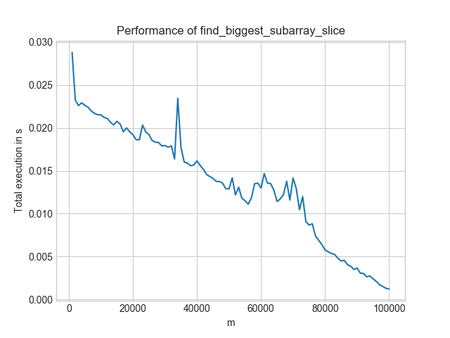

I recently taught a course about improving code for performance. An obvious
performance improvement is to not execute unnecessary operations. I lacked a
good example when I gave the course, but here is one: Find value of the largest
contiguous sub-array of fixed length in a huge array.

This is a toy example, of course, but it shows the idea quite well.

The [Code is on GitHub](https://github.com/MartinThoma/algorithms/tree/master/Python/continuous-subarray).


## Small Example

Input:

* array: [7, 9, 2, 0, 5, 2, 0, 1, 1, 2]
* sub-array length m = 3

Contiguous sub-arrays of the given length:

1. `[7, 9, 2]`, value = 18
2. `[9, 2, 0]`, value = 11
3. `[2, 0, 5]`, value = 7
4. `[0, 5, 2]`, value = 7
5. `[5, 2, 0]`, value = 7
6. `[2, 0, 1]`, value = 3
7. `[0, 1, 1]`, value = 2
8. `[1, 1, 2]`, value = 4

Output: 18


## Inefficient Solution

The following solution makes use of the slicing notation. It is short,
easy to read and mostly pretty efficient:

```python
from typing import List


def find_biggest_subarray_slice(array: List[int], m: int) -> int:
    return max(sum(array[i : i + m]) for i in range(len(array) - m + 1))
```

Except that it has one flaw: It makes too many additions and accesses list
elements way more often than necessary


## Efficient Solution

```python
from typing import List


def find_biggest_subarray_iterative(array: List[int], m: int) -> int:
    value = sum(array[0:m])
    largest_sub_array = value
    for remove, add in zip(array, array[m:]):
        value = value - remove + add
        largest_sub_array = max(value, largest_sub_array)
    return largest_sub_array
```


## Comparison

The inefficient solution is in $\mathcal{O}((n - m) \cdot m)$, the efficient
one is in $\mathcal{O}(n - m)$. So you will notice the difference clearly when
you compare the execution times with big $m$.

The inefficient solution changes its execution time like as shown in the image
below for increasing m and contant n = 100,000:

<figure class="wp-caption aligncenter img-thumbnail">
    <a href="../images/2020/02/total-execution-time.png"></a>
    <figcaption class="text-center">Total execution time of find_biggest_subarray_slice</figcaption>
</figure>

In contrast, the efficient solution looks like this:

<figure class="wp-caption aligncenter img-thumbnail">
    <a href="../images/2020/02/find_biggest_subarray_iterative.png"></a>
    <figcaption class="text-center">Total execution time of the efficient solution</figcaption>
</figure>

Two things to notice:

* **Worst-Case**: For the inefficient solution, it is $m = n/2$. For the
  efficient solution, it is $m = 1$.
* **Level**: The efficient solution is always below 0.03s. The inefficient one
  is only for the best-case scenario ($n=m$) below that. And even then, the
  efficient solution is at 0.0008s whereas the inefficient one is at 0.001s.
* **Speed-ups**: If you look at $m = 60,000$, the more efficient solution gives
  a 1000× speedup!


## See also

* [Maximum Contiguous Subarray Sum](https://martin-thoma.com/maximum-subarray-sum/)
