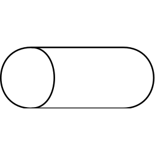

My mentee recently asked me what software architecture is. How do you draw
an architecture diagram? What is a bad one and how do I learn to draw good ones?

The software architecture gives a very high-level overview of a software system.

## Typical Components

A software architecture tries to solve a problem. It tries to achieve
"high quality" in some of the properities mentioned in [ISO/IEC 25010](https://iso25000.com/index.php/en/iso-25000-standards/iso-25010).

One very typical property is **modularity**. We want to have components which
are to a large degree independent so that different teams can work on it. It
also helps with Analysability, Modifiability and Testability.

<table class="table">
    <tr>
        <th>Image</th>
        <th>Technology</th>
        <th>Description</th>
    </tr>
    <tr>
        <td>Database </td>
        <td>MySQL, PostgreSQL</td>
        <td>Databases are a typical way to store data and state. One distinguishes relational databases from NoSQL Databases. <a href="https://en.wikipedia.org/wiki/ACID">ACID</a> properties are important.</td>
    </tr>
    <tr>
        <td>Queue / Kafka Topic </td>
        <td><a href="http://www.celeryproject.org/">Celery</a></td>
        <td>A job queue can be used to distribute computationally intensive tasks. Think about encoding a video on YouTube.</td>
    </tr>
    <tr>
        <td>Object Storage </td>
        <td>AWS S3 / Google Cloud Storage</td>
        <td>Storing files is often useful for various parts of machine learning projects. In the YouTube example, storing an encoded file.</td>
    </tr>
    <tr>
        <td>Front Ends FEs</td>
        <td>Android, IOS, Web</td>
        <td>The front-ends typically can be seperated pretty well in different teams. They need to access the same backend services.</td>
    </tr>
    <tr>
        <td>Cache </td>
        <td><a href="https://en.wikipedia.org/wiki/Memcached">Memcached</a>, <a href="https://en.wikipedia.org/wiki/Content_delivery_network">CDN</a> for static files, Redis, Cassandra</td>
        <td>Caches are important to make things fast and reduce load. There are many different ways to cache.</td>
    </tr>
    <tr>
        <td>Load Balancer </td>
        <td><a href="https://aws.amazon.com/de/elasticloadbalancing/">AWS ELB</a>, <a href="https://docs.nginx.com/nginx/admin-guide/load-balancer/http-load-balancer/">NGINX</a></td>
        <td>If you built your service in a way to be horizontally scalable, load balancing is crucial. Round-robin or hashing on the IP address are possible choices.</td>
    </tr>
</table>

## Interfaces

When reading that there are different Front Ends, you might wonder how you
define the interfaces between front ends and backend services.

* [REST API](https://martin-thoma.com/rest/): [OpenAPI Specification](https://en.wikipedia.org/wiki/OpenAPI_Specification) e.g. with [Flask-RestX](https://flask-restx.readthedocs.io/en/latest/)
* [JSON Schema](https://json-schema.org/)
* [Avro](https://aseigneurin.github.io/2018/08/02/kafka-tutorial-4-avro-and-schema-registry.html)
* Flat file: Sometimes it is enough to make a file available, e.g. via FTP or even HTTP (Amazon S3). The strenght of a single file is batch-load. You can keep the files and thus track the past. It is not a good choice for streaming / real time applications where you have a lot of events.

## Typical Patterns

* Layers: Presentation layer, application layer, business logic layer, data access layer
* Client / Server: Online applications
* Master / Slave: In database replication
* Broker pattern: Distributed Systems
* Peer-to-peer pattern: File sharing
* Event-bus: Android development
* Model-view-controller: Django applications and many more web applications

## See also

* Vijini Mallawaarachchi: [10 Common Software Architectural Patterns in a nutshell](https://towardsdatascience.com/10-common-software-architectural-patterns-in-a-nutshell-a0b47a1e9013), 2017.
* Eberhard Wolff: [How to Become a Great Software Architect](https://www.youtube.com/watch?v=v_nhv6aY1Kg) at GOTO 2019
* Clément Mihailescu: [Google Systems Design Interview With An Ex-Googler](https://www.youtube.com/watch?v=q0KGYwNbf-0), 2020.
