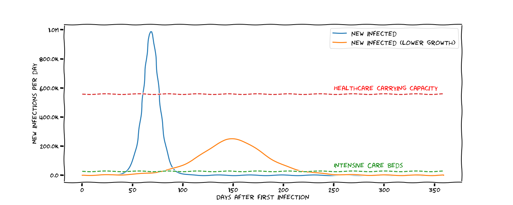

The [Coronavirus](https://en.wikipedia.org/wiki/Coronavirus) runs around the
world and causes many changes in our everyday lives. Correct information is
important so that people behave well.


## What are good sources?

* [World Health Oranization](https://www.who.int/emergencies/diseases/novel-coronavirus-2019): Hands down the source I would trust most
* [Johns Hopkins University](https://coronavirus.jhu.edu/map.html)
* Video: [Kurzgesagt](https://www.youtube.com/watch?v=BtN-goy9VOY)
* German Sources
    * [Robert Koch Institut](https://www.rki.de/DE/Content/InfAZ/N/Neuartiges_Coronavirus/nCoV.html)
    * Bundesregierung
        * [Informationen zum neuartigen Coronavirus / Covid-19](https://www.infektionsschutz.de/coronavirus/)
        * [Leitlinien gegen Ausbreitung des Coronavirus](https://www.bundesregierung.de/breg-de/themen/coronavirus/leitlinien-bund-laender-1731000)

## What can we do...

### ...now?

* **Hygene**: Wash your hands properly ([video](https://www.youtube.com/watch?v=IisgnbMfKvI))
* **Don't hoard**
* [**Social Distancing**](https://en.wikipedia.org/wiki/Social_distancing)
    * Stay at home
    * Don't meet other people in person
* **Support Others**

#### Social Distancing

The idea behind social distancing is to minimize risk of getting infected. The
less people you talk to, the less often you interact with other humans, the
less risk to spread the virus.

The main point of it is not that you don't get infected (although [you really don't want to get this](https://www.youtube.com/watch?v=iFLSG-7K3Tc)), but that the infection
over the country slows down. Roughly 5% of people who get infected need
intensive care at hospital. We only have a limited amount of beds in hospitals
for intensive care. If we run out of beds, people die. This is what "flatten
the curve" is about.

##### Flatten The Curve

The following summarizes what Harald Lesch discuessed ([video](https://www.youtube.com/watch?v=Fx11Y4xjDwA)).

* 5% of people who get COVID-19 need intensive care at hospital ([source](https://jamanetwork.com/journals/jama/fullarticle/2762130))
* A hospitalized case stays there for 11 days in average ([source](https://www.npr.org/sections/goatsandsoda/2020/03/20/815408287/how-the-novel-coronavirus-and-the-flu-are-alike-and-different))
* Germany has 28,000 intensive care beds in hospitals ([source](https://www.mdr.de/wissen/kliniken-krankenhaeuser-deutschland-kapazitaet-corona-100.html)). However, there are still other diseases. So we can't use all of them just for COVID-19 cases.

This means once we have more than 28000/0.05 = 560k new infections per day, we
have a problem.

The infections seem to follow an exponential growth pattern, but that doesn't
make much sense within limited populations. Assuming a [logistic growth
pattern](https://en.wikipedia.org/wiki/Logistic_growth) makes more sense:

* It starts like exponential growth
* At some point it flattens out to linear growth
* At the end, getting the last few uninfected people, it decays exponentially

Taking this growth model (a [generalized logistic function](https://en.wikipedia.org/wiki/Generalised_logistic_function)) and the
thoughts from before. I also assume that once 20 million people (1/4th of
Germany) was infected, the virus will basically stop due to heard immunity. I
don't know if this is a reasonable assumption. The higher this number needs to
be, the more depressing the picture looks:

<figure class="aligncenter img-thumbnail">
    <a href="../images/2020/03/flatten-the-curve.png"></a>
    <figcaption class="text-center">The number of new infections by day. Note that the total number of infections in both cases is the same, but the flatter curve is within the carring capacity of the hospitals. This means no people die because of missing medical equipment.</figcaption>
</figure>

You can find the [code on GitHub](https://github.com/MartinThoma/algorithms/tree/master/Python/covid-19).

However, looking at [the statistics for China](https://en.wikipedia.org/wiki/2019%E2%80%9320_coronavirus_pandemic_in_mainland_China#Statistics), one
can see that the number of sick people decreases after roughly 33 days. So if
other countries have similar strict quarantines, I would expect a similar
behaviour. This would mean for Germany that the most severe time is already
behind us. I guess the truth is somewhere in between. I I would need to to
guess, I would say that the situation will become more severe until maybe 20th
of April and then becomes better.


#### Support Others

Eldery people are at most risk. They should isolate themselves as much as
possible. Maybe you can buy them food? Maybe you can call your (grand) parents
or teach them how to use video chat software like Skype, so that they don't
feel alone.

Medical staff and eldery care staff also needs your help basically the same way
([video, 49s](https://www.youtube.com/watch?v=jmSPOSGpAYs)): Help them to buy
groceries and give them emotional support. They have a pretty stressful time
right now, they are not super well paid, they are in contact with all the sick
people. Remember: You might need them as well.

### ...in future?

Personally, you can do a bit of prepping so that you don't panic when there is
an pandemic:

* Have enough food for 14 days at home, for example pasta, rice, wheat, and oil
* Have toiletries for at least 14 days at home
* Be well-connected with your family and friends
* Have a bike / car, so that you can go alone to the supermarket.
* [Zero Waste](https://en.wikipedia.org/wiki/Zero_waste): If you have re-usable
  stuff, you might need to buy less. For example, [Silicone baking mats](https://www.amazon.com/AmazonBasics-Silicone-Baking-Mat-Sheet/dp/B0725GYNG6) and [cotton handkerchiefs](https://www.amazon.com/Handkerchiefs-Cotton-White-Hankie-Pieces/dp/B01930CBF4) can help.

Companies can move to a remote-first strategy. [Working remotely](https://martin-thoma.com/working-remotely/) has a couple of advantages. It can be supported by:

* Make sure people have a laptop which they can take home
    * Make sure people have a video conference software installed (e.g. Skype)
    * Make sure people have access to everything from outside the company network
* Company-wide chat (e.g. Slack / [Mattermost](https://mattermost.com/))

Schools and the boards of education of countries can finally put the
educational material online, for free. It's about time.

Government agencies can do the same what companies can do, but additionally
make sure that the people don't need to come in person.
[E-government](https://en.wikipedia.org/wiki/E-government) rules.

Countries can make sure they have clear plans what to do. Especially hospitals
need to be equipped (material and people).


## Myth: It affects only the elderly

[A Medical Worker Describes Terrifying Lung Failure From COVID-19 — Even in His Young Patients.](https://www.propublica.org/article/a-medical-worker-describes--terrifying-lung-failure-from-covid19-even-in-his-young-patients)

If you want a video of a young person being affected:

<iframe width="560" height="315" src="https://www.youtube-nocookie.com/embed/iFLSG-7K3Tc" frameborder="0" allow="accelerometer; autoplay; encrypted-media; gyroscope; picture-in-picture" allowfullscreen></iframe>

## Name

The [Coronavirus](https://en.wikipedia.org/wiki/Coronavirus) causes the [Coronavirus disease 2019](https://en.wikipedia.org/wiki/Coronavirus_disease_2019), in short: COVID-19.

It is sometimes also called Wuhan virus ([nature.com, 2020-01-21](https://www.nature.com/articles/d41586-020-00146-w)), Fox News calls it ["chinese" coronavirus (2020-03-12)](https://www.youtube.com/watch?v=QI-9v-TdshU), [Trump, 2020-03-18](https://www.youtube.com/watch?v=7zatCqqRY_I). Especially in the US I have heard the term "foreign virus" pretty often. **Those names should not be used.** It should not be called like this, because it doesn't add anything to the discussion. "Coronavirus" is short, everybody knows what is meant. Adding "Wuhan", "Chinese" or "foreign" only strengthens racism and [Xenophobia](https://en.wikipedia.org/wiki/Xenophobia). There are several other examples of viruses in the past where we didn't use this naming:

* [2009 flu pandemic](https://en.wikipedia.org/wiki/2009_flu_pandemic): Commonly known as swine flu. Nobody said "Mexican virus"
* [2015–16 Zika virus epidemic](https://en.wikipedia.org/wiki/2015%E2%80%9316_Zika_virus_epidemic): Nobody said "Brazilian virus"
* [2002–2004 SARS outbreak](https://en.wikipedia.org/wiki/2002%E2%80%932004_SARS_outbreak#Timeline): Nobody said "Chinese virus" - this also shows another problem. How do you start calling them if there are two different ones?


## Timeline of the Pandemic

* 2019-09-18: sciencemag claims this was the start ([source](https://science.sciencemag.org/content/367/6477/492))
* 2019-11-17: First case of COVID-19 in Wuhan, China.
* 2019-12-31:
    * The chinese pandemic team starts looking at cases in Wuhan after 44 [Pneumonias](https://en.wikipedia.org/wiki/Pneumonia) with unknown origin
    * Taiwan starts screening people
* 2020-01-13: Case in Thailand confirmed
* 2020-01-15: Case in Japan confirmed
* 2020-01-21: First confirmed case in the [United States](https://en.wikipedia.org/wiki/Timeline_of_the_2020_coronavirus_pandemic_in_the_United_States)
* 2020-01-26: 2744 confirmed cases in China, 80 dead. [RKI](https://en.wikipedia.org/wiki/Robert_Koch_Institute) declares Wuhan an risk area.
* 2020-01-28: First confirmed case in [Germany](https://en.wikipedia.org/wiki/2020_coronavirus_pandemic_in_Germany) and [Italy](https://en.wikipedia.org/wiki/2020_coronavirus_pandemic_in_Italy).
* 2020-01-30: First confirmed case in [India](https://en.wikipedia.org/wiki/Timeline_of_the_2020_coronavirus_pandemic_in_India)
* 2020-01-31:
    * More than 100 cases in Germany
    * First confirmed case in [Spain](https://en.wikipedia.org/wiki/2020_coronavirus_pandemic_in_Spain)
* 2020-02-20: First death toll in [Iran](https://en.wikipedia.org/wiki/2020_coronavirus_pandemic_in_Iran)
* 2020-02-22: Israel and Libanon confirm first cases
* 2020-02-23: More than 100 cases in Italy
* 2020-02-24: First confirmed cases in Kuwait, Bahrain, Afghanistan, Irak
* 2020-02-25: First confirmed case in [Switzerland](https://en.wikipedia.org/wiki/2020_coronavirus_pandemic_in_Switzerland)
* 2020-02-29: More than 1000 cases in Italy
* 2020-03-02: More than 100 cases in Spain
* 2020-03-05:
    * More than 100 cases in the United States
    * More than 100 cases in Switzerland
* 2020-03-09:
    * More than 1000 cases in Spain
    * More than 1000 cases in Germany
    * First confirmed case in Brunei
* 2020-03-10: More than 10,000 cases in Italy
* 2020-03-11: More than 1000 cases in the United States
* 2020-03-12: First death in Indonesia
* 2020-03-13: More than 1000 cases in Switzerland
* 2020-03-17:
    * More than 10,000 cases in Spain
    * More than 100 cases in India
* 2020-03-19:
    * More than 10,000 cases in the United States
    * More than 10,000 cases in Germany

Another way to look at it is by Google searches:

<script type="text/javascript" src="https://ssl.gstatic.com/trends_nrtr/2152_RC02/embed_loader.js"></script> <script type="text/javascript"> trends.embed.renderExploreWidget("TIMESERIES", {"comparisonItem":[{"keyword":"coronavirus","geo":"","time":"2020-01-01 2020-03-22"},{"keyword":"sex","geo":"","time":"2020-01-01 2020-03-22"},{"keyword":"/m/0cqt90","geo":"","time":"2020-01-01 2020-03-22"}],"category":0,"property":""}, {"exploreQuery":"date=2020-01-01%202020-03-22&q=coronavirus,sex,%2Fm%2F0cqt90","guestPath":"https://trends.google.de:443/trends/embed/"}); </script>

A small timeline:

* 2020-01-21: The Coronavirus became more interesting than Donald Trump
* 2020-01-31: It almost became as interesting as porn/sex
* 2020-02-20: People lost interest again
* 2020-02-24: The Coronavirus became as interesting as porn/sex
* 2020-03-09: The Coronavirus starts to get super interesting - maybe, because
  a couple of countries in Europe start realizing that this is getting out of
  hand.
* 2020-03-15: The Coronavirus hit a maximum.


## Predictions for Germany

Fitting a [generalized logistic function](https://en.wikipedia.org/wiki/Generalised_logistic_function)

$$f(x) = \frac{1}{1 + e^{-b \cdot x + c}}$$

to the data from 2020-02-24 to 2020-03-23 in order to get the total number of
infected people gave the following results.


### Issues

I assumend that at most 64 million people can (and will) become infected.

Please keep in mind that the data is not fixed. If a person gets the results of
the test later, the numbers for a given day might be corrected. And the
corrections are huge.

For 2020-03-20:

* 12,890: What I got from en-wiki at 2020-03-23
* 13,957: What I see on en-wiki at 2020-03-25 (08:25)
* 18,361: [statista.com](https://de.statista.com/statistik/daten/studie/1102667/umfrage/erkrankungs-und-todesfaelle-aufgrund-des-coronavirus-in-deutschland/) (2020-03-25 08:25)
* 19,850: [Berliner Morgenpost](https://interaktiv.morgenpost.de/corona-virus-karte-infektionen-deutschland-weltweit/) (2020-03-25 08:25)

So the range is 6960 cases. The highest number is 54% higher than the lowest
one. With such extrem corrections of the current numbers, the predictions must
be pretty bad.

Naturally, the model also does not know about any changes like quarantine or
self-isolation. One could analogize to other countries, but I was too lazy
to implement that.

### Predictions

On the training data:

```
LogitRegressor(beta=0.1980, c=13.4600, max_population=64000000.0)
Day 2020-02-24: 91 (+91) predicted vs 16 in reality
Day 2020-02-25: 111 (+20) predicted vs 18 in reality
Day 2020-02-26: 136 (+24) predicted vs 21 in reality
Day 2020-02-27: 165 (+30) predicted vs 26 in reality
Day 2020-02-28: 202 (+36) predicted vs 53 in reality
Day 2020-02-29: 246 (+44) predicted vs 66 in reality
Day 2020-03-01: 300 (+54) predicted vs 117 in reality
Day 2020-03-02: 365 (+66) predicted vs 150 in reality
Day 2020-03-03: 445 (+80) predicted vs 188 in reality
Day 2020-03-04: 543 (+97) predicted vs 240 in reality
Day 2020-03-05: 661 (+119) predicted vs 349 in reality
Day 2020-03-06: 806 (+145) predicted vs 534 in reality
Day 2020-03-07: 983 (+177) predicted vs 684 in reality
Day 2020-03-08: 1,198 (+215) predicted vs 847 in reality
Day 2020-03-09: 1,460 (+262) predicted vs 1,112 in reality
Day 2020-03-10: 1,780 (+320) predicted vs 1,460 in reality
Day 2020-03-11: 2,170 (+390) predicted vs 1,884 in reality
Day 2020-03-12: 2,645 (+475) predicted vs 2,369 in reality
Day 2020-03-13: 3,224 (+579) predicted vs 3,062 in reality
Day 2020-03-14: 3,930 (+706) predicted vs 3,795 in reality
Day 2020-03-15: 4,790 (+860) predicted vs 4,838 in reality
Day 2020-03-16: 5,839 (+1,049) predicted vs 6,012 in reality
Day 2020-03-17: 7,117 (+1,278) predicted vs 7,156 in reality
Day 2020-03-18: 8,675 (+1,558) predicted vs 8,198 in reality
Day 2020-03-19: 10,575 (+1,899) predicted vs 10,999 in reality
Day 2020-03-20: 12,890 (+2,315) predicted vs 13,957 in reality
Day 2020-03-21: 15,711 (+2,822) predicted vs 16,662 in reality
Day 2020-03-22: 19,151 (+3,439) predicted vs 18,610 in reality
Day 2020-03-23: 23,342 (+4,192) predicted vs 22,672 in reality
```

Let's see when the predictions start to fall apart. They will, because the
training data does not contain the isolation and also there isn't a lot of
training data for Germany.

Here are the predictions from 2020-03-23:

```
Date: Total infections at the end of the day (new infections on that day)
2020-03-24: 28,451 (+5,109) -- was 29,542
2020-03-25: 34,678 (+6,226)
2020-03-26: 42,266 (+7,588)
2020-03-27: 51,513 (+9,247)
2020-03-28: 62,781 (+11,268)
2020-03-29: 76,512 (+13,730)
2020-03-30: 93,240 (+16,729)
2020-03-31: 113,620 (+20,380)
2020-04-01: 138,445 (+24,825)
2020-04-02: 168,679 (+30,234)
2020-04-03: 205,495 (+36,816)
2020-04-04: 250,315 (+44,820)
2020-04-05: 304,863 (+54,548)
2020-04-06: 371,230 (+66,366)
2020-04-07: 451,941 (+80,711)
2020-04-08: 550,049 (+98,108)
2020-04-09: 669,229 (+119,181)
2020-04-10: 813,902 (+144,672)
2020-04-11: 989,361 (+175,459)
2020-04-12: 1,201,925 (+212,564)
2020-04-13: 1,459,101 (+257,176)
2020-04-14: 1,769,755 (+310,654)
2020-04-15: 2,144,282 (+374,527)
2020-04-16: 2,594,763 (+450,481)
2020-04-17: 3,135,087 (+540,324)
2020-04-18: 3,780,998 (+645,911)
2020-04-19: 4,550,035 (+769,038)
2020-04-20: 5,461,306 (+911,271)
2020-04-21: 6,535,022 (+1,073,716)
2020-04-22: 7,791,737 (+1,256,715)
2020-04-23: 9,251,217 (+1,459,480)
2020-04-24: 10,930,911 (+1,679,694)
2020-04-25: 12,844,031 (+1,913,120)
2020-04-26: 14,997,360 (+2,153,329)
2020-04-27: 17,388,984 (+2,391,624)
2020-04-28: 20,006,289 (+2,617,305)
2020-04-29: 22,824,631 (+2,818,341)
2020-04-30: 25,807,100 (+2,982,469)
2020-05-01: 28,905,699 (+3,098,599)
2020-05-02: 32,064,000 (+3,158,301)
2020-05-03: 35,221,055 (+3,157,055)
2020-05-04: 38,316,010 (+3,094,955)
2020-05-05: 41,292,711 (+2,976,700)
2020-05-06: 44,103,564 (+2,810,854)
2020-05-07: 46,712,145 (+2,608,581)
2020-05-08: 49,094,309 (+2,382,163)
2020-05-09: 51,237,904 (+2,143,595)
2020-05-10: 53,141,410 (+1,903,506)
2020-05-11: 54,811,915 (+1,670,505)
2020-05-12: 56,262,843 (+1,450,928)
2020-05-13: 57,511,771 (+1,248,928)
2020-05-14: 58,578,524 (+1,066,753)
2020-05-15: 59,483,661 (+905,137)
2020-05-16: 60,247,363 (+763,702)
2020-05-17: 60,888,679 (+641,316)
2020-05-18: 61,425,081 (+536,401)
2020-05-19: 61,872,236 (+447,156)
2020-05-20: 62,243,960 (+371,723)
2020-05-21: 62,552,262 (+308,302)
2020-05-22: 62,807,474 (+255,212)
2020-05-23: 63,018,402 (+210,928)
2020-05-24: 63,192,502 (+174,100)
2020-05-25: 63,336,048 (+143,546)
2020-05-26: 63,454,297 (+118,249)
2020-05-27: 63,551,635 (+97,338)
2020-05-28: 63,631,711 (+80,076)
2020-05-29: 63,697,554 (+65,843)
2020-05-30: 63,751,672 (+54,118)
2020-05-31: 63,796,137 (+44,465)
2020-06-01: 63,832,661 (+36,524)
2020-06-02: 63,862,656 (+29,995)
2020-06-03: 63,887,284 (+24,628)
2020-06-04: 63,907,502 (+20,218)
2020-06-05: 63,924,097 (+16,596)
2020-06-06: 63,937,718 (+13,621)
2020-06-07: 63,948,897 (+11,179)
2020-06-08: 63,958,071 (+9,174)
2020-06-09: 63,965,598 (+7,528)
2020-06-10: 63,971,775 (+6,177)
2020-06-11: 63,976,843 (+5,068)
2020-06-12: 63,981,002 (+4,158)
2020-06-13: 63,984,414 (+3,412)
2020-06-14: 63,987,213 (+2,799)
2020-06-15: 63,989,509 (+2,297)
2020-06-16: 63,991,394 (+1,884)
2020-06-17: 63,992,939 (+1,546)
2020-06-18: 63,994,208 (+1,268)
2020-06-19: 63,995,248 (+1,040)
2020-06-20: 63,996,102 (+854)
2020-06-21: 63,996,802 (+700)
2020-06-22: 63,997,376 (+574)
```

## See also

* Statistics:
    * Johns Hopkins University: [Dashboard](https://coronavirus.jhu.edu/map.html)
    * [worldometers.info/coronavirus](https://www.worldometers.info/coronavirus/) - I'm NOT sure how trustworthy they are! The numbers currently roughly match the ones of Johns Hopkins University and they are trustworthy
    * Robert-Koch-Institue: [COVID-19: Fallzahlen in Deutschland und weltweit](https://www.rki.de/DE/Content/InfAZ/N/Neuartiges_Coronavirus/Fallzahlen.html) (German)
    * Berliner Morgenpost: [Coronavirus-Monitor](https://interaktiv.morgenpost.de/corona-virus-karte-infektionen-deutschland-weltweit/) (Map / Dashboard)
    * statista.com: [Entwicklung der täglich neu gemeldeten Fallzahl des Coronavirus (COVID-19) in Deutschland seit Januar 2020](https://de.statista.com/statistik/daten/studie/1100739/umfrage/entwicklung-der-taeglichen-fallzahl-des-coronavirus-in-deutschland/)
* Social Distancing
    * [Vox](https://www.youtube.com/watch?v=h9d86ocFlxE)
    * [The math behind why we need social distancing, starting right now](https://www.vox.com/2020/3/15/21180342/coronavirus-covid-19-us-social-distancing)
    * [Australian Government Department of Health](https://www.youtube.com/watch?v=2WCtGFNENYU)
    * Harald Lesch: [Coronavirus – unnötiger Alarm bei COVID-19?](https://www.youtube.com/watch?v=Fx11Y4xjDwA) (German)
    * 3Blue1Brown: [Exponential Growth and Epidemia](https://www.youtube.com/watch?v=Kas0tIxDvrg), 2020-03-08 on YouTube.