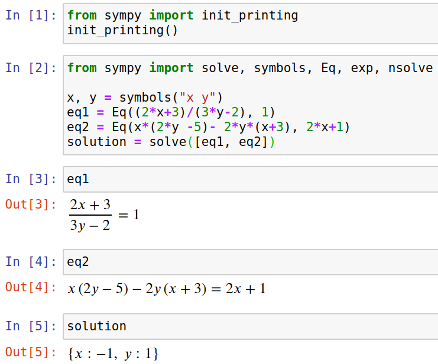

A friend recently asked me if I could help her to find the solution to a
system of non-linear equations. I remembered [Sympy](https://en.wikipedia.org/wiki/SymPy),
a Python library for symbolic computations.

Installation is easy:

```bash
pip install sympy
```


## Solving Single Equation

```python
from sympy import Eq, symbols, solve

x = symbols("x")
eq = Eq(x ** 2, 9)
print(solve(eq))
```

And it returns `[-3, 3]`! Awesome! So it found all solutions for that single,
simple equation!


## Solving System of Equations


```python
from sympy import Eq, symbols, solve

x, y = symbols("x y")
eq1 = Eq(x * y, 35)
eq2 = Eq(x + y, 12)
print(solve([eq1, eq2]))
```

This returns `[{x: 5, y: 7}, {x: 7, y: 5}]` 🎉


## Visualization

Equations can get really complicated and typos happen easily. Rendering the
equations in a nice way helps a lot to find bugs. I do this by starting
a [Jupyter Notebook](https://jupyter.org/). Just install `jupyter` and enter
`jupyter notebook` in the console.

Add this to a cell in the notebook and execute it:

```python
from sympy import init_printing

init_printing()
```

It looks like this:

<figure class="wp-caption aligncenter img-thumbnail">
    <a href="../images/2020/04/jupyter-equation-solving.png"></a>
    <figcaption class="text-center">Sympy in Jupyter Notebook</figcaption>
</figure>


## Alternatives

* [Wolfram Mathematica](https://en.wikipedia.org/wiki/Wolfram_Mathematica) ([comparison](https://github.com/sympy/sympy/wiki/SymPy-vs.-Mathematica)): Pretty expensive, no Python binding
