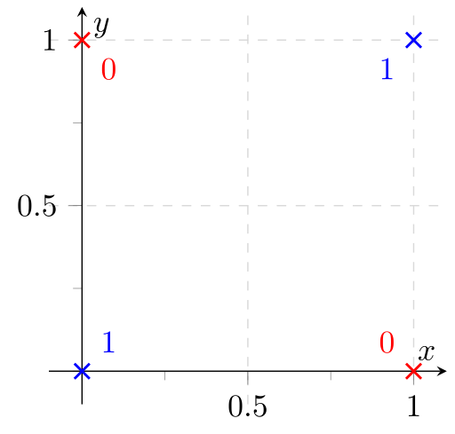

XOR is a simple bit-wise defined function:

\begin{align}
    \text{XOR}:& \{0, 1\} \times \{0, 1\} \rightarrow \{0, 1\}\\
    \text{XOR}(a, b) :&= \begin{cases}0 &\text{if } a= b\\1&\text{otherwise}\end{cases}
\end{align}

To make it more convenient, we define $a \oplus b := \text{XOR}(a, b)$.

If $a$ and $b$ have multiple bits, just align the bits to the same number and
and apply it point-wise on every index.

This simple function is applicable in many contexts. In Python, you make a
bit-wise XOR(a, b) with `a ^ b`.


## Multi-Bit Example

Just look at each column:

```text
        a = 0011
        b = 0110
XOR(a, b) = 0101
```

## Simple Tasks

There are some simple coding competition tasks where you can apply this trick.

### Leetcode 136

> Given a non-empty array of integers, every element appears twice except for
> one. Find that single one.

See [Leetcode.com](https://leetcode.com/problems/single-number/)

Here is a straight-forward solution to that problem using no additonal space
and running in $\mathcal{O}(n)$:

```python
from typing import List


def find_outlier(nums: List[int]) -> int:
    for num in nums[1:]:
        nums[0] = num ^ nums[0]
    return nums[0]
```

Pretty cool, isn't it?


### Missing Number

> Given is an array of (n-1) numbers. Each number is in  1, ..., n and unique.
> This means you have all numbers from 1 to n, but one is missing and the
> array is not necessarily sorted.
> Find the missing number.

The straight-forward solution with the XOR-trick is:

```python
from typing import List


def find_missing(nums: List[int]) -> int:
    # Prepare
    missing = 0
    for i in range(1, len(nums) + 1):
        missing ^= i

    # Run
    for num in nums:
        missing ^= num
    return missing
```

This already has the optimal space complexity of $\mathcal{O}(1)$ and
the optimal time complexity of $\mathcal{O}(n)$. However, I don't like that
the prepare-block is in $\mathcal{O}(n)$.

Let's call the XOR of the numbers 1 to n, ALL_XOR(n):

$$\text{ALL_XOR}(n) := \begin{cases}0 &\text{if } n =0\\\text{XOR}(n , \text{ALL_XOR(n-1)}) &\text{otherwise}\end{cases}$$

The XOR of 1 to n for some numbers can be seen here:

<table class="table">
    <thead>
        <tr>
            <th>n</th>
            <th>$\text{ALL_XOR}(n)$</th>
            <th>n % 4</th>
        </tr>
    </thead>
    <tbody>
    <tr>
        <td>0</td>
        <td>0</td>
        <td>0</td>
    </tr>
    <tr>
        <td>1</td>
        <td>1</td>
        <td>1</td>
    </tr>
    <tr>
        <td>2</td>
        <td>3</td>
        <td>2</td>
    </tr>
    <tr>
        <td>3</td>
        <td>0</td>
        <td>3</td>
    </tr>
    <tr>
        <td>4</td>
        <td>4</td>
        <td>0</td>
    </tr>
    <tr>
        <td>5</td>
        <td>1</td>
        <td>1</td>
    </tr>
    <tr>
        <td>6</td>
        <td>7</td>
        <td>2</td>
    </tr>
    <tr>
        <td>7</td>
        <td>0</td>
        <td>3</td>
    </tr>
    <tr>
        <td>8</td>
        <td>8</td>
        <td>0</td>
    </tr>
    <tr>
        <td>9</td>
        <td>1</td>
        <td>1</td>
    </tr>
    <tr>
        <td>10</td>
        <td>11</td>
        <td>2</td>
    </tr>
    </tbody>
</table>

#### Hypothesis 1: If n % 4 == 0, then $\text{ALL_XOR}(n) = n$

A [proof by induction](https://en.wikipedia.org/wiki/Mathematical_induction) follows:

**Base Case** (BC): For $n = 0$ we have $n$ % 4 == 0 and $\text{ALL_XOR}(n) = n = 0$.

**Induction step**: For $n + 4$, we have:

\begin{align}
    \text{ALL_XOR}(n + 4) &= \text{ALL_XOR}(n) \oplus (n+1) \oplus (n+2) \oplus (n+3) \oplus (n+4)\\
    &\stackrel{(BC)}{=} n \oplus (n+1) \oplus (n+2) \oplus (n+3) \oplus (n+4)\\
&\stackrel{(R)}{=} n \oplus (n \oplus 1) \oplus (n \oplus 2)  \oplus (n \oplus 3) \oplus (n + 4)\\
&\stackrel{(A + K)}{=} (n \oplus n) \oplus 1 \oplus 2 (n \oplus n) \oplus 3 \oplus (n + 4)\\
&= 3 \oplus 3 \oplus (n + 4)\\
&= n + 4
\end{align}

A few steps to explain:

* R: If you look at $n$ in binary, the last two digits are zero as n % 4 == 0. This means that $n+1 = n \oplus 1$.
* BC: The base case
* A + K: Associativity and Kommutativity; I didn't prove it but it is pretty
  clear from the defintion

#### Hypothesis 2: If n % 4 == 1, then $\text{ALL_XOR}(n) = 1$

And another proof by induction!

**Base Case** (BC): For $n = 1$ we have $n$ % 4 == 1 and $\text{ALL_XOR}(n) = 0 \oplus 1 = 1$.

**Induction step**: For $n + 4$, we have:

\begin{align}
    \text{ALL_XOR}(n + 4) &= \text{ALL_XOR}(n) \oplus (n+1) \oplus (n+2) \oplus (n+3) \oplus (n+4)\\
    &\stackrel{(BC)}{=} 1 \oplus (n + 1) \oplus (n + 2) \oplus (n + 3) \oplus (n+4)\\
&\stackrel{(R)}{=} 1 \oplus (n \oplus 3) \oplus (n \oplus 2) \oplus (n + 3) \oplus (n+4)\\
&= (n+3) \oplus (n + 4)
&= 1
\end{align}

#### Hypothesis 3: If n % 4 == 2, then $\text{ALL_XOR}(n) = n+1$

All good things come in threes!

**Base Case** (BC): For $n = 2$ we have $n$ % 4 == 2 and $\text{ALL_XOR}(n) = 0 \oplus 1 \oplus 2 = 3$.

**Induction step**: For $n + 4$, we have:

\begin{align}
    \text{ALL_XOR}(n + 4) &= \text{ALL_XOR}(n) \oplus (n+1) \oplus (n+2) \oplus (n+3) \oplus (n+4)\\
    &\stackrel{(BC)}{=} (n+1) \oplus (n + 1) \oplus (n + 2) \oplus (n + 3) \oplus (n+4)\\
&= (n + 2) \oplus (n + 3) \oplus (n+4)\\
&\stackrel{(R)}{=} (n + 3) \oplus 2\\
&= n + 1
\end{align}

#### Hypothesis 4: If n % 4 == 3, then $\text{ALL_XOR}(n) = 0$

**Base Case** (BC): For $n = 3$ we have $n$ % 4 == 3 and $\text{ALL_XOR}(n) = 0 \oplus 1 \oplus 2 \oplus 3 = 0$.

**Induction step**: For $n + 4$, we have:

\begin{align}
    \text{ALL_XOR}(n + 4) &= \text{ALL_XOR}(n) \oplus (n+1) \oplus (n+2) \oplus (n+3) \oplus (n+4)\\
    &\stackrel{(BC)}{=} (n + 1) \oplus (n + 2) \oplus (n + 3) \oplus (n+4)\\
&\stackrel{(R)}{=} 1 \oplus (n+3) \oplus(n+4)\\
&\stackrel{(R)}{=} (n+4)\oplus(n+4)\\
&= 0
\end{align}

This means there is a faster solution!

```python
from typing import List


def find_missing(nums: List[int]) -> int:
    # Prepare
    n = len(nums) + 1
    if n % 4 == 0:
        missing = n
    elif n % 4 == 1:
        missing = 1
    elif n % 4 == 2:
        missing = n + 1
    else:  # n % 4 == 3
        missing = 0

    # Run
    for num in nums:
        missing ^= num
    return missing
```


## Fault Tolerance

In order to be fault-tolerant, one can calculate the XOR. Please note that this
is the same idea as in both toy questions from above. The [parity drive](https://en.wikipedia.org/wiki/Parity_drive)
in RAID 3 uses this.


## XOR Problem

In the context of Machine Learning there is something called the "XOR Problem".
The XOR-Problem is a classification problem, where you only have four data
points with two features. The training set and the test set are exactly the
same in this problem. So the interesting question is only if the model is able
to find a decision boundary which classifies all four points correctly:

<figure class="wp-caption aligncenter img-thumbnail">
    <a href="../images/2016/07/xor-problem.png"></a>
    <figcaption class="text-center">The XOR classification problem. 4 datapoints and two classes. All datapoints have 2 features.</figcaption>
</figure>
