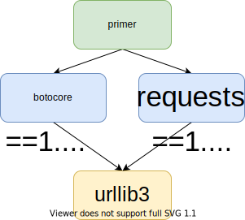
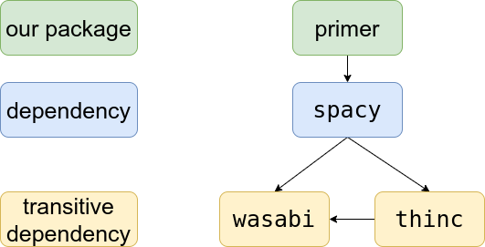

Pythons package management is a constant source of confusion. One part of the
confusion is in which format dependencies should get denoted. It gets worse, because there are [too many tools](https://stackoverflow.com/q/25337706/562769). [xkcd](https://xkcd.com/1987/) shows this pretty well:

<figure class="wp-caption aligncenter img-thumbnail">
    <a href="https://xkcd.com/1987/"></a>
    <figcaption class="text-center">xkcd The Python environmental protection agency wants to seal it in a cement chamber, with pictorial messages to future civilizations warning them about the danger of using sudo to install random Python packages. (<a href="https://www.explainxkcd.com/wiki/index.php/1987:_Python_Environment">explanation</a>)</figcaption>
</figure>

After reading this post, you will know the difference between abstract and concrete requirements, the relationship between setup.py, setup.cfg, requirements.txt, Pipfile, Pipfile.lock, and pyproject.toml.

I will not cover at all anything related to Anaconda and it will not go into detail how to use various tools.


## How Code is Shared

Back in the old days, code was shared as actual boxes which you borrowed from the library - the building, not some other software. I'm talking about [punch cards](https://en.wikipedia.org/wiki/Punched_card). Then people moved to sharing code on the internet as simple snippets / functions. Things became bigger and more organized. From simple archives (e.g. zip files) to archives with structure. The archive file contained code in pre-defined places, contained some meta data such as the author and especially the required dependencies. This special kind of archive file was then called a package.

Packages need to be built. They can then be shared. Finally, they can be installed, used and removed.

Packages exist on the Python ecosystem level where you have the installer `pip` and the package repository PyPI, on the Anaconda level with the installer `conda` and the repository Anaconda Cloud and on the operating system level where you have tools like `apt` and the Ubuntu repositories. Of course, there are many more.

Also, you have self-extracting archives and specialized installers. They are super common on Windows.


## Sharable Code Types

There are two very different types of sharable code to write: **Applications** and **libraries**. An application can have a command line interface (CLI), a graphical interface (GUI), be running as a web service or a system service, or it can just run regularly when events happen.

For libraries, the code never runs on its own. It is included in other code.

Please note that for this post, I consider a **framework** to be a special kind of library.

## Abstract Dependencies

The simplest way to share dependencies is by stating the names of the packages your code expects to be present. Not where one can get the dependency from, no version.

This is nice, because it allows the user of your code to have just any version of the dependency installed. The user might even be able to have an alternative implementation of the package installed, such as `Pillow` instead of `PIL` or `propy3` instead of `propy`. Just something that keeps the interfaces intact and you exposes the same names as imports.

## Concrete Dependencies

Abstract dependencies are nice, but sometimes the version is important. Sometimes interfaces break. Then you might want to point out which version range is acceptable. Or you might want to set an exact version.

## Abstract or Concrete: When to use which?

For library/framework code, you want to have maximum flexibility. Your
library is likely not the only one your users use. If you give concrete
dependencies, you might make it impossible for your users to have one set of
packages installed which fulfills all requirements:

<figure class="wp-caption aligncenter img-thumbnail">
    <a href="../images/2020/05/dependency-graph-pinning-conflict.svg"></a>
    <figcaption class="text-center">A package version conflict if two packages pinned different versions of urllib</figcaption>
</figure>

So, **for library/framework code, you keep dependencies abstract**.

For application code on the other hand, the user just wants to run the
application. You want to be as sure as possible that nothing fails. So you
specify concrete dependencies. You say for everything your application needs
where it comes from and in which version it is used. But this might not be
enough.

<figure class="wp-caption aligncenter img-thumbnail">
    <a href="../images/2020/05/dependency-graph.png"></a>
    <figcaption class="text-center">Dependency graph where wasabi could make things fail if only the version of spacy is pinned</figcaption>
</figure>

So, **for application code, you specify concrete dependencies and you apply
version pinning**. That means you specify the exact version you need for all of
your direct **and** indirect dependencies.

<div class="alert alert-warning">The reason why this whole topic is so confusing, is the fact that the two concepts (application vs library) are not strictly seperated and that the file formats and tools have grown over time.</div>

Practically, I suggest to keep dependencies in `setup.py` as loose as possible and add a `requirements.txt` which has pinned dependencies. This way one can install the package via pip and reasonably expect other things not to break while one can still use the `requirements.txt` and an virtual environment to isolate the application from the rest of the system.

You might think this is a shortcomming of the Python community not to allow packages to distinguish those two concepts and install "application packages" automatically in an isolated virtual environment with all their pinned dependencies. It's not. It's a design decision. The positive side of this is that it can save resources. You don't need to have dozens of duplicates of the same package on your disk. Also, when you load two libraries A and B which both depend on C, you only have C once in memory. The downside of it is that if you update that shared version, you can break things in unexpected ways.

Essentially you let the user decide what they want: Do they (a) want a small disk footprint or (b) isolation. If they want (a), they neey can install everything in the same environment. If they want (b), they need to use `venv` in some way, e.g. directly, via `virtualenv` or via `pipenv`.

Sadly, within one running environment it is not so easy to have multiple versions of the same package ([source](https://stackoverflow.com/q/60084441/562769)).


## Distribution formats

Python packages are distributed in two relevant flavours: **Source distributions** (sdist) and **built distributions** (bdist, a special case is the "binary distribution").

### Built Distributions

A **built distribution** can either be in the [egg format](https://setuptools.readthedocs.io/en/latest/formats.html) (deprecated) or in the [wheels format](https://www.python.org/dev/peps/pep-0427/). There is no reason to use/build eggs anymore; use and build just wheels. The wheels format is newer and learned from shortcommings of the egg format. Wheels is specified in [PEP 427](https://www.python.org/dev/peps/pep-0427/).

### Source Distributions

A **source distribution** is just sharing the source. It doesn't build anything. The advantage of this is that it is the same for all platforms (Windows, Linux, Mac) and machines (32 Bit / 64 Bit). The disadvantage is that users have to build the package themselves. This might include building Fortran / C code (e.g. for numpy and scipy). This also includes to get the dependencies.

Source distributions are typically created to use [setuptools](https://setuptools.readthedocs.io/en/latest/setuptools.html) is it is around for a long time and installed on essentially every machine which has Python. **If you want to install a source distribution using setuptools, you need a `setup.py` file**. You can see the structure of such a file below.

Similar as egg was created to solve an issue and later replaced by a specified version (wheels), the setuptools build solution is getting superseeded by `pyproject.toml`. This file allows you to specify the build system you want. This includes `setuptools` (with `setup.py`), but is not limited to it.


## Version pinning

Version pinning is the act of specifying the exact version of your
dependencies. Not only the direct dependencies, but also the indirect ones.

### pip-compile

Create a `requirements.in` and run `pip-compile` from [`pip-tools`](https://pypi.org/project/pip-tools/):

```shell
$ pip-compile -U requirements.in
```

This is the solution I would recommend.


### virtualenv + pip freeze

An alternative option is to create a virtual environment, install the package, make sure everything works and write the installed dependencies versions in a `requirements.txt` file:

```shell
$ virtualenv venv
$ source venv/bin/activate

# Add additional targets, if wanted!
$ pip install .

$ pip freeze > requirements.txt
```

### pipreqs

If you think your setup.py might miss something, try [`pipreqs`](https://pypi.org/project/pipreqs/):

```shell
$ pip install pipreqs
$ pipreqs /project/path
```

A similar tool is [`pipdeptree`](https://pypi.org/project/pipdeptree/).

## Dependency Formats

There are two common formats to denote dependencies: Within the `setup.py` and
`requirements.txt` files.

`setup.py` is used to install packages, whereas `requirements.txt` files are
used to prepare a development environment.

As an alternative to `requirements.txt`, you can use `Pipfile` + `Pipfile.lock`.
However, the `requirements.txt` is still the de facto standard.


### requirements.txt

The structure of a `requirements.txt` file is super simple:

```text
--index-url https://pypi.python.org/simple/
-e https://github.com/foo/bar.git#egg=bar
virtualenv==15.1.0
visitor==0.1.3
vtk==8.1.1
wadllib==1.3.2
watchdog==0.8.3
wcwidth==0.1.7
webencodings==0.5.1
websocket-client==0.54.0
Werkzeug==0.15.2
widgetsnbextension==3.3.0
wily==1.12.2
```

One line of the format `[package]==[version]`per requirement.

It can be installed via

```shell
$ pip install -r requirements.txt
```

There are nice tools like `piprot` which tells you how outdated the
requirements are. I would not create a `requirements.txt` manually, but instead
a `setup.py` or a `requirements.in` and let `pip-compile` create the
`requirements.txt` with all the transitive dependencies. You can then also use
`pip-compile -U` to upgrade the dependencies.


### setup.py

I usually end up using something like the following:

```python
#!/usr/bin/env python

"""mpu: Martins Python Utilities."""

# Core Library
import io
import os

# Third party
from setuptools import find_packages, setup


def read(file_name):
    """Read a text file and return the content as a string."""
    with io.open(
        os.path.join(os.path.dirname(__file__), file_name), encoding="utf-8"
    ) as f:
        return f.read()


requires_datetime = ["pytz"]
requires_image = ["Pillow"]
requires_io = ["pytz", "tzlocal"]
requires_aws = ["boto3"]
requires_tests = [
    "pytest",
    "pytest-cov",
    "pytest-mccabe",
    "pytest-flake8",
    "simplejson",
]
requires_all = (
    ["pandas", "python-magic"]
    + requires_datetime
    + requires_image
    + requires_io
    + requires_aws
    + requires_tests
)

setup(
    name="mpu",
    version="0.21.0",  # keep in sync with mpu/_version.py
    author="Martin Thoma",
    author_email="info@martin-thoma.de",
    maintainer="Martin Thoma",
    maintainer_email="info@martin-thoma.de",
    packages=find_packages(),
    package_data={"mpu": ["units/currencies.csv", "data/*", "package/templates/*"]},
    extras_require={
        "all": requires_all,
        "aws": requires_aws,
        "datetime": requires_datetime,
        "image": requires_image,
        "io": requires_io,
        "tests": requires_tests,
    },
    platforms=["Linux"],
    url="https://github.com/MartinThoma/mpu",
    license="MIT",
    description="Martins Python Utilities",
    long_description=read("README.md"),
    long_description_content_type="text/markdown",
    install_requires=[],
    keywords=["utility"],
    download_url="https://github.com/MartinThoma/mpu",
    classifiers=[
        "Development Status :: 3 - Alpha",
        "Environment :: Console",
        "Intended Audience :: Developers",
        "Intended Audience :: Information Technology",
        "License :: OSI Approved :: MIT License",
        "Natural Language :: English",
        "Programming Language :: Python :: 3.6",
        "Topic :: Software Development",
        "Topic :: Utilities",
    ],
    zip_safe=True,
)
```

### setup.cfg

Instead of filling the `setup.py` that much, I like to move stuff to the `setup.cfg`. The reason for that is that I prefer to have configuration files instead of code, if it's possible.

Instead of the `setup.py` from above you can have this one:

```python
#!/usr/bin/env python
from setuptools import setup

setup()
```

and this `setup.cfg`:

```ini
[metadata]
# https://setuptools.readthedocs.io/en/latest/setuptools.html#configuring-setup-using-setup-cfg-files
name = mpu

author = Martin Thoma
author_email = info@martin-thoma.de
maintainer = Martin Thoma
maintainer_email = info@martin-thoma.de

# keep in sync with mpu/_version.py
version = 0.21.0

description = Martins Python Utilities
long_description = file: README.md
long_description_content_type = text/markdown
keywords = utility,

platforms = Linux

url = https://github.com/MartinThoma/mpu
download_url = https://github.com/MartinThoma/mpu

license = MIT
classifiers =
        Development Status :: 3 - Alpha
        Environment :: Console
        Intended Audience :: Developers
        Intended Audience :: Information Technology
        License :: OSI Approved :: MIT License
        Natural Language :: English
        Programming Language :: Python :: 3 :: Only
        Programming Language :: Python :: 3.6
        Programming Language :: Python :: 3.7
        Programming Language :: Python :: 3.8
        Topic :: Software Development
        Topic :: Utilities

[options]
zip_safe = true
packages = find:
python_requires = >= 3.0

[options.extras_require]
all = pandas; python-magic; boto3; pytz; Pillow; tzlocal; pytest; pytest-cov; pytest-mccabe; pytest-flake8; simplejson
aws = boto3
datetime = pytz
image = Pillow
io = pytz; tzlocal
test = pytest; pytest-cov; pytest-mccabe; pytest-flake8; simplejson
```

You also see a reason here why you might want to mix-and-match between a pure `setup.py` and a pure `setup.cfg` solution: The `all` extra can be specified way better in code than in the configuration.

### pyproject.toml

The pyproject.toml deserves its [own blog post](https://martin-thoma.com/pyproject-toml/), but there are a few things to point out:

* Only the build system aspect is specified in [PEP 518](https://www.python.org/dev/peps/pep-0518/)
* [poetry defines](https://python-poetry.org/docs/pyproject/) name, version, license, maintainers, readme, keywords, classifiers, dependencies and dependencies-dev, ...
* [flit defines](https://flit.readthedocs.io/en/latest/) module, author, author-email, home-page, ...


## Tool Overview

Core Tools used by everybody:

* [pip](https://pypi.org/project/pip/): Install and remove Python packages. Installing includes dependency resolution.
* [twine](https://pypi.org/project/twine/): Upload Python packages ("distributions")
* [venv](https://docs.python.org/3/library/venv.html): An application in the standard library that allows you to create virtual environments. I don't use this. Instead, I like to use [`tox`](https://pypi.org/project/tox/) to isolate my unit tests. Or just have them run in a CI pipeline.

Third Party tools:

* [cookiecutter](https://github.com/MartinThoma/cookiecutter-python-package): Create a package sceleton. I can recomend cookicutter, although it is just a tiny tool. I use it with [my own template](https://github.com/MartinThoma/cookiecutter-python-package).
* [pyenv](https://github.com/pyenv/pyenv): Manage different Python versions. I highly recommend to use it! Before, switching the Python version was a massive pain for me. After that, it just takes a minute to install a new version.
* [pipenv](https://github.com/pypa/pipenv): Manage virtual environments for us

## Comparison with other Languages

The concept of abstract and concrete dependencies is not unique to Python and thus other programming languages have similar concepts. They look sometimes way less confusiong, e.g. because the language is new and could learn from existing patterns (e.g. Rust).

There are multiple ways to achieve the same thing in Python. For example, instead of using

<table class="table">
    <thead>
    <tr>
        <th>Language</th>
        <th>Package Metadata</th>
        <th>Abstract dependencies</th>
        <th>Locked dependencies</th>
    </tr>
    </thead>
    <tbody>
    <tr>
        <td>Python</td>
        <td>setup.py<br/>setup.cfg</td>
        <td><span style="color: green;">setup.py</span><br/><span style="color: green;">Pipfile</span><br/><span style="color: red;">requirements.txt</span></td>
        <td><span style="color: green;">requirements.txt</span><br/><span style="color: green;">Pipfile.lock</span><br/><span style="color: red;">setup.py</span></td>
    </tr>
    <tr>
        <td>Ruby</td>
        <td>.gemspec</td>
        <td>Gemfile</td>
        <td>Gemfile.lock</td>
    </tr>
    <tr>
        <td>Rust</td>
        <td>Cargo.toml</td>
        <td>Cargo.toml</td>
        <td>Cargo.lock</td>
    </tr>
    </tbody>
</table>

## Glossary

The following is mostly taken from Wikipedia and <a href="https://docs.python.org/3/glossary.html">the Python glossary</a>:

<dl>
    <dt><a href="https://en.wikipedia.org/wiki/Namespace"><dfn>Namespace</dfn></a></dt>
    <dd>The place where a variable is stored. A namespace ensures that all the identifiers within it have unique names so that they can be easily identified</dd>
    <dt><a href="https://docs.python.org/3/tutorial/modules.html"><dfn>Module</dfn></a></dt>
    <dd>An object that serves as an organizational unit of Python code. Modules have a namespace containing arbitrary Python objects. Modules are loaded into Python by the process of importing. A module is a <code>.py</code> file containing Python definitions and statements. The file name is the module name with the suffix .py appended. Within a module, the module’s name (as a string) is available as the value of the global variable __name__</dd>
    <dt><a href="https://docs.python.org/3/tutorial/modules.html#packages"><dfn>Package</dfn></a></dt>
    <dd>A package is a folder with an <code>__init__.py</code> file. A package is a Python module with an <code>__path__</code> attribute.</dd>
    <dt><dfn>Subpackage</dfn></dt>
    <dd>If package B is contained in package A, then B is called a <dfn>subpackage</dfn> of A.</dd>
</dl>


## See also

* [setuptools vs. distutils: why is distutils still a thing?](https://stackoverflow.com/q/25337706/562769)
* [How to upload your python package to PyPi](https://medium.com/@joel.barmettler/how-to-upload-your-python-package-to-pypi-65edc5fe9c56), 07.05.2018.
* [How are Pipfile and Pipfile.lock used?](https://stackoverflow.com/q/46330327/562769)
* [Pipenv: A Guide to the New Python Packaging Tool](https://realpython.com/pipenv-guide/#dependency-management-with-requirementstxt)
* [Comparison with Rust and Ruby](https://github.com/pypa/pipfile/issues/27#issuecomment-262264222), 22.11.2016.
* [Why to keep requirements.txt + pip-compile and not go to pipenv + Pipfile](https://github.com/jazzband/pip-tools/issues/679#issuecomment-418251444)
* [Managing Application Dependencies](https://packaging.python.org/tutorials/managing-dependencies/#managing-dependencies): poetry, hatch, pip-tools
* [A Practical Guide to Using Setup.py](https://blog.godatadriven.com/setup-py)
* [Wheel vs Egg](https://packaging.python.org/discussions/wheel-vs-egg/)
* [The Many Layers of Packaging](http://sedimental.org/the_packaging_gradient.html)
