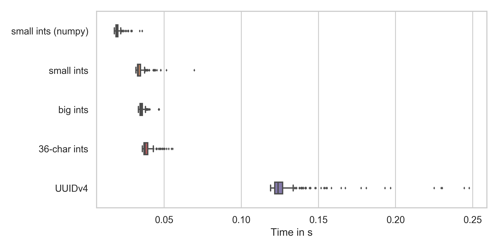

[Big Data](https://en.wikipedia.org/wiki/Big_data) was a common buzzword in
industry in 2012 until 2017. It is still common, but hopefully less of a
buzzword. Now other buzzwords are more common:

<script type="text/javascript" src="https://ssl.gstatic.com/trends_nrtr/2152_RC03/embed_loader.js"></script> <script type="text/javascript"> trends.embed.renderExploreWidget("TIMESERIES", {"comparisonItem":[{"keyword":"/m/0bs2j8q","geo":"","time":"2008-01-01 2020-03-24"},{"keyword":"/m/01hyh_","geo":"","time":"2008-01-01 2020-03-24"},{"keyword":"/m/0138n0j1","geo":"","time":"2008-01-01 2020-03-24"},{"keyword":"/m/0wkcjgj","geo":"","time":"2008-01-01 2020-03-24"},{"keyword":"/m/02_7vm","geo":"","time":"2008-01-01 2020-03-24"}],"category":0,"property":""}, {"exploreQuery":"date=2008-01-01%202020-03-24&q=%2Fm%2F0bs2j8q,%2Fm%2F01hyh_,%2Fm%2F0138n0j1,%2Fm%2F0wkcjgj,%2Fm%2F02_7vm","guestPath":"https://trends.google.de:443/trends/embed/"}); </script>

By the way, I didn't include "artificial intelligence" because it dominates all
of the others.

For me, a big-data solution means that I can't fit the critical part into
memory. This means that it is a question of time and money what problems
actually require a big data solution. Amazons `u-24tb1.metal` instance has 24
TB of memory. Yes, that is not a typo on my side. TB, not GB.
([source](https://aws.amazon.com/de/ec2/instance-types/high-memory/)). They
don't even publicly say how expensive those beasts are.

When it comes to big data, people think of
[Hadoop](https://en.wikipedia.org/wiki/Apache_Hadoop) and
[Spark](https://en.wikipedia.org/wiki/Apache_Spark). I'm not sure if I want to
go into that rabbit hole for this article. I want to show how to sort huge
amounts of data on a single machine: My Thinkpad T460p with 8GB of memory.

Please note that an `x1e.32xlarge` EC2 instance with about 4 TB of RAM costs
about 27 USD per hour
([source](https://aws.amazon.com/de/ec2/pricing/on-demand/)). This means you
might not need such a solution for quite a while.


## Data Generation

I want to generate a bit of data and make it at least a tiny bit realistic. So
lets generate about 20GB of data in a CSV file.

### Disk Space

With `df -h` I realized that I only have 5 GB left of my 500GB HDD 😢

The [Disk Usage Analyzer](http://www.marzocca.net/linux/baobab/) showed the
following disk space hogs:

* 404 GB: My Home Directory:
    * 152 GB: Various git repsitories
        * 103 GB: My "algorithms" repository
            * 99 GB for PyPI (see [PyPI Analysis 2020](https://martin-thoma.com/pypi-2020/))
            * 4 GB for a [database benchmark](https://github.com/MartinThoma/algorithms/tree/master/Python/databases/benchmark). I never really finished this; I moved on to other topics
        * 28 GB for [YouTube-Report](https://github.com/A3M4/YouTube-Report). Or rather the Takeout
    * 97 GB: Downloads
        * 1.5 GB: Photos of a hiking trip
        * 800 MB: [HASYv2](https://arxiv.org/pdf/1701.08380.pdf)
        * many smaller things ... that would take a while. Maybe I should just delete everything
    * 44 GB: Pictures
    * 22 GB: Dropbox
    * 20 GB: .local
    * 10 GB: .cache (mostly pip and pipenv)
    * 9 GB: Anaconda
    * many smaller things
* 26 GB `/usr`
    * 7 GB TexLive
    * 6 GB CUDA in different versions
* 7 GB `/var`
    * 5 GB journal logs
* some smaller things

I'm astonished not to see Docker here 🤔

After this short cleanup, I have `128G` available 🎉

### Generate it!

I don't want to spend too much time dealing with the actual element-by-element
comparison, so I want to use integers or strings to compare. I also don't want
to fiddle around with data organization, so I don't add a payload. We only
generate data which is sorted.

I can imagine two ways to generate data to sort: Random numbers and UUIDs.
Let's see which is faster ([code on GitHub](https://github.com/MartinThoma/algorithms/blob/master/sorting/timing.py)):

<figure class="wp-caption aligncenter img-thumbnail">
    <a href="../images/2020/03/number-generation-speed.png"></a>
    <figcaption class="text-center">Time for generating 10k random elements</figcaption>
</figure>

As you can see, numpy is the fastest and UUIDv4 generation is by far the
slowest. But numpy cannot generate random integers which are that big and the
time difference is not that huge. Everything as expected.

So, let's say we generate those 36-character random numbers. Each of them needs
37 Byte - don't forget the newline. We want 20&thinsp;GB, we need 540&thinsp;540&thinsp;541 elements.
Lets say 550 million numbers. My machine needed about 0.05s to generate 10k, so
I expect it to take `540540541 / 10_000  * 0.05 / 60 = 45 min`. A good time to
get some food 🙂

Done after 32&nbsp;minutes. The file size is 20.4&thinsp;GB.


## Bash Sorting

Sorting with standard unix tools - namely `split` and `sort` - is the simplest
solution that popped to my mind which should also be pretty fast. I will
wrap all commands in `time (the actual command)` so that you can see how
fast they are.

Chunk the data:

```shell
$ time (split -l 10000000 numbers-large.txt chunk-)

real    89,00s
user    5,16s
sys    25,29s
```

Sort the chunks:

```shell
$ time (for X in chunk-*; do sort -n < $X > sorted-$X; done)

real    625,44s
user    2768,27s
sys    85,40s
```

Merge:

```shell
$ time (sort -n -m sorted-chunk* > sorted.txt)

real    531,50s
user    470,09s
sys    52,20s
```

In total, this approach needed **20 min and 46 seconds**.

I will check other solutions for correctnes by the following command. It takes
91s just to check if the two files are identical!

```shell
$ cmp -l shell-sort/sorted.txt other-solution.txt
```


## Python

Let's see how quick I can do it with Python!

### Merge Sort

You can see the code [on GitHub](https://github.com/MartinThoma/algorithms/blob/master/sorting/mergesort.py).
The idea is to (1) split the file into chunks that fit into memory (2) sort the
chunks (3) merge the chunks pair-wise. With this approach, you only have to
keep two chunks at a time in memory.

This takes many hours to execute.

There are a couple of things that come in handy when you have long-running
processes:

* Progressbars: You want to have an indicator how much time is remaining. Or if
  something crashed.
* Resumability: You want to be able to interrupt and resume later. An
  additional benefit is that the program becomes more robust against crashes.
  You achieve this by storing intermediate results.

### Heap Sort

Basically the same idea as with merge sort, but using heapq:

```python
import heapq


def merge_files(filepath1: str, filepath2: str, outpath: str) -> int:
    """
    Using heapq to merge two files.

    See https://docs.python.org/2/library/heapq.html#heapq.merge
    """
    with open(outpath, "w") as fout, open(filepath1) as f1, open(filepath2) as f2:
        for line in heapq.merge(f1, f2):
            fout.write(line)
```

This takes 10420s (2h 53min 40s) to execute.


### Trivial Radix Sort

Again, same idea as with the mergesort and the heapsort approach:

1. **Chunking**: Generate 90 chunks for all of the 2-letter prefixes (10, 11,
   12, ... 97, 98, 99). Each chunk is now small enough to fit into memory.
2. **Chunk sorting**: Sort each chunk individually.
3. **Combining**: Combine all of the chunks. As they were created by prefixes,
   this is just simply pasting the files together in the order of the prefixes.

The difference in this case is the chunking. That part already does a great
deal of the sorting which makes the combining step trivial.

Timing:

1. Chunking: 290.4s
2. Chunk Sorting: 779.5s
3. Combining: 208.4s

In total, the Python Radix-Sort is at **21 min and 30 seconds**.


### Multi-process Radix Sort

Most of the time is spent on sorting. However, I only used one core. So we can
improve the wall-clock execution time by running on multiple cores!

To do so, we make a minor adjustment:

```python
def sort_chunks(state: Dict[str, Any]) -> Dict[str, Any]:
    from multiprocessing import Pool

    pool = Pool(processes=8)
    pool.map(sort_chunk, state["chunks_to_sort"])
    return state
```

Timing:

<table class="table">
    <thead>
        <tr>
            <th>Task</th>
            <th>2.7.18</th>
            <th>3.6.10</th>
            <th>3.7.7</th>
            <th>3.8.3</th>
            <th>3.9.0a</th>
        </tr>
    </thead>
    <tr>
        <td>Chunking</td>
        <td>192.2s</td>
        <td>302.5s</td>
        <td>308.5s</td>
        <td>279.8s</td>
        <td>292.6s</td>
    </tr>
    <tr>
        <td>Chunk Sorting</td>
        <td>262.4s</td>
        <td>301.0s</td>
        <td>253.3s</td>
        <td>248.6s</td>
        <td>252.0s</td>
    </tr>
    <tr>
        <td>Combining Chunks</td>
        <td>137.3s</td>
        <td>212.1s</td>
        <td>221.5s</td>
        <td>187.2s</td>
        <td>195.5s</td>
    </tr>
    <tfoot>
        <tr>
            <th>Total</th>
            <th>592.1s</th>
            <th>815.8s</th>
            <th>783.6s</th>
            <th>715.7s</th>
            <th>740.2s</th>
        </tr>
    </tfoot>
</table>


In total, the Python parallel Radix-Sort is at **12 min and 45 seconds**.

The speed-up is 3.1x.

It's quite weird that Python 2.7 is way faster than Python 3.6+. I've asked
on StackOverflow [Did I/O or dictionaries become slower since Python 2.7?](https://stackoverflow.com/q/62079732/562769),
but didn't receive an answer so far.


### Dask

I wanted to give [Dask](https://dask.org/) a try and got some help from. However, I interrupted the
execution of the following solution after 5 hours:

```python
import dask
import dask.dataframe as dd

input_file = "numbers-large.txt"
output_file = "numbers-large-sorted-dask.txt"
blocksize = 1_000_000

print("Create ddf")
ddf = dd.read_csv(input_file, header=None, blocksize=blocksize)

print("Sort")
ddf_sorted = ddf.set_index(0)

print("Write")
fut = ddf_sorted.to_csv(output_file, compute=False, single_file=True, header=None)
dask.compute(fut)
print("Stop")
```

### SQLite

Databases should be able to deal with large amounts of data, right? So let's
create a database with a single table and a single column, insert the data
and use SQL to sort:

```python
"""Sort a huge amount of data by inserting it into SQLite."""

# Core Library modules
import logging
import sqlite3
import sys
import time

logging.basicConfig(
    format="%(asctime)s %(levelname)s %(message)s",
    level=logging.DEBUG,
    stream=sys.stdout,
)

logger = logging.getLogger(__name__)


def main(big_filepath: str):
    db_filepath = "numbers-large.sqlite"
    output_filepath = "sqlite-sorted-numbers.txt"

    if True:
        t0 = time.time()
        create_db(big_filepath, db_filepath, batch_size=10 ** 7)
        t1 = time.time()
        print(f"create_db finished in {t1 - t0}")
    if True:
        t0 = time.time()
        read_sort_write(db_filepath, output_filepath)
        t1 = time.time()
        print(f"sorting and writing with sqlite finished in {t1 - t0}")


def create_db(big_filepath: str, db_filepath: str, batch_size: int = 10 ** 6):
    con = sqlite3.connect(db_filepath)

    # Create the table
    con.execute("CREATE TABLE numbers(i)")

    batch_count = 0
    with open(big_filepath) as fp:
        batch = []
        for line in fp:
            batch.append((line,))
            if len(batch) >= batch_size:
                con.executemany("INSERT INTO numbers(i) VALUES (?)", batch)
                con.commit()
                batch = []
                batch_count += 1
                logger.info(f"Finished batch {batch_count}")
        con.executemany("insert into numbers(i) values (?)", batch)
        con.commit()
        logger.info("Make index")
        con.execute("CREATE INDEX fooindex ON numbers(i)")
        con.commit()
        logger.info("Finished making index.")
        con.close()
    logger.info("Finished creation of SQLiteDB")


def read_sort_write(db_filepath: str, output_filepath: str):
    con = sqlite3.connect(db_filepath)
    res = con.execute("SELECT i FROM numbers ORDER BY i ASC")
    with open(output_filepath, "w") as fp:
        for el in res:
            fp.write(el[0])


if __name__ == "__main__":
    main("numbers-large.txt")
```

Timing it:

* create_db: 850s
* sorting and writing with sqlite: 1184s

In total, it needed 2033s (33min 53s).

If you make that single column an index after inserting:

* create_db: 1980s (index-making added 1130s)
* sorting and writing with sqlite: 432s (index made it faster by 752s)


## C++

### Single-Core Radix-Sort

For implementing it, the following was important:

* File Flushing: If you use `endl` for the newline, then the chunking step alone
  takes 1814s. That one takes 290s with Python.
* `-O3`: Just compile it with `g++ -O3 radixsort.cpp`.

Here is the code:

```c++
#include <algorithm>
#include <fstream>
#include <iostream>
#include <iterator>
#include <map>
#include <vector>

using namespace std;

vector<string> chunk_data(string big_filepath)
{
    vector<string> chunks_to_sort;
    map<string, ofstream* > prefix2file;
    system("mkdir cpp-radix");
    for (int i = 10; i < 100; ++i) {
        string prefix = to_string(i);
        prefix2file[prefix] = new ofstream("cpp-radix/" + prefix + ".txt");
        chunks_to_sort.push_back("cpp-radix/" + prefix + ".txt");
    }

    // Read and split the file
    ifstream infile(big_filepath);
    string line;
    cout << "start chunking" << endl;
    while (infile >> line) {
        *prefix2file[line.substr(0,2)] << line << '\n';
    }
    cout << "chunking done" << endl;

    // Close files
    for(map<string,ofstream*>::iterator it=prefix2file.begin();
        it!=prefix2file.end(); ++it) {
        (*it).second->close();
    }

    return chunks_to_sort;
}


void sort_chunk(string filepath)
{
    // Read
    vector<string> lines;
    ifstream infile(filepath);
    string line;
    while (infile >> line) {
        lines.push_back(line);
    }

    // Sort
    sort(lines.begin(), lines.end());

    // write
    ofstream output_file("filepath");
    ostream_iterator<string> output_iterator(output_file, "\n");
    copy(lines.begin(), lines.end(), output_iterator);
}

void merge(vector<string> chunks)
{
    ofstream output_file("cpp-sorted.txt");
    ostream_iterator<string> output_iterator(output_file, "\n");

    // iterate over the vector
    vector<string>::iterator it_chunk;
    #pragma omp parallel for
    for(it_chunk=chunks.begin(); it_chunk != chunks.end(); it_chunk++) {
        cout << "Sort " << *it_chunk << endl;

        // Read file
        ifstream infile(*it_chunk);
        string line;
        while (infile >> line) {
            output_file << line << '\n';
        }
        infile.close();
    }

    output_file.close();
}


int main()
{
    vector<string> chunks_to_sort = chunk_data("numbers-large.txt");
    vector<string>::iterator it_chunk;
    for(it_chunk=chunks_to_sort.begin(); it_chunk != chunks_to_sort.end(); it_chunk++) {
        cout << "Sort " << *it_chunk << endl;
        sort_chunk(*it_chunk);
    }

    cout << "Merge" << endl;
    merge(chunks_to_sort);
    cout << "done" << endl;
    return 0;
}
```

In total, it took 18min 50s.


### Multi-Core Radix-Sort

Add `#pragma omp parallel for`, compile with the following flags and off it goes!

```bash
g++ radixsort.cpp -O3 -std=c++11 -Wall -pedantic -fopenmp
```

In total, 715s (11min 55s)

## See also

StackExchange

* [How can I sort a 10GB file?](https://stackoverflow.com/q/34090744/562769), 2015.
* [Übersicht über Sortieralgorithmen](https://martin-thoma.com/ubersicht-uber-sortieralgorithmen/) (German)
