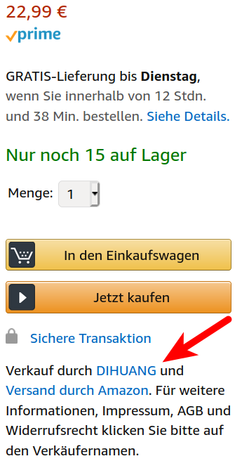

I use my in-ear headphones a lot: I work from home and have a couple of video
conferences. I go running and listen to podcasts. I go cycling and talk with my
father. And my in-ear headphones break often.

This article is only about **in-ear headphones with a microphone and a cable**.
And it's mainly about cheap options.

I will not look at wireless earbuds where you have two seperate pieces. I'm
just too afraid that I would loose one and I can't imagine that the microphone
quality is good enough. I will also not look at on-ear / over-ear headphones.
They are just too bulky for me most of the time. I want something that I can
easily take with me.

## Buying on Amazon

Before you buy anything below 40 EUR on Amazon, look at the seller:

<figure class="wp-caption aligncenter img-thumbnail">
    
    <figcaption class="text-center">Go to the seller page</figcaption>
</figure>

<figure class="wp-caption aligncenter img-thumbnail">
    
    <figcaption class="text-center">Look at the country of the shop</figcaption>
</figure>

Very often, they are either in the UK or in China (CN). If you buy stuff below
40 EUR and you want to return it, you have to pay the shipping cost. Which can
mean that you would actually pay more for shipping than the product costed
originally.

I had negative experience with UK based shops. They sent me broken headphones /
headphones which broke within a month, and I couldn't reasonably return them.

I could return a cheap, but broken product for free to [RS Traders](https://www.amazon.de/sp?_encoding=UTF8&asin=&isAmazonFulfilled=1&isCBA=&marketplaceID=A1PA6795UKMFR9&orderID=&seller=A396LIRD9ACCCJ&tab=&vasStoreID=).

You should also be aware that there are a lot of white-label products from china.
This is not negative or positive. The concept is that a company produces a product,
but does not create a brand. There are other companies which take care of
marketing / brand creation. So you might see a lot of products which look super
similar... because the products are the same. They just have a different label.

## AKG Samsung Galaxy S10 earbuds

Those are the default ones you get with the Samsung S10 smartphone. They are
ok, but considering the price of the S10 I would have expected something
better. Mine are broken after a year. I didn't let them fall down. I didn't put
water over it. I treated them well, but used them often. First the left ear
piece went more siltent. It didn't break, just the volume went down. Then the
microphone made me more silent. I had to scream in a video call so that people
hear me.

<table class="table">
    <thead>
        <tr>
            <th>AKG EO-IG955</th>
            <th><a href="https://www.samsung.com/latin_en/mobile-accessories/earphones-tuned-by-akg-eo-ig955/EO-IG955BREGWW/">Specs</a></th>
        </tr>
    </thead>
    <tbody>
        <tr>
            <td>Impedance</td>
            <td>32 Ohm</td>
        </tr>
        <tr>
            <td>Frequency Response</td>
            <td>20 - 20kHz</td>
        </tr>
        <tr>
            <td>Sensitivity</td>
            <td>93.2 dB/mW</td>
        </tr>
        <tr>
            <td>Release date</td>
            <td>2019-03-08</td>
        </tr>
        <tr>
            <td>Weight</td>
            <td>15g</td>
        </tr>
        <tr>
            <td>Cable length</td>
            <td>120cm</td>
        </tr>
        <tr>
            <td>Price</td>
            <td>20 EUR</td>
        </tr>
        <tr>
            <td>Durability</td>
            <td>8 months</td>
        </tr>
        <tr>
            <td>Control</td>
            <td>3 buttons</td>
        </tr>
        <tr>
            <td>Reviews</td>
            <td><a href="https://www.soundguys.com/akg-samsung-galaxy-s10-earbuds-review-22402/">soundguys.com</a></td>
        </tr>
    </tbody>
</table>

## SAMSUNG EG920

Those are the default ones for the Samsung S7. I liked them a lot. The quality
of the headphones and of the microphone was ok, they were comfortable, they
didn't fall out of my ears. They are also pretty cheap; sadly in both senses
of the word: Low price and they broke pretty soon.

I bought them 3x from [FoneM8store](https://www.amazon.de/sp?_encoding=UTF8&asin=&isAmazonFulfilled=0&isCBA=&marketplaceID=A1PA6795UKMFR9&orderID=304-2000476-7301142&seller=A3CV872FYAAA4E&tab=&vasStoreID=),
once from [The Smart Phone Shop](https://www.amazon.de/sp?_encoding=UTF8&asin=&isAmazonFulfilled=0&isCBA=&marketplaceID=A1PA6795UKMFR9&orderID=028-8598297-7208304&seller=A7HOC08INLHF7&tab=&vasStoreID=)
and once from [EXCELLENTAS](https://www.amazon.de/sp?_encoding=UTF8&asin=&isAmazonFulfilled=1&isCBA=&marketplaceID=A1PA6795UKMFR9&orderID=028-4719487-9061948&seller=AL8K2NQB0VM86&tab=&vasStoreID=).
I was super angry at FoneM8store as they broke VERY quickly; the other ones
lasted a couple of months. The ones from FoneM8store were broken after the first
two weeks or so.

<table class="table">
    <thead>
        <tr>
            <th>Spec</th>
            <th>Value</th>
        </tr>
    </thead>
    <tbody>
        <tr>
            <td>Name</td>
            <td>SAMSUNG EG920</td>
        </tr>
        <tr>
            <td>Release date</td>
            <td>?</td>
        </tr>
        <tr>
            <td>Weight</td>
            <td>?</td>
        </tr>
        <tr>
            <td>Cable length</td>
            <td>120 cm</td>
        </tr>
        <tr>
            <td>Price</td>
            <td>5 EUR</td>
        </tr>
        <tr>
            <td>Durability</td>
            <td>3 months</td>
        </tr>
        <tr>
            <td>Control</td>
            <td>3 buttons</td>
        </tr>
        <tr>
            <td>Frequency Response</td>
            <td>20 Hz</td>
        </tr>
        <tr>
            <td>Sensitivity</td>
            <td>98.5 dB/mW</td>
        </tr>
        <tr>
            <td>Impedance</td>
            <td>32 Ohm</td>
        </tr>
        <tr>
            <td>Reviews</td>
            <td><a href="https://www.soundguys.com/akg-samsung-galaxy-s10-earbuds-review-22402/">soundguys.com</a></td>
        </tr>
    </tbody>
</table>

## Zedela Bluetooth Kopfhörer V5.0

I bought the [zedela Bluetooth Kopfhörer V5.0](https://www.amazon.de/gp/product/B07V6PZCTV)
for 25 EUR from [Zedela](https://www.amazon.de/sp?_encoding=UTF8&asin=&isAmazonFulfilled=1&isCBA=&marketplaceID=A1PA6795UKMFR9&orderID=028-8891696-6077918&seller=A1DCZH27EK8ALU&tab=&vasStoreID=).
At the time I found a lot of similar ones, so I guess this is a white-label product.

I can't find any of those anymore.

They are comfortable to wear at home or while cycling. They don't work at all
for me when I'm running. They work ok for phone calls during cycling, but when
there is wind, the noise becomes too strong. The battery live is amazing.

## Mpow Flame

The [Mpow Flame](https://www.xmpow.com/products/mpow-flame-pl02-sports-earphones)
costs about 27 EUR, they are aparently IPX 7, support bluetooth 5, have up to
7 hours of playing time. The two ear pieces are connected and they are advertised
for sports.

I can't find mine again. I vaguely remember that they were average, but not
comfortable to wear.

## Panasonic RP-HJE120E1K

I aparently bought the Panasonic RP-HJE120E1K for about 8 EUR. I really don't
remember them, but it took 3 years until I bought new headphones. Maybe they
were just good?

## Everdigi and Hanmir

I bought [Everdigi](https://www.amazon.de/gp/product/B073TZ1DY7/ref=ppx_yo_dt_b_asin_title_o00_s00?ie=UTF8&psc=1) for 8.59 EUR and [Hanmir](https://www.amazon.de/gp/product/B0793R9D7F/ref=ppx_yo_dt_b_search_asin_title?ie=UTF8&psc=1) for 12.99 EUR. I returned both of them.
I don't remember the reason. I think they might have been super uncomfortable.

## Sennheiser

Sennheiser is a well-known brand for high quality headphones. I had the HD 201
over-ear headphones from them and liked them a lot. I bought my father the
Sennheiser RS 170 and he liked them a lot. But I didn't ever try in-ear
headphones by Sennheiser. In case I have to buy new headphones, I would
likely give them a shot.

I ignored the model CX 100, as it seems to be inferior to the CX 300S.

### CX 300S

* [Official Page](https://en-de.sennheiser.com/earbuds-in-ear-headphones-cx-300-s)
* Impedance: 18 Ohms
* Frequency response (Microphone): 100 – 10,000 Hz (-10 dB)
* Frequency response: 17–21,000 Hz (-10 dB)
* Sound pressure level (SPL): 118 dB
* 29.40 EUR
* Reviews: [Many Fakes](https://reviewmeta.com/amazon-de/B07N1YLC23)
* [Amazon](https://www.amazon.de/Sennheiser-Ear-Kopfh%C3%B6rer-Universal-Smart-Remote-Wei%C3%9F/dp/B07N23DXMK/ref=sr_1_1_sspa?__mk_de_DE=%C3%85M%C3%85%C5%BD%C3%95%C3%91&dchild=1&keywords=sennheiser+cx+300s&qid=1591293714&quartzVehicle=21-716&replacementKeywords=sennheiser+300s&sr=8-1-spons&psc=1&spLa=ZW5jcnlwdGVkUXVhbGlmaWVyPUEzNTNKV0xKSFFRQkRTJmVuY3J5cHRlZElkPUEwMzM5ODI3MUNPTk1QUDk4TkhQUSZlbmNyeXB0ZWRBZElkPUEwNjI4NzEzMTA5VExBVEtUMlFYRSZ3aWRnZXROYW1lPXNwX2F0ZiZhY3Rpb249Y2xpY2tSZWRpcmVjdCZkb05vdExvZ0NsaWNrPXRydWU=), [36 EUR](https://www.amazon.de/Sennheiser-Ear-Kopfh%C3%B6rer-Universal-Remote-schwarz/dp/B07N1YLC23/ref=psdc_617060011_t1_B00MEI9Z34?th=1), [36.90](https://www.amazon.de/Sennheiser-Ear-Kopfh%C3%B6rer-Universal-Smart-Remote-Rot/dp/B07N246ZPJ/ref=sr_1_5?__mk_de_DE=%C3%85M%C3%85%C5%BD%C3%95%C3%91&dchild=1&keywords=sennheiser+in-ear+mikrofon&qid=1591293738&sr=8-5)
* [YouTube Review](https://www.youtube.com/watch?v=B8Y2LTWfVr4)

### Momentum

* [Official Page](https://en-de.sennheiser.com/momentum-headphones-in-ear)
* Impedance: 18 Ohms
* Frequency response (Microphone): 100 – 10,000 Hz
* Frequency response: 15Hz - 22000Hz
* Sound level pressure (SLP): 118 dB (1kHz/1Vrms)
* [Review](https://www.youtube.com/watch?v=SJ1icC_rfSM)

## Ludos

The old model is called Clamor, the new model is called Ultra.

* Foam H
* Magnetic Ends
* Inline control: Volume up, Volume down, Accept phone call
* [13.57 EUR](https://www.amazon.de/LUDOS-Ultra-Kopfh%C3%B6rer-Kristallklarer-Lautst%C3%A4rkeregelung-Schwarz/dp/B07ZVDH3X3/ref=sr_1_61?__mk_de_DE=%C3%85M%C3%85%C5%BD%C3%95%C3%91&crid=3FCMYSYDIJO35&dchild=1&keywords=in-ear%2Bkopfh%C3%B6rer%2Bmit%2Bmikrofon&qid=1591292378&s=ce-de&sprefix=in-ear%2Celectronics%2C176&sr=1-61&th=1)

There is a [marketing video](https://techbuzzireland.com/2020/03/04/review-the-ludos-ultra-earphones-tech-ludos-earphones/)

* Reviews: [Mostly Fake](https://reviewmeta.com/amazon-de/B07ZVDH3X3)

The "KLIM Fusion" headphones look similar, too.

## See also

* [Sony MDR-EX15AP](https://www.amazon.de/Sony-MDR-EX15AP-Ear-Kopfh%C3%B6rer-Headsetfunktion-integriertes-Wei%C3%9F/dp/B00I3LV20A/ref=sr_1_3?__mk_de_DE=%C3%85M%C3%85%C5%BD%C3%95%C3%91&dchild=1&keywords=SONY+MDR-EX15AP&qid=1591294576&sr=8-3): 9.99 EUR; 4.4 Stars and 4514 ratings
* [1More Quad Driver](https://www.amazon.de/E1010-Quad-driver-Kopfh%C3%B6rer-Fernbedienung-Kompatibel-Silber/dp/B06XSJV5B9/ref=sr_1_3?__mk_de_DE=%C3%85M%C3%85%C5%BD%C3%95%C3%91&dchild=1&keywords=1More+Quad+Driver&qid=1591297327&sr=8-3): 112 EUR; 3.9 Stars and 7297 ratings
* [Mee Audio M6 Pro 2nd Gen](https://www.amazon.de/Generation-universal-fit-Ger%C3%A4uschisolierende-Ear-Monitore-abnehmbarem-Klar/dp/B07B4PDF6K/ref=sr_1_5?__mk_de_DE=%C3%85M%C3%85%C5%BD%C3%95%C3%91&dchild=1&keywords=Mee+Audio+M6+Pro+2nd+Gen&qid=1591297272&sr=8-5): 39.16 EUR; 4.3 Stars and 1126 ratings
* [PANASONIC ErgoFit Earbud](https://www.amazon.de/Headphones-Microphone-Controller-Compatible-BlackBerry-matte-black/dp/B07SHW92VR/ref=sr_1_5?__mk_de_DE=%C3%85M%C3%85%C5%BD%C3%95%C3%91&dchild=1&keywords=PANASONIC+ErgoFit+Earbud&qid=1591297199&sr=8-5): 23.21 EUR; 4.2 Stars and 64328 ratings
* JBL
    * [E15](https://www.amazon.de/JBL-Universeller-1-Tasten-Fernbedienung-Integriertem-Smartphones-Wei%C3%9F/dp/B01MAX4FP6/ref=sr_1_26?__mk_de_DE=%C3%85M%C3%85%C5%BD%C3%95%C3%91&dchild=1&keywords=JBL+T210&qid=1591294340&s=ce-de&sr=1-26): 30.95 EUR; 3.8 Star and 73 ratings
    * [C100SI](https://www.amazon.de/JBL-Kopfh%C3%B6rer-1-Tasten-Fernbedienung-Mikrofon-Kompatibel-Schwarz/dp/B01DEWVZ2C/ref=sr_1_8?__mk_de_DE=%C3%85M%C3%85%C5%BD%C3%95%C3%91&dchild=1&keywords=JBL+T210&qid=1591294340&s=ce-de&sr=1-8): 16.42 EUR; 4.0 Stars and 60273 ratings
    * [T210](https://www.amazon.de/JBL-Kopfh%C3%B6rer-1-Tasten-Fernbedienung-Integriertem-Kompatibel-Rose-Gold/dp/B01M5I6LP2/ref=sr_1_4?__mk_de_DE=%C3%85M%C3%85%C5%BD%C3%95%C3%91&dchild=1&keywords=JBL+T210&qid=1591294340&s=ce-de&sr=1-4): 15.99 EUR; 3.5 Stars and 6051 ratings
