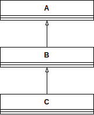
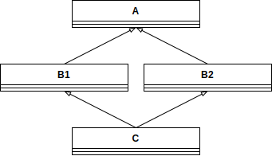

Python has a built-in function called [`super()`](https://docs.python.org/3/library/functions.html#super).
It might behave different from what you thought.


## Single Inheritance

As a first simple example, consider this script:

```python
class A:
    def __init__(self):
        print("A")
        super().__init__()


class B(A):
    def __init__(self):
        print("B")
        super().__init__()


class C(B):
    def __init__(self):
        print("C")
        super().__init__()


C()
```

This prints:

```plain
C
B
A
```

This is simple, because every class inherits from exactly one other class
and the inheritance tree looks like this:

<figure class="wp-caption aligncenter img-thumbnail">
    <a href="../images/2020/06/inheritance-a-b-c.svg"></a>
    <figcaption class="text-center">Inheritance tree where A is the parent of B and B is the parent of C.</figcaption>
</figure>


## Multiple Inheritance

Python supports [multiple inheritance](https://docs.python.org/3/tutorial/classes.html#multiple-inheritance).
This means classes can inherit from arbitrary many classes.

Let's start with a simple example how super works here:

```python
class A:
    def __init__(self):
        print("A")
        super().__init__()


class B1(A):
    def __init__(self):
        print("B1")
        super().__init__()


class B2(A):
    def __init__(self):
        print("B2")
        super().__init__()


class C(B1, B2):
    def __init__(self):
        print("C")
        super().__init__()


C()
```

The inheritance tree looks like this:

<figure class="wp-caption aligncenter img-thumbnail">
    <a href="../images/2020/06/inheritance-a-b1-b2-c.svg"></a>
    <figcaption class="text-center">Inharitance Tree where A is the parent of B1 and B2. They are the parents of C.</figcaption>
</figure>

The output of this script is:

```plain
C
B1
B2
A
```

Still expected, right? Basically going deeper and left to right.


## Multiple Inheritance: Linearization

Where the mental model might break is with the following example. The
inheritance tree is still the same. However, within B1 I don't call super
anymore. Which output would you expect?

```python
class A:
    def __init__(self):
        print("A")
        super().__init__()


class B1(A):
    def __init__(self):
        print("B1")


class B2(A):
    def __init__(self):
        print("B2")
        super().__init__()


class C(B1, B2):
    def __init__(self):
        print("C")
        super().__init__()


C()
```

The received output is

```plain
C
B1
```

Now, why does it not print `B2` and not `A`? After all, C still inherits from
`B2` and `B2` still calls `super` which would point to `A`, right?

The reason is that the method resolution order is:

```python-repl
>>> print(C.__mro__)
(<class '__main__.C'>, <class '__main__.B1'>, <class '__main__.B2'>, <class '__main__.A'>, <class 'object'>)
```

This means that super searches first in B1, then B2, then A and then object for
the `__init__` function. If it is found in one of them, it just executes that
one. It does not continue searching.

Super is a call-next-method. It calls the next method in the method resolution
order. And it is cooperative: If one in the line does not call super, then the
line ends.


## See also

* StackOverflow:
    * Callisto: [How does Python's super() work with multiple inheritance?](https://stackoverflow.com/q/3277367/562769), 2010.
    * Mizipzor: [Understanding Python super() with __init__() methods](https://stackoverflow.com/q/576169/562769), 2009.
* Raymond Hettinger: [Super considered super!](https://www.youtube.com/watch?v=EiOglTERPEo) at PyCon on YouTube, 2015.
* Raymond Hettinger: [Python’s super() considered super!](https://rhettinger.wordpress.com/2011/05/26/super-considered-super/), 2011.
