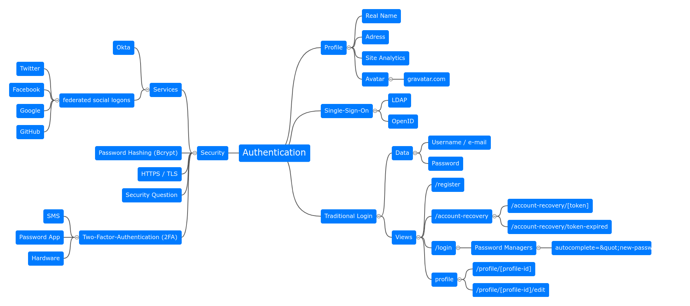

Authentication is one core component of all web communities. While I'm building
[enzado.com](https://enzado.com/), I started thinking about it in detail.

<figure class="wp-caption aligncenter img-thumbnail">
    
    <figcaption class="text-center">Authentication in Web Services</figcaption>
</figure>

## HTML

### Login

### Reset Password

Make sure to use the `autocomplete="new-password"` for the new password fields
(for both the same).

## See also

* [Authentication](https://en.wikipedia.org/wiki/Authentication)
* [Making password managers play ball with your login form](https://hiddedevries.nl/en/blog/2018-01-13-making-password-managers-play-ball-with-your-login-form)
* [Hints by 1Password](https://support.1password.com/compatible-website-design/)
