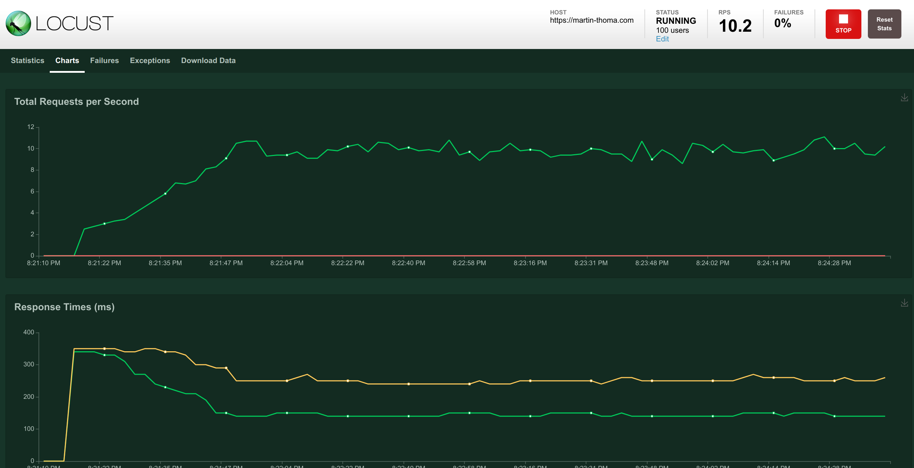

As a data scientist, I need to make my models accessible. I usually [deploy models with Flask](https://medium.com/analytics-vidhya/deploying-a-machine-learning-model-on-web-using-flask-and-python-54b86c44e14a). As a software engineer, I want to make sure things work as expected by unit testing them.

Unit Testing websites or web services is hard for multiple reasons: You have Code-within-Code like HTML template engines and SQL. Additionally, you have Databases as dependencies which are pretty hard to mock. In this article you will learn how to deal with those challenges in the case of the Flask web framework. I assume you have used Flask before and that you [know the basics of unit testing in Python](https://medium.com/swlh/unit-testing-in-python-basics-21a9a57418a0).

## My Tiny Flask App

In order to make ensure correctness of the following parts, I’ve created a tiny Flask app. You can copy [all files from GitHub](https://github.com/MartinThoma/algorithms/tree/master/medium/flask-testing/example-app).

The general structure is this:

```text
example-app
├── mini_app
│   ├── __init__.py  # make the folder a package
│   ├── app.py       # contains the Flask app object
│   ├── config.py
│   ├── models.py    # SQLAlchemy models
│   └── templates    # HTML / Jinja2 templates
└── tests
    ├── conftest.py  # General Test configuration
    └── test_app.py  # The actual unit tests
```

The only file you don’t find in there is .envrc which is used with direnv to set environment variables. Its content looks like this:

```bash
export DB_HOST=localhost
export DB_DATABASE=books
export DB_USER=root
export DB_PASSWORD=you_wish_i_forgot
```

## How to test Routes

Routes typically look like this in Flask:

```python
# Third party modules
from flask import Flask, request
from flask_sqlalchemy import SQLAlchemy

db = SQLAlchemy()


def create_app():
    app = Flask(__name__)

    db.init_app(app)

    @app.route("/square")
    def square():
        number = int(request.args.get("number", 0))
        return str(number ** 2)

    return app


if __name__ == "__main__":
    app = create_app()
    app.run()
```

The documentation of Flask contains [Testing Flask Applications](https://flask.palletsprojects.com/en/1.1.x/testing/) which covers this topic. It especially contains an example how to create a pytest fixture. Imagine a fixture like a way to set things up before your tests and to clean up after the test run. In this simple example, we assume that your application is a proper Python package and called flaskr . You can download an example from Github [flask/examples/tutorial/flaskr](https://github.com/pallets/flask/tree/1.1.2/examples/tutorial/flaskr) . The fixture in this simple case looks like this:

```python
import pytest


@pytest.fixture
def client():
    # Prepare before your test
    flaskr.app.config["TESTING"] = True
    with flaskr.app.test_client() as client:
        # Give control to your test
        yield client
    # Cleanup after the test run.
    # ... nothing here, for this simple example
```

pytest fixtures are a bit magical. You can give them as a parameter to the test, but you don’t have to execute it. The fixture just has to be discoverable by pytest.

The complete test then looks like this:

```python
# Third party modules
import pytest

# First party modules
from app import create_app


@pytest.fixture
def client():
    app = create_app()
    app.config["TESTING"] = True
    with app.test_client() as client:
        yield client


def test_square(client):
    rv = client.get("/square?number=8")
    assert b"64" == rv.data
```

Instead of putting the fixture in the test directly, you can put them in `tests/conftest.py`. pytest will find them there and use in all tests. No need to import.

## How to deal with the Database

Most web applications have a database. When running tests, you want to be certain that the tests don’t hit the production database. At the same time, you want something like a database to be there.

I assume that you are using
[flask-sqlalchemy](https://github.com/pallets/flask-sqlalchemy). It is part of
the pallets project and thus an official part of the Flask ecosystem. With that
plugin, you configure your database connection via
`app.config["SQLALCHEMY_DATABASE_URI"]`. If you override that configuration
string with `sqlite://`, flask-sqlalchemy will create an in-memory SQLite
database and use that instead of the real database. This is super fast to
create and interact with (see
[benchmark](https://martin-thoma.com/key-value-stores/#benchmark_1)).

You can adjust the client fixture like this:

```python
# Third party modules
import pytest

# First party modules
from mini_app.app import create_app, db
from mini_app.models import Author


@pytest.fixture
def client():
    app = create_app()

    app.config["TESTING"] = True
    app.testing = True

    # This creates an in-memory sqlite db
    # See https://martin-thoma.com/sql-connection-strings/
    app.config["SQLALCHEMY_DATABASE_URI"] = "sqlite://"

    client = app.test_client()
    with app.app_context():
        db.create_all()
        author1 = Author(id=1, first_name="foo", last_name="bar")
        db.session.add(author1)
        db.session.commit()
    yield client
```

Now you can easily run your tests against the fake database:

```python
def test_author(client) -> None:
    rv = client.get("/author/1")
    assert rv.json == {"id": 1, "first_name": "foo", "last_name": "bar"}
```

Note that this will become harder the more complex your data becomes and the more data you need to properly test your views.

### Wait … what about testing the SQL Queries?

You might wonder now how to test the SQL queries. Testing that they work at all should not be necessary if you use SQLAlchemy. And I really recommend to use SQLAlchemy when you use Flask with a relational database. If your queries are too complex for that, you can have a look at Query Builders. Avoid using raw SQL. In most cases it should not be necessary.

## Protected Routes

It’s pretty common that you have routes which are either protected by [Basic Auth](https://en.wikipedia.org/wiki/Basic_access_authentication) or need a form of login. You can essentially also set up a test account in the client fixture and login manually. This requires some work and depends on what exactly you’re doing for authentication.

### Basic Access Authentication

You can provide the necessary credentials in the header within the test:

```python
# Core Library modules
from base64 import b64encode


def test_protected_route(client):
    credentials = b64encode(b"user:password").decode("utf-8")
    route = "protected/route"
    rv = client.get(route, headers={"Authorization": "Basic " + credentials})
    assert rv.status_code == 200
```

### Flask Login

Flask-login is a pretty widespread plugin to handle user session management.
They have a [section about unit
testing](https://flask-login.readthedocs.io/en/latest/#protecting-views) in
which they suggest do set the configuration variable `LOGIN_DISABLED` to
`True`.

## Test Jinja2 Templates

Before we dive into testing Jinja2 Templates, let’s first recap a couple of
things that can go wrong.

### Problem 1: Empty Double Braces

You wanted to write something, got interrupted and now your template has `{{}}`
in it. When Jinja tries to render this, you will get

```text
jinja2.exceptions.TemplateSyntaxError: Expected an expression, got 'end of print statement'
```

### Problem 2: Data Structure confusion

You assume `number` is a string, but it actually is an integer:

```text

    {{ digit }}

```

You will get a `TypeError: 'int' object is not iterable`.

### Problem 3.1: Typo in Variable

Instead of `{{ numbers }}` you write `{{ number }}`. This is pretty bad as it
actually does nothing. It is as if the variable number existed and was the
empty string.

### Problem 3.2: Forgetting to pass Variable

You actually wanted to write `number`, but you forgot to pass it to the
template. The effect is the same, but I think it’s an interesting different
cause. This is what happens most often to me.

### Status Code Testing

By calling a view and making sure that the `assert rv.status_code == 200` you
can already capture Problem 1 and 2:

```python
def test_main_route_status_code(client) -> None:
    route = "/"
    rv = client.get(route)
    assert rv.status_code == 200
```

For this reason, make sure that you call each route at least once.

Up to my knowledge, there is not a lot more you can do without getting creative. Let’s hope [StackOverflow knows more](https://stackoverflow.com/q/62970759/562769).

### Testing the Template Context

This one needed a lot of trail and error, but I finally managed to get some pytest fixtures with which you have a better control over the variables passed to the templates. I love it 😍

```python
# Core Library modules
import logging

# Third party modules
import pytest
from flask import template_rendered

# First party modules
from mini_app.app import create_app, db
from mini_app.models import Author


@pytest.fixture
def app():
    """Create application for the tests."""
    _app = create_app()
    _app.logger.setLevel(logging.CRITICAL)
    ctx = _app.test_request_context()
    ctx.push()

    _app.config["TESTING"] = True
    _app.testing = True

    # This creates an in-memory sqlite db
    # See https://martin-thoma.com/sql-connection-strings/
    _app.config["SQLALCHEMY_DATABASE_URI"] = "sqlite://"

    with _app.app_context():
        db.create_all()
        author1 = Author(id=1, first_name="foo", last_name="bar")
        db.session.add(author1)
        db.session.commit()

    yield _app
    ctx.pop()


@pytest.fixture
def client(app):
    client = app.test_client()
    yield client


@pytest.fixture
def captured_templates(app):
    recorded = []

    def record(sender, template, context, **extra):
        recorded.append((template, context))

    template_rendered.connect(record, app)
    try:
        yield recorded
    finally:
        template_rendered.disconnect(record, app)
```

And this is how you can use it:

```python
def test_main_route_status_code_number3(client, captured_templates) -> None:
    route = "/?number=3"
    rv = client.get(route)

    # Sanity checks - it would be a total surprise if this would not hold true
    assert rv.status_code == 200
    assert len(captured_templates) == 1
    template, context = captured_templates[0]
    assert template.name == "base.html"

    # Here I test the two values which are passed to the template:
    assert context["number"] == 3
    assert context["square"] == 9
```

## pytest-recording

[pytest-recording](https://github.com/kiwicom/pytest-recording) is a pytest plugin which integrates [vcr.py](https://pypi.org/project/vcrpy/) into pytest. There is also [pytest-vcr](https://github.com/kiwicom/pytest-recording/issues/52) and both plugins are not wide-spread. I think pytest-recording is better maintained as [the author answered within 2 hours](https://github.com/kiwicom/pytest-recording/issues/52#issuecomment-660528322).

### Block Network Access

This one is a potential live saver. Just decorate a test with
`@pytest.mark.block_network` and you can be certain that everything runs
locally. If something tries to make a network access, it is blocked and you get

```text
RuntimeError: Network is disabled
```

You can also use [pytest-socket](https://github.com/miketheman/pytest-socket) to disable network access.

### Record Network Interactions

You can decorate a test with `@pytest.mark.vcr()`. Run `pytest
--record-mode=rewrite`


## Load Testing

Testing Flask apps is not only about testing the used functions and routes, but also about knowing your limits. You want to know what actually breaks and when it breaks when you get tons of users.

[Apache JMeter](https://jmeter.apache.org/) is maybe one of the most well-known
applications for load testing. Being a Python user, I prefer to stay in Python
and for this reason I’ll briefly present [Locust](https://locust.io/). You can
create a `locustfile.py` with this content:

```python
# Third party modules
from locust import HttpUser, between, task


class MyWebsiteUser(HttpUser):
    wait_time = between(5, 15)

    @task
    def load_main(self):
        self.client.get("/")
```

Then you run

```bash
pip install locust
locust -f locustfile.py --host=[https://your-website.com](https://martin-thoma.com)
```

It then gives output like this:

<figure class="wp-caption aligncenter img-thumbnail">
    <a href="../images/2020/07/locust.png"></a>
    <figcaption class="text-center">I've chosen to simulate 100 users</figcaption>
</figure>

There is a lot more to make this realistic than just calling a “static” endpoint. We want the users to interact in some way. So we can define a [SequentialTaskSet](https://docs.locust.io/en/stable/writing-a-locustfile.html#sequentialtaskset-class). At this point, I will leave it up to you to decide if you want to know more about load testing with Locust.

Maybe it’s not necessary for you.

If you have a web service live, you should have another service which regularly pings yours and checks if it is still alive. The latency of the answer can be measured and should be monitored. If you don’t expect a crazy amount of calls and if you have auto scaling enabled anyway, it’s perfectly reasonable not to run a load test. Just monitor your API behavior and act if you really need to.

## What’s next?

You already know [the basics of Unit Testing in Python](https://medium.com/swlh/unit-testing-in-python-basics-21a9a57418a0) and [how to patch and create mocks](https://levelup.gitconnected.com/unit-testing-in-python-mocking-patching-and-dependency-injection-301280db2fed). In this parts you learned how to deal with the special challenges of Flask applications.

In future articles, I will present:

* How to structure Unit Tests

* tox and nox

* CI-Pipelines

* Test Automation

* Property-based Testing

* Mutation Testing
