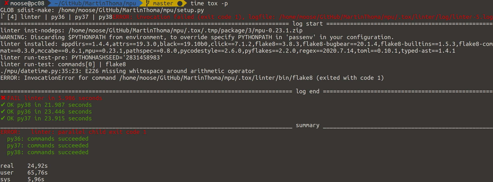
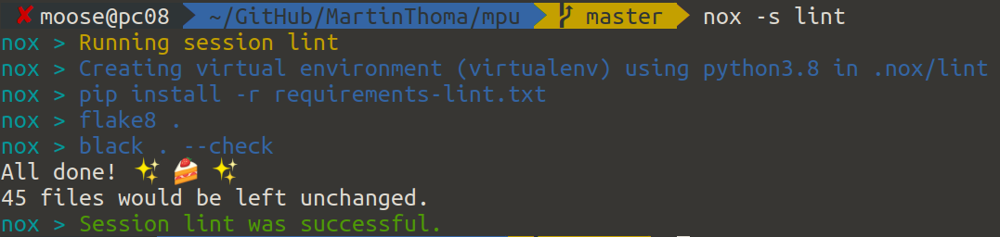

<figure>
    <a href="../images/2020/07/alice-full- Andrea-Caprotti.png"></a>
    <figcaption>Image derived by Martin Thoma from <a href="https://github.com/theacodes/nox/blob/master/docs/_static/alice-full.png">Andrea Caprotti</a> (nox project)</figcaption>
</figure>

When I started developing Python packages, there was one mistake I made quite often: I forgot to add all dependencies. Additionally, I only tested on my machine for a single Python version.

After reading this article, you will know how to locally and automatically test multiple Python versions in isolated environments. This is a preparation for [Continuous Integration](../ci-pipelines/) tools like Travis. I assume you already know [the basics of unit testing in Python](../unit-testing-basics/) and [how to package your code](https://packaging.python.org/tutorials/packaging-projects/).

## pyenv

[pyenv](https://github.com/pyenv/pyenv) is a tool which lets you easily install and switch Python versions on your system. Take a look at [the official installation instructions](https://github.com/pyenv/pyenv#installation); it’s not a Python package but hooks directly into your shell.

Once it is installed, you can get a list of all available Python versions. In July 2020, there were 427 different versions! I’ve shortened them here to show you the ones I think are interesting:

```shell
$ pyenv install --list
Available versions:
  [...]
  2.7.18
  [...]
  3.6.11
  [...]
  3.7.8
  [...]
  3.8.4
  3.9.0b4
  3.9-dev
  3.10-dev
  [...]
  pypy-c-jit-latest
  pypy-dev
  [...]
  pypy-5.7.1
  [...]
  pypy3.6-7.3.1
  [...]
```

Install a Python version:

```shell
$ pyenv install 3.8.4
Downloading Python-3.8.4.tar.xz...
-> https://www.python.org/ftp/python/3.8.4/Python-3.8.4.tar.xz
Installing Python-3.8.4...
Installed Python-3.8.4 to /home/moose/.pyenv/versions/3.8.4
```

And use it:

```shell
$ pyenv local 3.8.4

$ python --version
Python 3.8.4

$ pip --version
pip 20.1.1 from /home/moose/.pyenv/versions/3.8.4/lib/python3.8/site-packages/pip (python 3.8)
```

## Virtual environment basics

A [virtual environment](../virtual-environments/) encapsulates the installed packages. Different virtual environments still share the same operating system, the same installed C libraries and executables. The only difference is which packages are available.

You can create a new virtual environment called venv-tutorial like this:

```bash
python -m venv venv-tutorial
```

It creates a folder which contains all installed packages and a few other things. To use it, you need to activate it:

```bash
source venv-tutorial/bin/activate
```

This will add the prefix `(venv-tutorial)` in front of your prompt. It will make sure that later calls to `python` and `pip` use this environment. If you want to stop it again, type `deactivate` in the shell. If you delete this folder, the virtual environment is gone.

## Testing multiple Python versions without tox

When you claim that your project supports Python 2.7 and 3.5 to 3.8, then you'd better test those versions. In order to make sure that you install the packages properly, you should create a virtual environment. You might end up creating a shell script which creates those virtual environments, starts the tests and deletes the virtual environments again.

## How to use tox

tox uses a `tox.ini` file which is in the package root directory. So your project structure might look like this:

```text
your-awesome-project/            # The git repository
├── README.md
├── setup.py                     # Dependencies / Package metadata
├── your_awesome_package/        # Code of the package
│   ├── a_module.py
│   └── another_module.py
├── tests/                       # Unit tests
│   ├── test_a_module.py
│   └── test_another_module.py
└── tox.ini                      # Why you're reading this article
```

The `tox.ini` file to run the tests in an isolated Python environment for
Python 3.6, Python 3.7 and Python 3.8 looks like this:

```ini
[tox]
envlist = py36,py37,py38

[testenv]
deps =
    -r requirements-dev.txt
commands =
    pip install -e .[all]
    pytest .
    pydocstyle
    flake8
```

Note that you need to have the different Python versions already installed. You
can do this with pyenv and make them available with the following command:

```shell
$ pyenv local 3.8.4 3.7.8 3.6.11
```

Run tox within the root folder — the same folder that contains your `tox.ini` file.

The next thing you might want to do is to break a couple of things out of the pytest run. For example, it’s not necessary to run the linter flake8 and the formatter black in every single environment. Instead, you can define a linter environment which is run once:

```ini
[tox]
envlist = linter,py36,py37,py38

[testenv]
deps =
    -r requirements-dev.txt
commands =
    pip install -e .[all]
    pytest .

[testenv:linter]
deps =
    flake8
    flake8-bugbear
    flake8-builtins
    flake8-comprehensions
    flake8-string-format
    black
    pydocstyle
commands =
    flake8
    black --check .
    pydocstyle
```

And finally, you want to run the different environments in parallel for speed:

```bash
tox -p
```

If one of them fails, you get this type of output:

<figure>
    <a href="../images/2020/07/tox-parallel-run.png"></a>
    <figcaption>Run tox in parallel, showing a linter issue. This output is way cleaner than if you had run flake8 and black via pytest. It might be a tiny bit faster, but that difference is not relevant.</figcaption>
</figure>

If you want to run just the linter, `tox -e linter` is your friend 🙂

You can also create a matrix of different combinations of Python environments and dependencies you install. Thea Flowers showed this at PyCon 2019 ([video](https://youtu.be/-BHverY7IwU?t=678)), but I never had the need to go down that rabbit hole.

## Now… what is nox?

[nox](https://nox.thea.codes/en/stable/) is a spin-off of tox. Instead of using a `tox.ini` configuration file, it uses a `noxfile.py` Python file. It’s pretty similar to tox, but more flexible as it uses Python code:

```python
# Third party
import nox


@nox.session(python=["3.6", "3.7", "3.8"])
def test(session):
    session.install(".[all]")
    session.install("-r", "requirements-dev.txt")
    session.run("pytest")


@nox.session(python="3.8")
def lint(session):
    session.install("-r", "requirements-lint.txt")
    session.run("flake8", ".")
    session.run("black", ".", "--check")
```

You can run a single session of nox with `nox -s lint`:

<figure>
    <a href="../images/2020/07/nox-single-session.png"></a>
    <figcaption>A single nox session</figcaption>
</figure>

Overall, not a huge difference. The output of nox is way nicer and for people who get started, I think the Python code written with nox is a bit simpler to read and understand than the tox.ini configuration file.

## More in this series

This article is part of my series about unit testing in Python:

* Part 1: [The basics of Unit Testing in Python](../unit-testing-basics/)
* Part 2: [Patching, Mocks and Dependency Injection](../unit-testing-patching/)
* Part 3: [How to test Flask applications](../test-flask-applications/) with Databases, Templates and Protected Pages
* Part 4: **tox and nox**
* Part 5: [Structuring Unit Tests](../unit-testing-structure/)
* Part 6: [CI-Pipelines](../ci-pipelines/)
* Part 7: [Property-based Testing](../property-based-testing/)
* Part 8: [Mutation Testing](../mutation-testing/)
* Part 9: [Static Code Analysis: Linters, Type Checking, and Code Complexity](../static-code-analysis/)

Let me know if you’re interested in other topics around testing with Python or professional software development with Python: info@martin-thoma.de
