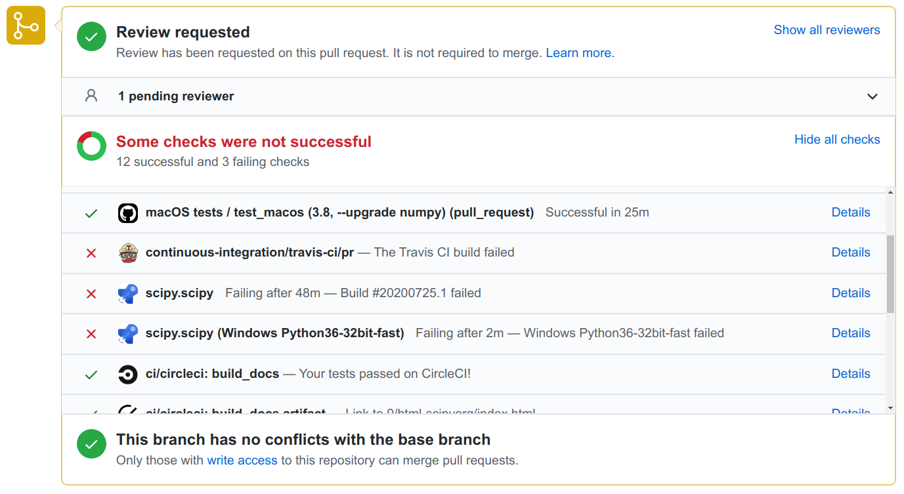
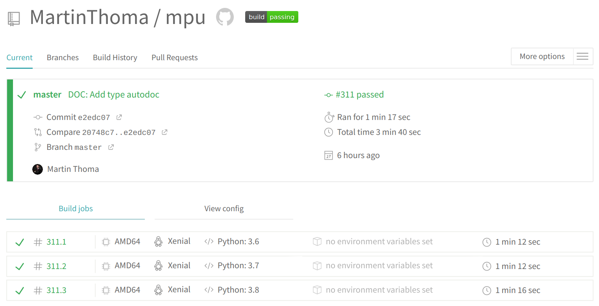
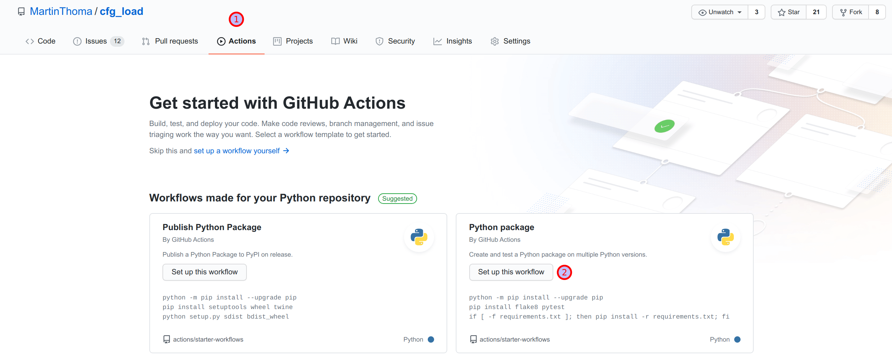
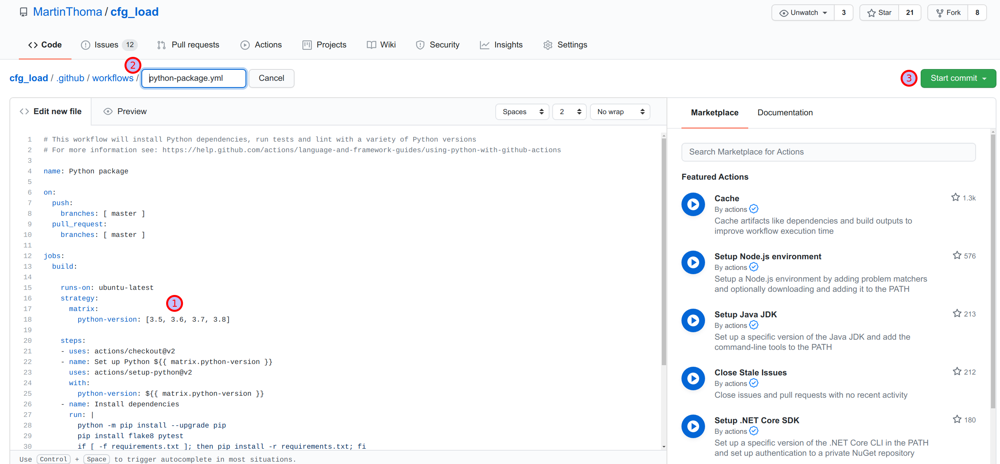
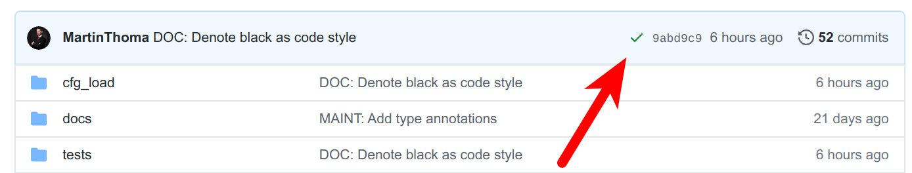
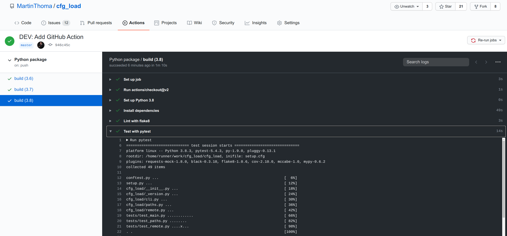
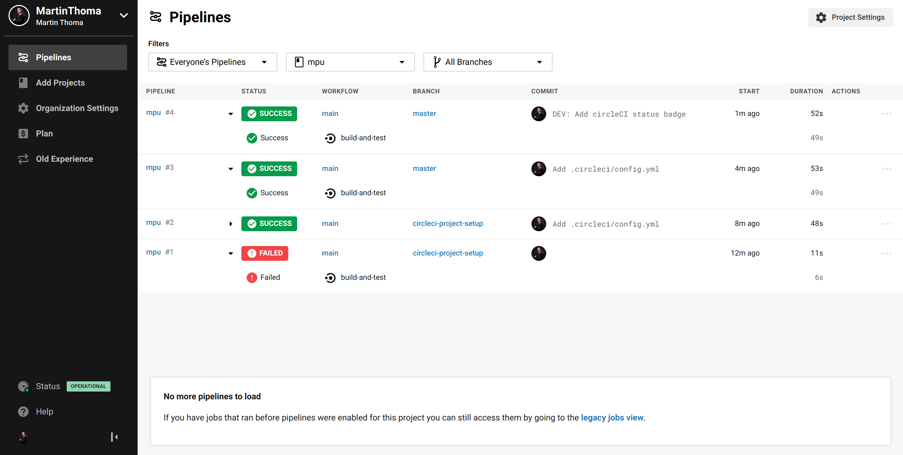
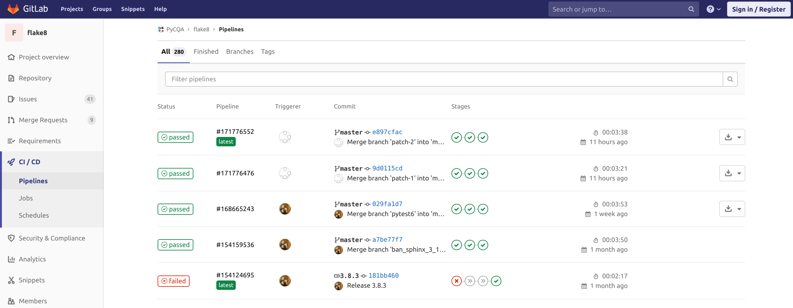
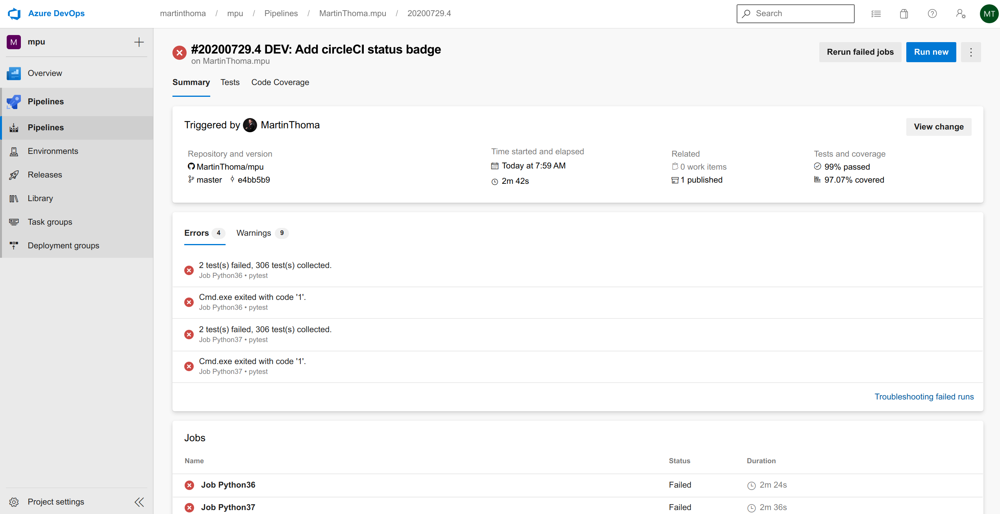
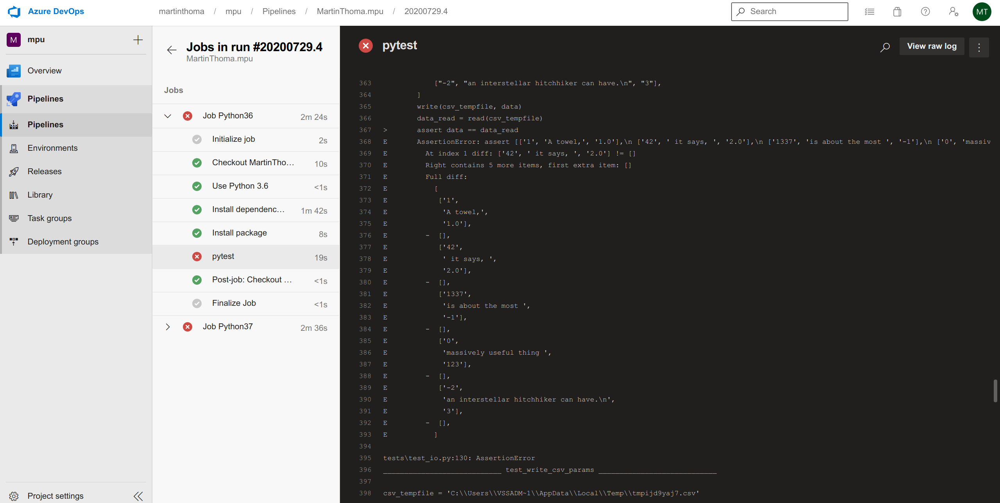

Continuous Integration is the practice of integrating code regularly with the main development branch. You can see the need for this when you look at huge projects like SciPy with currently [274 open pull requests](https://github.com/scipy/scipy/pulls) (PRs). This means 274 different new features, bug fixes or other improvements want to be added. The maintainers likely don’t know the contributors in person. While there is no way around looking at the contributed change, there is a good solution to make sure things are not horribly wrong: Unit Tests.

Running the test suite for all of those pull requests costs quite a bit of time. The quicker the maintainers can see if the PR has issues and what the issues are, the better.

The solution is a Continuous Integration Pipeline. The CI Pipeline is code which is automatically executed. Usually, there are several steps in the pipeline, like (1) unit testing with pytest (2) linting with tools like flake8 or pylint (3) type checking with mypy (4) manual review. There is an automatically generated comment which lets the maintainers and the contributor know about the status of the pipeline steps.

<figure class="wp-caption aligncenter img-thumbnail">
    <a href="../images/2020/07/ci-feedback-github.png"></a>
    <figcaption class="text-center">Automatic feedback given by Github Actions, Travis, Azure Pipelines and Circle CI. Some of the steps fail, some succeed. The steps have links so that the maintainers can look at the details.</figcaption>
</figure>

In the following article, I will show you how to run unit tests automatically with various different CI Services such as Github Actions, Azure Pipelines, TravisCI and CircleCI.

## Travis CI

[Travis CI](https://travis-ci.org/) was founded in 2011 and is the first CI service I’ve used. It is configured via a .travis.yml file

I’ve almost always used it with the following script with minor variations:

```yaml
language: python
python:
  - 3.6
  - 3.7
  - 3.8
install:
  - pip install coveralls tox-travis
script:
  - tox
after_success:
  - coveralls
```

The [tox-travis](https://github.com/tox-dev/tox-travis) package is awesome. I just made sure tox is working and then Travis worked as well. If you want a refresher about tox, have a look at [the previous article](https://medium.com/python-in-plain-english/unit-testing-in-python-tox-and-nox-833e4bbce729) in this series.

The configuration file looks for sure less scary than the one of Github Actions. The interface of Travis is also pretty and clean:

<figure class="wp-caption aligncenter img-thumbnail">
    <a href="../images/2020/07/travis-overview.png"></a>
    <figcaption class="text-center">Web interface of Travis</figcaption>
</figure>

## Github Actions

[Github Actions](https://github.com/features/actions) is the CI/CD solution integrated into Github. It was released in November 2019 and thus is the most recently released service. The main advantage it has over the others is the integration into Github. You can create a new action by clicking on the offered tabs:

<figure class="wp-caption aligncenter img-thumbnail">
    <a href="../images/2020/07/github-action-create.png"></a>
    <figcaption class="text-center">Start to create a Github Action</figcaption>
</figure>

The defaults are ok, but you might want to adjust a few things in the file. For example, I don’t support any Python version older than 3.6 in my private projects. I also want to install the dependencies from my requirements.txt . If you want to adjust the file name, you can do it. Commit when it looks fine.

<figure class="wp-caption aligncenter img-thumbnail">
    <a href="../images/2020/07/github-action-create-2.png"></a>
    <figcaption class="text-center">The next steps to create a Github Action via the Web Interface</figcaption>
</figure>

Finally, you can see the nice green check mark indicating that the run was successful.

<figure class="wp-caption aligncenter img-thumbnail">
    <a href="../images/2020/07/github-action-checkmark.png"></a>
    <figcaption class="text-center">See that the run was successful in Github Actions</figcaption>
</figure>

You can also click on the Actions tab and inspect the last run:

<figure class="wp-caption aligncenter img-thumbnail">
    <a href="../images/2020/07/github-action-inspect.png"></a>
    <figcaption class="text-center">Inspect the last run</figcaption>
</figure>


## CircleCI

CircleCI is another possibility for a CI pipeline. They have a concept they call [Orbs](https://circleci.com/orbs/) which is a re-usable set of configuration. It reminds me a bit of how you can have a Docker base image.

The Python orb is on Github at [CircleCI-Public/python-orb](https://github.com/circleci-public/python-orb). The interesting parts are in src/commands . CircleCI has an [example page](https://circleci.com/orbs/registry/orb/circleci/python) for the Python orb and a [Python language overview](https://circleci.com/docs/2.0/language-python/).

The configuration I use for [mpu](https://github.com/MartinThoma/mpu) only uses the checkout step. The rest is manually defined. The following is in .circleci/config.yml :

```yaml
version: 2.1

orbs:
  python: circleci/python@0.2.1

jobs:
  build-and-test:
    executor: python/default
    steps:
      - checkout
      - run:
          command: pip install -r requirements-dev.txt
          name: Install Test requirements-dev
      - run:
          command: pip install -e .[all]
          name: Install Pacakge
      - run:
          command: pytest
          name: Test

workflows:
  main:
    jobs:
      - build-and-test
```

The CircleCI web interface looks nice and clean:

<figure class="wp-caption aligncenter img-thumbnail">
    <a href="../images/2020/07/circleci-overview.png"></a>
    <figcaption class="text-center">CircleCI Web Interface</figcaption>
</figure>

I’ve added CircleCI check to mpu and, of course, the badge should not be missing:

```markdown
[](https://app.circleci.com/pipelines/github/MartinThoma/mpu)](https://circleci.com/gh/MartinThoma/mpu.svg?style=shield)](https://app.circleci.com/pipelines/github/MartinThoma/mpu))
```

## Gitlab CI

[Gitlab CI](https://docs.gitlab.com/ee/ci/yaml/README.html) is similar to Github Actions in the sense that it is also integrated into the platform. You use a .gitlab-ci.yml file to configure it. However, I like Gitlab CI way more as it just seems so much cleaner.

Let’s take the linter [Flake8](https://gitlab.com/pycqa/flake8) as an example. Their [.gitlab-ci.yml](https://gitlab.com/pycqa/flake8/-/blob/master/.gitlab-ci.yml) is a bit lengthy, so I’ve shortened it to only the test stage. They have a build and a release stage as well:

```yaml
image: python

stages:
- test

before_script:
- pip install pip --upgrade
- pip install -r dev-requirements.txt

after_script:
- pip install codecov
- codecov --token=7d117e6b-aab6-4283-ab19-166dafc38cf5

python36:
  image: python:3.6
  stage: test
  script: tox -e py36

python37:
  image: python:3.7
  stage: test
  script: tox -e py37

python38:
  image: python:3.8
  stage: test
  script: tox -e py38

linters:
  image: python:3.7
  stage: test
  script: tox -e linters
```

In the web interface, it looks like this:

<figure class="wp-caption aligncenter img-thumbnail">
    <a href="../images/2020/07/gitlab-pipelines.png"></a>
    <figcaption class="text-center">Web interface of gitlab</figcaption>
</figure>

You can also tick a checkbox in the “Settings” section of your repository to prevent merges if the pipelines fail. You should do it.

## Azure Pipelines

Azure is Microsoft's Cloud Platform, similar to AWS from Amazon or GCP from Google. As with all of those big cloud platforms, things are overly complicated. It’s no comparison to the ease of Travis.

There are many things I don’t like about Azure Pipelines, especially that it requires the permission to make code changes. This is mainly done as a convenience feature so that it can create the configuration file azure-pipelines.yml . I hate that, because the CI solution should not touch my code. It should just read it. But as Github was bought by Microsoft and Azure Pipelines is also owned by Microsoft, I guess there is not too much harm in giving it access 🤷

Azure Pipelines have one killer feature: You can execute stuff on Windows machines. Let’s dive into the shortest path to get there:

1. Go to [azure.microsoft.com/services/devops/pipelines](http://azure.microsoft.com/services/devops/pipelines/)
2. Create a project
3. Click on Pipelines -> Create Pipeline -> Github YAML -> Pyton Package
4. Use vmImage: 'VS2017-Win2016'

It will create a azure-pipelines.yml in the project root:

```yaml
# [https://docs.microsoft.com/azure/devops/pipelines/languages/python](https://docs.microsoft.com/azure/devops/pipelines/languages/python)

trigger:
- master

pool:
  vmImage: 'VS2017-Win2016'
strategy:
  matrix:
    Python36:
      python.version: '3.6'
    Python37:
      python.version: '3.7'

steps:
- task: UsePythonVersion@0
  inputs:
    versionSpec: '$(python.version)'
  displayName: 'Use Python $(python.version)'

- script: |
    python -m pip install --upgrade pip
    pip install -r requirements-dev.txt
  displayName: 'Install dependencies'

- script: |
    pip install .[all]
  displayName: 'Install package'

- script: |
    pip install pytest pytest-azurepipelines
    pytest -vv
  displayName: 'pytest'
```

The first thing I did after the pipeline itself worked was to add a project badge:

```markdown
[](https://dev.azure.com/martinthoma/mpu/_build/latest?definitionId=1&branchName=master)](https://dev.azure.com/martinthoma/mpu/_apis/build/status/MartinThoma.mpu?branchName=master)](https://dev.azure.com/martinthoma/mpu/_build/latest?definitionId=1&branchName=master))
```

The main reason for adding the badge was that Azure tries to create new accounts for me. I have a super hard time coming back to the main overview page 😢

<figure class="wp-caption aligncenter img-thumbnail">
    <a href="../images/2020/07/azure-overview.png"></a>
    <figcaption class="text-center">Azure project overview page</figcaption>
</figure>

If you click on one of the failing jobs, you can see this:

<figure class="wp-caption aligncenter img-thumbnail">
    <a href="../images/2020/07/azure-failing-pytest.png"></a>
    <figcaption class="text-center">A failing pytest run</figcaption>
</figure>


## CI Service Comparison

The unique selling point of Azure is the possibility to run code on a Windows machine. The killer argument for Github Actions / Gitlab CI is the integration into github.com / Gitlab.

Looking only at the **Web Interface**, I like CircleCI, Travis and Gitlab very much. Github Actions is a bit overloaded and I hate Azure pipelines because I cannot find an easy way to go to my account.

The **configuration file format** is YAML for all of them. I like that most of the services have a leading dot for the file / folder, so that the CI config is hidden on Linux. Only Azure Pipelines wants to be visible. Looking at the configuration itself, Travis and Gitlab look cleanest to me. CircleCI offers the unique “orb” concept which I’m not used to — that might make things way simpler on the long run.

The **execution speed** of the steps felt pretty fast for CircleCI, but I didn’t thoroughly test that one.

All of the presented CI Services send an email when you broke the pipeline and when it’s fixed again. I’m uncertain how easy it is to set up other **notifications** like Slack messages. I have seen [Slack notifications for Jenkins](https://medium.com/better-programming/5-jenkins-plugins-you-should-use-867e39fbf532) and for Gitlab.

A point which I didn’t bring up so far is **continuous delivery (CD)**. All of the presented services can also be used for CD. Would you like to read an article specifically about CD?

<figure class="wp-caption aligncenter img-thumbnail">
    <a href="../images/2020/07/geek-and-poke-automated-tests.jpg"></a>
    <figcaption class="text-center">Geek and Poke: <a href="http://geek-and-poke.com/geekandpoke/2010/10/26/geekpokes-list-of-best-practices-today-continuous-integratio.html">CI</a></figcaption>
</figure>

## Want to know more about unit testing?

In this series, we already had:

* Part 1: [The basics of Unit Testing in Python](https://medium.com/swlh/unit-testing-in-python-basics-21a9a57418a0)
* Part 2: [Patching, Mocks and Dependency Injection](https://levelup.gitconnected.com/unit-testing-in-python-mocking-patching-and-dependency-injection-301280db2fed)
* Part 3: [How to test Flask applications](https://medium.com/analytics-vidhya/how-to-test-flask-applications-aef12ae5181c) with Databases, Templates and Protected Pages
* Part 4: [tox and nox](https://medium.com/python-in-plain-english/unit-testing-in-python-tox-and-nox-833e4bbce729)
* Part 5: [Structuring Unit Tests](https://towardsdatascience.com/unit-testing-in-python-structure-57acd51da923)
* Part 6: CI-Pipelines

In future articles, I will present:

* Property-based Testing
* Mutation Testing
* Static Code Analysis: Linters, Type Checking, and Code Complexity

Let me know if you’re interested in other topics around testing with Python.

## See also

* Joaquín Menchaca: [Jenkins CI Pipeline with Python](https://medium.com/@Joachim8675309/jenkins-ci-pipeline-with-python-8bf1a0234ec3), 2019.
* [Elle O’Brien](https://towardsdatascience.com/@andronovhopf): [What data scientists need to know about DevOps](https://towardsdatascience.com/what-data-scientists-need-to-know-about-devops-2f8bc6660284), 2020.
