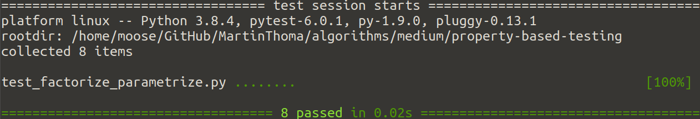
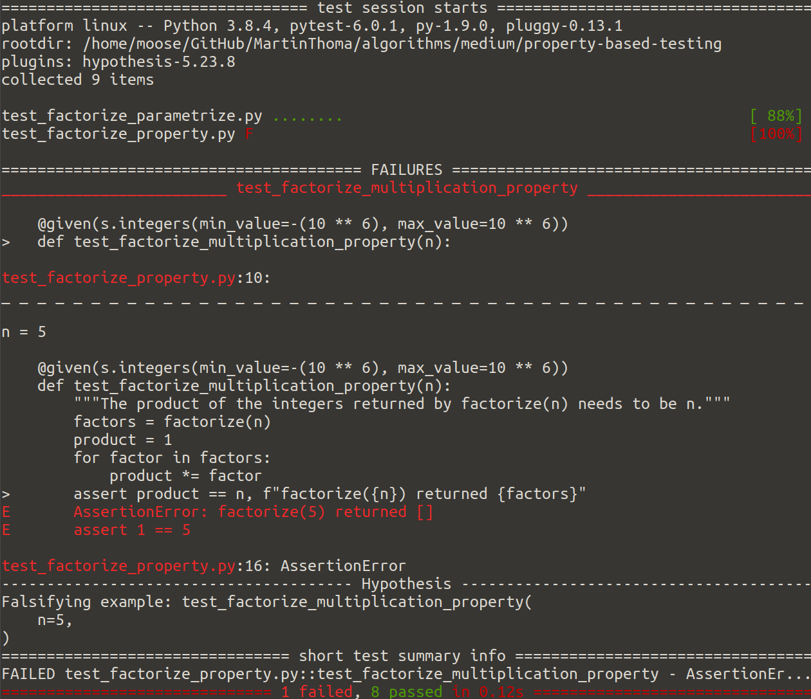
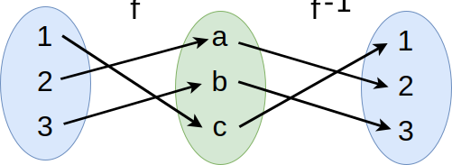

When you write unit tests, it’s hard to find the right test cases. You want to
be certain that you covered all the interesting cases, but you could simply not
know or forget one of them. For example, if you unit test a function which
receives an integer, you might think about testing 0, 1, and 2. But did you
think about negative numbers? What about big numbers?

We were just thinking about a testing strategy for integers. A strategy is a
generator of data. The property testing framework hypothesis offers [a lot of
strategies](https://hypothesis.readthedocs.io/en/latest/data.html) for many
types. You can install it with pip install hypothesis .

One thing we can do with those inputs — those tests strategies — is to check if
the runtime is acceptable and if the tested function/method does not crash.

It would be better if we compare the output of our function against something.
A check for equality is likely not possible, so we need to know a property of
our function. An invariant which we always expect to hold. We need to base our
test on an inherent property of the function.

To whet your appetite for property-based testing even more:

<center><iframe width="560" height="315" src="https://www.youtube.com/embed/AfaNEebCDos" frameborder="0" allowfullscreen></iframe></center>

## Example: Integer factorization

We have a function factorize(n : int) -> List[int] which takes an integer and
returns the prime factors:

> An integer n is called a prime number if it is positive and divisible by
> exactly two numbers: 1 and n.

We want that the product of returned integers is the number itself. So this is
how we design the functions behavior:

* factorize(0) = [0] — an exception would have been reasonable as well
* factorize(1) = [1] — strictly speaking, 1 is not a prime.
* factorize(-1) = [-1] — … and neither is -1
* factorize(-n) = [-1] + factorize(n) for n > 1

An implementation might look like this:

```python
from typing import List
import math


def factorize(number: int) -> List[int]:
    if number in [-1, 0, 1]:
        return [number]
    if number < 0:
        return [-1] + factorize(-number)
    factors = []

    # Treat the factor 2 on its own
    while number % 2 == 0:
        factors.append(2)
        number = number // 2
    if number == 1:
        return factors

    # Now we only need to check uneven numbers
    # up to the square root of the number
    i = 3
    while i <= int(math.ceil(number ** 0.5)) + 1:
        while number % i == 0:
            factors.append(i)
            number = number // i
        i += 2
    return factors
```

You might feel a bit uneasy about the condition in

```python
while i <= int(math.ceil(number ** 0.5)) + 1:
    ...
```

so you write a test to check for the important cases:

```python
# Third party modules
import pytest

# First party modules
from factorize import factorize


@pytest.mark.parametrize(
    "n,expected",
    [
        (0, [0]),  # 0
        (1, [1]),  # 1
        (-1, [-1]),  # -1
        (-2, [-1, 2]),  # A prime, but negative
        (2, [2]),  # Just one prime
        (3, [3]),  # A different prime
        (6, [2, 3]),  # Different primes
        (8, [2, 2, 2]),  # Multiple times the same prime
    ],
)
def test_factorize(n, expected):
    assert factorize(n) == expected
```

If the test parametrization is unfamiliar, you might want to
[read up on pytest.mark.parametrize](https://towardsdatascience.com/unit-testing-in-python-structure-57acd51da923).
It’s awesome and those few lines run 8 tests:

<figure class="wp-caption aligncenter img-thumbnail">
    <a href="../images/2020/08/pytest-parametrize.png"></a>
    <figcaption class="text-center">Running pytest</figcaption>
</figure>

How would a property-based test look like for factorize?

First, we need to think about the property we want to test. For factorize as we
designed it, we know that the product of the returned numbers is equal to the
number itself. We can put in any integer, but if the integers become too big,
the runtime will be too long. So let’s constrain them in a reasonable range of
+/- one million:

```python
# Third party
import hypothesis.strategies as s
from hypothesis import given

# First party
from factorize import factorize


@given(s.integers(min_value=-(10 ** 6), max_value=10 ** 6))
def test_factorize_multiplication_property(n):
    """The product of the integers returned by factorize(n) needs to be n."""
    factors = factorize(n)
    product = 1
    for factor in factors:
        product *= factor
    assert product == n, f"factorize({n}) returned {factors}"
```

Now we run the tests with `pytest`:

<figure class="wp-caption aligncenter img-thumbnail">
    <a href="../images/2020/08/pytest-factorize-hypothesis.png"></a>
    <figcaption class="text-center">Hypothesis found an issue!</figcaption>
</figure>

As you can see in the example above, hypothesis discovered that factorize(5)
returned an empty list which does not multiply to 5. We can then quickly see
that we actually made a mistake for all primes — we need to add the prime
number. After adding the following line, the tests run just fine:

```python
if number != 1:
    factors.append(number)
```

A curious thing to notice in the failed example is that it is the smallest positive integer where it fails. This is no coincidence. The property-testing framework tries to find a simple example which makes the test fail. This process is called [shrinking](https://hypothesis.readthedocs.io/en/latest/data.html#shrinking).

## What did hypothesis generate?

You can have a look at examples like this:

```python
from hypothesis import strategies as st

st.lists(st.integers()).map(sorted).example()
```

## Where can I apply property-based testing?

This kind of pattern works for quite a couple of algorithms where verification
is cheap:

* [Arg max](https://en.wikipedia.org/wiki/Arg_max): Iterate over the list and ensure that no other element is larger.
* Solving a set of equations: Verify that the solution is actually a solution.
* [Constraint satisfaction](https://en.wikipedia.org/wiki/Constraint_satisfaction): Verify that the solution satisfies all constraints.
* All [NP complete problems](https://en.wikipedia.org/wiki/NP-completeness): This is a set of decision problems where it is hard to find an answer, but easy to verify a found answer. An example is the traveling salesman. Given a set of cities which the salesman has to visit, is there a tour he can take which has a length of at most L? Given such a tour, it is easy to verify. Computing such a tour can be hard, though.

Weaker, but still helpful are checks which verify if the returned value is in the set of candidates:

* [Greatest common divisor](https://en.wikipedia.org/wiki/Greatest_common_divisor): Ensure that it actually **is a** divisor.
* Shortest path: Ensure it **is a** path.
* Sorting and ranking: Ensure exactly the same elements are in the list as
  before. Maybe you can also test for the sorting/ranking criterion?
* Filtering: Assert that the relevant data is still there / that the other data
  was removed.

## The Generate to Test Pattern

Sometimes it is easy to generate a sample to test the function you’re
interested in. For the factorization example above, you might have a list of
known primes and you multiply random subsets of them. If you write a function
that checks if a string is a palindrome, you can easily generate a palindrome
first. If you want to check if a text contains a given string, you can add
random text around that string and then check.

## Example: Testing Data Structures

I’ve implemented an interval data structure which has a method `issubset`

```python
from hypothesis import given, strategies as st
from mpu.datastructures import Interval


@given(st.lists(st.integers(), min_size=4, max_size=4).map(sorted))
def test_interval_issubset(integer_list):
    a, b, c, d = integer_list
    assert Interval(b, c).issubset(Interval(a, d))


@given(st.lists(st.integers(), min_size=4, max_size=4).map(sorted))
def test_interval_issubset_not(integer_list):
    a, b, c, d = integer_list
    assert not Interval(a, b).issubset(Interval(c, d)) or c <= a <= b <= d
    assert not Interval(a, c).issubset(Interval(b, d)) or b <= a <= c <= d
    assert not Interval(c, d).issubset(Interval(a, b)) or a <= c <= d <= b
    assert not Interval(b, d).issubset(Interval(a, c)) or a <= b <= d <= c
```

## String Verification

`hypothesis` can generate some special strings, for example email addresses and
IP addresses. This means you can easily check the positive cases for functions
which decide if something is an IP address or an email address:

```python
import hypothesis.strategies as s
from hypothesis import given

import mpu.string  # Martins Python Utilities


@given(s.emails())
def test_is_email(email):
    assert mpu.string.is_email(email), f"is_email({email}) returned False"


@given(s.ip_addresses(v=4))
def test_is_ipv4(ip):
    assert mpu.string.is_ipv4(str(ip)), f"is_ipv4({ip}) returned False"
```

## Invertible functions

<figure class="wp-caption aligncenter img-thumbnail">
    <a href="../images/2020/08/inverse-function.svg"></a>
    <figcaption class="text-center">A function and its inverse function</figcaption>
</figure>

If you have a function and its inverse function, such as encrypt / decrypt or a
serialize / deserialize function, you can test them together. The testing
strategy should then just give values within the domain.

For example, if we wanted to test b64encode / b64decode , the test would be:

```python
from hypothesis import given, strategies as s
from base64 import b64encode, b64decode


@given(s.binary())
def test_base64_encode_decode_together(data):
    assert b64decode(b64encode(data)) == data
```

This test now also documents that those two functions belong together and are
meant to be used in this order.

## Oracles

<figure class="wp-caption aligncenter img-thumbnail">
    <a href="../images/2020/08/oracles.jpg"></a>
    <figcaption class="text-center">Photo by <a href="https://unsplash.com/@jentheodore">Jen Theodore</a> on <a href="https://unsplash.com">Unsplash</a></figcaption>
</figure>

In complexity theory, an oracle is a black box which offers a solution to a
problem in instant time. In this context, it is just a second implementation
which we trust to be correct. If you have a complex algorithmic problem, you
might first want to implement a brute-force solution and then test your faster
algorithm against that easier to understand solution. The brute-force algorithm
is the oracle.

## Use Type Annotations!

I love type annotations 💓 I’ve you’re not using them, I highly recommend to
read about [type annotations](https://medium.com/analytics-vidhya/type-annotations-in-python-3-8-3b401384403d)
and gradual typing.

Type annotations are relevant for property-based testing as an annotated class
can be used to generate random objects of that class. As a data scientist
working on Machine Learning topics, I usually want this in my preprocessing /
postprocessing steps, where the objects of interest might be rather
complicated. Here is how hypothesis can support and generate those:

```python
from typing import Dict, Optional
from dataclasses import dataclass
from hypothesis import strategies as st


@dataclass
class PdfInfo:
    path: str
    is_errornous: bool
    is_encrypted: bool
    nb_pages: int
    nb_toc_top_level: int
    nb_characters: int
    user_attributes: Dict[str, Optional[str]]


# Usage in test to generate one PdfInfo:
# @given(st.builds(PdfInfo))

# Now show some samples:
for _ in range(10):
    print(st.builds(PdfInfo).example())

##########
# Output #
##########
# PdfInfo(path='', is_errornous=False, is_encrypted=True,
#         nb_pages=0, nb_toc_top_level=0, nb_characters=0, user_attributes={})
# PdfInfo(path='', is_errornous=False, is_encrypted=True,
#         nb_pages=-6679854645310868666, nb_toc_top_level=20135,
#         nb_characters=-32,
#         user_attributes={'\x02\x15\U0001189c¤\U000e7fde^¹': None})
# PdfInfo(path='', is_errornous=False, is_encrypted=False,
#         nb_pages=0, nb_toc_top_level=0, nb_characters=0, user_attributes={})
# PdfInfo(path='', is_errornous=True, is_encrypted=True,
#         nb_pages=0, nb_toc_top_level=0, nb_characters=0, user_attributes={})
# PdfInfo(path='', is_errornous=True, is_encrypted=False,
#         nb_pages=0, nb_toc_top_level=0, nb_characters=0, user_attributes={})
# PdfInfo(path='¬´à', is_errornous=True, is_encrypted=False,
#         nb_pages=-17389, nb_toc_top_level=15767, nb_characters=124,
#         user_attributes={})
# PdfInfo(path='', is_errornous=True, is_encrypted=False,
#         nb_pages=0, nb_toc_top_level=0, nb_characters=0, user_attributes={})
# PdfInfo(path='', is_errornous=False, is_encrypted=False,
#         nb_pages=0, nb_toc_top_level=0, nb_characters=0, user_attributes={})
# PdfInfo(path='', is_errornous=False, is_encrypted=True,
#         nb_pages=0, nb_toc_top_level=0, nb_characters=0, user_attributes={})
# PdfInfo(path='', is_errornous=False, is_encrypted=False,
#         nb_pages=0, nb_toc_top_level=0, nb_characters=0, user_attributes={})
```

When you develop web applications with complex business logic it should also be
helpful.

## The Name of the Game

I have seen the same concept being called *generative testing* and also
*data-driven testing*. The first one is fine; we do generate sample data for
our tests.

However, I would not call it *data-driven testing*. We didn’t get real-world
data to generate our test cases.

It’s also interesting to think about it the other way around: If we are now testing properties, what did we test before? [Andrea Leopardi](https://www.youtube.com/watch?v=p84DMv8TQuo) calls it example-based or table-based testing.

Example-based testing is good to cover known corner-cases, wheres property-based testing is good to discover unknown corner-cases.

## Summary

Property-based testing does not replace example-based testing, but complements
example-based testing. It sometimes documents properties in a very concise form
and helps to find unknown edge cases. It takes more time to execute
property-based tests than to execute example-based tests. hypothesis is a good
Python framework to write property-based tests.

## Want to know more about unit testing?

In this series, we already had:

* Part 1: [The basics of Unit Testing in Python](https://medium.com/swlh/unit-testing-in-python-basics-21a9a57418a0)
* Part 2: [Patching, Mocks and Dependency Injection](https://levelup.gitconnected.com/unit-testing-in-python-mocking-patching-and-dependency-injection-301280db2fed)
* Part 3: [How to test Flask applications](https://medium.com/analytics-vidhya/how-to-test-flask-applications-aef12ae5181c) with Databases, Templates and Protected Pages
* Part 4: [tox and nox](https://medium.com/python-in-plain-english/unit-testing-in-python-tox-and-nox-833e4bbce729)
* Part 5: [Structuring Unit Tests](https://medium.com/python-in-plain-english/unit-testing-in-python-structure-57acd51da923)
* Part 6: [CI-Pipelines](https://levelup.gitconnected.com/ci-pipelines-for-python-projects-9ac2830d2e38)
* Part 7: [Property-based Testing](https://levelup.gitconnected.com/unit-testing-in-python-property-based-testing-892a741fc119)

In future articles, I will present:

* Mutation Testing
* Static Code Analysis: Linters, Type Checking, and Code Complexity

Let me know if you’re interested in other topics around testing with Python.
