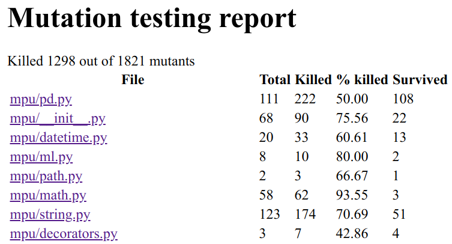
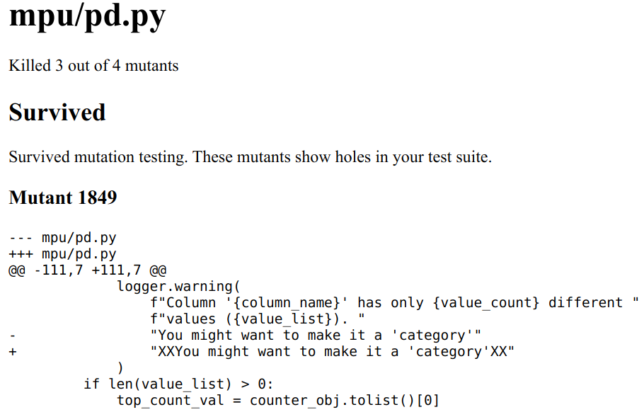
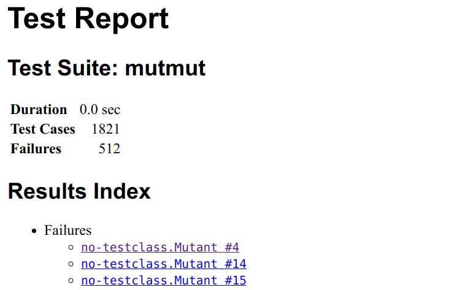
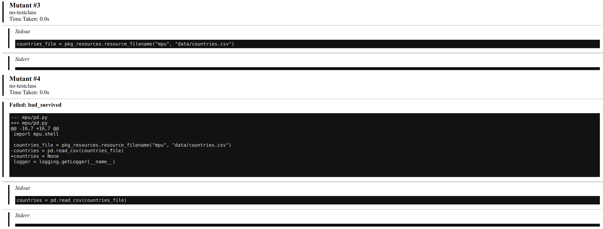

<figure>
    <a href="../images/2020/08/mutation-testing-1.jpg"></a>
    <figcaption>Based on the <a href="https://www.freepik.com/free-vector/monster-character-set_1538770.htm">Monster Character set</a> by <a href="https://www.freepik.com/macrovector">macrovector</a></figcaption>
</figure>

We need to kill the mutants — no, I’m not a villain from the X-Men comics. I’m
a software engineer who wants to improve unit tests.

In this article, you will learn what mutation testing is and how it can help you
to write better tests. The examples are for Python, but the concepts hold in
general, and at the end I have a list of tools in other languages.

## Why do we need mutation testing?

Unit tests have the issue that it’s unclear when your tests are good enough. Do
you cover the important edge cases? How do you test the quality of your unit
tests?

Typical mistakes are slight confusions. Accessing `list[i]` instead of
`list[i-1]`, letting the loop run for `i < n` instead of `i <= n`, initializing
a variable with None instead of the empty string. There are a lot of those
slight changes which are usually just called “**typos**” or “**off-by-one**”
mistakes. When I make them, I often haven’t thought about the part thoroughly
enough.

**Mutation testing tests your unit tests**. The key idea is to apply those
minor changes and run the unit tests that could fail. If a unit test fails, the
mutant was killed. Which is what we want. It shows that this kind of off-by-one
mistake cannot happen with our test suite. Of course, we assume that the unit
tests themselves are correct or at worst incomplete. Hence, you can see a
mutation test as an alternative to test coverage. In contrast to test coverage,
the mutation testing toolkit can directly show you places and types of mistakes
you would not cover right now.

## Which mutation testing tools are there?

There are a couple of tools like cosmic-ray, but Anders Hovmöller did a pretty amazing job by creating mutmut. As of August 2020, mutmut is the best library for Python to do mutation testing.

To run the examples in this article, you have to install [mutmut](https://pypi.org/project/mutmut/):

```bash
pip install mutmut
```

In other languages, you might want to try these:

* C / C++: [mull](https://github.com/mull-project/mull)
* Java: [PIT](https://pitest.org/) ([GitHub](https://github.com/hcoles/pitest))
* JavaScript: [Stryker](https://github.com/stryker-mutator/stryker/tree/master)
* PHP: [Infection](https://github.com/infection/infection) (formerly called humbug)
* Ruby: [mutant](https://github.com/mbj/mutant)
* Rust: [mutagen](https://github.com/llogiq/mutagen)
* Swift: [muter](https://github.com/muter-mutation-testing/muter)

## Why isn’t branch and line coverage enough?

It is pretty easy to get to a high line coverage by creating bad tests. For
example, take this code:

```python
def fibonacci(n: int) -> int:
    """Get the n-th Fibonacci number, starting with 0 and 1."""
    a, b = 0, 1
    for _ in range(n):
        a, b = b, a + b
    return b  # BUG! should be a!


def test_fibonacci():
    fibonacci(10)
```

This smoke test already adds some value as it makes sure that things are not
crashing for a single input. However, it would not find any logic bug. There is
an assert statement missing. This pattern can quickly drive the line
coverage up to 100%, but you are then still lacking good tests.

A mutation test cannot be fooled as easily. It would mutate the code and, for
example, initialize b with 0 instead of 1:

```text
- a, b = 0, 1
+ a, b = 0, 0
```

The test would still succeed and thus the mutant would survive. Which means the
mutation testing framework would complain that this line was not properly
tested. In other words:

Mutation testing provides another way to get a more rigid line coverage. It can
still not guarantee that a tested line is correct, but it can show you
potential bugs that your current test suite would not detect.

## Create the mutants!

As always, I use my small [mpu](https://github.com/MartinThoma/mpu) library as
an example. At the moment, it has a 99% branch and 99% line coverage.

```text
$ mutmut run

- Mutation testing starting -

These are the steps:
1. A full test suite run will be made to make sure we
   can run the tests successfully and we know how long
   it takes (to detect infinite loops for example)
2. Mutants will be generated and checked

Results are stored in .mutmut-cache.
Print found mutants with `mutmut results`.

Legend for output:
🎉 Killed mutants.   The goal is for everything to end up in this bucket.
⏰ Timeout.          Test suite took 10 times as long as the baseline so were killed.
🤔 Suspicious.       Tests took a long time, but not long enough to be fatal.
🙁 Survived.         This means your tests needs to be expanded.
🔇 Skipped.          Skipped.

1. Running tests without mutations
⠧ Running...Done

2. Checking mutants
⠸ 1818/1818  🎉 1303  ⏰ 1  🤔 6  🙁 508  🔇 0
```

This takes over 1.5 hours for mpu. mpu is a small project, with only about 2000
lines of code:

```text
Language     files          blank        comment        code
---------------------------------------------------------------
Python       22            681           1399           2046
```

One pytest run of the mpu example project takes roughly 9 seconds and the
slowest 3 tests are:

```text
1.03s call     tests/test_main.py::test_parallel_for
0.80s call     tests/test_string.py::test_is_email
0.41s call     tests/test_io.py::test_download_without_path
```

In the end, you will see how many mutants were successfully killed (🎉), how
many received a timeout (⏰), and which ones survived (🙁). Especially the timeout
ones are annoying as they make the mutmut runs slower, but the code and the
tests might still be fine.

## Which mutations are applied?

mutmut 2.0 creates the following mutants ([source](https://github.com/boxed/mutmut/blob/9fc568648ba81d193f986c25ab60cbee0660dd33/mutmut/__init__.py#L433-L446)):

* **Operator mutations**: About 30 different patterns like replacing `+` with `-`, `*`
  with `**`, and similar, but also `>` with `>=`.
* **Keyword mutations**: Replacing `True` with `False`, `in` with `not in`, and similar.
* **Number mutations**: You can write things like `0b100`, which is the same as 4,
  `0o100`, which is 64, `0x100`, which is 256, `.12`, which is 0.12, and similar. The
  number mutations try to capture mistakes in this area.
* **Name mutations**: The name mutations capture `copy` vs `deepcopy` and `""` vs `None`.
* **Argument mutations**: Replaces keyword arguments one by one from `dict(a=b)` to `dict(aXXX=b)`.
* **or_test and and_test**: `and` ↔ `or`
* **String mutation**: Adding XX to the string.

Those can be grouped into three very different kinds of mutations: **value
mutations** (string mutation, number mutation), **decision mutations** (switch
if-else blocks, e.g. the or_test / and_test and the keyword mutations), and
**statement mutations** (removing or changing a line of code).

The value mutations are most often false positives for me. I’m not certain if I
could write my code or my tests in another way to fix this. I’ve briefly
discussed it with the library author, but apparently he does not have the same
issue. If you’re interested in that discussion,
see [issue #175](https://github.com/boxed/mutmut/issues/175).

## How can I get an HTML report with mutmut?

```bash
$ mutmut html
```

gives you:

<figure>
    <a href="../images/2020/08/mutmut-html-report.png"></a>
    <figcaption>Index page of the mutmut HTML report</figcaption>
</figure>

<figure>
    <a href="../images/2020/08/mutmut-html-pd.png"></a>
    <figcaption>The complete pd.py report</figcaption>
</figure>

As you can see, the index claims that 108 mutants survived and the HTML report
only shows one. That one is also a false positive as a change in the logging
message does not cause any issue.

Alternatively, you can use the junit XML to generate a report:

```shell
$ pip install junit2html
$ mutmut junitxml > mutmut-results.xml
$ junit2html mutmut-results.xml mutmut-report.html
```

The report shows this index page:

<figure>
    <a href="../images/2020/08/mutmut-report.png"></a>
    <figcaption>Test report generated from JUnit XML</figcaption>
</figure>

Clicking on one mutant, you get this:

<figure>
    <a href="../images/2020/08/mutmut-result-2.png"></a>
    <figcaption>Mutant #3 was killed, but mutant #4 survived. I did not use the global variable “countries” anywhere in the tests</figcaption>
</figure>

The issue with this generated HTML report is that it shows many results for a single line of code and no grouping. If the failures were grouped by file and if one could see the code in which lines with surviving mutants would be highlighted, it would be way more useful.

## Mutation Testing for Machine Learning Systems

I’ve searched for cool applications of machine learning to generate mutants in
code, but I’ve only found “Machine Learning Approach in Mutation Testing” from
2012 (12 citations).

I was hoping to find data-based code mutant generation techniques. For example,
one could search for git commits which are bug fixes by examining the commit
message. If the fix is rather short, this is a kind of mutation one could test
for. Instead of generating all possible mutants, one could sample from the
mutants in a way to first take the most promising ones; the ones that are most
likely not perceived as a false positive.

Other work was more focused on making machine learning systems more robust ([DeepMutation](https://arxiv.org/pdf/1805.05206.pdf), [DeepGauge](https://arxiv.org/pdf/1803.07519.pdf), an [Evaluation](https://www.pre-crime.eu/techreps/TR-Precrime-2019-03.pdf)). I don’t know this stream of work well enough to write about it. But it sounds similar to techniques I know:

* To overcome scarcity in training data, various **data augmentation
  techniques** such as rotations, flips, or color adjustments are applied. You
  can actually see those as mutations.
* Also, in the **GAN** setting where you have a generator and a discriminator,
  you could argue that the generator produces mutants and the discriminator
  should tell them apart.
* In order to force the network to **learn more robust features**, a technique
  called dropout
  ([Tensorflow](https://www.tensorflow.org/api_docs/python/tf/keras/layers/Dropout),
  [Lasagne](https://lasagne.readthedocs.io/en/latest/modules/layers/noise.html)) is
  commonly used. You could say that a part of the input or the internal
  representation is randomly mutated by setting it to zero.

## More in this series

This article is part of my series about unit testing in Python:

* Part 1: [The basics of Unit Testing in Python](../unit-testing-basics/)
* Part 2: [Patching, Mocks and Dependency Injection](../unit-testing-patching/)
* Part 3: [How to test Flask applications](../test-flask-applications/) with Databases, Templates and Protected Pages
* Part 4: [tox and nox](../tox-and-nox/)
* Part 5: [Structuring Unit Tests](../unit-testing-structure/)
* Part 6: [CI-Pipelines](../ci-pipelines/)
* Part 7: [Property-based Testing](../property-based-testing/)
* Part 8: **Mutation Testing**
* Part 9: [Static Code Analysis: Linters, Type Checking, and Code Complexity](../static-code-analysis/)

Let me know if you’re interested in other topics around testing with Python or professional software development with Python: info@martin-thoma.de
