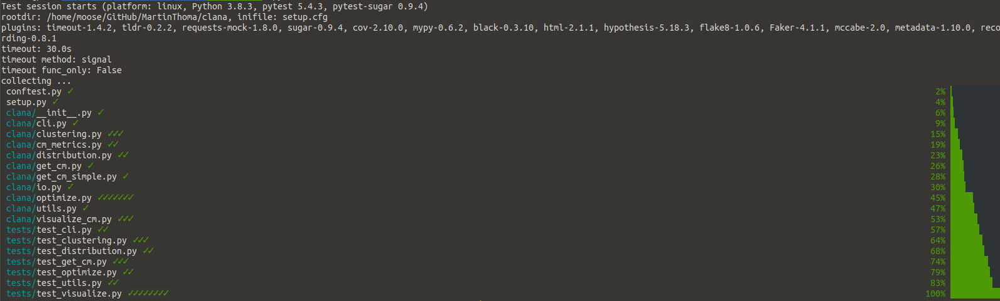
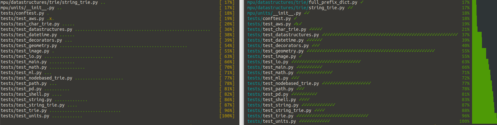
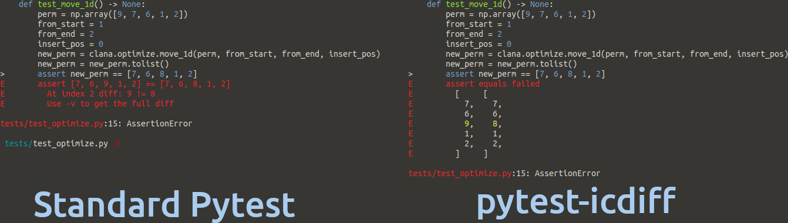
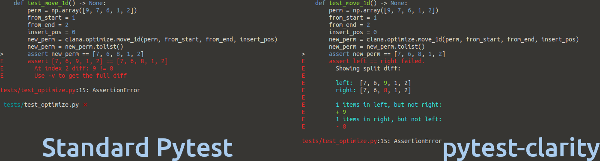
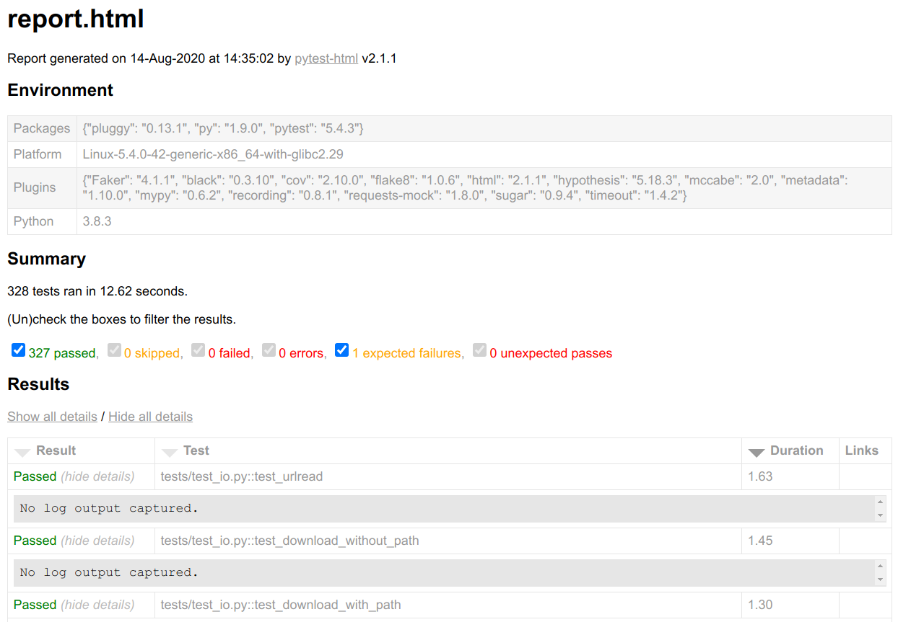
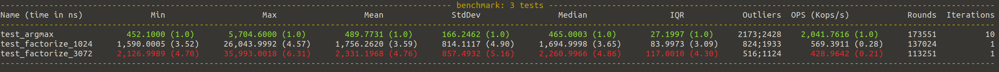

<figure class="wp-caption aligncenter img-thumbnail">
    <a href="../images/2020/08/pytest-sugar-big.png"></a>
    <figcaption class="text-center">Plugins can modify and extend a lot of aspects of pylint, including how the output is done</figcaption>
</figure>

Pytest is extensible and has plenty of plugins. You don’t need to use any of
them, but you might find some very useful. I love this because you have an easy
time to [get started with unit
testing](https://medium.com/swlh/unit-testing-in-python-basics-21a9a57418a0),
while still finding amazing stuff when you’re more experienced 🤩

In this article, I’ll show you examples of plugins I use and the plugins I
found while writing this article. You might want to cover the [basics of unit
testing](https://medium.com/swlh/unit-testing-in-python-basics-21a9a57418a0)
first or refresh [testing details like
fixtures](https://medium.com/python-in-plain-english/unit-testing-in-python-structure-57acd51da923).

## How can I add a plugin?

All plugins presented in this article can be installed via `pip`. Most of them
are then already active. For example, when you install pytest-sugar via

```bash
pip install pytest-sugar
```

You can just execute pytest and the plugin will automatically work. Others need
to be used more directly. For example, after installing `pytest-timeout` you
need to specify the timeout parameter you want to use:

```bash
pytest --timeout=1
```

Don’t worry, I will explain those two plugins later 🙂

## How many Pytest plugins exist?

Searching on pypi.org for the trove classifier `Framework :: Pytest`, I found
668 packages. A stunning 1053 packages have “pytest” in the name. 461 packages
have both, the name and the trove classifier.

I went through over 700 pytest-plugins for this article. I’ve jumped over
plugins that consider themselves to be in planning, pre-alpha, or alpha stage.
I’ve also skipped packages where I’ve seen a TODO in the readme or if the
package had less than 10 stars on GitHub.

The packages I’ve found make pytest sparkle ✨, improve the speed 🏎, are
specialized to specific packages, or just unique in their behavior ❄️

Last but not least, there are some plugins where I’m not sure if they are
awesome or if they are a bad idea. Let’s jump right into it and have a look
yourself!

> **Side note**: Maybe you remember my [side note on typo squatting](https://towardsdatascience.com/static-code-analysis-for-python-bdce10b8d287#9026)? I found a [fixable issue on PyPI](https://github.com/pypa/warehouse/issues/8462) while writing this article, hopefully improving security for the community🎉

## The shiny ones

The default output of pytest is already good, but some plugins make it amazing.
[pytest-sugar](https://github.com/Teemu/pytest-sugar) is one of those plugins❤

<figure class="wp-caption aligncenter img-thumbnail">
    <a href="../images/2020/08/pytest-sugar.png"></a>
    <figcaption class="text-center">Pytest sugar changes the dots to checkmarks and the percentage to a bar.</figcaption>
</figure>

If those dots or checkmarks are too decent for you,
give [pytest-emoji](https://pypi.org/project/pytest-emoji/) and
[pytest-emoji-out](https://pypi.org/project/pytest-emoji-output/) a try 😃

The summary output now looks good, but the diffs between the expected value and
the actual value can be improved.
[pytest-icdiff](https://pypi.org/project/pytest-icdiff/) is a plugin I’ve only
found while researching this article — and it was love at first sight 🥰❤

<figure class="wp-caption aligncenter img-thumbnail">
    <a href="../images/2020/08/pytest-error-message-normal-vs-icdiff.png"></a>
    <figcaption class="text-center">Normal pytest output vs pytest-icdiff</figcaption>
</figure>

Very similar is [pytest-clarity](https://pypi.org/project/pytest-clarity/) — be aware, that pytest-clarity is only active when you execute pytest -vv:

<figure class="wp-caption aligncenter img-thumbnail">
    <a href="../images/2020/08/pytest-error-message-normal-vs-clarity.png"></a>
    <figcaption class="text-center">Comparison of the normal output with pytest-clarity</figcaption>
</figure>

Once you're happy with the terminal output, you might think about getting
reports in the browser. This could help once you have to have a look at many
things, want to scroll and search. Then
[pytest-html](https://pypi.org/project/pytest-html/) is your friend. It
generates reports like this one:

<figure class="wp-caption aligncenter img-thumbnail">
    <a href="../images/2020/08/pytest-html.png"></a>
    <figcaption class="text-center">Output of pytest-html</figcaption>
</figure>

Now that we are happy with the output, we want to make it lightning fast!


## We need speed!

Plugins can speed things up. For example, you can make pytest fail instantly
with [`pytest-instafail`](https://pypi.org/project/pytest-instafail/) instead of
executing all remaining tests. For tests which might take a long time or even
result in an infinite loop in case of errors, I use
[`pytest-timeout`](https://pypi.org/project/pytest-timeout/) ❤. That is
especially helpful when you apply [Mutation
testing](https://medium.com/analytics-vidhya/unit-testing-in-python-mutation-testing-7a70143180d8).

We also want to use our machine properly by using
[`pytest-xdist`](https://pypi.org/project/pytest-xdist/). Install it, execute
`pytest -n auto` and your tests run in parallel!
[`pytest-parallel`](https://pypi.org/project/pytest-parallel/) might also be
worth a shot.

The most extreme speedup is not to execute stuff you don’t need.
[`pytest-picked`](https://github.com/anapaulagomes/pytest-picked) executes tests
that are related to unstaged files which can be way less than your complete
test suite.

Going in a different direction, we want to make sure that the algorithms have
some speed behavior. With
[`pytest-benchmark`](https://pypi.org/project/pytest-benchmark/), we can use
the benchmark fixture to annotate parts of a test which we want to benchmark:

```python
def test_argmax(benchmark):
    assert benchmark(mpu.math.argmax, [1, 2, 3]) == 2
```

Running pytest then also gives this output, where you can see three functions
to which I’ve added a benchmark. Two of them test a factorization function. It
should not be a surprise that factorizing 3072 takes longer than factorizing
1024, but it is always astonishing to me how quickly the numbers grow. The
argmax of 3 examples is super quick, but factorization just needs way more
computation:

<figure class="wp-caption aligncenter img-thumbnail">
    <a href="../images/2020/08/pytest-benchmark.png"></a>
    <figcaption class="text-center">Minimum, Mean and Maximum execution time, as well as the standard deviation and the interquartile range, give you some insights into the execution time distribution</figcaption>
</figure>


## The unique ones

Some plugins are unique and don’t fit in any of the other categories:

* [pytest-cov](https://pypi.org/project/pytest-cov) : Get a test coverage
  report 😍 ❤ I like to generate both, an HTML report and an output to the
  terminal. In some settings, an XML report is also helpful.
* [pytest-socket](https://pypi.org/project/pytest-socket/) : Make certain that
  you don’t query anything non-local. Very nice ❤
* [pytest-randomly](https://github.com/pytest-dev/pytest-randomly) and
  [pytest-rng](https://pypi.org/project/pytest-rng/): If you use
  `random.random`, then the outcome depends on the random seed. This plugin
  changes the seed.
* [pytest-random-order](https://pypi.org/project/pytest-random-order/) :
  Execute the tests in a random order, to make sure you see when a test leaves
  the system in a different state.
* [pytest-lazy-fixtures](https://pypi.org/project/pytest-lazy-fixture/) : Use
  fixtures in `@pytest.mark.parametrize`.
* [pytest-freezegun](https://pypi.org/project/pytest-freezegun/) : Freeze time!
  This is one I’ve also mentioned in [my patching
  article](https://levelup.gitconnected.com/unit-testing-in-python-mocking-patching-and-dependency-injection-301280db2fed).
* [pytest-leaks](https://pypi.org/project/pytest-leaks/) : Find resource leaks.
  This requires a debug-built of Python!
* [pytest-flake8](https://github.com/tholo/pytest-flake8) : Run flake8 via
  pytest. I did that for a long time, but when I learned
  [how to use Continuous Integration pipelines](https://levelup.gitconnected.com/ci-pipelines-for-python-projects-9ac2830d2e38)
  more effectively, I stopped it. You can still execute flake8 directly.
* [pytest-mypy](https://pypi.org/project/pytest-mypy/) and pytest-mccabe: Same
  story as for flake8. By the way, [type annotations are
  awesome](https://medium.com/analytics-vidhya/type-annotations-in-python-3-8-3b401384403d)!
  I like to have those [static code analysis
  tools](https://towardsdatascience.com/static-code-analysis-for-python-bdce10b8d287)
  in a linter step within the CI pipeline.
* [pytest-deadfixtures](https://pypi.org/project/pytest-deadfixtures/) : Point
  out which fixtures are not used or duplicated.

## 17 Specialized Plugins — You’ll know if you need them

The following plugins are only interesting to you if you work with the applications for which they are written. They usually provide fixtures/mocks.

* [pytest-cookie](https://pypi.org/project/pytest-cookies/) : Supports testing
  of [cookiecutter](https://github.com/cookiecutter/cookiecutter) templates.
* [pytest-plt](https://pypi.org/project/pytest-plt/) and
  [pytest-mpl](https://pypi.org/project/pytest-mpl/): Provides fixtures for
  matplotlib.
* [pytest-responses](https://pypi.org/project/pytest-responses/) : Provides
  fixtures for [`requests`](https://requests.readthedocs.io/en/master/).
* [pytest-asyncio](https://pypi.org/project/pytest-asyncio/) : Use it when you
  develop async functions.
* [pytest-qt](https://pypi.org/project/pytest-qt/) : GUI development via Qt /
  PySide / PySide2.

### Web Development

* [pytest-djangoapp](https://pypi.org/project/pytest-djangoapp/) /
  [pytest-djangoqueries](https://pypi.org/project/pytest-django-queries/):
  Exposes tools for Django application developers to facilitate test authoring,
  including settings override, template tag testing, and user creation.
* [pytest-flask](https://pypi.org/project/pytest-flask/) and
  [pytest-flask-sqlalchemy](https://pypi.org/project/pytest-flask-sqlalchemy/)
  : Provides fixtures for running tests in transactions using Flask-SQLAlchemy.
* [pytest-seleniumbase](https://pypi.org/project/pytest-seleniumbase/) /
  [pytest-sbase](https://pypi.org/project/pytest-sbase/) /
  [pytest-selenium](https://pypi.org/project/pytest-selenium/)

### Mocks and Fixtures for AWS

* [moto](https://pypi.org/project/moto/) : Mocks for boto3 — AWS stuff. I don’t
  exactly love this one, but it is for sure the best you can do when you want
  to test code that uses S3.
* [pytest-aws](https://pypi.org/project/pytest-aws/) : Testing AWS resource
  configurations
* [pytest-lambda](https://pypi.org/project/pytest-lambda/) : Fixtures for AWS Lambda
* [pytest-localstack](https://pypi.org/project/pytest-localstack/) : Create AWS
  integration tests via a Localstack Docker container

## Plugins I’m uncertain about

The following plugins sounded cool for me when I first read about them, but for
various reasons, I’m uncertain if they are really a good idea:

* [pytest-check](https://github.com/okken/pytest-check) : Allows multiple
  failures per test. At first, I loved the idea. Then I realized that this
  might lead to worse tests as the tests start to do many things. On the other
  hand, you might want to test a “workflow” once — so not a unit test, but an
  integration test or even an end-to-end test. But then you would also need
  intermediate results.
* [pytest-docker-tools](https://pypi.org/project/pytest_docker_tools/) and
  [pytest-docker-compose](https://github.com/pytest-docker-compose/pytest-docker-compose):
  I would just build the Docker image and execute the stuff in it.
* [pytest-mock](https://pypi.org/project/pytest-mock/) : Provides a mocker
  fixture which is a thin wrapper around the patching API provided by the mock
  package.
* [`pytest-spec`](https://pypi.org/project/pytest-spec/),
  [`pytest-pspec`](https://pypi.org/project/pytest-pspec/), and
  [pytest-testdox](https://pypi.org/project/pytest-testdox/) modify the pytest
  output. They show what is tested. The tests should be written in such a way
  that they represent the software specification — so the test is against a
  part of the specification.
* [pytest-recording](https://pypi.org/project/pytest-recording/) : It should
  record network interactions via VCR.py, but I didn’t get it to work.
* [pytest-dependency](https://github.com/RKrahl/pytest-dependency) allows you
  to specify which tests need to succeed for others to be able to succeed. Unit
  tests should be independent and dependent code should be mocked…maybe. I’m
  not certain about that.


## TL;DR

pytest is the tool of choice to run tests in Python. While it has reasonable
defaults, it’s extensive plugin system lets you customize it to make it even
better.

I love [`pytest-sugar`](https://github.com/Teemu/pytest-sugar) and
[`pytest-icdiff`](https://pypi.org/project/pytest-icdiff/), because they make
the output of pytest easier to read.
[`pytest-cov`](https://pypi.org/project/pytest-cov/) generates line- and branch
coverage and thus is a valuable tool to find spots that need better tests. The
next step is to run the tests. You really don’t want to accidentally hit the
production environment. This is where
[`pytest-socket`](https://pypi.org/project/pytest-socket/) comes into play. It
just blocks everything and reports it to you. The other type of issue are
long-running tests that are potentially in infinite loops.pytest-timeout kills
those tests after the specified amount of time.

There are so many other plugins; many add fixtures for specific packages which
are typically hard to test. You should now have a good idea of the many
possibilities added by pytest plugins — use them!
