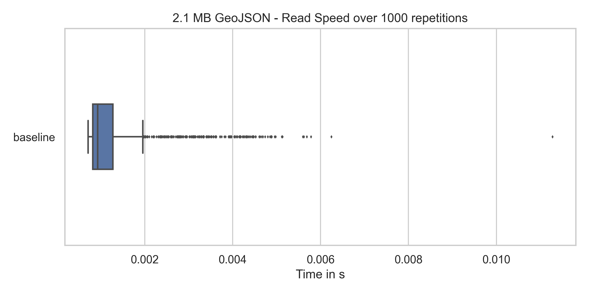
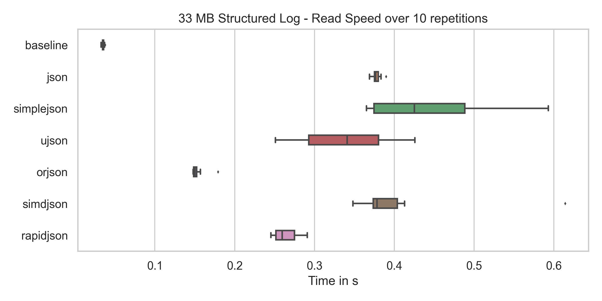
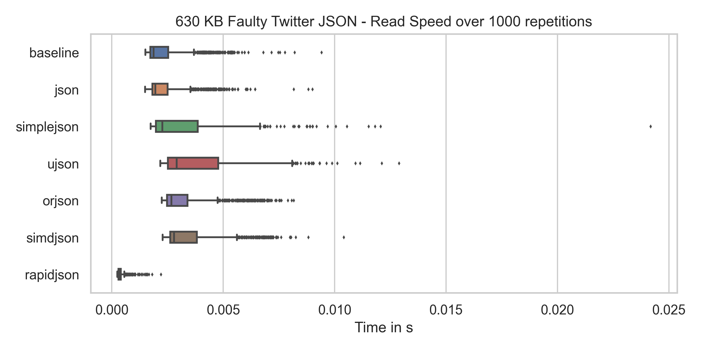
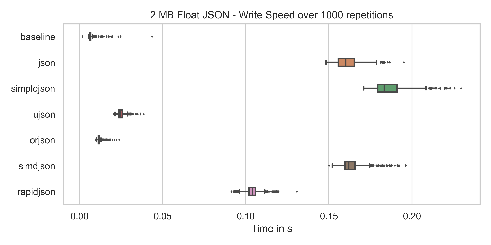
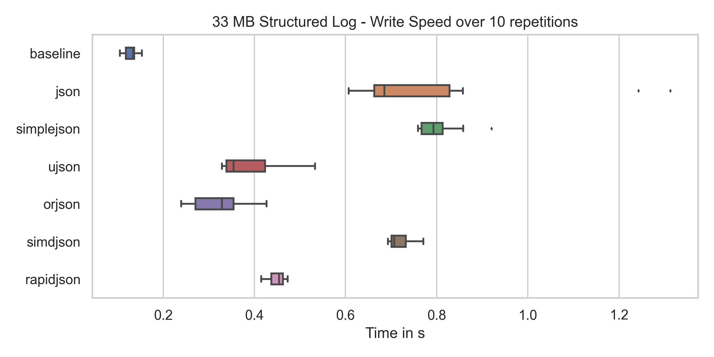

JSON is a cornerstone for the exchange of data on the Internet. REST APIs use the standardized message format all around the world. Being a subset of JavaScript, it got a huge initial boost in its adoption right from the start. The fact that its syntax is pretty clear and easy to read also helped.

JSON has libraries in every language I know for serialization and deserialization. In Python, there are actually multiple libraries. In this article, I will compare them for you.

## The libraries

**CPython** itself has a [json](https://docs.python.org/3/library/json.html) module. It was originally developed by Bob Ippolito as simplejson and was merged into Python 2.4 ([source](https://docs.python.org/3/whatsnew/2.6.html#the-json-module-javascript-object-notation)). CPython is licensed under the Python Software Foundation License.

**simplejson** still exists as its own library and you can install it via pip. It is a pure Python library with an optional C extension. Simplejson is licensed under the MIT and the Academic Free License (AFL) license.

[**ujson**](https://pypi.org/project/ujson/) is a binding to the C library [Ultra JSON](https://github.com/ultrajson/ultrajson). Ultra JSON was developed by ESN ([an Electronic Arts Inc. studio](https://techcrunch.com/2012/09/26/electronic-arts-buys-online-gaming-development-studio-esn/)) and is licensed under the [3-clause BSD License](https://tldrlegal.com/license/bsd-3-clause-license-(revised)). Ultra JSON has 3k stars on Github, 305 forks, 50 contributors, the last commit is only 12 days old and the last issue was opened 5 days ago. I’ve heard that it is in “maintenance mode” ([source](https://github.com/ultrajson/ultrajson/issues/428#issuecomment-699456053)), indicating that there is no new development.

**pysimdjson** is a binding to the C++ library [simdjson](https://github.com/simdjson/simdjson). SIMDjson received funding from Canada. simdjson has 12.2k stars on Github, 611 forks, 63 contributors, the last commit was 11 hours ago, and the last issue was opened 2 hours ago.

**python-rapidjson** is a binding to the C++ library [RapidJSON](https://github.com/Tencent/rapidjson). RapidJSON was developed by [Tencent](https://en.wikipedia.org/wiki/Tencent). RapidJSON has 9.8k stars on GitHub, 2.7k forks, 150 contributors, the last commit was about 2 months ago and the last issue was opened 17 days ago.

[**orjson**](https://pypi.org/project/orjson/) is a Python package that relies on Rust to do the heavy lifting.

## Maturity and Operational Safety

All mentioned libraries worked for the benchmark examples without issues. Switching the JSON module is not a super big deal, but still, I want to know that the module is supported.

CPython, simplejson, ujson, and orjson consider themselves production-ready.

python-rapidjson marks itself as alpha, but one maintainer says that is a mistake and will be fixed soon ([source](https://github.com/python-rapidjson/python-rapidjson/issues/140#issuecomment-699475354)).

<table class="table table-striped table-sm" style="width: 60%">
    <thead>
    <tr>
        <th></th>
        <th>cPython JSON</th>
        <th>simplejson</th>
        <th>ujson</th>
        <th>orjson</th>
        <th>pysimdjson</th>
        <th>python-rapidjson</th>
    </tr>
</thead>
<tbody>
    <tr>
        <th>License</th>
        <td>Python Software Foundation License</td>
        <td>MIT / Academic Free License (AFL)</td>
        <td>BSD License</td>
        <td>MIT / Apache</td>
        <td>MIT</td>
        <td>MIT</td>
    </tr>
    <tr class="table-primary">
        <th colspan="7" style="text-align: center">Maturity</th>
    </tr>
    <tr>
        <th>Version</th>
        <td>3.8.6</td>
        <td>3.17.2</td>
        <td>3.2.0</td>
        <td>3.4.0</td>
        <td>3.0.0</td>
        <td>0.9.1</td>
    </tr>
    <tr>
        <th>Development Status</th>
        <td></td>
        <td>Production/Stable</td>
        <td>Production/Stable</td>
        <td>Production/Stable</td>
        <td style="background-color: red;">Alpha</td>
        <td style="background-color: red;">Alpha</td>
    </tr>
    <tr>
        <th>GH First release</th>
        <td><span alt="v0.9.8">1993-01-10</span></td>
        <td><span alt="v1.1">2006-01-01</span></td>
        <td><span alt="v1.19">2012-06-18</span></td>
        <td><span alt="1.0.0">2018-11-23</span></td>
        <td><span alt="v1.2.0">2019-02-23</span></td>
        <td><span alt="v0.0.9">2017-03-02</span></td>
    </tr>
    <tr>
        <th>CI-Pipeline</th>
        <td>GH, Travis, Azure</td>
        <td>GH, Travis, Appveyor</td>
        <td>GH, Travis</td>
        <td>Azure</td>
        <td>GH, Travis</td>
        <td>Appveyor</td>
    </tr>
    <tr class="table-primary">
        <th colspan="7" style="text-align: center">Operational Safety</th>
    </tr>
    <tr>
        <th>GH Organization</th>
        <td style="font-weight: bold; color: green; font-size: 30px;">✓</td>
        <td style="font-weight: bold; color: green; font-size: 30px;">✓</td>
        <td style="font-weight: bold; color: green; font-size: 30px;">✓</td>
        <td style="font-weight: bold; color: red; font-size: 30px;">✗</td>
        <td style="font-weight: bold; color: red; font-size: 30px;">✗</td>
        <td style="font-weight: bold; color: green; font-size: 30px;">✓</td>
    </tr>
    <tr>
        <th>GH Contributors</th>
        <td>1319</td>
        <td>30</td>
        <td>50</td>
        <td>9</td>
        <td>7</td>
        <td>15</td>
    </tr>
    <tr>
        <th>Last release</th>
        <td>2020-09-23</td>
        <td>2020-07-16</td>
        <td>2020-09-08</td>
        <td>2020-09-25</td>
        <td>2020-08-21</td>
        <td>2019-11-13</td>
    </tr>
    <tr>
        <th>Last Commit</th>
        <td>2020-09-25</td>
        <td>2020-07-16</td>
        <td>2020-09-19</td>
        <td>2020-09-25</td>
        <td>2020-08-31</td>
        <td>2020-05-08</td>
    </tr>
    <tr>
        <th>PyPI Maintainers</th>
        <td></td>
        <td>3</td>
        <td>4</td>
        <td style="background-color: red;">1</td>
        <td style="background-color: red;">1</td>
        <td>2</td>
    </tr>
    <tr class="table-primary">
        <th colspan="7" style="text-align: center">Users</th>
    </tr>
    <tr>
        <th>GH Stars</th>
        <td style="background-color: green;">33,700</td>
        <td>1310</td>
        <td>2966</td>
        <td>1348</td>
        <td>374</td>
        <td>397</td>
    </tr>
    <tr>
        <th>GH Forks</th>
        <td style="background-color: green;">16,200</td>
        <td>290</td>
        <td>306</td>
        <td>48</td>
        <td>25</td>
        <td>31</td>
    </tr>
    <tr>
        <th>GH Used By</th>
        <td>-</td>
        <td style="background-color: green;">47,164</td>
        <td style="background-color: green;">14,760</td>
        <td>613</td>
        <td>11</td>
        <td>661</td>
    </tr>
    <tr>
        <th>StackOverflow Questions</th>
        <td></td>
        <td><a href="https://stackoverflow.com/questions/tagged/simplejson">279</a></td>
        <td><a href="https://stackoverflow.com/questions/tagged/ujson">6</a></td>
        <td><a href="https://stackoverflow.com/questions/tagged/orjson">3</a></td>
        <td>-</td>
        <td><a href="https://stackoverflow.com/questions/tagged/rapidjson">319</a></td>
    </tr>
    <tr class="table-primary">
        <th colspan="7" style="text-align: center">Benchmarks</th>
    </tr>
    <tr>
        <th>GeoJSON Read</th>
        <td>48ms</td>
        <td>45ms</td>
        <td style="background-color: green;">22ms</td>
        <td style="background-color: green;">19ms</td>
        <td style="background-color: green;">14ms</td>
        <td style="background-color: red;">83ms</td>
    </tr>
    <tr>
        <th>GeoJSON Write</th>
        <td>291ms</td>
        <td style="background-color: red;">352ms</td>
        <td style="background-color: green;">34ms</td>
        <td style="background-color: green;">15ms</td>
        <td>289ms</td>
        <td style="background-color: green;">108ms</td>
    </tr>
    <tr>
        <th>Twitter Read</th>
        <td style="background-color: green;">6ms</td>
        <td style="background-color: green;">6ms</td>
        <td style="background-color: green;">6ms</td>
        <td style="background-color: green;">5ms</td>
        <td style="background-color: green;">6ms</td>
        <td style="background-color: red;">9ms</td>
    </tr>
    <tr>
        <th>Twitter Write</th>
        <td>25ms</td>
        <td style="background-color: red;">33ms</td>
        <td style="background-color: green;">5ms</td>
        <td style="background-color: green;">3ms</td>
        <td>24ms</td>
        <td style="background-color: green;">6ms</td>
    </tr>
    <tr>
        <th>2MB Float List Read</th>
        <td>36ms</td>
        <td>37ms</td>
        <td style="background-color: green;">16ms</td>
        <td style="background-color: green;">9ms</td>
        <td style="background-color: green;">7ms</td>
        <td style="background-color: green;">66ms</td>
    </tr>
    <tr>
        <th>2MB Float List Write</th>
        <td>161ms</td>
        <td style="background-color: red;">186ms</td>
        <td style="background-color: green;">25ms</td>
        <td style="background-color: green;">12ms</td>
        <td style="background-color: red;">164ms</td>
        <td>104ms</td>
    </tr>
    </tbody>
</table>


## The Questions

One indicator of how easy it might be to resolve problems is to ask questions and see how the behavior is:

* [SimpleJSON](https://github.com/simplejson/simplejson/issues/267): I’ve got a response the next day. The response was clear, easy to follow, friendly. [Bob Ippolito](undefined) answered me — the guy who originally developed it and who also is mentioned in the Python docs for the JSON module!
* [uJSON](https://github.com/ultrajson/ultrajson/issues/428): I’ve got a clear, friendly, easy to follow answer within 30 minutes. @hugovank
* [ORJSON](https://github.com/ijl/orjson/issues/127): No answer after 8 days.
* [PySIMDJSON](https://github.com/TkTech/pysimdjson/issues/54): No answer after 8 days.
* [Python-RapidJSON](https://github.com/python-rapidjson/python-rapidjson/issues/140): I’ve got a clear, friendly, easy to follow answer within 30 minutes. A [simple PR](https://github.com/python-rapidjson/python-rapidjson/pull/143) wasn’t merged after two days.

One answer I’ve got for all of the projects is that they are essentially not in contact with each other.

## The Benchmark

In order to benchmark the different libraries properly, I thought of the following scenarios:

* **APIs**: Web services that exchange information. It might contain Unicode and have a nested structure. A JSON file from a Twitter API sounds good to test this.
* **API JSON Error**: I was curious about how the performance would change if there was an error in the JSON API format. So I removed a brace in the middle.
* **GeoJSON**: I’ve first seen [the GeoJSON format](https://en.wikipedia.org/wiki/GeoJSON) with [Overpass Turbo](https://overpass-turbo.eu/), an Open Streep Map exporter. You will get crazy big JSON files with mostly coordinates, but also pretty nested.
* **Machine Learning**: Just a massive list of floats. Those might be weights of a neural network layer.
* **JSON Line**: Structured logs are heavily used in the industry. If you analyze those logs, you might need to go through Gigabytes of data. They are all simple dictionaries with a datetime object, a message, the logger, log status, and maybe some more.

### Deserialization Speed

The speed of my hard drive gives a lower boundary for the speed to read. I’ve included it as a baseline in the following 3 charts.

<figure class="wp-caption aligncenter img-thumbnail">
    <a href="../images/2020/10/read-twitter.png"></a>
    <figcaption class="text-center">Read a complex, but small JSON</figcaption>
</figure>

<figure class="wp-caption aligncenter img-thumbnail">
    <a href="../images/2020/10/read-geojson.png"></a>
    <figcaption class="text-center">Read a GeoJSON</figcaption>
</figure>

<figure class="wp-caption aligncenter img-thumbnail">
    <a href="../images/2020/10/read-float.png"></a>
    <figcaption class="text-center">Read a massive float array</figcaption>
</figure>

<figure class="wp-caption aligncenter img-thumbnail">
    <a href="../images/2020/10/read-structured-log.png"></a>
    <figcaption class="text-center">Read a structured log file</figcaption>
</figure>

<figure class="wp-caption aligncenter img-thumbnail">
    <a href="../images/2020/10/read-twitter-fail.png"></a>
    <figcaption class="text-center">Read a faulty twitter.json</figcaption>
</figure>

The conclusion from this:

* Rapidjson is slow, but for small JSONs like the twitter.json, you will not notice a difference. One can see this with the structured logs.
* simdjson, orjson, and ujson are all crazy fast.
* Reading a JSON file that contains a structural error is equally fast for most libraries. A notable exception is rapidjson. I guess that it aborts reading the file once it finds the error.

### Serialization Speed

In this case, I created the JSON-String beforehand and measured the time it takes to write it to disk as a baseline.

<figure class="wp-caption aligncenter img-thumbnail">
    <a href="../images/2020/10/write-twitter.png"></a>
    <figcaption class="text-center">Write a twitter.json</figcaption>
</figure>

<figure class="wp-caption aligncenter img-thumbnail">
    <a href="../images/2020/10/write-geojson.png"></a>
    <figcaption class="text-center">Write a GeoJSON</figcaption>
</figure>

<figure class="wp-caption aligncenter img-thumbnail">
    <a href="../images/2020/10/write-float.png"></a>
    <figcaption class="text-center">Write a massive float array</figcaption>
</figure>

<figure class="wp-caption aligncenter img-thumbnail">
    <a href="../images/2020/10/write-structured-log.png"></a>
    <figcaption class="text-center">Write a structured log file</figcaption>
</figure>

What I conclude from this:

* orjson is just insanely fast. It is super close to maxing out my hard drive. And ujson is pretty close to that.
* rapidjson is pretty quick, but not on the same level as orjson or ujson.
* simdjson is slow.

## A professional workflow with JSON

As a closing note, I want to point out some issues I see sometimes and have written myself:

* Calling variables foo_json : JSON is a string format. If it’s not a string, it’s not JSON. If you deserialized a JSON with bar = json.loads(foo) , then bar is not a JSON. You can serialize bar to a JSON which is equivalent to the JSONfoo , but bar is not a JSON. It’s a Python object. Very likely a dictionary. You can then all it foo_dict .
* Attribute checks all over the place: If you receive a JSON, it’s super easy to convert it to a Python object (e.g. a dict) and use it. This is fine for proof-of-concept code or very small JSON strings. It will bite you in the ass if you don’t convert it to something like a [dataclass](https://docs.python.org/3/library/dataclasses.html).

[pydantic](https://github.com/samuelcolvin/pydantic) is a super helpful validation library. You can take the JSON-string, parse it to a Python base representation with dictionaries / lists / strings / numbers / booleans with your favorite JSON library and then parse it again with Pydantic. The advantage you get from this is that you know what you’re dealing with later. No longer just Dict[str, Any] as a [type annotation](https://medium.com/analytics-vidhya/type-annotations-in-python-3-8-3b401384403d). No longer unhelpful editor autocompletion. No longer checking if attributes exist all over your code.

To include other json packages than the default json , I recommend the pattern

```python
import ujson as json
```

For Flask, you can use another [encoder](https://flask.palletsprojects.com/en/1.1.x/api/#flask.json.JSONEncoder)/[decoder](https://flask.palletsprojects.com/en/1.1.x/api/#flask.json.JSONDecoder) like this:

```python
from simplejson import JSONEncoder, JSONDecoder

app.json_encoder = JSONEncoder
app.json_decoder = JSONDecoder
```

## See also

* [Daniel Lemire](undefined): [Parsing JSON Really Quickly: Lessons Learned](https://www.youtube.com/watch?v=wlvKAT7SZIQ) at InfoQ
* [Ng Wai Foong](undefined): [Introduction to orjson](https://levelup.gitconnected.com/introduction-to-orjson-3d06dde79208)
* [Nicolas Seriot](undefined): [Parsing JSON is a Minefield](http://seriot.ch/parsing_json.php)
