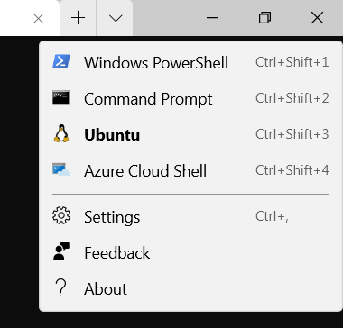
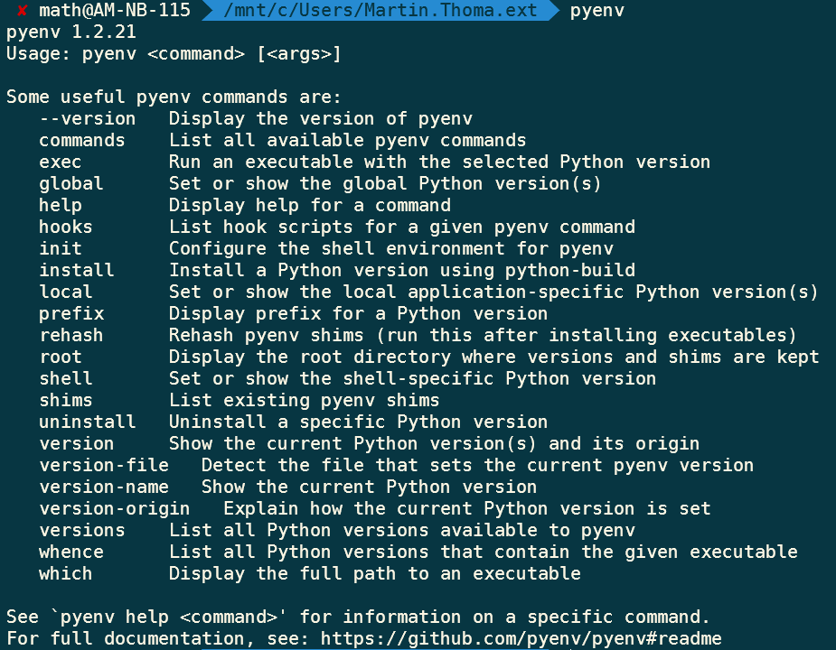

The Python programming language is used for [web development](https://blog.miguelgrinberg.com/post/the-flask-mega-tutorial-part-i-hello-world), [data analysis](https://www.udacity.com/course/intro-to-data-analysis--ud170), [machine learning](https://www.udacity.com/course/intro-to-machine-learning--ud120), [statistics](https://towardsdatascience.com/hypothesis-testing-in-machine-learning-using-python-a0dc89e169ce), [web scraping](../scraping-with-selenium/), and so much more. There are tons of tutorials which, ironically, make it pretty hard to recommend one. However, there is also a lack of support for Windows.

Let’s get the very first step done: Install it on Windows. You could [use Python through Anaconda](https://medium.com/python-in-plain-english/how-to-start-python-development-on-windows-10-anaconda-edition-cc91c2d57a1d), but in this article, we will use it on Windows with WSL. This prepares you to follow one of the many tutorials to start your Python career.

## What is WSL?

The [Windows Subsystem for Linux](https://en.wikipedia.org/wiki/Windows_Subsystem_for_Linux) (WSL) is a compatibility layer that allows you to run Linux binaries on Windows. WSL2 uses a real Linux kernel ([source](https://blogs.windows.com/windows-insider/2020/06/10/announcing-windows-10-insider-preview-build-19645/)). On top of WSL, you can run the Linux flavor “Ubuntu”. Such a kind of “flavor” is called a *distribution*. There are many other distributions, but Ubuntu is by far the most widespread option.

This is pretty awesome because most Python developers use Linux. This means many tutorials assume that you have access to Linux programs and some Python packages contain code that is platform-specific. The Python community is increasingly becoming aware of the issue that Windows support is suboptimal, but for now, using (something similar to) Linux is just the easier path.

## Install WSL2 and Ubuntu

I recommend following the official Microsoft guide:
[Install Windows Subsystem for Linux (WSL) on Windows 10](https://docs.microsoft.com/en-us/windows/wsl/install-win10)

In Step 6, choose “[Ubuntu 20.04 LTS](https://www.microsoft.com/en-US/p/ubuntu-2004-lts/9n6svws3rx71?activetab=pivot:overviewtab)”.

## Install and Configure Windows Terminal

When Ubuntu is installed, install [Windows Terminal](https://www.microsoft.com/en-US/p/windows-terminal/9n0dx20hk701?rtc=1&activetab=pivot:overviewtab).

Download and install all 4 “[DejaVu Sans Mono Powerline](https://github.com/powerline/fonts/tree/master/DejaVuSansMono)” fonts.

Launch a terminal and navigate to the settings. It’s this small downward-pointing “arrow”:

*Click on “Settings”. The screenshot was taken by Martin Thoma*

You should see a JSON file which you can change to fit your taste. I have the following:

<iframe src="https://medium.com/media/db0a1b7a8b8d0eccc2a75276eec241da" frameborder=0></iframe>

## Install pyenv

[pyenv](https://github.com/pyenv/pyenv) lets you run any Python runtime you like. To install it, run the following commands. Lines that begin with `$` indicate that you should enter what follows. Copy everything except the `$` until the next `$`.

```shell
$ sudo apt-get install git
$ git clone https://github.com/pyenv/pyenv.git ~/.pyenv

$ echo 'export PYENV_ROOT="$HOME/.pyenv"' >> ~/.bash_profile
$ echo 'export PATH="$PYENV_ROOT/bin:$PATH"' >> ~/.bash_profile

$ echo 'export PYENV_ROOT="$HOME/.pyenv"' >> ~/.zshrc
$ echo 'export PATH="$PYENV_ROOT/bin:$PATH"' >> ~/.zshrc

# Copy the next two lines, except the first $
$ echo -e 'if command -v pyenv 1>/dev/null 2>&1; then\n  eval "$(pyenv init -)"\nfi' >> ~/.bash_profile

# Copy the next two lines, except the first $
$ echo -e 'if command -v pyenv 1>/dev/null 2>&1; then\n  eval "$(pyenv init -)"\nfi' >> ~/.zshrc

# Install the build dependencies
$ sudo apt-get update; sudo apt-get install --no-install-recommends make build-essential libssl-dev zlib1g-dev libbz2-dev libreadline-dev libsqlite3-dev wget curl llvm libncurses5-dev xz-utils tk-dev libxml2-dev libxmlsec1-dev libffi-dev liblzma-dev
```

Close all terminals and open one again. Now the command `pyenv` should show you the help:

*Screenshot by Martin Thoma*

Most importantly, the command `pyenv install --list` shows you all the different Python versions you can install. I recommend installing 3.8.6 as of October 2020.

```shell
$ pyenv install 3.8.6
Downloading Python-3.8.6.tar.xz...
-> https://www.python.org/ftp/python/3.8.6/Python-3.8.6.tar.xz
Installing Python-3.8.6...
Installed Python-3.8.6 to /home/math/.pyenv/versions/3.8.6
```

After that, you can use it globally:

```shell
$ pyenv global 3.8.6

$ python --version
Python 3.8.6

$ pip --version
pip 20.2.1 from /home/math/.pyenv/versions/3.8.6/lib/python3.8/site-packages/pip (python 3.8)
```

## Editor

There are two beginner-friendly, gratis, widespread editor options: [Visual Studio Code](https://code.visualstudio.com/) and [Sublime Text](https://www.sublimetext.com/). A lot of people also like [PyCharm Professional](https://www.jetbrains.com/pycharm/download) and some hackers like vim / Emacs. Personally, I do most of my work in Sublime Text. I like that it is super lightweight and doesn’t have a lot of distracting information.

I highly recommend navigating within Windows to `\\wsl$\Ubuntu\home`. This way, you access the Linux files from Windows.

You can also go to `/mnt/c/Users` within Ubuntu, but this way things become crazy slow.

## How can I continue?

If you want an introduction to Python from the beginning, try [the official Python tutorial](https://docs.python.org/3/tutorial/). Although I already had programming experience when I started with Python, I went through this to make sure I know the basics.

If you have some programming background, there is also the [Python Jumpstart by building 10 apps](https://training.talkpython.fm/courses/explore_python_jumpstart/python-language-jumpstart-building-10-apps). I haven’t tried it, but I love [the Talk Python podcast](https://talkpython.fm/).

## Acknowledgment

A big THANK YOU to my colleague [Marcus Windmark](https://www.linkedin.com/in/marcuswindmark/) who helped me to get started with Python on Windows 🤗
