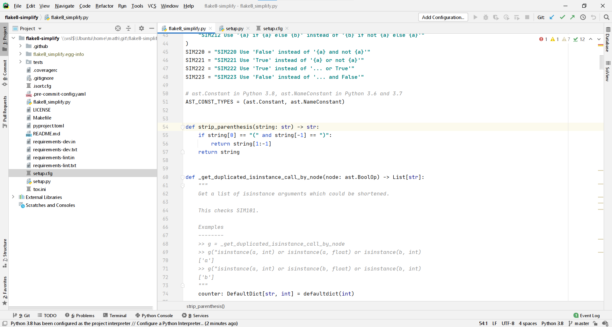
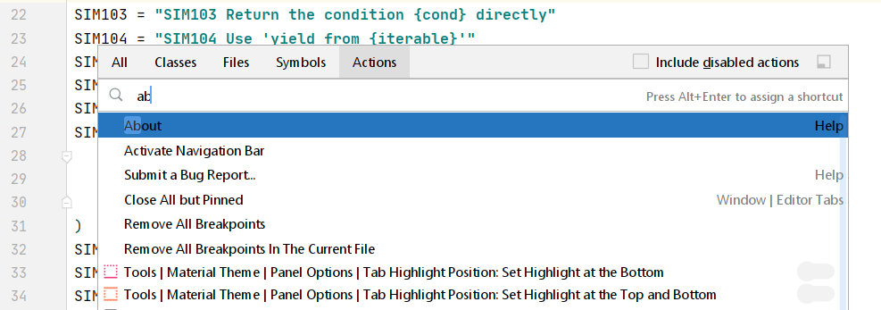
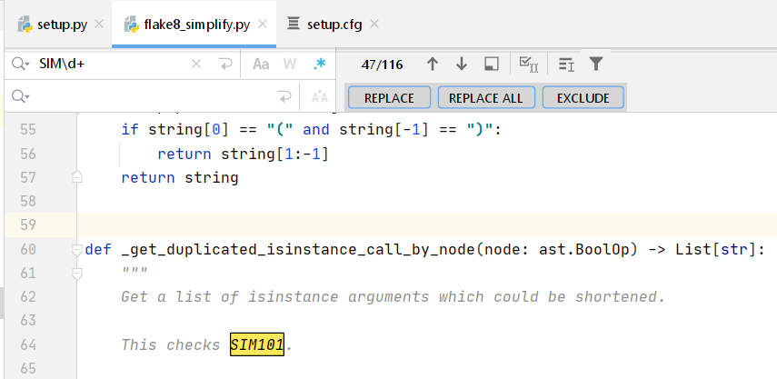
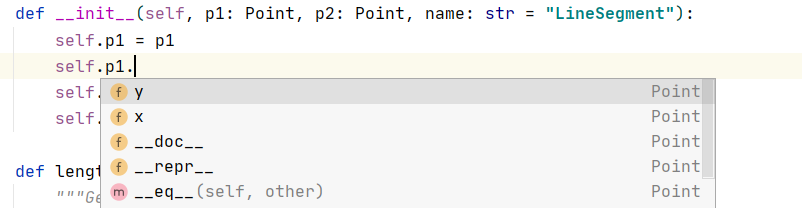
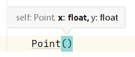
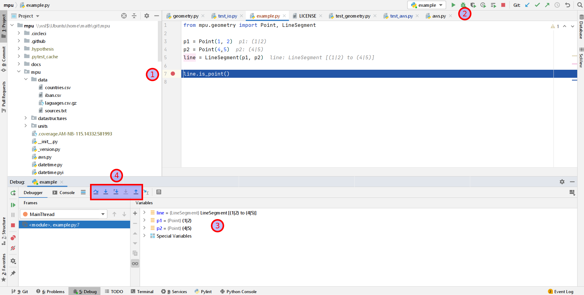
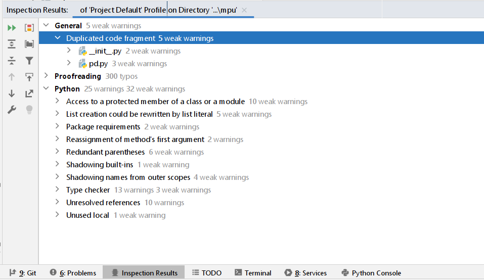

*PyCharm Professional 2020.2. The screenshot was taken by Martin Thoma.*

PyCharm is an IDE developed by JetBrains since 2010. Yes, the same company that developed IntelliJ, the de facto default for Java. It costs **$200 per year**, which is pretty expensive if you are just getting your feet wet with Python. It’s pretty cheap if you consider that the editor/IDE is one of the most important tools of a professional software developer.

It is used by many Python developers as one can see in the number of [Stack Overflow questions](https://stackoverflow.com/questions/tagged/pycharm) (12,455), in the [2019 JetBrains Survey](https://www.jetbrains.com/lp/devecosystem-2019/python/), and the [2019 Stack Overflow survey](https://insights.stackoverflow.com/survey/2019#technology-_-most-popular-development-environments).

## Speed

It takes roughly 9 seconds on my ThinkPad T490s to start. Sublime Text takes less than a second. PyCharm also has this annoying “do you really want to close me” pop-up. When you close it, it automatically saves the document — but the edit history will be gone. This means you cannot use `Ctrl+Z` to undo edits.

When you create a new file, you have to decide first which type it has, which name it has, and where it should be stored. In Sublime Text, you just start typing.

## The User Interface

In the screenshot above, you can see how PyCharm typically looks for me. I say “for me” because PyCharm allows quite a bit of customization. Let’s go through the [components of the UI](https://www.jetbrains.com/help/pycharm/guided-tour-around-the-user-interface.html):

* The **editor** dominates the view. It supports syntax highlighting, shows the line numbers in the **gutter**, and the scroll bar indicates where it found warnings (yellow) and errors (red).

* To the left of the editor, there is a **file explorer**.

* To the right of the editor, there are two minimized elements that are pretty cool: A **database explorer** and the **SciView**. We will come to those later.

* In the footer, there are also minimized elements. I like the **problems** and the **terminal** section.

## Find Action

[Find Action](https://www.jetbrains.com/pycharm/guide/tips/find-action) allows you to search for any menu. No more searching in deeply nested menus. It is similar to the Command Palette in Sublime Text.

If you have the Sublime Text key bindings, you can open the dialog with `Ctrl+Shift+P`. It looks like this:

*The screenshot was taken by Martin Thoma*

In contrast to Sublime Text, PyCharm does not do a fuzzy search here.

## Key bindings: Customizable Shortcuts!

If you go to File → Settings (`Ctrl+Alt+S`) and then to *Keymap*, you can select the defaults of other editors like Sublime Text. This makes a switch pretty easy. You also have a nice interface to set key bindings.

### Tab Interactions

You can close a tab with `Ctrl+W`, create a new file with `Ctrl+N`, and select the previous/next tab with `Ctrl+Page Up` / `Ctrl+Page Down`. I haven’t found a way to jump to the first/second/n-th tab.

### Jump to Line

`Ctrl+G` lets you go to a line. You can even specify the column you want to go to!

### Go to File

`Ctrl+P` lets you go to any file in the workspace. No fuzzy search, though 😢

### Find / Replace All

`Ctrl+F` to find something, `Ctrl+H` to replace. You can also use RegEx! Definitely a feature I don’t want to miss. This is pretty cool in combination with multiple cursors!

*The screenshot was taken by the author.*

### Distraction-Free Mode and Zen Mode

`Shift+F11` switches to [distraction-free mode](https://www.jetbrains.com/help/webstorm/ide-viewing-modes.html). You just see the code. No minimap, no file explorer, no footer. This is helpful if you want to show another developer something. The Zen mode is even better 😃

## Autocompletion

The autocompletion of PyCharm works well. PyCharm obviously makes use of [type annotations](../type-annotations/) 🎉

*PyCharm automatically suggests using one of the attributes of the used class. The screenshot was taken by the author.*

PyCharm also gives you hints when you create a new class or use a function:

*PyCharm tells you that there are two parameters — x and y — expected. It also lets you know that you have to enter the first one now (x is bold) and that it should be a float 😍*

## Jump to Definition

`F12` shows you the usage of the symbol under your cursor and brings you to the declaration of classes, methods, and functions. In contrast to Sublime Text, this works flawlessly in PyCharm.

## Debugging

PyCharm comes with a proper debugger. Have a look at the following image:

*The debugger of PyCharm. Screenshot was taken by Martin Thoma.*

You can set a breakpoint at the line you’re interested in by clicking next to it (1). Then you click on the “debug” icon (2). PyCharm opens a variable explorer (3). Now you can decide if you want to step over / step into / step into my code / step out (4). It’s simple to use, but extremely valuable if you don’t have a clue what is going on.

## Plugins

PyCharm has a [Marketplace](https://plugins.jetbrains.com/pycharm) that offers 2354 plugins. For Python, I like [Rainbow Brackets](https://plugins.jetbrains.com/plugin/10080-rainbow-brackets): If you have multiple brackets after each other, it becomes hard to read them. Rainbow brackets colors the matching brackets to support you.

Please let me know if you have any other plugin you use for Python!

## Code Inspection

PyCharm has various linters for which there is no comparable free [static code analysis tool](../static-code-analysis/). They call this [code inspection](https://www.jetbrains.com/help/pycharm/running-inspections.html#scopes_order).

*Code Inspection within PyCharm.*

Cool rules I’ve noticed are:

* [**Spell checking**](https://www.jetbrains.com/help/pycharm/spellchecking.html): This works astonishingly well. Preventing typos is helpful because you don’t want to force downstream users to use typos, e.g. if your function name was misspelled.

* **Documentation**: PyCharm can check your docstrings against the function signature. This is pretty amazing 😻

In my [example repository mpu](https://github.com/MartinThoma/mpu/commit/7be3a65acafed8bb902d88c4e65064e16397daa0), I had a couple of those. This is a repository where I try hard to follow good practices.

## Database Explorer

The [database tool window](https://www.jetbrains.com/help/pycharm/database-tool-window.html) is a part of PyCharm where I don’t know yet what to think about it. On the one hand, it is useful. On the other hand, I like the Unix philosophy:
> Make each program do one thing well. To do a new job, build afresh rather than complicate old programs by adding new “features”.

There are a couple of programs which fulfil the same purpose:

* [phpMyAdmin](https://en.wikipedia.org/wiki/PhpMyAdmin): For MySQL / MariaDB only
* [SQLite Browser](https://sqlitebrowser.org/): For SQLite only
* [HeidiSQL](https://en.wikipedia.org/wiki/HeidiSQL): MySQL, MariaDB, PostgreSQL, SQLite, Microsoft SQL Server
* [DBeaver](https://en.wikipedia.org/wiki/DBeaver): All databases which have a JDBC or ODBC driver, including MySQL, PostgreSQL, SQLite
* [JetBrains DataGrip](https://www.jetbrains.com/de-de/datagrip/): Pretty much the same as the plugin, I suspect?

## SciView

The [Scientific View](https://www.jetbrains.com/help/pycharm/matplotlib-support.html#sm) is essentially trying to offer the capabilities of a Jupyter Notebook within PyCharm.

More details can be found here:

<iframe width="560" height="315" src="https://www.youtube.com/embed/46RjXawJQgg" frameborder="0" allowfullscreen></iframe>

## 42 more hints

PyCharm can do a lot. Way more than I can show you in this 6-minute article. Give the following video a try:

<iframe width="560" height="315" src="https://www.youtube.com/embed/NoDx0MEESDw" frameborder="0" allowfullscreen></iframe>

## Comparison: Community Edition and Sublime Text

PyCharm's Community Edition is pretty crappy. Don’t even give it a try.

In comparison to Sublime Text, one has to mention the big price difference. You can use Sublime Text pretty well for free. Even if you are super annoyed by the reminder to pay for it, it is still only $70 once for Sublime Text compared to $200 per year for PyCharm.

Sublime Text offers what you need in 90% of your development time. In those cases, it is faster and less cluttered. However, especially the missing debugger might be a deal-breaker for you.

## Summary

PyCharm Professional is an **amazing IDE** for professional Python developers. I love that they have **nice autocompletion**, can **jump to definitions**, and have a working **spell-checker** integrated. The **debugger** is also sometimes super helpful.

On the downside, PyCharm's interface is too cluttered. To me, the editor has too little screen space. The context menus are just crazy huge and the starting time is too long if you just want to edit a small file.

## What’s next?

In this “Python for Beginners” series, we already explained [how to use Python with WSL2 on Windows](../python-development-with-wsl2/), and [how to use Python on Windows with Anaconda](https://medium.com/python-in-plain-english/how-to-start-python-development-on-windows-10-anaconda-edition-cc91c2d57a1d). The editor [Sublime Text](https://medium.com/python-in-plain-english/python-editors-in-review-sublime-text-b71956c32375) was introduced as a good minimal starting point.

This article briefly introduced PyCharm Professional. In a follow-up article, you will see Visual Studio Code. Stay tuned!
