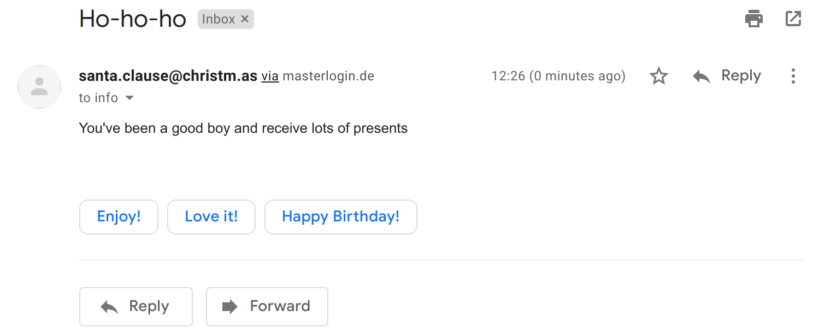
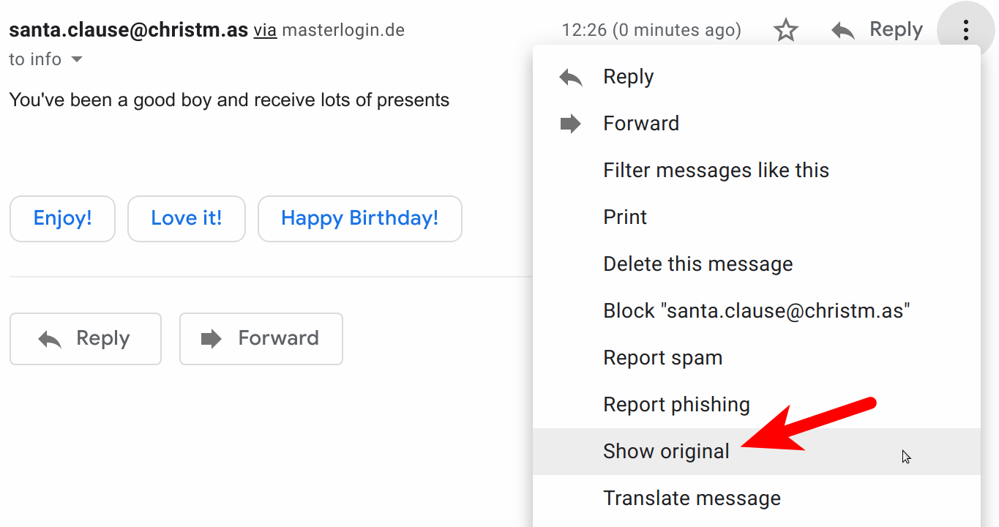
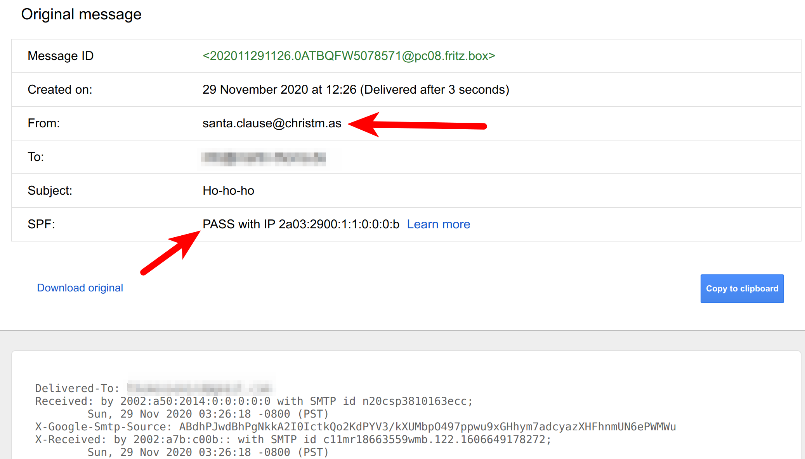

Email spoofing is the creation of emails with a forged sender address. Faking the senders’ address is often a part of a **phishing** attack. There are different ways to fool the victim of a phishing attack about who is the real sender: Using slightly different sender domains like security@paypal.co instead of security@paypal.com , hiding the senders address like in Paypal Security <something@phishy.com> , or spoofing the email address.

## Why it Matters

Business Email Compromise (BEC) is a form of fraud that uses a business email address. There are many examples of this, but they are not well documented. At least not publicly. Some of the bigger ones I’ve found are:

* **2014**: The drug company Upsher-Smith Laboratories lost **$50 million USD** by CEO fraud ([source](https://www.fox9.com/news/ceo-spoofing-costs-drug-company-50-million))
* **2015**: The networking company Ubiquiti Networks lost **$46.7 million USD** to a scammer who impersonated employees ([source](https://www.nbcnews.com/tech/security/ubiquiti-networks-says-it-was-victim-47-million-cyber-scam-n406201))
* “In **2018**, the IC3 received 20,373 BEC/E-mail Account Compromise (EAC) complaints with adjusted losses of over **$1.2 billion**” ([source](https://www.ic3.gov/Media/PDF/AnnualReport/2018_IC3Report.pdf))

## How are Emails spoofed?

Emails are transferred via the [SMTP](https://de.wikipedia.org/wiki/Simple_Mail_Transfer_Protocol) protocol. This protocol has an envelope that contains the sender (**MAIL FROM**) and the recipient (**RCPT TO**). The sender is typically not verified and not displayed. Instead, the content of the mail contains additional metadata. One item there is the **reply-to** and the **sender**. It’s interesting that reply-to and sender are different.

As an attacker, one can manipulate everything. Just like with normal mail:

* Write a wrong MAIL FROM
* Claim within the mail you’re another person (sender)

A key difference here is that typically, a lot is handled in the background.

To make it clear that this is super easy and the attackers are not doing rocket science, here is how an email can be sent with Python:

```python
import smtplib
from email.message import EmailMessage

msg = EmailMessage()
msg.set_content("You've been a good boy")

msg["Subject"] = "Ho-ho-ho"
msg[
    "From"
] = "[santa.clause@christm.as](mailto:santa.clause@christm.as)"  # The fake sender
msg["To"] = "victim@example.com"  # The actual receiver
# msg.add_header("reply-to", "[phishy@phising.com](mailto:phishy@phising.com)")  # The attackers address

# Send the message via our own SMTP server.
# On Ubuntu, you need to install sendmail:
#     $ apt-get install sendmail
s = smtplib.SMTP("localhost")
s.send_message(msg)
s.quit()
```

Which then looks like this in Gmail:

<figure class="wp-caption aligncenter img-thumbnail">
    <a href="../images/2020/12/email-spoofing-gmail-1.png"></a>
    <figcaption class="text-center">Spoofed Email in Gmail</figcaption>
</figure>

When I click on it, I see this:

<figure class="wp-caption aligncenter img-thumbnail">
    <a href="../images/2020/12/email-spoofing-gmail-1-full.png"></a>
    <figcaption class="text-center">Spoofed Email in Gmail - full view</figcaption>
</figure>

Even when I go on the details, I see:

<figure class="wp-caption aligncenter img-thumbnail">
    <a href="../images/2020/12/gmail-show-original.png"></a>
    <figcaption class="text-center">'Show original' in Gmail</figcaption>
</figure>

<figure class="wp-caption aligncenter img-thumbnail">
    <a href="../images/2020/12/gmail-original-mail.png"></a>
    <figcaption class="text-center">Original view of email</figcaption>
</figure>

The attacker might also put a reply-to in the mail:

```python
msg.add_header("reply-to", "phishy@phising.com")
```

The attacker can also add a name to the email address:

```python
from email.utils import formataddr

fake_address = "santa.clause@christm.as"
msg["From"] = formataddr(("Santa Clause", fake_address))
```

Interestingly, that triggered Gmails spam detection:

*Screenshot taken by Martin Thoma*

## How can I prevent Email Spoofing?

* [**SPF**](https://en.wikipedia.org/wiki/Sender_Policy_Framework) (Sender
  Policy Framework), is an email authentication method designed to detect
  forging sender addresses in emails. Domain owners (e.g. me for
  martin-thoma.com) can publish SPF records to DNS. In that record, they
  **whitelist IP addresses** that can send emails for their domain. Email
  servers can then perform an SPF lookup when they receive an email for the
  (claimed) sender's domain. That prevents spammers from using your domains
  **in the email envelope**. When spammers do, the receiving email server
  **can** check the SPF record and either reject the email completely or mark
  it as spam. More information can be found at
  [open-spf.org](http://www.open-spf.org/SPF_Record_Syntax/).
* [**DKIM**](https://en.wikipedia.org/wiki/DomainKeys_Identified_Mail)
  (DomainKeys Identified Mail), is an email authentication method designed to
  detect forged sender addresses in emails. It works by **cryptographically
  signing sent emails** from a given domain. This is not a signature per
  person, but a signature for your organization. The corresponding public key
  is published to the DNS records where email servers that receive those mails
  can get it and verify it. DKIM makes sure that nobody tampered with the email
  after it was sent. Imagine DKIM like a seal. SPF then is the knowledge which
  seal should be used.
* [**DMARC**](https://en.wikipedia.org/wiki/DMARC) (Domain-based Message
  Authentication, Reporting, and Conformance), is an email authentication
  protocol. DMARC uses SPF and DKIM and gives **policies** on how to deal with
  error cases. The domain owner creates a DMARC DNS record that contains
  instructions on what to do with messages that failed the SPF / DKIM test.
  Received emails that failed can on the receiver side either be rejected or
  quarantined. If that happens, DMARC can be configured to send a report back.
  DMARC enforces an **alignment** of the MAIL FROM and the sender. This can be
  problematic for newsletters but represents also what users expect.

As a domain owner, you can validate your SPF record like this:

```bash
$ dig google.com txt | grep spf
google.com.  3600 IN TXT "v=spf1 include:_spf.google.com ~all"
```

To verify DKIM, look in an email you received for this:

```text
DKIM-Signature: v=1; a=rsa-sha256; c=relaxed/relaxed; d=medium.com; \
h=content-type:from:mime-version:reply-to:to:subject:list-unsubscribe; \
s=m1; bh=NY62YFtbfuXkL/SNoiClZV8gaZxkiYhFD4J77gUHGEY=; \
b=EL3HbaL iSgAJsE6LO8L10T52+rYyump4R1aMAV9nCwyXLENaxbS0xgZvksgoplu8Rjo/wWV J0jDEFRe+UsOnIhaCTBXa1H7LVdjkRyOu9+9Qwd7hlWY5fx/mtRQXvWRDfe9KEsS 9WH8o0lRbOAq7AJXPLID/tZokm+KIMmMc/H0=
```

The record is structured in tag=version pairs which are separated by `;`:

* `v`: DKIM **version**
* `a`: The signature **algorithm**, typically rsa-sha256
* `c`: The **canonicalization** algorithm. The first value is for the header, the second one for the body of the email.
* `d`: The used **domain**.
* `h`: The **headers**.
* `s`: The DKIM **selector** record name.
* `b`: The base64 encoded hash value of the headers h .
* `bh`: The hash of the body of the email.

You can look up your DMARC record like this:

```bash
$ dig _dmarc.google.com txt | grep DMARC
_dmarc.google.com. 290 IN TXT "v=DMARC1; p=reject; \
    rua=[mailauth-reports@google.com](mailto:mailauth-reports@google.com)"
```

The record is structured in tag=value pairs which are separated by `;` ([source](https://dmarc.org/overview/)):

* `v`: The protocol **version.**
* `p`: The **policy**. It typically should be reject , but can also be quarantine
* `rua`: The reporting URI for **aggregate reports** (how the domain is used)
* `ruf`: The reporting URI for **forensic reports**
 (showing when validation failed)
* `pct`: How many percent of mails get handled with DMARC. You can set this to an integer from 0 to 100. For the beginning, you can set it low for testing. It should become 100 over time. If you don’t use the tag at all, it’s by default 100%.

## Summary

Spoofing emails is easy.

As a system administrator, you can protect your company by setting an [anti-phishing-policy in Office 365](https://docs.microsoft.com/en-us/microsoft-365/security/office-365-security/set-up-anti-phishing-policies?view=o365-worldwide) or review the [advanced phishing and malware settings of G Suite](https://support.google.com/a/answer/9157861?hl=en).

As a domain owner, make sure you have SPF, DKIM, and DMARC configured correctly to protect your customers or clients.

## What’s next?

In this series about application security (AppSec) we already explained some of the techniques of the attackers 😈 and also techniques of the defenders 😇:

* Part 1: [SQL Injections](https://medium.com/faun/sql-injections-e8bc9a14c95) 😈
* Part 2: [Don’t leak Secrets](https://levelup.gitconnected.com/leaking-secrets-240a3484cb80) 😇
* Part 3: [Cross-Site Scripting (XSS)](https://levelup.gitconnected.com/cross-site-scripting-xss-fd374ce71b2f) 😈
* Part 4: [Password Hashing](https://levelup.gitconnected.com/password-hashing-eb3b97684636) 😇
* Part 5: [ZIP Bombs](https://medium.com/bugbountywriteup/zip-bombs-30337a1b0112) 😈
* Part 6: [CAPTCHA](https://medium.com/plain-and-simple/captcha-500991bd90a3) 😇
* Part 7: [Email Spoofing](https://medium.com/bugbountywriteup/email-spoofing-9da8d33406bf) 😈
* Part 8: [Software Composition Analysis](https://medium.com/python-in-plain-english/software-composition-analysis-sca-7e573214a98e) (SCA) 😇
* Part 9: [XXE attacks](https://medium.com/faun/xxe-attacks-750e91448e8f) 😈
* Part 10: [Effective Access Control](https://levelup.gitconnected.com/effective-access-control-331f883cb0ff) 😇
* Part 11: [DOS via a Billion Laughs](https://medium.com/bugbountywriteup/dos-via-a-billion-laughs-9a79be96e139) 😈

And this is about to come:

* CSRF 😈
* DOS 😈
* Credential Stuffing 😈
* Cryptojacking 😈
* Single-Sign-On 😇
* Two-Factor Authentication 😇
* Backups 😇
* Disk Encryption 😇

Let me know if you are interested in more articles around AppSec / InfoSec!
