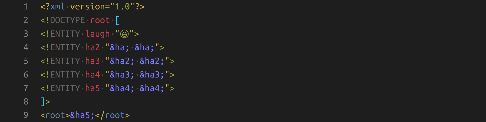

*Image by the author*

The billion laughs attack has been known since 2003 ([source](https://cve.mitre.org/cgi-bin/cvename.cgi?name=CVE-2003-1564)). The attack uses the references in XML files to make a small source file be huge in memory if all references are expanded. It’s also known as a LOL bomb, XML bomb, or in a variation as a YAML bomb and git bomb. It is a type of denial of service (DOS) attack as it can bring a service down.

## Why you should care

This is a bit too specific to be visible in many news articles. However, there are several big projects which were vulnerable over the years:

* 2003: libxml2 was vulnerable ([CVE-2003-1564](https://cve.mitre.org/cgi-bin/cvename.cgi?name=CVE-2003-1564))
* 2015: MediaWiki was vulnerable ([CVE-2015-2942](https://cve.mitre.org/cgi-bin/cvename.cgi?name=CVE-2015-2942))
* 2016: [libxml2](https://en.wikipedia.org/wiki/Libxml2) was vulnerable … again ([CVE-2016-3705](https://cve.mitre.org/cgi-bin/cvename.cgi?name=CVE-2016-3705))
* 2016: HTTP/2 header compression was used to build an HPACK bomb ([CVE-2016-6581](https://nvd.nist.gov/vuln/detail/CVE-2016-6581))
* 2019: Kubernetes was vulnerable ([source](https://github.com/kubernetes/kubernetes/issues/83253), [CVE-2019-11253](https://nvd.nist.gov/vuln/detail/CVE-2019-11253))
* 2019: [c3p0](https://www.mchange.com/projects/c3p0/) (a JDBC connection pool) was vulnerable ([CVE-2019-5427](https://nvd.nist.gov/vuln/detail/CVE-2019-5427))

## How it works

The following XML defines an entity `laugh`, then an entity `ha2` which contains `laugh` twice. This pattern is repeated. This means `ha5` contains `laugh` indirectly 16 times. You can see the exponential growth, can’t you?

```xml
<?xml version="1.0"?>

<!DOCTYPE root [
<!ENTITY laugh "😆">
<!ENTITY ha2 "&laugh; &laugh;">
<!ENTITY ha3 "&ha2; &ha2;">
<!ENTITY ha4 "&ha3; &ha3;">
<!ENTITY ha5 "&ha4; &ha4;">
]>

<root>&ha5;</root>
```

With `ha31`, we would have 2³⁰ times 😆. That is about a billion laughs. Please note how asymmetric this is: With a document that is less than 1 kB in size, the attacker can make the parser consume gigabytes of memory. This can easily consume all memory of a machine and thus render it unusable until the parser is killed or the machine is restarted.

A slight variation of the **billion laughs attack** is called **quadratic blowup**.

Please notice that similar attacks are possible in other file formats such as YAML. The key point here is that those formats have references.

## How can I defend against a billion laughs?

Assuming that you cannot control the input directly and prevent malicious XML documents from reaching you at all, I can think of 4 measures:

* **Lazy evaluation of references**: Instead of evaluating the whole document at once, the references are only resolved when necessary. It might solve some issues.
* **No evaluation of references**: Throwing the dangerous feature out of the window for sure means that you’re not vulnerable to the attack anymore. You need to make sure it doesn’t affect your users, though. Communicating this might be hard.
* **Reference recursion depth limit**: The parser itself could be aware of this issue and have a threshold when it stops evaluating references. However, this might also lead to false positives — documents that don't get parsed because the parser thinks it’s an attack.
* **RAM restriction**: You can run the code that might execute the billion laughs attack under resource restrictions. This means the execution thread/process receives a (catchable) exception and can continue execution normally. It might especially mean that even if the exception is not thrown, the rest of your system might be fine. Only that thread/process might be killed.

So, how do you do this with Python?

The resource restriction is easiest:

```python
import resource
import contextlib


@contextlib.contextmanager
def limit(resource_type, limit):
    """Temporarily limit a resource."""
    soft_limit, hard_limit = resource.getrlimit(resource_type)
    resource.setrlimit(resource_type, (limit, hard_limit))  # set soft limit
    try:
        yield
    finally:
        resource.setrlimit(resource_type, (soft_limit, hard_limit))  # restore


def dangerous_call():
    [i ** 2 for i in range(10 ** 5)]


try:
    with limit(resource.RLIMIT_AS, 2 ** 24):
        dangerous_call()
except MemoryError:
    print("Your call consumed too much memory!")
```

Restricting the parser is sometimes possible, sometimes not. It depends on your
parser. Some have parameters like `resolve_entities`
([lxml](https://lxml.de/api/lxml.etree.XMLParser-class.html)).

Limiting the maximum decompression size was done against the HTTP/2 “HPACK”
bomb
([source](https://python-hyper.org/projects/hpack/en/latest/security/CVE-2016-6581.html#the-solution)).

## See also

Kate Murphy wrote an awesome article about git bombs; check it out:
[Exploding Git Repositories](https://kate.io/blog/git-bomb/)

## More in this series

In this series about application security (AppSec), we already explained some of the techniques of the attackers 😈 and also techniques of the defenders 😇:

* Part 1: [SQL Injections](../sql-injections/) 😈🐝
* Part 2: [Don’t leak Secrets](../leaking-secrets/) 😇
* Part 3: [Cross-Site Scripting (XSS)](../xss/) 😈🐝
* Part 4: [Password Hashing](../password-hashing/) 😇
* Part 5: [ZIP Bombs](../zip-bombs/) 😈
* Part 6: [CAPTCHA](../captcha/) 😇
* Part 7: [Email Spoofing](../email-spoofing/) 😈
* Part 8: [Software Composition Analysis](../sca/) (SCA) 😇
* Part 9: [XXE attacks](../xxe-attacks/) 😈🐝
* Part 10: [Effective Access Control](../effective-access-control/) 😇
* Part 11: **DOS via a Billion Laughs** 😈
* Part 12: [Full Disk Encryption](../full-disk-encryption/) 😇
* Part 13: [Insecure Deserialization](../insecure-deserialization/) 😈🐝
* Part 14: [Docker Security](../docker-security/) 😇
* Part 15: [Credential Stuffing](../credential-stuffing/) 😈🐝
* Part 16: [Multi-Factor Authentication](../multi-factor-authentication/) (MFA/2FA) 😇
* Part 17: [ReDoS](../redos/) 😈

The following articles are about to come:

* Part 18: Secure Messaging 😇
* Part 19: Cryptojacking 😈
* Part 20: Backups 😇
* Part 21: Cryptotrojans 😈
* Part 22: Single-Sign-On 😇
* Part 23: Clipboard Hijacking 😈
* Part 24: Certificates 😇
* Part 25: Race Condition Attacks in Blockchains 😈
* Part 26: Mobile Device Management (MDM) 😇
* Part 27: Server-Side Request Forgery (SSRF) 😈
* Part 28: Network Separation 😇
* Part 29: Social Engineering (including Phishing) 😈
* Part 30: Virtual Private Networks (VPNs) 😇
* Part 31: CSRF 😈

Let me know if you are interested in more articles around AppSec / InfoSec!
