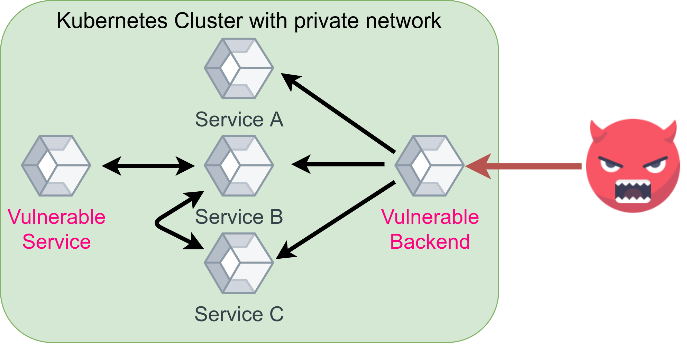

 on [Unsplash](https://unsplash.com)](../images/2021/02/docker-security-1.jpg)*Photo by [Andrey Sharpilo](https://unsplash.com/@sharpiloa) on [Unsplash](https://unsplash.com)*

Most companies I have seen deploy Docker images in at least one project or service. Docker is great because it makes stuff reproducible by specifying the environment to a big degree. However, you still have to think about security. Let’s have a closer look!

## Host Security

All Docker containers run on a host system. The host needs to be secure AND the container needs to be secure.

There are various vulnerability scanning, auditing, and hardening tools for Linux systems:

* [Lynis](https://cisofy.com/lynis/): Execute `sudo apt-get install lynis && sudo lynis audit system`, wait for a couple of minutes, and you get a pretty nice report indicating what you can do to harden your system.
* [SELinux](https://en.wikipedia.org/wiki/Security-Enhanced_Linux): Provides Mandatory Access Control (MAC) as a kernel module. Thomas Cameron gave an [introduction to SELinux](https://www.youtube.com/watch?v=_WOKRaM-HI4). The key point for SELinux and AppArmor is the access control policy. Linux, by default, uses Discretionary Access Control (DAC). SELinux and AppArmor enforce MAC. [Learn more about the differences](../effective-access-control/). Luc Juggery gave a nice introduction to [SELinux & Docker](https://medium.com/lucjuggery/docker-selinux-30-000-foot-view-30f6ef7f621).
* [AppArmor](https://en.wikipedia.org/wiki/AppArmor): Provides MAC as a service. It distinguishes unconfined and confined processes. It ignores unconfined processes. Confined processes may only do what they are allowed to do according to the AppArmor profile of that process. [Seth Arnold](http://sarnold.org/resume/sarnold.html) gave a nice talk about [AppArmor 3.0](https://www.youtube.com/watch?v=PRZ59lxLlOY). Again, Luc Juggery wrote a hands-on guide for [AppArmor & Docker](https://medium.com/lucjuggery/docker-apparmor-30-000-foot-view-60c5a5deb7b).
* Docker Daemon: Run the daemon as a non-privileged user. Especially not as root.

You should run regular checks against vulnerability databases. If they find an
issue, you need an effective way to get notified, e.g. by posting to a Slack
channel.

You could also use an OS that is optimized for containers, e.g. [Google's
Container-Optimized OS](https://cloud.google.com/container-optimized-os)
(COS).

There are many more things to say about the host system, but that is not the
focus of this article. If you’re interested, I’ll write a follow-up 🙂

## Base Image

The base image is the foundation of your Docker image. Within your Dockerfile,
you define the base image with `FROM`. For me, it typically is
[python:3.8.7-slim-buster](https://hub.docker.com/_/python) or similar. You
need to ask yourself:

* Do I trust the base image’s author to have good intentions?
* Do I trust the base image’s author to have a secure development setup so that malware isn’t uploaded unintentionally, e.g. by leaking the credentials to the account or password re-use?

You should also scan your base image for vulnerabilities. Even for very
standard images, there are often vulnerabilities. Some can be fixed by
directly running an update (e.g. `RUN apt-get update && apt-get upgrade`),
others don’t have an update within the repository. But pretty often you also
don’t need all the installed stuff.

Be aware that Alpine only shares vulnerabilities that they have already
fixed. So the scan might look better for them, although they are not better.
Alpine images are smaller, though. So the attack surface is smaller.

## Harden Your Image

Hardening is the process of reducing the attack surface or increasing the
difficulty to find and use existing vulnerabilities. It reduces the blast radius
any ticking bomb in your system could have.

### Copy only necessary files

You can use the
[.dockerignore](https://docs.docker.com/engine/reference/builder/#dockerignore-file)
file to make sure that some files are not added.

### Run as a non-privileged user in the container

By default, the code you execute within a Docker container runs with the user
ID 0 — with root. It is recommended not to do that. You can change that in
multiple ways:

Within the Dockerfile — I prefer that one:

```dockerfile
RUN groupadd -r noroot && useradd -r -g noroot noroot
USER noroot
```

When you start the container:

```bash
$ docker run -u 1000 -it python:3.9.1-buster bash
I have no name!@a70ba4f24042:/$ echo $UID
1000
```

In Kubernetes via `runAsUser` in the `securityContext`
([docs](https://kubernetes.io/docs/tasks/configure-pod-container/security-context/)).

### Multi-Stage Builds

If an attacker gets access to your container, you want them to have as few tools there as possible. Use [multi-stage builds](https://docs.docker.com/develop/develop-images/multistage-build/) for that. Build your code in a build-container and use the built artifact in another container. As a bonus, your image size will be smaller.

The [Docker docs](https://docs.docker.com/develop/develop-images/multistage-build/) give a very good example:

```dockerfile
FROM golang:1.7.3
WORKDIR /go/src/github.com/alexellis/href-counter/
RUN go get -d -v golang.org/x/net/html
COPY app.go .
RUN CGO_ENABLED=0 GOOS=linux go build -a -installsuffix cgo -o app .

FROM alpine:latest
RUN apk --no-cache add ca-certificates
WORKDIR /root/
COPY --from=0 /go/src/github.com/alexellis/href-counter/app .
CMD ["./app"]
```

## Harden Your Containers

### Read-Only Root File System

This depends on how you run the Docker image, but if you use `docker run`, you can add the [--read-only flag](https://docs.docker.com/engine/reference/commandline/run/). This makes the root file system read-only. This means that if an attacker gets into the system, they cannot store anything on disk or change any of the executables. They can still change the memory.

You should also be aware that some pretty standard tasks like creating a temporary file obviously don’t work anymore:

```bash
$ sudo docker run -it --read-only python:3.9.1-buster
Python 3.9.1 (default, Jan 12 2021, 16:45:25)
[GCC 8.3.0] on linux
Type "help", "copyright", "credits" or "license" for more information.
>>> import tempfile
>>> a = tempfile.mkdtemp()
Traceback (most recent call last):
  File "<stdin>", line 1, in <module>
  File "/usr/local/lib/python3.9/tempfile.py", line 348, in mkdtemp
    prefix, suffix, dir, output_type = _sanitize_params(prefix, suffix, dir)
  File "/usr/local/lib/python3.9/tempfile.py", line 118, in _sanitize_params
    dir = gettempdir()
  File "/usr/local/lib/python3.9/tempfile.py", line 287, in gettempdir
    tempdir = _get_default_tempdir()
  File "/usr/local/lib/python3.9/tempfile.py", line 219, in _get_default_tempdir
    raise FileNotFoundError(_errno.ENOENT,
FileNotFoundError: [Errno 2] No usable temporary directory found in ['/tmp', '/var/tmp', '/usr/tmp', '/']
```

You can work around this issue by mounting /tmp as a volume:

```bash
$ sudo docker run -it --mount source=myvol2,target=/tmp --read-only python:3.9.1-buster
Python 3.9.1 (default, Jan 12 2021, 16:45:25)
[GCC 8.3.0] on linux
Type "help", "copyright", "credits" or "license" for more information.
>>> import tempfile; a = tempfile.mkdtemp()


$ sudo docker run --rm -i -v=myvol2:/tmp/v busybox find /tmp/v
/tmp/v
/tmp/v/tmpbhw8djco
```

Even better is using a tmpfs mount (an in-memory file system):

```bash
$ sudo docker run -it --tmpfs /tmp --read-only python:3.9.1-buster
```

### Limit Capabilities

You can limit the [Linux kernel capabilities](https://man7.org/linux/man-pages/man7/capabilities.7.html):

```bash
$ docker run --cap-drop all -it python:3.9.1-buster bash
root@3c568219116e:/# groupadd -r noroot
groupadd: failure while writing changes to /etc/gshadow
```

You can then grant the ones your application needs:

```bash
$ docker run --cap-drop all --cap-add CHOWN -it python:3.9.1-buster bash
root@3c568219116e:/# groupadd -r noroot
groupadd: failure while writing changes to /etc/gshadow
```

In Kubernetes, this is done via `capabilities` in the `securityContext`
([docs](https://kubernetes.io/docs/tasks/configure-pod-container/security-context/)).

### no-new-privileges

You might want to always set `--security-opt=no-new-privileges`. It prevents
container processes from gaining new privileges
([docs](https://docs.docker.com/engine/reference/run/#security-configuration)).
In Kubernetes, this is called `allowPrivilegeEscalation`
([docs](https://kubernetes.io/docs/tasks/configure-pod-container/security-context/)).

### Scanning for vulnerabilities

[Clair](https://github.com/quay/clair) by quay seems to be a commonly used
tool to scan containers for vulnerabilities. I haven’t used it so far,
though.

## Inter-Container Communication

A key thought of “defense in depth” is to make every single step as hard as
possible for an attacker. If something is not strictly necessary for the
application to run, it is not allowed. Restricting the way the containers
communicate with other containers is one part of that.

*Scenario how an attacker is blocked by a controlled network communication / inter container communication. Image by Martin Thoma*

Most companies have a lot of different microservices running in containers.
Some of the containers need to communicate, others don’t need it. Maybe two
have vulnerabilities as shown in the image above. The backend has a
vulnerability that allows the attacker to get into the container and another
service might suffer from the same issue. But there is no direct way the
attacker can communicate with the other vulnerable service and thus harm is
prevented.

Have a look at [Docker container
networking](https://docs.docker.com/config/containers/container-networking/)
or [Kubernetes network
policies](https://kubernetes.io/docs/concepts/services-networking/network-policies/).

## Conclusion

Container Security is an extremely broad field. The [NIST Application
Container Security
Guide](https://www.nist.gov/publications/application-container-security-guide)
is way more extensive than this article; the [OWASP Docker Cheat
Sheet](https://cheatsheetseries.owasp.org/cheatsheets/Docker_Security_Cheat_Sheet.html)
is of similar length. Tsvi Korren gave a pretty good presentation about container
security:

<center><iframe width="560" height="315" src="https://www.youtube.com/embed/_5uZnM1yv0Y" frameborder="0" allowfullscreen></iframe></center>

In security, it is hard to recommend what to do. For maximum security, you want to do everything. But a very short and actionable guide would be:

* Make sure you use a well-known, trusted, maintained base image.
* Install only software you need, copy only files you use. Try multi-stage builds if you need software to build the software.
* Use a non-root user.
* Restrict privileges / inter-container communication.
* Use a read-only file system.
* Get a workflow that automatically scans for vulnerabilities and alerts you if anything new was found.

## More in this series

In this series about application security (AppSec), we already explained some of the techniques of the attackers 😈 and also techniques of the defenders 😇:

* Part 1: [SQL Injections](../sql-injections/) 😈🐝
* Part 2: [Don’t leak Secrets](../leaking-secrets/) 😇
* Part 3: [Cross-Site Scripting (XSS)](../xss/) 😈🐝
* Part 4: [Password Hashing](../password-hashing/) 😇
* Part 5: [ZIP Bombs](../zip-bombs/) 😈
* Part 6: [CAPTCHA](../captcha/) 😇
* Part 7: [Email Spoofing](../email-spoofing/) 😈
* Part 8: [Software Composition Analysis](../sca/) (SCA) 😇
* Part 9: [XXE attacks](../xxe-attacks/) 😈🐝
* Part 10: [Effective Access Control](../effective-access-control/) 😇
* Part 11: [DOS via a Billion Laughs](../billion-laughs-dos/) 😈
* Part 12: [Full Disk Encryption](../full-disk-encryption/) 😇
* Part 13: [Insecure Deserialization](../insecure-deserialization/) 😈🐝
* Part 14: **Docker Security** 😇
* Part 15: [Credential Stuffing](../credential-stuffing/) 😈🐝
* Part 16: [Multi-Factor Authentication](../multi-factor-authentication/) (MFA/2FA) 😇
* Part 17: [ReDoS](../redos/) 😈

The following articles are about to come:

* Part 18: Secure Messaging 😇
* Part 19: Cryptojacking 😈
* Part 20: Backups 😇
* Part 21: Cryptotrojans 😈
* Part 22: Single-Sign-On 😇
* Part 23: Clipboard Hijacking 😈
* Part 24: Certificates 😇
* Part 25: Race Condition Attacks in Blockchains 😈
* Part 26: Mobile Device Management (MDM) 😇
* Part 27: Server-Side Request Forgery (SSRF) 😈
* Part 28: Network Separation 😇
* Part 29: Social Engineering (including Phishing) 😈
* Part 30: Virtual Private Networks (VPNs) 😇
* Part 31: CSRF 😈

Let me know if you are interested in more articles around AppSec / InfoSec!
