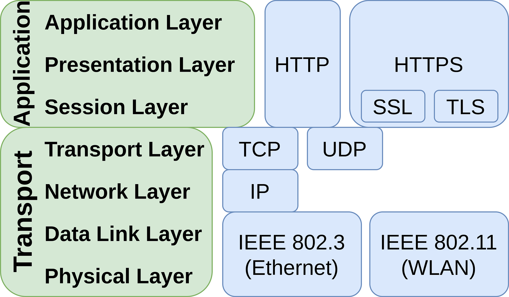

*Image by Martin Thoma*

HTTPS, SSL, and TLS are all related to encrypted (“secure”) internet connections. The problem they solve is that a [man in the middle](https://en.wikipedia.org/wiki/Man-in-the-middle_attack) could read the data you receive or send. It is clearly an issue when you log in to your bank or when you send messages via Twitter / Facebook that should be private. Similarly, you might not want people to know what you are interested in or what you don’t know when you use Wikipedia.

[**SSL**](https://en.wikipedia.org/wiki/Transport_Layer_Security#SSL_1.0,_2.0,_and_3.0) is short for Secure Sockets Layer. It was released in 1995 in version 2. The latest version, SSL 3, was deprecated in 2015 in favor of TLS.

[**TLS**](https://en.wikipedia.org/wiki/Transport_Layer_Security) is short for Transport Layer Security and can be seen as the successor of SSL.

Both SSL and TLS are encryption protocols that HTTP (and other protocols) can run on top of.

[**HTTPS**](https://en.wikipedia.org/wiki/HTTPS) is short for Hypertext Transfer Protocol Secure. It can also be called “**HTTP over TLS”** or **“HTTP over SSL”**, depending on which protocol you use for encryption.

Protocols on the internet are working on top of each other. You’re not using only one protocol at a time, but many simultaneously. You can use the guarantees they give on the higher levels.
