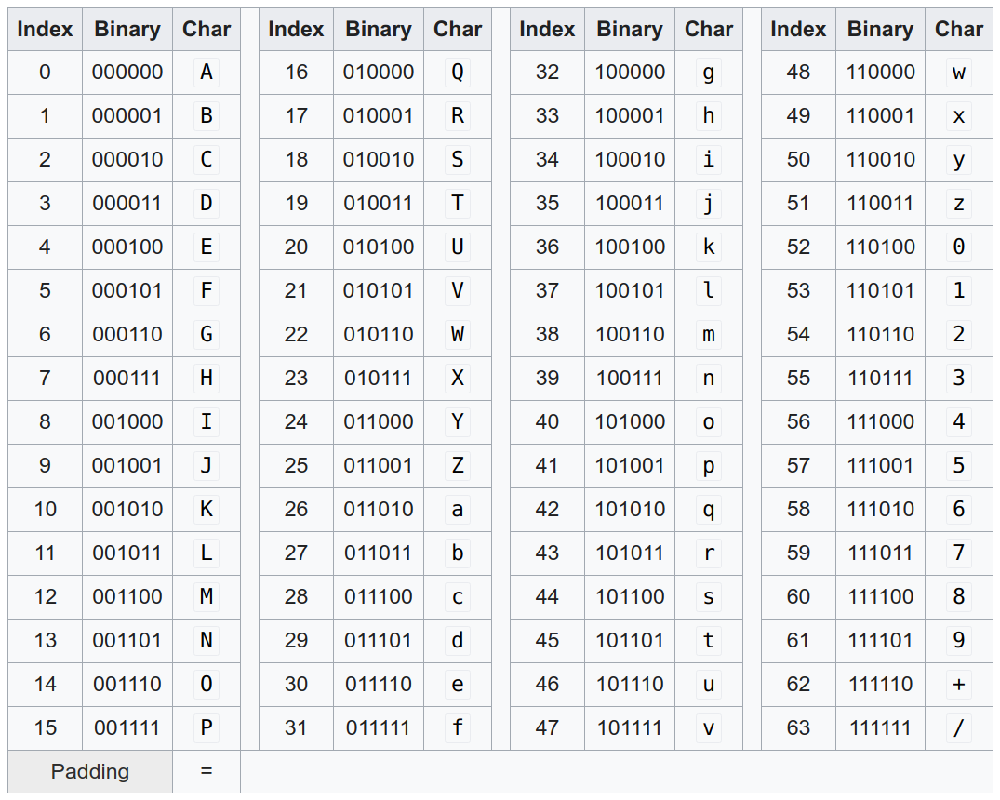

**Encryption is about keeping a secret** and being able to restore it. **Hashing is about fingerprinting** — you don’t need to restore the original, but you need to make sure it is identical. **Encoding is about data representation to enable information exchange**. Encoding does not involve keeping secrets.

This was my Twitter-length explanation. Let’s dive into details!

## Encoding

 on [Unsplash](https://unsplash.com)](../images/2021/02/encryption-vs-encoding-vs-hashing-1.jpg)*Photo by [Quino Al](https://unsplash.com/@quinoal) on [Unsplash](https://unsplash.com)*

Encoding is about data representation. For example, for icons on the web, we prefer not to store image files but have them directly on the web page. This prevents the client from creating many HTTP requests for little data.

But then the binary data of the image has to be converted to text data. A common way to do that is [base64 encoding](https://en.wikipedia.org/wiki/Base64).



As you can see, the “translation” is trivial: We build 6-bit blocks of the binary data and look up the character in the table above. It’s called base64 because there are 2⁶ = 64 digits. Hence it can be interpreted as a [number base conversion](https://en.wikipedia.org/wiki/Positional_notation#Base_conversion).

Please note that this does not keep the content secret. Base64 does not use a secret key. Hence it is not encryption.

Character encodings are also extremely common. They map an integer to a character. The three which I stumble over most often are UTF-8, ASCII, and Latin-1.

## Encryption

 on [Unsplash](https://unsplash.com)](../images/2021/02/encryption-vs-encoding-vs-hashing-3.jpg)*Photo by [Mauro Sbicego](https://unsplash.com/@maurosbicego) on [Unsplash](https://unsplash.com)*

Encryption is about keeping secrets. You don’t want to keep the method how you encrypt and decrypt secret. Instead, you should have a secret key that is necessary to decrypt. This is called Kerckhoffs’s principle.

Mathematically speaking, you have two functions:

```text
encrypt(plain text, key) -> cipher text
decrypt(cipher text, key) -> plain text
```

This is called a symmetric-key algorithm as you use the same key for encrypting and for decrypting. There are asymmetric-key algorithms as well, but this would go too far.

A very early scheme to encrypt was to use a natural sentence as a key to encrypt single characters. If the sentence happens to have one character multiple times, the second and following characters are deleted:

```text
Sentence   : The quick brown fox jumps
Derived key: the quickbrownfxjmpsadglvyz
```

Then you translate character by character:

```text
Original     : the quickbrownfxjmpsadglvyz
Translates to: abcdefghijklmnopqrstuvwxyz
```

Note that “space” translates to “d” and “z” translates to “space”.

Putting it all together, the message `secret` translates to `tchkca`.

In Python, it looks like this:

```python
alphabet = "".join(chr(ord("a") + i) for i in range(26))


def derive_key(sentence: str) -> str:
    key = ""
    sentence = sentence.lower()
    for letter in sentence + "".join(alphabet):
        if letter not in key:
            key += letter
    return key


def encrypt(plain_text: str, key: str) -> str:
    mapping = {
        plain_char: cipher_char for plain_char, cipher_char in zip(key, alphabet)
    }
    return "".join(mapping[plain_char] for plain_char in plain_text)


def decrypt(cipher_text: str, key: str) -> str:
    mapping = {
        cipher_char: plain_char for plain_char, cipher_char in zip(key, alphabet)
    }
    return "".join(mapping[cipher_char] for cipher_char in cipher_text)


if __name__ == "__main__":
    sentence = "The quick brown fox jumps"
    key = derive_key(sentence)
    print(f"key: {key}")

    plain_text = "secret"
    cipher_text = encrypt(plain_text, key)
    print(f"cipher_text: {cipher_text}")

    recovered_plain = decrypt(cipher_text, key)
    print(f"recovered_plain: {recovered_plain}")
```

Modern encryption algorithms are a bit more complicated. The state of the art is AES — the [Advanced Encryption Standard](https://en.wikipedia.org/wiki/Advanced_Encryption_Standard). Notable mentions are Twofish, Serpent, [SM4](https://en.wikipedia.org/wiki/SM4_(cipher)), and [SEED](https://en.wikipedia.org/wiki/SEED).

## Hashing

 on [Unsplash](https://unsplash.com)](../images/2021/02/encryption-vs-encoding-vs-hashing-4.jpg)*Photo by [Immo Wegmann](https://unsplash.com/@macroman) on [Unsplash](https://unsplash.com)*

Hashing is about fingerprinting. You want to be able to uniquely identify a list of bytes (e.g. a string or a file), but you don’t want to store it. You either don’t need to be able to go back to the original or you don’t even want it. Just like with a fingerprint: You can take two fingerprints and conclude that they belong to the same person. But given only one fingerprint, you cannot reconstruct that person.

I wrote an article that explains in detail why this loss of information is desired:
[**Password Hashing 😇**
*Prepare to get hacked*](../password-hashing/)

But there are several other applications of hash functions as well:
[**The 3 Applications of Hash Functions**
*What they are, what the options are, and why they matter*](../3-applications-of-hash-functions/)

State-of-the-art hash functions are SHA-256 or SHA-512.
