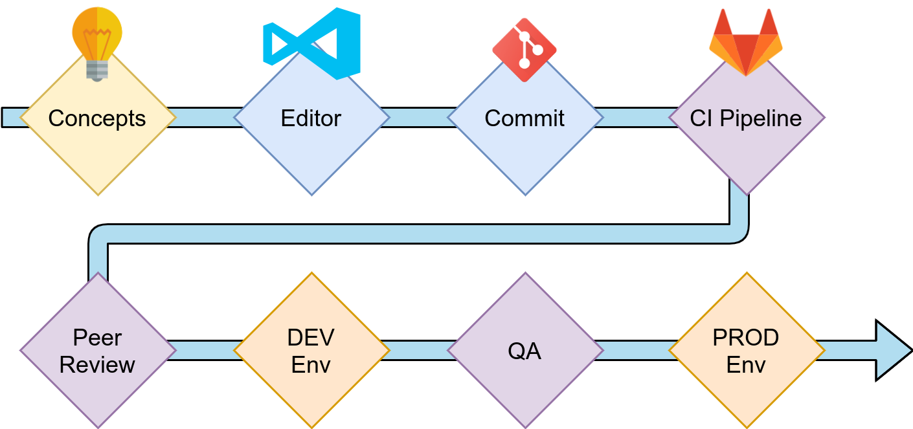
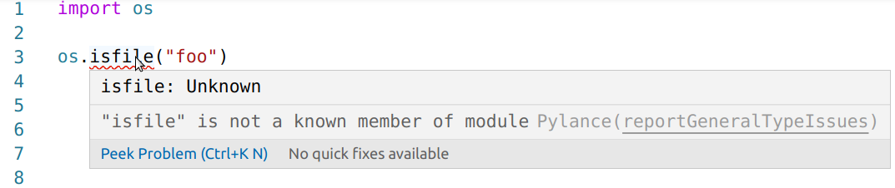
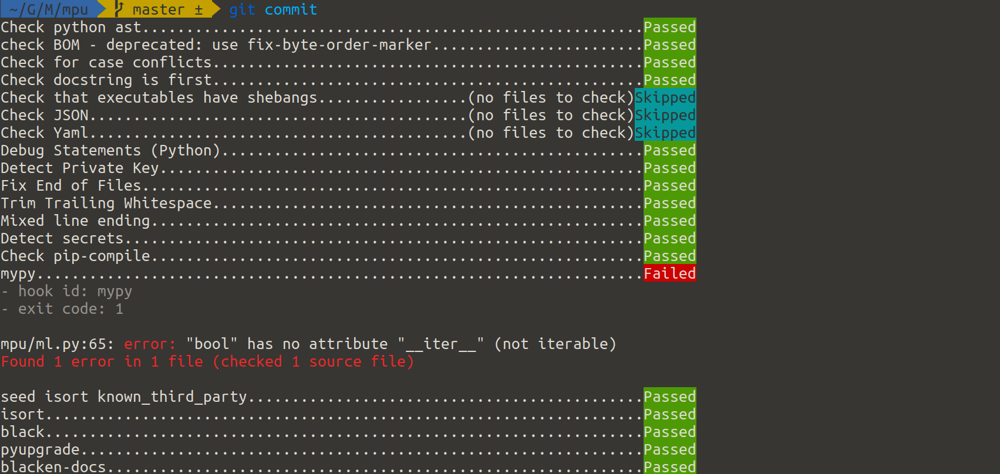
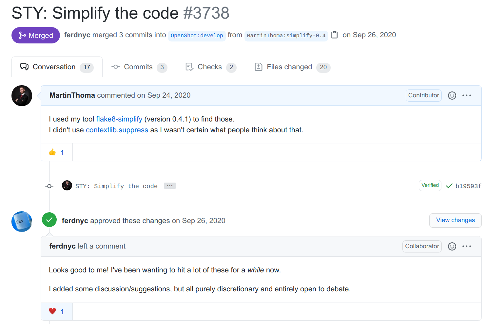

*Image by Martin Thoma*

The quicker you spot mistakes, the easier it is to fix them. This is the whole
idea of “shift left”. When you are getting a call from your boss or the
support team that “it doesn’t work”, you know that this will take a while to
even identify where the problem is. Most non-developers have a hard time
communicating issues to developers. And we should make sure that they don’t
have to bother to learn this skill.

In this article, you’ll learn strategies to catch errors in different
development phases. At the very end, I’ll also point out what others typically
mean by “shift left”. Let’s start!

## Conceptual Phase: Planning and Design

 on [Unsplash](https://unsplash.com?utm_source=medium&utm_medium=referral)](../images/2021/02/shift-left-2.jpg)*Photo by [Kelly Sikkema](https://unsplash.com/@kellysikkema?utm_source=medium&utm_medium=referral) on [Unsplash](https://unsplash.com?utm_source=medium&utm_medium=referral)*

Before developers start implementing a difficult feature, people typically
need to discuss the feature. The people to approach could be product owners or
product managers, the client, different development teams (front end, back
end, Android, iOS, …), operational teams, marketing, …

In order to communicate the idea, you can create two types of documents:

* **Product design document**: Which problem of the user does the new feature
  solve? How will the user be impacted?
* **Engineering design document**: What does the feature require? Which
  sub-systems need to be developed, how many requests need to be served, where
  is a lot of data stored/processed/sent? What is computationally expensive?
  How does the idea scale overall?

On a smaller level, if the features are not that big, you can put those two
perspectives in your tickets/stories (e.g. Jira).

To communicate ideas either in the documents or tickets, you can use plenty of
techniques:

* **Wireframes**: I love wireframes. [Balsamiq](https://balsamiq.com/) is my
  tool of choice here, but there are certainly many more. The point of it is
  not to have a finished design. The point is to give a rough idea of which
  elements might be necessary. It’s an advantage if they clearly look like
  mocks.
* **User stories**: To make sure that you look at it from a user's
  perspective, you can create personas and tell a story of how that persona
  uses the software or the feature you’re developing.
* **Sequence diagrams**: What happens when? Who communicates in which way? A
  sequence diagram can in some cases be super helpful. I like
  [websequencediagrams.com](https://www.websequencediagrams.com/) to create
  them.
* **Architecture diagrams**: Showing which microservices you use, which
  databases or caches are in place, which kinds of devices access the
  software, if you have a task queue — all of this helps a lot to get a first
  overview. I typically use [draw.io](https://app.diagrams.net/) for it.
* **Database schema diagrams**: Showing the tables of a relational database
  tells me a lot about how a system works. When I create smaller web services,
  I typically create a database schema diagram with the “Designer” feature of
  phpMyAdmin — even if I don’t use MySQL. I just like the designer 😅 Please
  let me know if you have an easier tool for that.

Now, how does this prevent you from making mistakes?

The image search with “architecture fail” gives you some ideas
([1](https://www.pinterest.de/pin/550213279445067754/),
[2](https://www.pinterest.de/pin/AU1UDUS-wlPeLaIwDqQdtpWHVSMzk3Tw3_aYUHhiJfHMC4uxjB-MZs4/),
[3](https://www.demilked.com/funny-architectural-nightmares/)):

<iframe src="https://medium.com/media/0dc33aabfe51cbcd601aa6d10c988c29" frameborder=0></iframe>

The mistakes now seem blatantly obvious, but in between nobody noticed them.
So either there was nobody checking or there was no good concept to actually
see that there is an issue. The two design documents help you to make the
mistakes obvious.

## Implementation Phase: Your Editor

*Image by Martin Thoma*

I have been a software developer for more than 15 years now. I still make stupid
mistakes like forgetting that it’s `os.path.isfile` and not `os.isfile`. Luckily,
we don’t need to remember all of the nitty-gritty details. Editors and IDEs do
a lot for us. They can warn us if we use a variable we didn’t declare in that
scope. They can tell us that we created a variable we didn’t use. They can
show us type-checking errors while we write.

I absolutely love Visual Studio Code for Python development:
[**Visual Studio Code — Python Editors in Review**
*I think I fell in love*](../visual-studio-code/)

But there are many other excellent editors for Python like
[PyCharm](../pycharm/)
or [Sublime
Text](https://py.plainenglish.io/python-editors-in-review-sublime-text-b71956c32375).
Some people also have strong opinions on vim/emacs and they certainly can
support you in exactly the same way.

The point here is not to take a specific editor. The point is to make sure
that you have one that works well for you. And hopefully captures the types of
mistakes you typically make.

*Image by Martin Thoma*

## Implementation: Commit

I sometimes do commits in a different editor, sometimes I miss an editor
warning. Luckily, there is another safety line: pre-commit hooks.

Pre-commit hooks are scripts that are executed before you commit a change.
They can do arbitrary changes and they can abort a commit. In combination with
the Python package [pre-commit](https://pre-commit.com/) they are
extraordinarily convenient. You can pick from a large range of tools to be
executed — and it doesn’t even have to be Python. I’ve created some on my own.
If you want to learn more about pre-commit, I’ve got you covered:
[**Pre-commit hooks you must know** *Boost your productivity and code quality
in 5
minutes*](../pre-commit-hooks/)

## Implementation: CI-Pipeline

A Continuous Integration pipeline (CI pipeline) is code that is executed
automatically when you push your changes. They are extremely useful for open
source projects to ensure the same thorough level of quality for every merge
request. You can execute unit tests to prevent regressions, you can execute
linting to ensure that code style rules are followed, code complexity checks
might point developers to sections that are hard to read. Type checking,
static application security testing (SAST), checking your 3rd party packages
for vulnerabilities, and license compatibility (SCA) are things you might want
to consider integrating. [**CI Pipelines for Python Projects** *What is a
Continuous Integration Pipeline and how can I use
it?*](../ci-pipelines/)

## Testing: Code Review

Code Reviews, peer reviews, and the [two-man
rule](https://en.wikipedia.org/wiki/Two-man_rule) all follow the same idea: A
single person might miss something that another person sees. Sometimes you’re
so deep into a topic that you don't see obvious flaws. Peer reviews are a way
to share knowledge and they can also work if a less-experienced developer
reviews something of a senior developer. A good merge request (or pull
request) does exactly one thing and contains some context why it is proposed.

On GitHub, it looks [like this](https://github.com/OpenShot/openshot-qt/pull/3738):

*Image by Martin Thoma*

You can see how many commits were done, talk with the person who proposed the
change, ask questions, see the automatic checks of the CI pipeline, inspect
every single change.

## Testing: Non-Prod Environments

The more complex your software becomes, the more services need to speak with
each other, the more you REALLY don’t want to deploy changes directly to your
production environment. You want to have an environment that is almost
identical to the production system, but no customer is affected if you break
something. Those environments are typically called DEV or INTEGRATION or
STAGING. Here you can deploy changes directly when they passed the CI Pipeline
and the review. They integrate all other services that might be needed to
properly test your software.

## Testing: Production

It is not possible to test everything. Especially user behavior and acceptance
are hard and expensive to test without releasing the software to real users.
At some point, you have to release the change. But you can be smart about it.
You can first release it to a group that is not so important to you. Maybe you
first activate the change for your own employees. Or maybe there is a complete
country that is less relevant to your business. I’ve heard that Facebook first
deploys new features to Brazil to test if they are working before they go live
in the US. I might mix up something as I cannot find a reference, though.

This procedure is called “canary release” or “canary testing”. To quote [Danilo Sato](https://martinfowler.com/bliki/CanaryRelease.html):

> **Canary release** is a technique to reduce the risk of introducing a new software version in production by slowly rolling out the change to a small subset of users before rolling it out to the entire infrastructure and making it available to everybody.

Of course, that only works if you have a certain scale. But releasing often
and releasing smaller changes is a good idea.

## Now … what do others say?

When I read about shift-left and the different phases you have (from
right to left) it sounded very much like a waterfall approach. The authors
probably didn’t intend that, but that is what I read when I only see “project
phases” like (1) Requirements (2) Design (3) Code (4) Test (5) Acceptance (6)
Production (7) Maintenance. Most documents focus on where the error appears,
but I focused on how you can prevent it. Most articles seem to take a
management perspective, but I have a developer's perspective.

## What you have learned

You have seen examples of 7 stages of testing before your awesome new feature hits the end customer:

1. Strategies to communicate ideas internally
2. How the editor can prevent typos and other stupid mistakes
3. Pre-commit hooks — might prevent you from [leaking secrets](../leaking-secrets/)
4. Enforcing code quality with a CI pipeline
5. Value your peers; support them by thorough reviews
6. Non-Prod environments are necessary if you have many interacting services
7. Canary releases are pretty cool if you’re big enough

Now write some high-quality awesome stuff!
