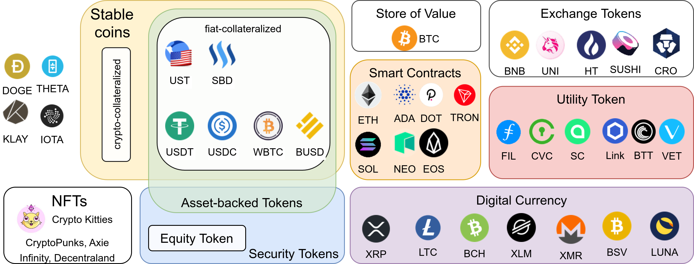

<figure class="wp-caption aligncenter img-thumbnail">
    
    <figcaption class="text-center">Cryptocurrency Types in Overview</figcaption>
</figure>
*Categorization of the top 30 cryptocurrencies + some chosen ones. Image by Martin Thoma*

The crypto ecosystem grew rapidly in the past years — so rapid, that it’s hard
for outsiders to even understand the various use-cases in that space. After
reading this article, you should have some mental models to compare the latest
blockchain projects. Let’s go!

## Coins vs Tokens: A technical distinction

**Coins** are assets on their native blockchain, whereas **tokens** are assets
foreign to the blockchain they live on. Examples for coins are Bitcoin on the
Bitcoin blockchain and Ether on the Ethereum blockchain. Examples for tokens
are Tether as a second-layer token on multiple blockchains; Uniswaps “UNI”
token and Chainlinks “LINK” token use the Ethereum blockchain. Building tokens
on top of Ethereum is super popular; most are so-called [ERC20
tokens](https://ethereum.org/en/developers/docs/standards/tokens/erc-20/).

Please note that in some conversations, articles, and videos the two terms are
used interchangeably.

While the distinction between coins and tokens is technical, we can group
tokens and coins by their intended usage. While there are a lot of use-cases,
two big distinct groups are *security tokens* and *utility tokens*.

## Security Tokens

A “security” is a tradable financial asset. The Howey-Test helps to tell if an asset is a security:
> # A contract, transaction or scheme whereby a person invests his money in a common enterprise and is led to expect profits solely from the efforts of the promoter or a third party, [is a security under the US Securities Act]

This is often simplified to:

1. Was there an investment of money?
2. Was the money invested in a common enterprise?
3. Was there an expectation of profit?
4. Are the profits solely from the efforts of the promoter or a third party?

Examples for security tokens can be found by looking for security token
offerings (STOs): [icoholder.com](https://icoholder.com/en/stos/past),
[coincodex.com](https://coincodex.com/sto-list/ethereum/).
[SolarStake](https://coinmarketcap.com/de/currencies/solarcoin/) and
[L’Osteria](https://stoanalytics.com/sto/fr-losteria/) are two recent examples
I found there.

Bitcoin is not a security token, because the money is not invested in a common enterprise.

### Equity Tokens

Equity tokens are a form of security tokens that allow the holders to have
some ownership rights. Although I found this being mentioned a couple of
times, I haven’t seen a concrete public example. If you know one, please share
it!

### Asset-backed tokens

The tokenization of assets makes them tradable. Instead of trading the asset
itself, you trade the token. It was similar to paper money: Instead of trading
gold, you trade paper which represents a certain amount of gold. The issue
with asset-backed tokens is the lack of oversight. Of course, the issuer of
the token can claim to back the asset is backed by anything. Without actual
checks, this claim isn’t worth anything.

Assets that can be tokenized are:

* **Precious metals**:
  [PAXG](https://coinmarketcap.com/de/currencies/pax-gold/) and
  [DGX](https://coinmarketcap.com/de/currencies/digix-gold-token/) are backed
  by gold
* **Company shares**: Instead of trading company shares via well-known
  exchanges, they could be traded as crypto tokens. I couldn’t find a single
  example where this is actually done.
* **Other commodities**: The
  [Petro](https://en.wikipedia.org/wiki/Petro_(cryptocurrency))
  ([XPD](https://coinmarketcap.com/currencies/petrodollar/)) was claimed to be
  backed by oil and mineral reserves. I haven’t seen other examples.
* **Real estate**: There are [multiple
  tokens](https://coinmarketcap.com/view/real-estate/) around real estate and
  several countries which look into representing real estate as a crypto
  token. The [IHT Coin](https://ihtcoin.com/) seems to go in this direction,
  but it also makes the impression that it’s not ready. The concept is nice,
  but there is no ready-to-use product as far as I can tell.

## Utility Tokens

Security tokens are traded with the expectation to get direct profit from
them. In contrast, utility tokens are traded with the expectation to get some
utility. For example, a FIL ([Filecoin](https://docs.filecoin.io/)) token /
[SC](https://coinmarketcap.com/de/currencies/siacoin/)
([SIA](https://sia.tech/technology)) can be used to store a file. The
[CVC](https://coinmarketcap.com/de/currencies/civic/)
([Civic](https://www.civic.com/)) token can be used to verify a user's
identity. Or let’s rather say that is the idea. I haven’t seen clear
instructions on how to actually do this.

In the real world, gift cards and public transportation tickets are examples
of utility tokens.

Other examples for utility tokens are the [Basic Attention Token](https://coinmarketcap.com/de/currencies/basic-attention-token/) and the
[Golem Token](https://coinmarketcap.com/de/currencies/golem-network-tokens/).

## Non-Fungible Tokens (NFTs)

All coins and most tokens are interchangeable. If you have one dollar, it does
not matter which one you use to pay for a snack. However, if you buy
collectibles such as art, comics, stamps, or baseball cards, it matters which
one you have. No [van Gogh](https://en.wikipedia.org/wiki/Vincent_van_Gogh) is
the same as any other van Gogh. The digital equivalent is
[CryptoKitties](https://www.cryptokitties.co/). The idea is that you — and
only you! — can have some digital value. This property is especially
attractive for computer games, where players already pay a lot for rare items
within the game. Putting those on the blockchain gives the players more
control over the asset. Maybe it would even be possible to trade the items
across games?

NFTs can be created on the Ethereum blockchain
([ERC-721](https://ethereum.org/en/developers/docs/standards/tokens/erc-721/),
[ERC-1155](https://eips.ethereum.org/EIPS/eip-1155)).

## Stablecoins

Stablecoins are digital representations of fiat currencies. They fall into three groups:

* **Fiat-collateralized**: The crypto-currency is backed by fiat currency. Examples are Tether (USDT) and the Gemini Dollar ([GUSD](https://coinmarketcap.com/de/currencies/gemini-dollar/)).
* **Crypto-collateralized**: The crypto-currency is backed by a crypto-currency. An example is [DAI](https://coinmarketcap.com/de/currencies/multi-collateral-dai/).
* **Non-collateralized** stablecoins rely on a smart contract to buy/sell the stablecoin in order to keep the price constant.

I recommend the article by [HyperQuant](undefined) about this topic:

[**Crypto-collateralized Stablecoins**
*This is a four-part series that serves as a primer for understanding the fundamentals surrounding stablecoins.*medium.com](https://medium.com/hyperquant/crypto-collateralized-stablecoins-129df769b089)

[Coininsider](https://www.coininsider.com/what-is-a-non-collateralized-stablecoin/)
also helped me to understand it.

Interestingly, several stablecoins are actually not coins, but tokens. Two
examples of stablecoins are
[TerraUSD](https://coinmarketcap.com/de/currencies/terrausd/) and [Steem
Dollars](https://coinmarketcap.com/de/currencies/steem-dollars/). Two examples
for “stable tokens” are
[Tether](https://coinmarketcap.com/de/currencies/tether/) and [USD
Coi](https://coinmarketcap.com/de/currencies/usd-coin/)n. Both are ERC20
tokens on the Ethereum blockchain.

## Summary

To get a rough understanding of a crypto project, you can ask the following
questions:

* **Is it a coin or a token?** If it’s a token, which blockchain is used? Does
  the project maybe start as a token on Ethereum and plan to transition to
  their own blockchain over time? This could give you an insight into which
  types of security issues you might have to worry about, where the main
  amount of work will go into, and if the [high gas prices of
  Ethereum](https://www.reddit.com/r/ethereum/comments/lffh25/eth_gas_fees_are_too_d_high/)
  and Ethereum 2.0 might be interesting for that project.
* **Choose from 7 groups**: Is it a digital currency, an exchange token, a
  smart contract blockchain, NFT, an asset-backed token, a utility token, or
  something different? The answer might affect regulations and should help you
  to understand how the project can provide value to its users.

If you want to see some more categories, have a look at the [Top 101 Coins
Grouped by
Usage/Purpose](https://www.reddit.com/r/CryptoCurrency/comments/lgeots/top_101_coins_grouped_by_usagepurpose/)
on /r/cryptocurrency!
