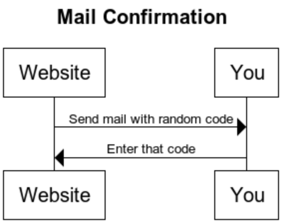
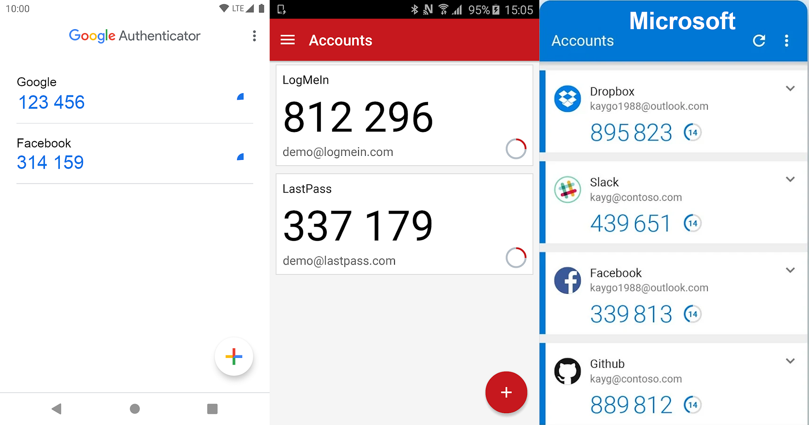

 on [Unsplash](https://unsplash.com/?utm_source=medium&utm_medium=referral)](../images/2021/04/multi-factor-authentication-1.jpg)*Photo by [Lukenn Sabellano](https://unsplash.com/@luferlex?utm_source=medium&utm_medium=referral) on [Unsplash](https://unsplash.com/?utm_source=medium&utm_medium=referral)*

Most websites only have one piece of evidence that is used to authenticate you: A password. However, having multiple pieces of evidence increases security quite a bit. Those pieces of evidence are also called “factors” and they fall into three groups:

* **Something you know**: A password
* **Something you have**: A password token or a device like a smartphone
* **Something you are**: Biometrics

Using multiple factors for authentication is also called multi-factor authentication (MFA). If you use two factors, it is two-factor authentication (2FA). Hence 2FA is the simplest form of MFA.

After reading this article you will understand how MFA makes your service more secure and how to apply it. Let’s start!

## What is MFA good for?

Suppose you’re a big bank and you have thousands of clients. All of them need to use your online services. To authorize them to see their balances, you first need to know that the correct person is in front of the computer/smartphone. They need to authenticate.

Typically, this is done with a username and a password. By giving their username, they tell us who they claim to be. By giving the secret password, we know that they have access to information that only the original user can have.

One issue with password-based authentication is malware on the device, e.g. **keyloggers**. Those programs (or even hardware!) write down every single keystroke you make. This includes all usernames and passwords. The attacker can then read the logs and get your secret. Your account is compromised.

Another issue that could occur is when you **leave your computer unlocked** while being logged into your account. By asking for any of the factors — password or other! — when doing critical operations such as bank transfers, you can avoid bigger issues. However, you could also do this with the password. Asking for a second factor that is easier to enter might be more convenient, though.

**Replay attacks** take a valid request and duplicate it. If the second factor uses the current time, those attacks can also be prevented. MFA should not be the planned way to prevent replay attacks, but they could make a vulnerability harder to use.

MFA also makes **phishing** more difficult, especially when it’s time-based. Your website's users might get ticked into telling attackers their passwords and maybe even giving them a single one-time password, but they will for sure not send their phones or other devices to the attackers. Well … hopefully 😅

## Something you know

Something you know is typically a password, but not necessarily.

Imagine you want to change your flight by calling the airline. Which questions do they ask you? You need the booking number and some knowledge about the passenger, e.g. the name, passport number, birthday, or similar. They will not ask for your password. The worrying part of that experience is that I would not have treated any of those as a secret before.

It’s a similar story with insurance and doctors. If you can provide enough knowledge about a person, you can just call them and ask for the information. In most cases, the person asking is actually authorized to get the information. However, not always.

Luckily, I cannot think of any [incentive](https://martinthoma.medium.com/incentives-of-malware-creators-62319053caf9) for attackers to abuse this weak authentication — except wanting to harm you personally. Let me know what I missed!

## Something you have

When you register, you prove that you have access to your email address. This works by sending you a random code to the address that should get confirmed.

*How confirming that you have access to a mail address (e-mail and physical) works*

This schema works for e-mail, physical mail, and phone numbers. In this way, you can prove that you have access to the address/phone number. Or at least that you had access to it once.

This brings us to the first problem: You can lose what you have. You could change your phone number because you switch the provider. You could move and thus get a new physical address. You could give up your sassy mail address from your school times for something professional. Hence the website that uses this factor needs to prepare for change.

There are two other solutions for “something you have” which are way more secure than the mentioned ones: Security keys/cards and time-based one-time password (TOTP) applications. The best-known provider for security keys is Yubico and a popular TOTP app is the [Google Authenticator](https://play.google.com/store/apps/details?id=com.google.android.apps.authenticator2&hl=de&gl=US).

### Inconvenient & Insecure: TAN List & SMS

Two options that are phasing out are TAN lists and SMS-based codes. The first one is inconvenient, the latter one is insecure.

TAN lists were used by banks for a while as a second factor. They sent you a list of numbers and codes for those numbers via snail mail. When you wanted to make a transaction, they asked you to give the code associated with a certain number. This is very inconvenient as I have to get those number lists out and get a new list once I’ve used all of the old ones. Additionally, I would not necessarily consider snail mail secure. To make it worse, taking a photo of a piece of paper is trivial with a smartphone.

SMS has the problem that the messages are not encrypted. The content can be viewed at least by mobile carriers. I’ve also heard phishing stories where the mobile carrier was convinced that the attacker is the victim and needs a duplicate SIM card. See also: [How hard is it to intercept SMS?](https://security.stackexchange.com/q/11493/3286)

### Time-based one-time password

The idea of TOTP is to provide the user with a one-time password via an App on their smartphone.

Alternative TOTP apps to the [Google Authenticator](https://play.google.com/store/apps/details?id=com.google.android.apps.authenticator2&hl=de&gl=US) are [Twilio Authy](https://play.google.com/store/apps/details?id=com.authy.authy&hl=de&gl=US), [LastPass Authenticator](https://play.google.com/store/apps/details?id=com.lastpass.authenticator&hl=de&gl=US), [Yubico Authenticator](https://play.google.com/store/apps/details?id=com.yubico.yubioath&hl=de&gl=US), and the [Microsoft Authenticator](https://play.google.com/store/apps/details?id=com.azure.authenticator).

The Apps from Google, LastPass, and Microsoft look like this:



When you use the TOTP app, you first pair it with the web service. That typically works by clicking on the “+” symbol and scanning a QR code with your phone. After that, you can see the one-time passwords with a timer that goes down. They are valid for something like 30 seconds, then you’ll receive another password.

The exact way this works is specified in [RFC 6238](https://tools.ietf.org/html/rfc6238). It’s only a few pages, so I recommend reading the RFC if you’re interested. Let me summarize it:

1. The server and the device share a secret. That typically is a long random byte sequence.
2. The server and the device share the current time. This is “guaranteed” to a certain extent by the [network time protocol](https://en.wikipedia.org/wiki/Network_Time_Protocol) (NTP).
3. The shared secret and the time are used to derive a current one-time password.

Such a key derivative function could look similar to this:

```python
import time


def derive_key(shared_secret, time_step=30):
    unix_time = int(time.time())
    time_bucket = (unix_time - unix_time % time_step) // time_step
    return sha512(shared_secret + str(time_bucket))
```

The time bucket changes every 30 seconds. There is some room for differences in the server time and your device's time, but they should not become too big.

Please note: The device actually never needs internet access! You need to share the secret once and it needs to be stored securely. If the device's time is close to the server's time, this will work.

There are two negative sides of having this second factor:

* **Inconvenience**: You need to have the device with you. This is only relevant when it’s not your smartphone.
* **Lost device**: You might lose the device or it might break.

### Security Keys and Smartcards

The Yubico keys are certainly the best-known ones and I have tried one myself. They are convenient to use and they work on Linux. [A lot of services](https://www.yubico.com/de/works-with-yubikey/catalog/) support Yubico keys. This works via FIDO2 / Webauthn. The recent versions of the huge [browsers support Webauthn](https://caniuse.com/webauthn), but many browsers with a small market share don’t support the standard as of April 2021.

Smartcards are similar. They have a typical credit card format and a chip inside. This chip does more than sending an identifier. It is processing data. The system works in a challenge-response way. I don’t want to [go into details](https://security.stackexchange.com/a/49294/3286), but as a mental model, think of the following:

1. The device against which you want to authenticate sends a random number called “challenge”.
2. The smartcard takes that number and sends back a package that contains an identifier of the card, the associated public key, the signed challenge, and maybe a certificate for the public key.
3. The device validates that the signature fits the public key and the challenge.
4. The device validates that the sent identifier is authorized for whatever action is requested, e.g. access to a building or confirming a bank transaction.

It is not possible to reconstruct the private key from the response to the challenge. The challenge is unique every time the card is used and nobody knows the private key — it is stored only within the card. Not even the manufacturer of the card should know it.

I am not aware of any relevant differences in how Yubikey / Smartcards work.

## Something you are

Authentication via biometric features was science fiction for a long time, but it has become normal with smartphones. **Fingerprint readers** are built into laptops for quite a while now, but since about 2018 they have also gained massive adoption in smartphones. Smartphones also allow using **facial recognition** to unlock the phone.

There are many more biometric features that can be used for identification:

* Eyes: [Iris recognition](https://en.wikipedia.org/wiki/Iris_recognition) and [retinal scans](https://en.wikipedia.org/wiki/Retinal_scan)
* Hand: [Fingerprint scanning](https://en.wikipedia.org/wiki/Fingerprint_scanner), [palm vein scanning](https://www.theverge.com/2021/4/21/22395441/amazon-one-palm-scanning-payments-whole-foods-seattle), [hand geometry](https://en.wikipedia.org/wiki/Hand_geometry)
* DNA
* Voice
* Behavior: [Gait recognition](https://en.wikipedia.org/wiki/Gait_analysis#Gait_as_biometrics) (the way people walk), the way you type or play a computer game

The big advantage of biometrics is that you cannot lose this information. However, it is possible to forge/copy this information. For example, the CCC showed only a few hours after Apple release an iPhone with a fingerprint reader that they could [copy the fingerprint](https://www.spiegel.de/international/world/german-hacker-group-ccc-compromises-iphone-fingerprint-sensor-a-923910.html). I don’t see online services using biometric information for authentication, because the attacker can supply anything. The online service has no control over the device and that it’s properly used.

In contrast, biometric information can be great for identification if humans make sure the process is not tampered with. For example, I cannot imagine how one would fool a DNA sample or a palm vein scan if another person is in the room.

Behavior-based recognition is pretty amazing. Imagine you would have to play a game of Super Mario before you can transfer big amounts of money. Even if you wanted to give this information to an attacker, you couldn't. I have seen something similar to this at university, but the game was boring and you had to play for quite a while.

Please leave a comment if you know of any other MFA methods!

## More in this series

In this series about application security (AppSec), we already explained some of the techniques of the attackers 😈 and also techniques of the defenders 😇:

* Part 1: [SQL Injections](../sql-injections/) 😈🐝
* Part 2: [Don’t leak Secrets](../leaking-secrets/) 😇
* Part 3: [Cross-Site Scripting (XSS)](../xss/) 😈🐝
* Part 4: [Password Hashing](../password-hashing/) 😇
* Part 5: [ZIP Bombs](../zip-bombs/) 😈
* Part 6: [CAPTCHA](../captcha/) 😇
* Part 7: [Email Spoofing](../email-spoofing/) 😈
* Part 8: [Software Composition Analysis](../sca/) (SCA) 😇
* Part 9: [XXE attacks](../xxe-attacks/) 😈🐝
* Part 10: [Effective Access Control](../effective-access-control/) 😇
* Part 11: [DOS via a Billion Laughs](../billion-laughs-dos/) 😈
* Part 12: [Full Disk Encryption](../full-disk-encryption/) 😇
* Part 13: [Insecure Deserialization](../insecure-deserialization/) 😈🐝
* Part 14: [Docker Security](../docker-security/) 😇
* Part 15: [Credential Stuffing](../credential-stuffing/) 😈🐝
* Part 16: **Multi-Factor Authentication** (MFA/2FA) 😇
* Part 17: [ReDoS](../redos/) 😈

The following articles are about to come:

* Part 18: Secure Messaging 😇
* Part 19: Cryptojacking 😈
* Part 20: Backups 😇
* Part 21: Cryptotrojans 😈
* Part 22: Single-Sign-On 😇
* Part 23: Clipboard Hijacking 😈
* Part 24: Certificates 😇
* Part 25: Race Condition Attacks in Blockchains 😈
* Part 26: Mobile Device Management (MDM) 😇
* Part 27: Server-Side Request Forgery (SSRF) 😈
* Part 28: Network Separation 😇
* Part 29: Social Engineering (including Phishing) 😈
* Part 30: Virtual Private Networks (VPNs) 😇
* Part 31: CSRF 😈

Let me know if you are interested in more articles around AppSec / InfoSec!
