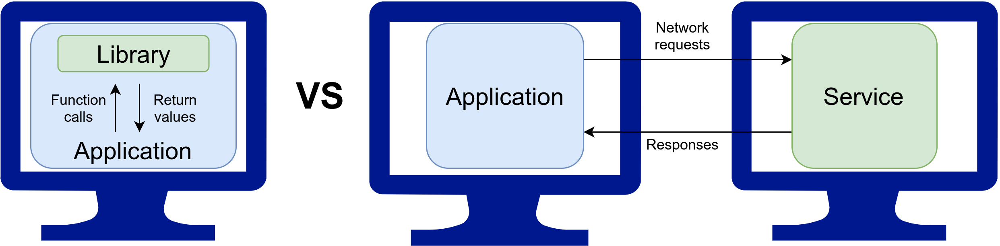
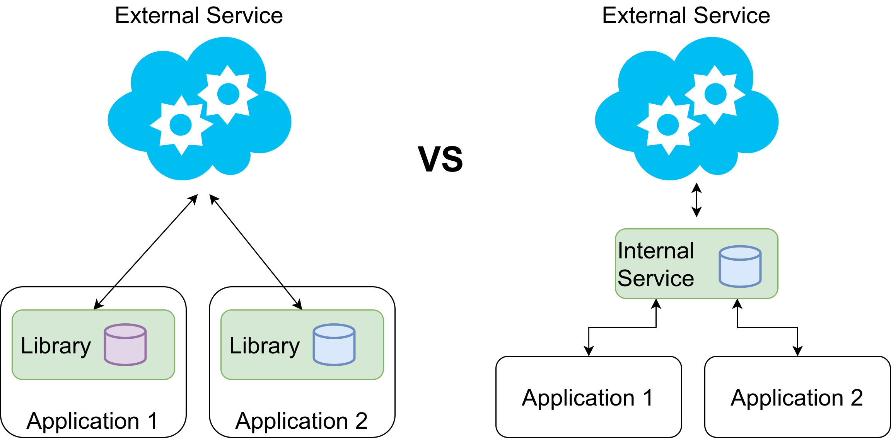
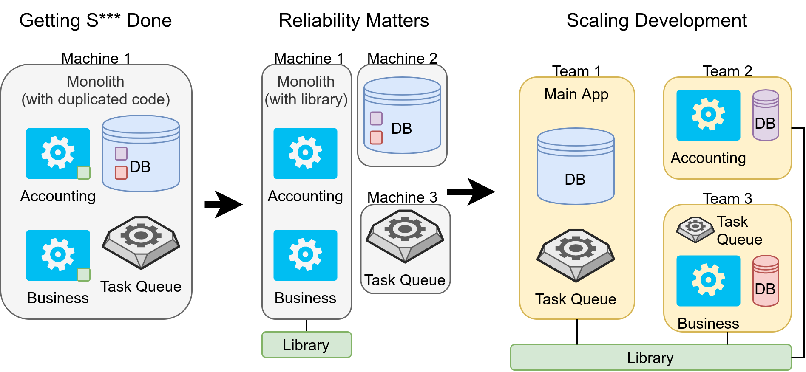

<figure class="wp-caption aligncenter img-thumbnail">
    
    <figcaption class="text-center">Shared code can be in a library or in a service. Image by Martin Thoma.</figcaption>
</figure>

Preventing code duplication is a software development principle called
[*DRY*](https://en.wikipedia.org/wiki/Don%27t_repeat_yourself) — **D**on’t
**R**epeat **Y**ourself. DRY is important because duplicated code usually
means way more code that needs to be maintained. If you need to fix a bug, you
need to fix it in all duplicated places. If you need to extend the
capabilities, you need to do it in multiple parts of the code. When a new
developer adjusts one part of the duplicated code and forgets to adjust the
other places, the situation gets more complicated.

There are two very different ways to keep your code DRY: Put the shared code
in a library or put it in a service. Eric Knipp calls this “shared capability”
([source](https://blogs.gartner.com/eric-knipp/2013/03/20/libraries-vs-services/)),
which already shows that there is an abstraction difference. When you interact
with services, you typically don’t want to care about the implementation
details of that service. In a library, you might think more about runtime
complexity or even jump into the code once in a while.

After reading this article, you will know what the differences between a
library and a service are and when you should use one or another. Let’s start!

## The differences

<figure class="wp-caption aligncenter img-thumbnail">
    
    <figcaption class="text-center">Photo by <a href="https://unsplash.com/@cooljonez?utm_source=medium&utm_medium=referral">Denise Jones</a> on <a href="https://unsplash.com?utm_source=medium&utm_medium=referral">Unsplash</a></figcaption>
</figure>
*Photo by [Denise Jones](https://unsplash.com/@cooljonez?utm_source=medium&utm_medium=referral) on [Unsplash](https://unsplash.com?utm_source=medium&utm_medium=referral)*

A library is shared code that gets deployed with each application. So the
library is part of the application and runs on the same machine as the
application. A library is accessed via function calls.

In contrast, a service has its own infrastructure. This means it has its own
machine, but also logging, monitoring, alerting, potentially an on-call team
to fix issues. It gets deployed independently of the applications. Updates can
be rolled out without the users of the service noticing that there was a
change at all.

Typically, when I interact with a service I like to keep that interaction in
one part of my code. I like to write an own module for each service I interact
with. This module only takes care of the service interaction. In some cases,
services provide such modules, e.g. the boto3 library for interacting with AWS
services. What I want to say: If you create a service, you might end up
creating a service *and* a small library.

Let’s dive into the different arguments for one solution or the other!

## #1: Speed of Calls

Function calls on the local machine are executing in a few nanoseconds whereas
network requests take a few milliseconds. You can expect network requests to
take 1,000,000 times longer than the internal function call.

Please keep in mind that this is only covering the communication part, not the
actual work. If you want to compute the hundredth billionth digit of pi, the
communication speed is dwarfed by the workload. Hence the speed of calls is
just an argument if the workload of the call is fast. If it is, this point
clearly goes to a library.

## #2: Reliability of Calls

Networks fail all the time. CPU instructions can also fail, but this is so
rare that most developers can safely ignore this case for all of their lives.

If you have network connections, you need to deal with timeouts. You need to
deal with unavailable services. For this reason, commercial services typically
provide a service level agreement (SLA). With an SLA you can get a grasp if
the service could be offline for too long or for a time that might severely
impact your own SLA.

This point clearly goes to libraries.

## #3: Infrastructure

A service typically comes with its own infrastructure. It has its own machine.
This means you have to take care of one more machine than in the library case.
But it doesn’t end there. If you have a service, you need to make sure you
have logging, monitoring, alerting, and potentially an on-call team in place.

This makes creating a library more straightforward than creating a service.

## #4: Development Overhead

A core reason why we try to follow the DRY principle is to keep development
and maintenance costs low. If we create a service, it comes with a lot of
overhead compared to a library.

On the one hand, there is the already mentioned infrastructure cost. On the
other hand, you now have to think about secrets management and
[authentication/authorization](https://medium.com/plain-and-simple/identification-vs-authentication-vs-authorization-e1f03a0ca885).
How do you make sure that only authorized users can access the new service?

## #5: Scalability

You can [scale applications horizontally or vertically](https://medium.com/plain-and-simple/scaling-vertically-vs-scaling-horizontally-82547a77d925). Scaling vertically means buying a bigger machine, scaling horizontally means buying a second machine. Buying a bigger machine is trivial and cheap until a certain point. From that point it becomes impossible. If you’re lucky, you never feel the need to scale vertically. Scaling vertically is way more complicated and you need to spend development time on it, which typically makes it way more expensive.

If you have a separate service, you might already be closer to an architecture
that allows you to scale vertically. However, this is not a strong argument
for a service as you need to take care of the infrastructure of the service.
You’re just paying the cost earlier — the infrastructure argument.

## #6: Flexibility in Development

Different problems require different solutions. You might even want to switch
programming languages for parts of your code because the community in one area
is way stronger. While Python and many other programming languages offer
foreign function interfaces
([FFIs](https://en.wikipedia.org/wiki/Foreign_function_interface)), it might
be simpler to completely encapsulate that part by a different service.

Please note that I see flexibility in development as a strong argument, but
lack of knowledge of how FFIs work as a weak argument. If you have different
teams working on the different topics anyway and if the overhead caused by the
network is not relevant, go for the service.

## #7: Shared State

If we have a stateless part of the code, it’s an indicator that a library
might be a good solution. If you have a shared state, maybe a service is
better.

One specific case I’m currently thinking about is an external service that
might not be as reliable or fast as I would like it to be. It needs to be
wrapped in a local “caching” layer that also abstracts away some of the
complexity of the external service.

<figure class="wp-caption aligncenter img-thumbnail">
    
    <figcaption class="text-center">Image by Martin Thoma</figcaption>
</figure>

In this case, it’s not so clear if the library option is better or worse than
the application option. The handling of data makes me tend to use a service,
but then I would need to deal with the unreliabilities of a network. And it
would certainly take longer to access that data.

## Library vs Service: Some simple Examples

The world is complex and I cannot give you a 5-step guide to decide if you
should use a service or a library. In cases like the one above, the situation
is not so clear. But there are simple cases:

* **Pure algorithms, no shared state**: If you only want to share algorithms
  or maybe some constants (e.g. HTTP Status Codes, Country names/codes,
  currencies, timezones), it’s a pretty clear indicator that you want a
  **library**. Examples that pop to my mind are [Numpy](https://numpy.org/),
  [Scipy](https://www.scipy.org/), [Tensorflow](https://www.tensorflow.org/),
* **Algorithms with lots of data**: The [Google
  maps](https://developers.google.com/maps) service has complex functionality
  such as “What is the address closest to this GPS point?” or “What is the
  fastest route from A to B?” combined with lots of data to fuel those
  algorithms. The service is heavy, needs regular updates of the data, the
  infrastructure to make this possible is crazy complex. The applications
  which make use of this are very simple: Draw my running route. Display the
  fastest route in my navigation system. Calculate the area of my neighbors'
  property. Writing a **service** to remove the burden of the heavy
  infrastructure is a good idea.
* **Lots of memory needed**: If you have a part of the code that constantly
  needs a lot of memory, you might want to put it on its own machine. This way
  you might keep things vertically scalable for longer. And in some cases,
  like machine learning applications which only do predictions, it is trivial
  to scale: Just spin up another machine and serve requested in a round-robin
  fashion (or similar). You don’t have a shared state, just the model which
  needs to be in memory. All translation and OCR **services** are good
  examples.
* **Only shred state, no algorithms**: You might consider just giving **direct
  database access**. Please note that this comes with its own problems and
  it’s very unlikely that this is a good solution in the long run. It might be
  an acceptable intermediate solution.

## Transitions

Big software projects are typically not created from scratch but evolve over
time. It starts with the “**Getting Stuff Done**” phase in which developers
have everything on their local machine or a hosted web service.

If it’s something serious, it gets to the “**Reliability Matters**” phase. In
this phase, developers start thinking about how to deal with a bigger amount
of users, how to deploy in a way that doesn’t disrupt users, multiple
environments like local/development/staging/production, logging, monitoring,
and alerting. Developers start to run things on multiple machines, e.g. the
database on a different one than the application and especially CPU intensive
stuff on another one. This got way simpler in the past years due to AWS.

At some point, the need to scale development arises. If you have dozens of
developers, you need to make sure that not everybody needs to know about
everything. You need to **Scale Development**. You need to partition the
software. Software can be partitioned by the type of value they provide. The
teams have a clearly defined responsibility and own their tech stack — the
code, the infrastructure, the operations. They need to talk with their clients
and they need to define their interfaces.

As an image, it might look like this:

<figure class="wp-caption aligncenter img-thumbnail">
    
    <figcaption class="text-center">Image by Martin Thoma</figcaption>
</figure>

A transition I have seen a couple of times is to create a monolith first to
get the business going. When the company grows, they structure the monolith by
business functionality. For example, there might be modules dealing with
accounting and others dealing with analytics. When the monolith becomes really
hard to maintain because everything is dependant on everything else, (micro)
services are factored out of the monolith.

An intermediate solution I’m currently thinking about is the problem of the
(potentially unreliable) external service described above. It would be
possible to first create a library solution where the different applications
could have different parts of the state. Potentially a small amount of data
will be in both applications. The data which is in multiple applications would
make a move from a library solution to a service solution hard as the
synchronization mechanism has to be considered.

## Summary

Libraries and Services allow you to keep your code DRY (**d**on’t **r**epeat
**y**ourself). Libraries are more integrated into the application and building
them comes with a lower upfront cost. Services provide a clear separation on
the infrastructure level, but you need to think about the issues of network
requests.

Going from a library to a service is trivial in many cases. Going from a
service to a library can be completely infeasible after a while.
