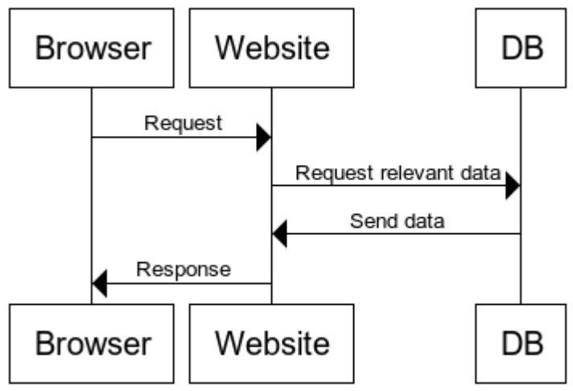

<figure class="wp-caption aligncenter img-thumbnail">
    <a href="https://cdn-images-1.medium.com/max/9102/0*rMrVa1-XOfWA62ui"></a>
    <figcaption class="text-center">Photo by <a href="https://unsplash.com/@edurnetx?utm_source=medium&utm_medium=referral">Edurne Chopeitia</a> on <a href="https://unsplash.com?utm_source=medium&utm_medium=referral">Unsplash</a></figcaption>
</figure>

We developers like to throw around terms that feel natural to us, but are
technical terms that most non-developers don’t use in the same way. This
article is aimed at all the poor souls who have to deal with us, e.g. product
managers, product owners, scrum masters, business people.

After reading this article, you will understand the difference between
synchronous vs asynchronous vs concurrent vs parallel. Let’s start!

## Speeding up Execution

If you want a program or website to feel faster, you have various options:

* Better machines: Buy new hardware
* Do less: Reduce the scope, simplify the business
* Do the things more efficiently: Better algorithms
* Do things in parallel: Make use of multiple CPU cores instead of just one
* Avoid waiting times

Especially the last point is interesting. Think about baking a cake. My oven
takes about 15 minutes until it is at 200°C. It takes me about 25 minutes to
prepare the cake and it needs to stay for 20 minutes in the oven. How long
does it take to make the cake?

The simple way is to execute the tasks one step after each other —
sequentially:

1. 25 min: Prepare the dough
2. 15 min: Pre-heat the oven
3. 20 min: Bake in the oven

That is 60 min to bake the cake.
> # Asynchronous execution reduces waiting times

You can pre-heat the oven. You don’t need to wait for it to pre-heat. This
might mean that it stays hot for 10 minutes, but you don’t need to wait. You
just reduced the time to make the cake from 60 minutes to 45 minutes!

But you might be able to do even more: By asking your girlfriend to help you,
you can prepare the dough in 15 minutes instead of 25 minutes. It’s not
exactly half of the time because there are limits in what you can do in
parallel. That means both of you worked even longer (2x 15 minutes is 30
minutes of work instead of just 25 minutes), but the time on the clock was
reduced. I call the 15 minutes you actually worked “wall-clock time” and the
combined time “execution time”. So the overall wall-clock time was reduced to
35 minutes.

> # Parallel execution reduces wall-clock time

## Sequential vs Interleaved vs Parallel

The **sequential** execution model does everything **step-by-step**. The
**parallel** one does it at the **same time**. The weird one is the
interleaved execution model. It is not in parallel, but also not sequential.

Think about something that is pretty CPU intensive, e.g. extracting a big ZIP
archive. That might block your CPU for several minutes. If things were done
strictly sequential, you could not do anything at that time. You could not
browse the web. You could not even move your mouse cursor. That feels not
responsive.

Instead of doing it sequentially, we can give the mouse cursor a little bit of
CPU time so that you can interact with the system. We stop the extraction of
the ZIP archive several times per second to see if you moved the mouse. If you
did, we change the position of the cursor on the screen and continue
extracting the ZIP archive. The execution of the ZIP archive extraction and
your mouse cursor moving is **interleaved**.

<figure class="wp-caption aligncenter img-thumbnail">
    <a href="../images/2021/05/parallel-interleaved.png"></a>
    <figcaption class="text-center">Sequential vs Interleaved vs Parallel</figcaption>
</figure>

As you can see, the execution times overlap in the parallel case. In the
sequential execution and the interleaved execution, the execution times for
both tasks never overlap. But the total task execution time from start to
finish overlaps in the interleaved case, whereas task 1 needs to finish before
task 2 can do anything in the interleaved case.

Interleaved execution is done by concurrent threads. Concurrent and
interleaved are used (roughly) synonymously.

## Outgoing requests: Asynchronous vs synchronous

Suppose you write a web crawler, which means a program that should read a
complete website. For example, you want to find interesting news stories on
[nytimes.com](https://www.nytimes.com/). The program goes to the first page,
extracts all interesting content and all URLs. Given every single of those
URLs, you do the same:

* Get the content behind the URL
* Get all URLs in the content

You do that until you have seen all URLs on nytimes.com. Of course, most of
the time you would just wait for the network / the website to actually give
you the content. Your CPU would not be busy all the time, your network would
not be busy all the time. There are tiny waiting times of maybe 0.5 seconds
for each web page. If you access 200,000 pages, those tiny waiting times
accumulate to half an hour.

Instead of doing it sequentially, you could run things in parallel. However,
you only have 4 cores and the level of parallelism is limited. It’s by far not
200,000.

What you have at this point are blocking I/O calls — I/O is short for
input/output. It essentially means we need to wait for the network or a disk
to give our code the data to continue:

```python
def get_website(url):
    content = get_content(url)  # Here we have to wait; IO blocks us
    links = get_links(content)
    add_to_db(links, content)
```

Instead, you could do something like this:

```python
async def get_website(url):
    content = await get_content(url)
    links = get_links(content)
    add_to_db(links, content)
```

For developers who want to understand how to use async/await in Python, I
recommend “[Async IO in Python: A Complete
Walkthrough](https://realpython.com/async-io-python/)” by Brad Solomon.

For non-develpers, the important take-away is that it requires additional
development effort but you can get **good speedups if blocking IO is the
issue**.

## Incoming Requests: Asynchronous vs synchronous

Think about how you get a website. You type in the URL in your browser, your
browser sends a request to the website, the website gets some data to build
the website and sends the response back. Simple enough, right?

<figure class="wp-caption aligncenter img-thumbnail">
    <a href="../images/2021/05/synchronous-response.png"></a>
    <figcaption class="text-center">Synchronous Response</figcaption>
</figure>

It becomes more interesting when you realize that all of this takes time.
Getting the data from the DB costs time. Maybe a 3rd party service is
contacted to build the webpage for you. And you’re not the only person using
that website.

The simplest mode of operation is to keep everything **sequential**. Alice
requested the webpage first, so she gets a response first. Then Bob and then
Charlie. But what happens if Alice wants a webpage that takes 5 seconds to
load? Does Bob have to wait for 5 seconds before the system even starts
working on his stuff?

Of course not. The obvious first improvement is to realize that you can run
many processes/threads in parallel. The number of concurrent threads you can
run is typically in the order of a few dozens. That means if you have hundreds
of requests hitting your server at the same time, **multiprocessing** or
**multithreading** is not a solution.

The next step is to start to think about which resources you run out of.
Typically, **CPU utilization** is not the issue. The CPU could handle way more
requests. The issue is that the CPU of the website does not get the data to
process. It’s waiting for the response from the database or from other
services. It’s **blocked** by that and simply waits.

Realizing this, you can keep a list of tasks you need to do. When one task is
blocked, it just gives away its “right” to execute to other services. It’s
acting cooperative. Welcome to **coroutines**.

To phrase it in our example:

* The website receives Alice requests. It parses the request and realizes that
  it needs data from the database. It sends the request to the database. But
  the program knows that this will take a bit of time, so it let’s other
  people continue.
* The website receives Bob request. It parses the request, sends the DB
  request and returns the power to execute.
* Alice DB request returned an answer. The response is crafted and Alice can continue

<figure class="wp-caption aligncenter img-thumbnail">
    <a href="../images/2021/05/asynchronous-response.png"></a>
    <figcaption class="text-center">Asynchronous Response</figcaption>
</figure>

This makes responses faster as waiting times are reduced. Of course, this only
matters if you have a lot of concurrent requests.
