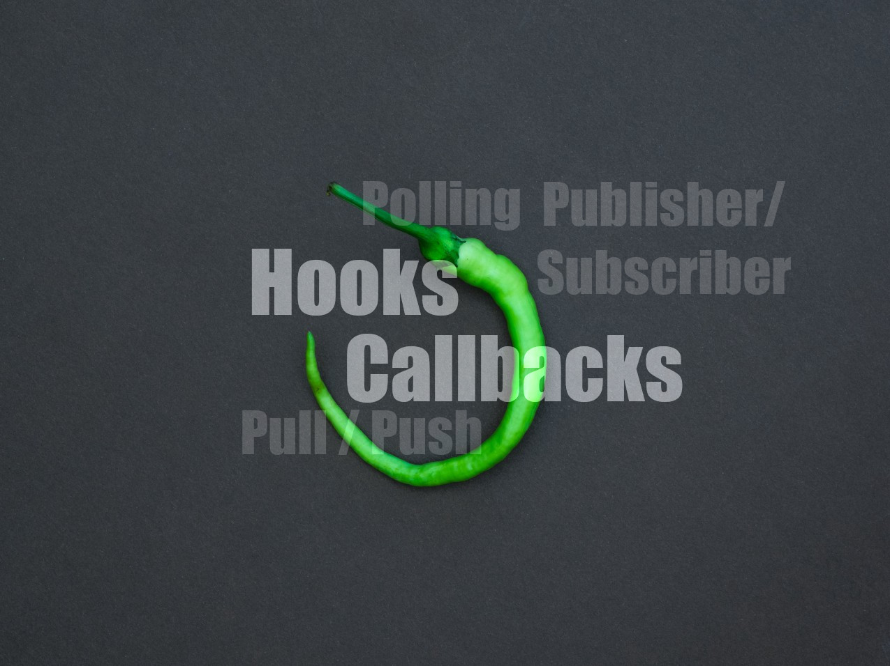

<figure class="wp-caption aligncenter img-thumbnail">
    <a href="../images/2021/05/webhook-banner.jpg"></a>
    <figcaption class="text-center">Photo by <a href="https://unsplash.com/@dancristianp?utm_source=medium&utm_medium=referral">Dan-Cristian Pădureț</a></figcaption>
</figure>

The Unix programming philosophy is to do (just) one thing but do it well.
Focusing on one core task is hard as developers see and feel their users' pain
points and desires. To be able to focus on the core product but allow
additional functions we cannot take care of, we develop plugin systems. One
way to do this is by giving hooks.

> # A hook is a way to extend software.

Think about an email client. The email client might define a hook pre_send
that receives the current receiver, subject line, and content of the email.
Developers can use this to extend the software. You could have one plugin that
uses this hook and adds a signature if it’s missing. Another hook could look
for swear words and stop you from sending that email drunk at night, which you
will regret.

Another way to extend software is by an event. An event just tells the plugin
that something happened. A hook might allow you to stop the further execution
flow — like preventing sending the email with swear words.

## Callbacks

Callbacks are pointers to functions. They represent a concrete function.

For example, think of a web crawler that wants to get the content of
`many_urls`. You could run it sequentially:

```python
for url in many_urls:
    get_content(url)
```

Or you could implement a function that executes everything in parallel for
every argument:

```python
parallel_for(get_content, many_urls)
```

Please note that we don’t actually call get_content in the second example. We
pass it as a parameter to a function. When you pass a function as a parameter
to another function, you call it a *callback*.

## Callbacks and Hooks

**Callbacks can be used to implement hooks.** If you think again about the
email example from above, you could implement it like this:

```python
import email_client

email_client.register_pre_send_hook(add_signature)
email_client.register_pre_send_hook(detect_swearwords)
```

The developers of email_client need to provide the method
`register_pre_send_hook`. They need to tell you that this function expects a
function as a parameter: A callback.

They need to tell you that they will run every given callback like this:

```python
def send_email():
    # Execute all registered hooks
    for hook in registered_hooks:
        email = hook(email)
```

So your hook receives an email object. It can modify this object in any way
and overwrite the contents in any way.


## Webhooks

Webhooks are hooks used in web services. Just like with normal hooks, you can
extend the functionality of a web service by using hooks. For example, Slack
allows you to post messages to an URL
([source](https://api.slack.com/messaging/webhooks#create_a_webhook)).

<figure class="wp-caption aligncenter img-thumbnail">
    <a href="../images/2021/05/polling-vs-webhook.png"></a>
    <figcaption class="text-center">Two models how the client can get new information: Either the server pushes the information or the client needs to pull. The “pull” model is also called “polling”. For the “push” model, the server needs to know the clients. So the clients need to subscribe. For this reason, it’s also called PubSub or Publisher-Subscriber-Model.</figcaption>
</figure>

Webhooks allow websites to push information to you instead of you pulling (and
polling) from them.

Let’s make it more concrete. You are certainly using
[Slack](https://en.wikipedia.org/wiki/Slack_(software)). And maybe you have a
monitoring system like [Sentry](https://sentry.io/welcome/). Now you want a
Slack message in a certain channel whenever Sentry finds a new issue.

The polling mechanism would be simple — slack would ask Sentry every few
seconds if there is a new message. That would consume way more resources from
Slack and Sentry than necessary. Instead of Slack pulling messages, we want
Sentry to push messages to Slack.

Web servers typically don’t know their clients. To be able to push information
to Slack, this needs to change. The client (Slack) needs to subscribe to the
server (Sentry). Slack needs to share an URL with Sentry. The code on the
sentry might look like this:

```python
def subscribe(callback_url):
    # callback_url could be
    # https://hooks.slack.com/services/T000/B000/XXXXXXXX
    store_in_client_list(callback_url)
```

The two parties need to agree on which format to use for exchange. In the case
of Slack, they provide [documentation for their webhook
system](https://api.slack.com/messaging/webhooks). Both parties can do that.
In the end, it only matters that they agree.

When Sentry finds a new issue, they will send data to Slack:

```python
def handle_subscribers(event):
    subscribers = event.get_subscribers()
    for subscriber in subscribers:
        post(subscriber.callback_url, event.data)
```

The post method could also use the return value, but in the case of Slack,
it’s simply ignored as far as I know.

## Summary

* A hook is a way to extend software.
* A callback is a function that is passed as a parameter to another function.
* A webhook is a hook in the web. Typically used to make two distinct systems
  communicate and typically to go away from polling towards a
  publisher-subscriber model.
