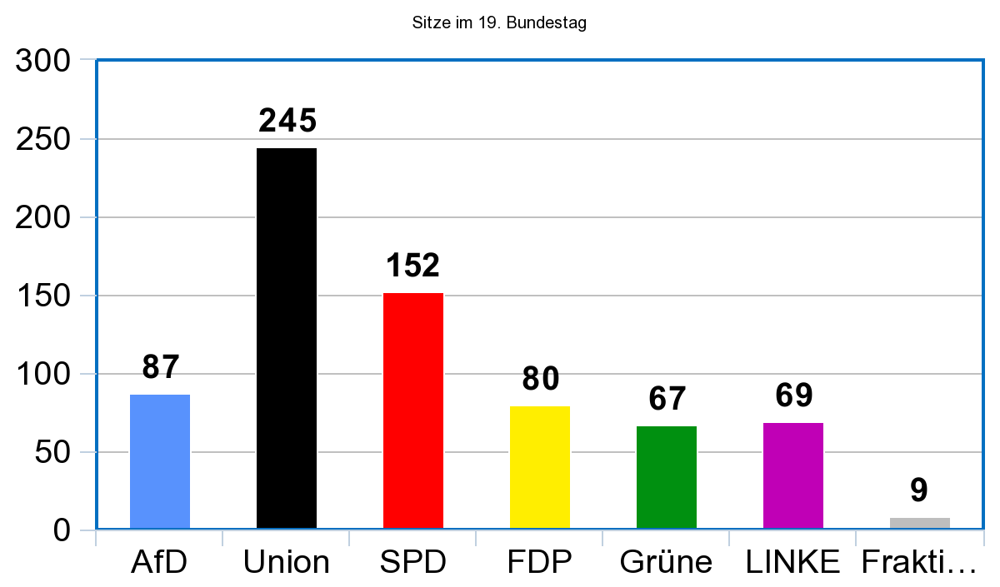

Die [Bundestagswahl 2021](https://de.wikipedia.org/wiki/Bundestagswahl_2021) findet am 26. September 2021 statt.

Seit März 2020 dominiert die [COVID-19-Pandemie](https://de.wikipedia.org/wiki/COVID-19-Pandemie) das Weltgeschehen. Spätestens seit 2005 mit dem [Kyoto-Protokoll](https://de.wikipedia.org/wiki/Kyoto-Protokoll) muss auch jedem Politiker klar sein, dass die [globale Erwährmung](https://de.wikipedia.org/wiki/Globale_Erw%C3%A4rmung) ein riesiges Problem ist.

## Themen

Folgendes sind die großen Themen die aus meiner Sicht für die Zukunft interessant sind:

* **Klimawandel**:
    * Wie können wir in Deutschland unseren CO2-Fußabdruck reduzieren?
    * Wie können wir einen positiven Einfluss auf den CO2-Fußabdruck der Welt nehmen?
* **Mittelschicht**: Eine gesunde Gesellschaft muss eine starke Mittelschicht haben. Das heißt für mich, dass ein Großteil der Menschen über einer gewissen Einkommensschwelle liegen muss. Der [Armuts- und Reichtumsbericht der Bundesregierung](https://de.wikipedia.org/wiki/Armuts-_und_Reichtumsbericht_der_Bundesregierung) nimmt 60% des Median-Einkommens als Schwelle. 2021 wäre man also mit einem Monatseinkommen von TODO über dieser Schwelle. Es waren also TODO arm.
* **Wohnen**: Mieten, Vermieten, Bauen, Renovieren: Wie schaffen wir es, Wohnraum in den Stätten günstiger zu machen / die Preissteigerungen zu begrenzen?
* **Rente**: Wie schaffen wir es, den Menschen eine Rentezu geben die zum Leben genügt?

### Digitaler Wandel

* Wie bekommen wir eine schnelle, günstige, und zuverlässige Internetverbindung Flächendeckend in Deutschland?
* Wie nutzen wir neue Möglichkeiten in den Prozessen, z.B.
    * Allgemeine Behördengänge, z.B. Einwohnermeldeamt
    * Steuererklärung (Elster)
    * Behördeninterne Kommunikation und Datenhaltung
* Open Source:
* Bildung: Wie schaffen wir freie Lerninhalte (Open Education)

### Urheberrecht

TODO

### Korruption & Demokratie

TODO

## Parteien

Im [19. Deutschen Bundestag](https://de.wikipedia.org/wiki/19._Deutscher_Bundestag) sind 6 Parteien relevant:

* [CDU/CSU](https://de.wikipedia.org/wiki/CDU/CSU-Fraktion_im_Deutschen_Bundestag) (Union): 245 Sitze
* [SPD](https://de.wikipedia.org/wiki/SPD-Bundestagsfraktion): 152 Sitze
* [AfD](https://de.wikipedia.org/wiki/AfD-Fraktion_im_Deutschen_Bundestag): 87
* [FDP](https://de.wikipedia.org/wiki/Fraktion_der_Freien_Demokraten): 80
* [LINKE](https://de.wikipedia.org/wiki/Fraktion_Die_Linke_im_Bundestag): 69
* [GRÜNE](https://de.wikipedia.org/wiki/Bundestagsfraktion_B%C3%BCndnis_90/Die_Gr%C3%BCnen): 67

<figure class="wp-caption aligncenter img-thumbnail">
    
    <figcaption class="text-center">Sitze im 19. Bundestag</figcaption>
</figure>

In den vergangenen 4 Kabinetten gab es folgende Verteilung der Ministerien:

<table>
	<thead>
	    <tr>
	        <th>Minister</th>
	        <th>Merkel I (2005 - 2009)</th>
	        <th>Merkel II (2009 - 2013)</th>
	        <th>Merkel III (2013 - 2018)</th>
	        <th>Merkel IV (2018 - 2021)</th>
	    </tr>
	</thead>
	<tbody>
	    <tr>
	        <td class="cdu">Bundeskanzler</td>
	        <td class="cdu">CDU (Merkel)</td>
	        <td class="cdu">CDU (Merkel)</td>
	        <td class="cdu">CDU (Merkel)</td>
	        <td class="cdu">CDU (Merkel)</td>
	    </tr>
	    <tr>
	        <td>Ausw&auml;rtiges</td>
	        <td class="spd">SPD (Steinmeier)</td>
	        <td class="fdp">FDP (Westerwelle)</td>
	        <td class="spd">SPD (Steinmeier&nbsp;/ Gabriel)</td>
	        <td class="spd">SPD (Maas)</td>
	    </tr>
	    <tr>
	        <td class="cdu">Inneres</td>
	        <td class="cdu">CDU (Sch&auml;uble)</td>
	        <td class="cdu">CDU (Maizi&egrave;re/ Friedrich)</td>
	        <td class="cdu">CDU (Maizi&egrave;re)</td>
	        <td class="cdu">CSU (Seehofer)</td>
	    </tr>
	    <tr>
	        <td>Justiz seit 2013 auch&nbsp;Verbraucherschutz</td>
	        <td class="spd">SPD (Zypries)</td>
	        <td class="fdp">FDP (Leutheusser-Schnarrenberger)</td>
	        <td class="spd">SPD (Maas)</td>
	        <td class="spd">SPD (Barley /&nbsp;Lambrecht)</td>
	    </tr>
	    <tr>
	        <td>Finanzen</td>
	        <td class="spd">SPD (Steinbr&uuml;ck)</td>
	        <td class="cdu">CDU (Sch&auml;uble)</td>
	        <td class="cdu">CDU (Sch&auml;uble, Altmaier)</td>
	        <td class="spd">SPD (Scholz)</td>
	    </tr>
	    <tr>
	        <td>Wirtschaft und Technologie seit 2013 Wirtschaft und Energie</td>
	        <td class="cdu">CDU (Glos&nbsp;/&nbsp;Guttenberg)</td>
	        <td class="fdp">FDP (Br&uuml;derle, R&ouml;sler)</td>
	        <td class="spd">SPD (Gabriel, Zypries)</td>
	        <td class="cdu">CDU (Altmaier)</td>
	    </tr>
	    <tr>
	        <td>Arbeit und Soziales</td>
	        <td class="spd">SPD (M&uuml;ntefering&nbsp;/ Scholz)</td>
	        <td class="cdu">CDU (Jung,&nbsp;von der Leyen)</td>
	        <td class="spd">SPD (Nahles /&nbsp;Barley)</td>
	        <td class="cdu">CDU (Heil)</td>
	    </tr>
	    <tr>
	        <td class="cdu">Ern&auml;hrung, Landwirtschaft und Verbraucherschutz seit 2013: Ern&auml;hrung und Landwirtschaft</td>
	        <td class="cdu">CSU (Seehofer&nbsp;/ Aigner)</td>
	        <td class="cdu">CSU (Aigner,&nbsp;Friedrich)</td>
	        <td class="cdu">CSU (Friedrich / Schmidt)</td>
	        <td class="cdu">CDU (Kl&ouml;ckner)</td>
	    </tr>
	    <tr>
	        <td class="cdu">Verteidigung</td>
	        <td class="cdu">CSU (Jung)</td>
	        <td class="cdu">CSU (zu Guttenberg, de Maizi&egrave;re)</td>
	        <td class="cdu">CDU (von der Leyen)</td>
	        <td class="cdu">CDU (von der Leyen,&nbsp;Kramp-Karrenbauer)</td>
	    </tr>
	    <tr>
	        <td>Familie, Senioren, Frauen und Jugend</td>
	        <td class="cdu">CDU (Kues)</td>
	        <td class="cdu">CDU (von der Leyen, Schr&ouml;der)</td>
	        <td class="spd">SPD (Schwesig, Barley)</td>
	        <td class="spd">SPD (Giffey, Lambrecht)</td>
	    </tr>
	    <tr>
	        <td>Gesundheit</td>
	        <td class="spd">SPD (Schmidt)</td>
	        <td class="fdp">FDP (R&ouml;sler, Bahr)</td>
	        <td class="cdu">CDU (Gr&ouml;he)</td>
	        <td class="cdu">CDU (Spahn)</td>
	    </tr>
	    <tr>
	        <td>Verkehr, Bau und Stadtentwicklung seit 2013:&nbsp;Verkehr und digitale Infrastruktur</td>
	        <td class="spd">SPD (Tiefensee)</td>
	        <td class="cdu">CSU (Ramsauer)</td>
	        <td class="cdu">CSU (Dobrindt,&nbsp;Schmidt)</td>
	        <td class="cdu">CSU (Scheuer)</td>
	    </tr>
	    <tr>
	        <td>Umwelt, Naturschutz und Reaktorsicherheit Seit 2013:&nbsp;Umwelt, Naturschutz, Bau und Reaktorsicherheit Seit 2018:&nbsp;Umwelt, Naturschutz und nukleare Sicherheit</td>
	        <td class="spd">SPD (Gabriel)</td>
	        <td class="cdu">CDU (R&ouml;ttgen, Altmaier)</td>
	        <td class="spd">SPD (Hendricks)</td>
	        <td class="spd">SPD (Schulze)</td>
	    </tr>
	    <tr>
	        <td class="cdu">Bildung und Forschung</td>
	        <td class="cdu">CDU (Schavan)</td>
	        <td class="cdu">CDU (Schavan,&nbsp;Wanka)</td>
	        <td class="cdu">CDU (Wanka)</td>
	        <td class="cdu">CDU (Karliczek)</td>
	    </tr>
	    <tr>
	        <td>Wirtschaftliche Zusammenarbeit und Entwicklung</td>
	        <td class="spd">SPD (Wieczorek-Zeul)</td>
	        <td class="fdp">FDP (Niebel)</td>
	        <td class="cdu">CSU (M&uuml;ller)</td>
	        <td class="cdu">CSU (M&uuml;ller)</td>
	    </tr>
	    <tr>
	        <td class="cdu">Bundesminister f&uuml;r besondere Aufgaben</td>
	        <td class="cdu">CDU (Maizi&egrave;re)</td>
	        <td class="cdu">CDU (Profalla)</td>
	        <td class="cdu">CDU (Altmaier)</td>
	        <td class="cdu">CDU (Braun)</td>
	    </tr>
	</tbody>
</table>

Interessante Oppositionsarbeit hat zusätzlich noch [Die PARTEI](https://de.wikipedia.org/wiki/Die_PARTEI) geleistet.

Im Folgenden will ich nun für die genannten Themen sehen was die Parteien planen und wie sie sich bisher in der Vergangenheit geschlagen haben.

### CSU-Fraktion

Die CDU/CSU hat von 2005 - 2021 insgesamt vier Kabinette gestellt.

Schauen wir uns mal vergangene Wahlversprechen aus der Wahl 2017 an:

* **Elektronisches Bürgerkonto**<a class="footnote-ref" href="#fn-1">1</a>: Die CDU/CSU wollte ein elektronisches Bürgerkonto einführen, über welches man z.B. einen Antrag auf Kindergeld machen kann. Soweit ich weiß gibt es keinen einzelnen Dienst über den man alles machen kann. Das für mich relevanteste Projekt ist [Elster](https://de.wikipedia.org/wiki/Elster_(Software)). Hier vermute ich mal, dass man es der CSU zuschreiben kann. Es wundert mich allerdings, dass sich die CSU nicht selbst mit diesen Federn schmückt; eventuell kommt es also doch woanders her?
* **Flächendeckender Glasfaser-Ausbau**<a class="footnote-ref" href="#fn-1">1</a> bis 2025: 8.3 Millionen Haushalte von 41.5 Millionen Haushalten haben aktuell Glasfaser-Zugang<a class="footnote-ref" href="#fn-2">2</a>. Das sind 20%. Allein 2019 ist es um 9 Prozentpunkte gestiegen<a class="footnote-ref" href="#fn-3">3</a>. Für mich sieht es nicht so aus als könnte man das Ziel auch nur annähernd erreichen, allerdings werden große Fortschritte gemacht. Unklar ist, wie viel davon tatsächlich auf die Politik zurückzuführen ist.
* **Vorreiter beim 5G-Ausbau**<a class="footnote-ref" href="#fn-1">1</a> bis 2025:
* **Bildungscloud**<a class="footnote-ref" href="#fn-1">1</a>: Sehr gute Ideen, allerdings ungenügende Umsetzung.

Das [Wahlprogramm der CDU/CSU](https://www.abgeordnetenwatch.de/sites/default/files/election-program-files/CDU-CSU_Wahlprogramm_BTW2021.pdf) hat 140 Seiten.

Negativ aufgefallen ist mir der Abschnitt "Gefahrenabwehr im Cyberraum". Allein schon der Titel. WTF. Was ist denn bitte der "Cyberraum"? Ich vermute das liegt irgendwo im Neuland?

Skandale:

* [Maskenaffäre](https://de.wikipedia.org/wiki/Maskenaff%C3%A4re)
* [Plagiatsaffäre Guttenberg](https://de.wikipedia.org/wiki/Plagiatsaff%C3%A4re_Guttenberg)
* [Philipp Amthor](https://de.wikipedia.org/wiki/Philipp_Amthor#Lobbyismus-Aff%C3%A4re)
* [Bundestrojaner](https://de.wikipedia.org/wiki/Online-Durchsuchung_(Deutschland))
* [Wirecard](https://de.wikipedia.org/wiki/Wirecard#Bilanzskandal_und_Insolvenzantrag)

Kritikpunkte:

* Kohleförderung
* Festhalten am Benziner - könnte ja Arbeitsplätze kosten
    * Umgang mit Elktromobilität
* Verhindern der Windkraft (was ist hier mit den Arbeitsplätzen?)
* Blasphemie-Paragraph
* Vollverschleierungsverbot
* Auseinandersetzung mit Kritik: Rezo
* PKW-Maut
* Vorratsdatenspeicherung
* Evakuierung Afghanistan
* TTIP

## SPD

<iframe width="560" height="315" src="https://www.youtube-nocookie.com/embed/6Kwx8nanRSo" title="YouTube video player" frameborder="0" allow="accelerometer; autoplay; clipboard-write; encrypted-media; gyroscope; picture-in-picture" allowfullscreen></iframe>

Die SPD hat kein eigenes Video mit ihrem Wahlprogramm, nur "[Scholz packt das an.](https://www.youtube.com/watch?v=6Kwx8nanRSo)". Da will ich mal kurz an den [Brechmittel-Einsatz 2001](https://taz.de/Brechmitteleinsatz-in-Hamburg/!5143440/), die [Cum-Ex-Affäre der Warburg-Bank 2016](https://de.wikipedia.org/wiki/Olaf_Scholz#Cum-Ex-Gesch%C3%A4fte_der_Warburg_Bank), dem [Wirecard-Skandal 2018-2020](https://de.wikipedia.org/wiki/Wirecard#Bilanzskandal_und_Insolvenzantrag), sowie dem sich anbahnenden [FIU/Geldwäscheskandal 2021](https://www.t-online.de/nachrichten/deutschland/innenpolitik/id_90783220/opposition-wirft-scholz-mitverantwortung-in-geldwaesche-skandal-vor.html) bedenkt. Das ist die Galleonsfigur, die sich die SPD ausgesucht hat.

## FDP

<iframe width="560" height="315" src="https://www.youtube-nocookie.com/embed/6SPKfiz8Zq8" title="YouTube video player" frameborder="0" allow="accelerometer; autoplay; clipboard-write; encrypted-media; gyroscope; picture-in-picture" allowfullscreen></iframe>

Freiheit ist ein Kernmotiv der Politik der FDP.

* Rentenreform
* Gegen Urheberrechtsreform
* Cannabis-Legalisierung
* Gleichstellung von gleichgeschlechtlichen Paaren
* Gegen Vorratsdatenspeicherung

## AfD

Die sogennante [Alternative für Deutschland](https://de.wikipedia.org/wiki/Alternative_f%C3%BCr_Deutschland),
kurz AfD, ist aus meiner Sicht aus einigen Gründen nicht wählbar.

Ein kurzer Blick ins [Wahlprogramm](https://www.afd.de/wahlprogramm/):

> Es ist bis heute nicht nachgewiesen, dass der Mensch, insbesondere die
> Industrie, für den Wandel des Klimas maßgeblich verantwortlich ist.

Das ist falsch. Exemplarisch wäre hier:

* [Oreskes](https://de.wikipedia.org/wiki/Naomi_Oreskes): [The Scientific Consensus on Climate Change](https://www.science.org/doi/full/10.1126/science.1103618), [Science](https://de.wikipedia.org/wiki/Science), 2004
* [Cook](https://www.monash.edu/mcccrh/people/john-cook), [Oreskes](https://de.wikipedia.org/wiki/Naomi_Oreskes), Doran, et al: [Consensus on consensus: a synthesis of consensus estimates on human-caused global warming](https://iopscience.iop.org/article/10.1088/1748-9326/11/4/048002), [Environmental Research Letters](https://de.wikipedia.org/wiki/Environmental_Research_Letters), 2016
* [Anderegg](http://www.anderegglab.net/), [Prall](https://www.eecg.utoronto.ca/~prall/), Harold et al: [Expert credibility in climate change.](https://www.pnas.org/content/107/27/12107.short), [Proceedings of the National Academy of Sciences](https://de.wikipedia.org/wiki/Proceedings_of_the_National_Academy_of_Sciences_of_the_United_States_of_America), 2010

Allein diese offensichtliche Leugnung der Realität macht die Partei unwählbar.
Wer nicht in der realen Welt lebt kann deren Probleme auch nicht lösen.
Da will ich gar nicht weiter auf das rechtsradikale Gedankengut eingehen.

## Die Linke

[Die Linke](https://de.wikipedia.org/wiki/Die_Linke) hat 2008 ein [100-Punkte Programm](https://www.linksfraktion.de/themen/positionspapiere/detail/das-100-punkte-programm-1/) veröffentlicht, welches immer noch verschiedene Grundgedanken gut zusammenfasst. Exemplarisch halte ich folgende für erwähnenswert:

> 1: Krieg ist kein Mittel der Politik.
>
> ...
>
> 10: Eine global wirkende Kartellbehörde setzt den multinationalen Konzernen Schranken.
>
> ...
>
> 18: Die Europäische Zentralbank wird auf Wachstum und Beschäftigung verpflichtet.
>
> ...
>
> 38: Massenentlassungen bei gleichzeitig hohen Gewinnen werden genehmigungspflichtig.
>
> ...
>
> 40: Öffentliche Fördergelder werden als Unternehmensbeteiligungen vergeben.
>
> ...
>
> 71: Deutsche Staatsangehörige werden unabhängig von ihrem tatsächlichen Wohnsitz oder gewöhnlichen Aufenthalt mit ihrem Einkommen in Deutschland steuerpflichtig.
>
> ...
>
> 74: Steuerpflichtige mit einem Einkommen von mehr als 500.000 Euro werden regelmäßig geprüft.

<iframe width="560" height="315" src="https://www.youtube-nocookie.com/embed/XVehiXiyJ74" title="YouTube video player" frameborder="0" allow="accelerometer; autoplay; clipboard-write; encrypted-media; gyroscope; picture-in-picture" allowfullscreen></iframe>

"Gerechtigkeit" ist ein Kernmotiv linker Politik. Seit Jahren ist Altersarmut, die Unterstützung des "kleinen Mannes" (z.B. Geringverdiener, Mieter, Minderheiten), mehr Kontrolle von Priviligierten (Große Firmen, Personen mit Einkommen über TODO). Frieden ist auch seit Jahrzehnten ein großes Anliegen der Linken.

* Entlastung von Geringverdienern
* Vermögenssteuer
* Bildungspolitik
* Konsequente Umweltpolitk
* Gegen NATO
* Keine gute Abgrenzung von Kuba

## Grüne

* Homöpathie
* Enthaltung / Befürwortung von Urheberrechtsreform
* Hambacher Forst

## Piraten

## Die Partei

* Urheberrechtsreform

## Einzelnachweise

[^1] cdu.de: [Chancen im digitalen Zeitalter nutzen](https://archiv.cdu.de/artikel/chancen-im-digitalen-zeitalter-nutzen), 2017.
[^2] Volker Briegleb: [Glasfaser-Ausbau in Deutschland: "Der Markt funktioniert"](https://www.heise.de/news/Glasfaser-Ausbau-in-Deutschland-Der-Markt-funktioniert-6149233.html), 2021.
[^3] Deutscher Bundestag: [11,8 Prozent der Haushalte mit Glasfaseranschluss](https://www.bundestag.de/presse/hib/707096-707096), 2020.
