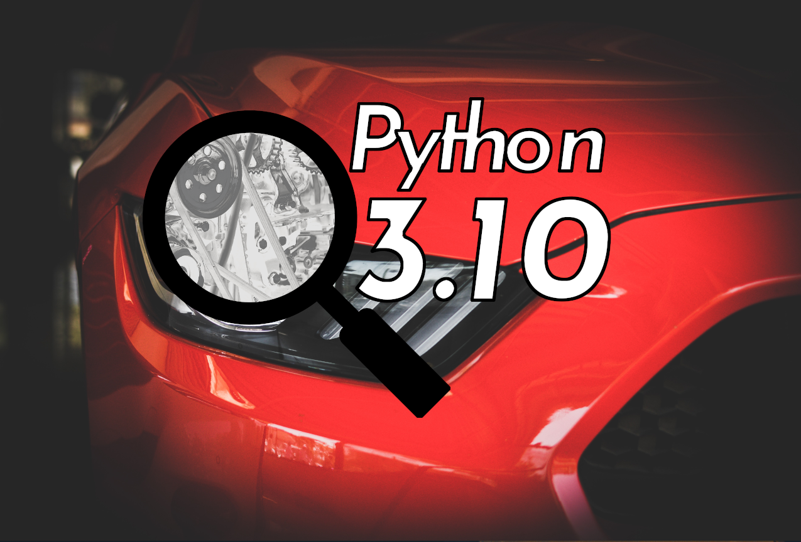
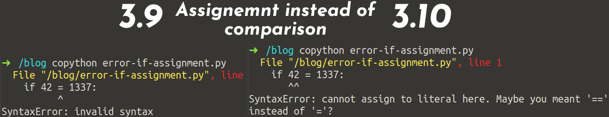
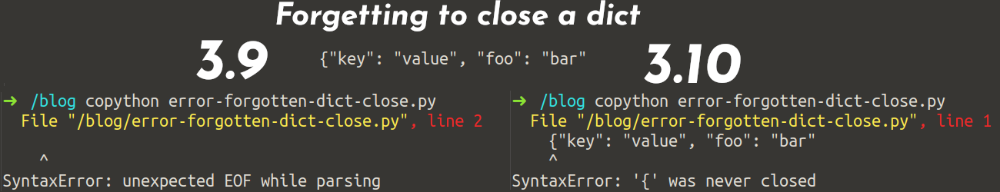

<figure class="wp-caption aligncenter img-thumbnail">
    <a href="../images/2021/10/python-3-10-title.png"></a>
    <figcaption class="text-center">Photo by Vraj Shah <a href="https://www.pexels.com/de-de/foto/rotes-autokopflicht-638479/">from pexels</a> and Mike <a href="https://www.pexels.com/de-de/foto/graustufenfotografie-des-automotors-190574/">from pexels</a>, edited by Martin Thoma</figcaption>
</figure>

Python 3.10 [was released](https://www.python.org/downloads/release/python-3100/) on the 4th of October 2021 according to [PEP 619](https://www.python.org/dev/peps/pep-0619/). Let’s see what’s in store for us.

## Type Annotations

I absolutely love type annotations. Since Python 3.6, they are super useful. If you don’t use them already, I highly recommend you to read [my introduction](https://medium.com/analytics-vidhya/type-annotations-in-python-3-8-3b401384403d).

Python 3.10 has improved them again! Let’s see how

### TypeGuards: Conditional Type Narrowing

[PEP 647](https://www.python.org/dev/peps/pep-0647/) introduces a new TypeGuard annotation. It’s backported via [typing_extensions](https://pypi.org/project/typing-extensions/).

```python
from typing_extensions import TypeGuard  # Before Python 3.10
from typing import TypeGuard  # With Python 3.10
```

Without TypeGuards, you could not find that there is an issue with this:

```python
from typing import TypedDict, TypeGuard


class User(TypedDict):
    name: str
    email: str


def is_user(data: dict) -> TypeGuard[User]:
    return "name" in data and "email" in data


if __name__ == "__main__":
    user = {"name": "Martin", "email": "info@martin-thoma.de"}
    user = {}
    if is_user(user):
        print(user["x"])
```

But with the TypeGuard, you can see:

```text
typeguard.py:17: error: TypedDict "User" has no key "x"

Found 1 error in 1 file (checked 1 source file)
```

Neat! Now you can get rid of a couple of cast andassert calls or comments like # type: ignore .

### Syntactic Sugar: Allow writing union types as X | Y ✨

[Readability counts](https://www.python.org/dev/peps/pep-0020/). The documentation is a lot of the reason why I love type annotations so much. [PEP 604](https://www.python.org/dev/peps/pep-0604/) allows you to use a more concise syntax that is easier to read:

```python
# Before 3.10
from typing import Union


def foo() -> Union[float, str]:
    ...


isinstance(bar(float, int))

# With 3.10
def foo(a: int) -> float | str:
    ...


isinstance(bar, float | int)
```

### Parameter Specification Variables: Type Annotations for Decorators

Non-trivial decorators are a pain to understand once they are written. And writing type-annotations has been pretty hard. [PEP 612](https://www.python.org/dev/peps/pep-0612/) introduces typing.ParamSpec and typing.Concatenate .

The PEP already gives a good example for those. Imagine you wrote a decorator add_logging which executed log_to_database before the decorated function is called. The function could have any parameters — the execution of the function should not be changed. How would you annotate that?

With parameter specification variables you could do it like this:

```python
from typing import Awaitable, Callable, ParamSpec, TypeVar

P = ParamSpec("P")
R = TypeVar("R")


def add_logging(f: Callable[P, R]) -> Callable[P, Awaitable[R]]:
    async def inner(*args: P.args, **kwargs: P.kwargs) -> R:
        await log_to_database()
        return f(*args, **kwargs)

    return inner


@add_logging
def takes_int_str(x: int, y: str) -> int:
    return x + 7


await takes_int_str(1, "A")  # Accepted
await takes_int_str("B", 2)  # Correctly rejected by the type checker
```

You can also add parameters or remove them with decorators. And now you can add proper types for that! Just have a look into [PEP 612](https://www.python.org/dev/peps/pep-0612/).

### Explicit Type Aliases

[PEP 613](https://www.python.org/dev/peps/pep-0613/) introduces typing.TypeAlias . This helps the type checker to distinguish between module-level assignments to create constants and actual type aliases:

```python
StrCache: TypeAlias = "Cache[str]"  # a type alias
LOG_PREFIX = "LOG[DEBUG]"  # a module constant
```

This helps mypy to give better error messages.

## Structural Pattern Matching

Structural Pattern Matching is such a big new feature that it is covered by multiple PEPs: [PEP 634](https://www.python.org/dev/peps/pep-0634/) (Specification), [PEP 635](https://www.python.org/dev/peps/pep-0635/) (Rationale), and [PEP 636](https://www.python.org/dev/peps/pep-0636/) (Tutorial)!

An example from the tutorial explains it best:

```text
match command.split():
    case ["quit"]:
        print("Goodbye!")
        quit_game()
    case ["look"]:
        current_room.describe()
    case ["get", obj]:
        character.get(obj, current_room)
    case ["go", direction]:
        current_room = current_room.neighbor(direction)
    # The rest of your commands go here
```

As you can see, the new keywords are match and case . The part after the match is what is evaluated. In this case, command.spit() returns a list of strings. An equivalent code before structural pattern matching would be:

```python
val: List[str] = command.split()

if val == ["quit"]:
    print("Goodbye!")
    quit_game()
elif val == ["look"]:
    current_room.describe()
elif len(val) == 2 and val[0] == "get":
    obj = val[1]
    character.get(obj, current_room)
elif len(val) == 2 and val[0] == "go":
    direction = val[1]
    current_room = current_room.neighbor(direction)
```

As you can see, the first example is way easier to read. There are a lot of other examples — I recommend going through [this tutorial](https://www.python.org/dev/peps/pep-0636/)!

## Better Error Messages

Python 3.10 has improved a couple of error messages. Here are just two
examples, but there are many more:

<figure class="wp-caption aligncenter img-thumbnail">
    <a href="../images/2021/10/error-assignment-comparison.png"></a>
    <figcaption class="text-center">Error message for assignment instead of comparison</figcaption>
</figure>

<figure class="wp-caption aligncenter img-thumbnail">
    <a href="../images/2021/10/error-missing-dict-close.png"></a>
    <figcaption class="text-center">Error message when a dictionary was not closed</figcaption>
</figure>

I’m using the [colored Python shell script](https://stackoverflow.com/a/59507107/562769) to get the highlighting. In the Terminal I use ZSH and the solarized dark color theme.

## Performance

Comparing performance is always hard. It depends a lot on your workload and what exactly you’re interested in. One obvious part is the startup time. The interpreter starts roughly 10% faster than Python 3.8. Also, the rendering of Django templates improved quite a bit.

Python 3.10 will be faster than 3.9 and 3.8:

<blockquote class="twitter-tweet"><p lang="en" dir="ltr">Python 3.10 will be up to 10% faster: <a href="https://t.co/7ydQ4iATsN">https://t.co/7ydQ4iATsN</a>. Here&#39;s the email that I wrote to python-dev 4.5 years ago with some perf ideas: <a href="https://t.co/tuJL7yXmjZ">https://t.co/tuJL7yXmjZ</a>. Thanks to <a href="https://twitter.com/pyblogsal?ref_src=twsrc%5Etfw">@pyblogsal</a> for picking up my patch and polishing it to get it merged. 🚀</p>&mdash; Yury Selivanov (@1st1) <a href="https://twitter.com/1st1/status/1318558048265404420?ref_src=twsrc%5Etfw">October 20, 2020</a></blockquote> <script async src="https://platform.twitter.com/widgets.js" charset="utf-8"></script>

<blockquote class="twitter-tweet"><p lang="en" dir="ltr">Python 3.10 is bringing a lot of cool things but how much faster is going to be? 🤔 The answer is &quot;it depends&quot; 😉 In the performance benchmark suite (<a href="https://t.co/RxzDk7vK33">https://t.co/RxzDk7vK33</a>) we are seeing speedups up to 25% in some cases 🚀 How this translates to your code depends a lot. 🧵👇 <a href="https://t.co/RZIfB09AlK">pic.twitter.com/RZIfB09AlK</a></p>&mdash; Pablo Galindo Salgado (@pyblogsal) <a href="https://twitter.com/pyblogsal/status/1433411699235774466?ref_src=twsrc%5Etfw">September 2, 2021</a></blockquote> <script async src="https://platform.twitter.com/widgets.js" charset="utf-8"></script>

See the [official speed comparison](https://speed.python.org/comparison/) for all benchmarks.

## How To Get Python 3.10

As a developer, I like to use [pyenv](https://github.com/pyenv/pyenv) to get the Python versions I need:

```text
pyenv install 3.10.0
pyenv local 3.10.0
```

If you want to use it in production environments, you’ll be interested in
[Docker](https://hub.docker.com/_/python). The base image is3.10 , but be
careful when you write this in YAML ⚠️ 3.10 might get interpreted as a float
and get converted to 3.1 . Write "3.10" in YAML. And maybe be more specific,
e.g. 3.10-slim-bullseye .

By the way: [PyPy is currently at 3.7](https://www.pypy.org/download.html) and [AWS Lambda is at 3.9](https://docs.aws.amazon.com/lambda/latest/dg/lambda-python.html).

## What Happened Before 3.10?

Many people do not use Python 3.9 yet. For this reason, you might be interested in other changes that were introduced with Python 3.9 or maybe even Python 3.8:
[**Killer Features by Python Version**
*Get to know what you miss when you support older Python versions: Python 2.7 to 3.5, 3.6, 3.7, 3.8 and 3.9*python.plainenglish.io](https://python.plainenglish.io/killer-features-by-python-version-c84ca12dba8)

## Summary

Python 3.10 is great! It has …

* Improved type annotations a lot
* Structural Pattern Matching
* Better error messages
* Better performance

For a full list, see [What’s New In Python 3.10](https://docs.python.org/3.10/whatsnew/3.10.html).
