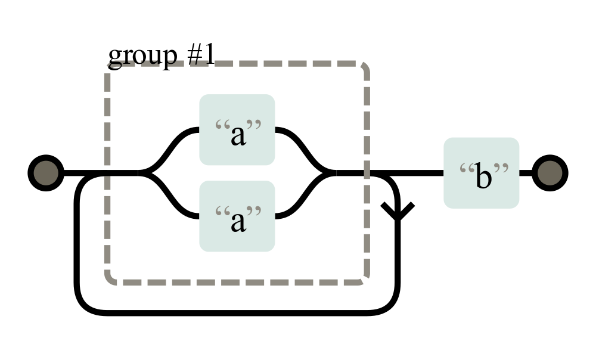

<figure class="wp-caption aligncenter img-thumbnail">
<a href="../images/2022/03/redos-title.png"></a>
<figcaption class="text-center">A redos example</figcaption>
</figure>
Regular expressions (RegEx) are a formal language to define simple patterns. It is commonly used to find interesting parts within a larger body of text or to validate data. It is typically fast and sometimes a clean solution. However, in some cases, an attacker can craft input to a vulnerable regular expression which causes the time to check the input for the regex to be way longer than expected.

## Why you should care

I’ve only found one example of a successful ReDoS “attack”. In 2016, 34 minutes of outage of StackOverflow was caused by ReDoS ([source](https://stackstatus.net/post/147710624694/outage-postmortem-july-20-2016)).

[Wikipedia](https://en.wikipedia.org/wiki/ReDoS) and [OWASP](https://owasp.org/www-community/attacks/Regular_expression_Denial_of_Service_-_ReDoS) don’t mention a single successful attack. I guess the reason for that is that RegEx is not used that often on the server-side 🤷‍♂️ There are a [lot of parsing tools](https://nedbatchelder.com/text/python-parsers.html) for Python, but I only vaguely remember using [pyparsing](https://github.com/pyparsing/pyparsing) once.

In many cases when you might want to use a regex, doing it completely correctly is just overkill. For example, [email regexes](https://stackoverflow.com/questions/201323/how-can-i-validate-an-email-address-using-a-regular-expression). Instead of jumping in that rabbit hole, you can just do some super basic checks, e.g. if the length is at least 3 and if there is exactly one @ symbol in there. Then you just send a confirmation email which verifies that the user actually has access to this email address.

For URLs, you can typically just ping them. For HTML, you want to use an HTML parser. For many other cases, using split goes a long way.

What I want to say: It might be that you don’t need to worry as you might not use RegEx in most of your code. It’s interesting nevertheless 😁

## An Introduction to PCRE

Perl Compatible Regular Expressions (PCRE) are the most common style of regular expressions. They are a way to specify types of strings. They are way more specific than just wildcard pattern matching.

For example, the following pattern matches first a single uppercase letter and then arbitrary many lowercase letters:

```text
[A-Z][a-z]*
```

The characters within the square brackets [...] define the character class. In this case, all characters from A to Z . The * is a quantifier and means “at least zero, but up to arbitrary many”.

## RegEx Engines

You’ve seen in the previous section how regular expressions are written. Next you need to get a grasp of how it’s checked if a regular expression matches a given text. That’s done by a RegEx engine.

The RegEx engine of Python uses **recursive backtracking**, which can have exponential asymptotic execution time (see [Optimizing Unicode Regular Expression Evaluation with Previews](https://eprints.whiterose.ac.uk/109809/1/jsre_journal_accepted_author_manuscript.pdf)). There are engines like [pyre2](https://github.com/facebook/pyre2) which use the [Thompson NFA algorithm](https://swtch.com/~rsc/regexp/regexp1.html). The only reason I see for using the backtracking algorithm are backreferences, e.g. when you want to check if a word is duplicated. you can recognize those by \1 or similar in the regex.

The idea of recursive backtracking is to match the string step-by-step. It keeps a list of possibilities that could match and eliminates them step-by-step.

## How does a ReDoS Attack work?

Think about the regular expression (a|a)+b as represented here:

](https://cdn-images-1.medium.com/max/2000/1*5udiwCeCPAb8YDTsTZ4boA.png)*Non-deterministic finite automaton (NFA) representation of the regex “(a|a)+b”. Created via [regexper.com](https://regexper.com/)*

<figure class="wp-caption aligncenter img-thumbnail">
<a href="../images/2022/03/regex-automaton.png"></a>
<figcaption class="text-center">Non-deterministic finite automaton (NFA) representation of the regex “(a|a)+b”. Created via regexper.com</figcaption>
</figure>

Although both sides of the first group are identical — just “a” — the recusive backtracking algorithm will still keep track of both possible matches. Meaning with every “a” in the input, it doubles the possible paths to match. Meaning if you have 26 times a, there will be 2²⁶ = 67,108,864 paths to evaluate:

```python
import re

pattern = re.compile("**(a|a)+b**")
evil_input = "aaaaaaaaaaaaaaaaaaaaaaaaaa"
if pattern.match(evil_input):
    print("💣🧨💥")
```

Executing this takes almost 7 seconds on my machine — impressively fast considering the number of possible options, but extremely slow if you remember that you can see at a single glance that this string cannot match.

If you have a vulnerable regular expression — also called “evil regex” — and an input that causes the exponential matching time, the machine will take quite some CPU resources to evaluate the expression on the input. In the worst case, your service will become unavailable to the other users of that machine. The regular expression denial of service attack (ReDOS) was successful.

## How can I prevent ReDos attacks?

If you don’t use regular expressions and don’t provide your users the option to use them, you’re save.

If you use a regular expression engine which does not use backtracking, you should also be save.

Or if your regular expressions are not “evil” you also don’t have this issue. However, recognizing evil regular expressions is hard:
[**How can I recognize an evil regex?**
*Because computers do exactly what you tell them to do, even if it's not what you meant or is totally unreasonable. If…*stackoverflow.com](https://stackoverflow.com/q/12841970/562769)
[**is this regex vulnerable to REDOS attacks**
*Testing on regex101.com shows that there are no combinations of inputs that create runaway checks - but your regex is…*stackoverflow.com](https://stackoverflow.com/questions/58345142/is-this-regex-vulnerable-to-redos-attacks/58347192#58347192)

## What’s next?

In this series about application security (AppSec) we already explained some of the techniques of the attackers 😈 and also techniques of the defenders 😇:

* Part 1: [SQL Injections](https://medium.com/faun/sql-injections-e8bc9a14c95) 😈🐝
* Part 2: [Don’t leak Secrets](https://levelup.gitconnected.com/leaking-secrets-240a3484cb80) 😇
* Part 3: [Cross-Site Scripting (XSS)](https://levelup.gitconnected.com/cross-site-scripting-xss-fd374ce71b2f) 😈🐝
* Part 4: [Password Hashing](https://levelup.gitconnected.com/password-hashing-eb3b97684636) 😇
* Part 5: [ZIP Bombs](https://medium.com/bugbountywriteup/zip-bombs-30337a1b0112) 😈
* Part 6: [CAPTCHA](https://medium.com/plain-and-simple/captcha-500991bd90a3) 😇
* Part 7: [Email Spoofing](https://medium.com/bugbountywriteup/email-spoofing-9da8d33406bf) 😈
* Part 8: [Software Composition Analysis](https://medium.com/python-in-plain-english/software-composition-analysis-sca-7e573214a98e) (SCA) 😇
* Part 9: [XXE attacks](https://medium.com/faun/xxe-attacks-750e91448e8f) 😈🐝
* Part 10: [Effective Access Control](https://levelup.gitconnected.com/effective-access-control-331f883cb0ff) 😇
* Part 11: [DOS via a Billion Laughs](https://medium.com/bugbountywriteup/dos-via-a-billion-laughs-9a79be96e139) 😈
* Part 12: [Full Disk Encryption](https://medium.com/faun/full-disk-encryption-2090489f9760) 😇
* Part 13: [Insecure Deserialization](https://medium.com/bugbountywriteup/insecure-deserialization-5c64e9943f0e) 😈
* Part 14: [Docker Security](https://levelup.gitconnected.com/docker-security-5f4df118948c) 😇
* Part 15: [Credential Stuffing](https://levelup.gitconnected.com/credential-stuffing-ff58ee8c3320) 😈🐝
* Part 16: [Multi-Factor Authentication](https://medium.com/plain-and-simple/multi-factor-authentication-cefff819be95) (MFA/2FA) 😇
* Part 17: ReDoS 😈

The following articles are about to come:

* Part 18: Secure Messaging 😇
* Part 19: Cryptojacking 😈
* Part 20: Backups 😇
* Part 21: Cryptotrojans 😈
* Part 22: Single-Sign-On 😇
* Part 23: Clipboard Hijacking 😈
* Part 24: Certificates 😇
* Part 25: Race Condition Attacks in Blockchains 😈
* Part 26: Mobile Device Management (MDM) 😇
* Part 27: Server-Side Request Forgery (SSRF) 😈
* Part 28: Network Separation 😇
* Part 29: Social Engineering (including Phising) 😈
* Part 30: Virtual Private Networks (VPNs) 😇
* Part 31: CSRF 😈

Let me know if you are interested in more articles around AppSec / InfoSec!

I love writing about software development and technology 🤩 Don’t miss updates: [**Get my free email newsletter](https://martinthoma.medium.com/subscribe)** 📧 or [sign up for Medium](https://martinthoma.medium.com/membership) ✍️ if you haven’t done it yet — both encourage me to write more 🤗
