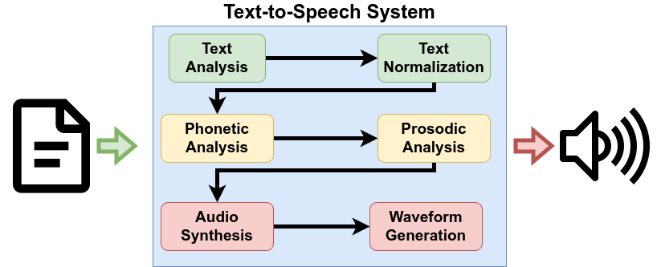

<figure class="wp-caption aligncenter img-thumbnail">
<a href="../images/2023/02/tts-pipeline.drawio.png"></a>
<figcaption class="text-center">A Text-to-Speech pipeline</figcaption>
</figure>

I recently injured my eye during a hike. Don’t worry, it’s be fine soon — but it made me think about text-to-speech (TTS) software again. You probably all know the robotic voices that can read text, but are extremely hard to understand:

<iframe width="100%" height="166" scrolling="no" frameborder="no" allow="autoplay" src="https://w.soundcloud.com/player/?url=https%3A//api.soundcloud.com/tracks/1453260838&color=ff5500"></iframe><div style="font-size: 10px; color: #cccccc;line-break: anywhere;word-break: normal;overflow: hidden;white-space: nowrap;text-overflow: ellipsis; font-family: Interstate,Lucida Grande,Lucida Sans Unicode,Lucida Sans,Garuda,Verdana,Tahoma,sans-serif;font-weight: 100;"><a href="https://soundcloud.com/martin-thoma-172139021" title="Martin Thoma" target="_blank" style="color: #cccccc; text-decoration: none;">Martin Thoma</a> · <a href="https://soundcloud.com/martin-thoma-172139021/mark-twain-the-awful-german-language-by-espeak-ng" title="eSpeak NG: &quot;The Awful German Language&quot; by Mark Twain" target="_blank" style="color: #cccccc; text-decoration: none;">eSpeak NG: &quot;The Awful German Language&quot; by Mark Twain</a></div>

This article guides you through the process of utilizing an improved text-to-speech system. Here, you will find complete, functional code that can be executed locally, as well as access to scientific publications for a deeper understanding. Audio examples will illustrate the notable advancements made in recent years. Without further ado, let’s delve into the topic at hand!

## The old Stuff: pyttsx3 and eSpeak

After installing the necessary requirements for [pyttsx3](https://github.com/nateshmbhat/pyttsx3#installation-), you can use the following Python snippet to generate the audio sample from above:

```python
import sys
from pathlib import Path

import pyttsx3 as tts  # pip install pyttsx3==2.90

# Get the data
with open(sys.argv[1]) as fp:
    data = fp.read()
print(data)

engine = tts.init()

# engine.say(data)  # say it directly
engine.save_to_file(data, Path(sys.argv[2]).resolve())  # store to file

engine.runAndWait()
```

pyttsx3 is just using the [eSpeak NG](https://en.wikipedia.org/wiki/ESpeak) speech synthesizer. It uses formant synthesis. That technique was developed around 1995 with the “Speak” software by Jonathan Duddington.

## The Stages of the Text-To-Speech Pipeline

A text-to-speech (TTS) pipeline contains the following steps:

* **Text Analysis**: Find sentence boundaries. Part-of-speech tagging (POS tagging) means that every word gets categorized with its grammatical role in the sentence (subject, verb, object). This helps to distinguish homographs like wind (blowing air) and wind (turn or twist).
* **Text Normalisation**: Convert abbreviations like “e.g.” and units like “°C” into their full form.
* **Phonetic Analysis**: Generate a sequence of phonemes. Those are similar to letters, but describe sounds. For example, the word “phoneme” would be written as /ˈfoʊniːm/. The wind (blowing air) is /wɪnd/ whereas the wind (turn or twist) is /waɪnd/. The phonetic analysis might simply be a dictionary lookup (e.g. via [CMUdict](http://www.speech.cs.cmu.edu/cgi-bin/cmudict)), but if the word is not found it becomes more complex. Then letter-to-sound (LTS) rules kick in.
* **Prosodic Analysis**: Figure out what to stress, how the intonation should be, and how the rhythm of the generated speech should be. The [ToBI](https://en.wikipedia.org/wiki/ToBI) annotation system can be used.
* **Audio synthesis**: The acoustic model typically generates mel-spectrograms as an input for the waveform generation. This is a high-level acoustic representation.
* **Waveform Generation**: The vocoder takes the high-level acoustic representation and converts it into a waveform that can be played as sound.

You can see that the first parts — text analysis and normalization — are clearly natural language processing. Waveform generation is rather digital speech processing. And the rest is somewhere in between.

## WaveNet: What Google Speech Services are using

The [WaveNet paper](https://arxiv.org/abs/1609.03499) was published in 2016 by Google (DeepMind) and it drastically improved audio synthesis and waveform generation. The change of approach is to use data to learn how text should sound, whereas formant synthesis uses knowledge and manual analysis to describe how the sounds are generated.

Listen for yourself:

<iframe width="100%" height="166" scrolling="no" frameborder="no" allow="autoplay" src="https://w.soundcloud.com/player/?url=https%3A//api.soundcloud.com/tracks/1453260838&color=ff5500"></iframe><div style="font-size: 10px; color: #cccccc;line-break: anywhere;word-break: normal;overflow: hidden;white-space: nowrap;text-overflow: ellipsis; font-family: Interstate,Lucida Grande,Lucida Sans Unicode,Lucida Sans,Garuda,Verdana,Tahoma,sans-serif;font-weight: 100;"><a href="https://soundcloud.com/martin-thoma-172139021" title="Martin Thoma" target="_blank" style="color: #cccccc; text-decoration: none;">Martin Thoma</a> · <a href="https://soundcloud.com/martin-thoma-172139021/mark-twain-the-awful-german-language-by-espeak-ng" title="eSpeak NG: &quot;The Awful German Language&quot; by Mark Twain" target="_blank" style="color: #cccccc; text-decoration: none;">eSpeak NG: &quot;The Awful German Language&quot; by Mark Twain</a></div>

You can use Google Text-to-Speech (TTS) to generate it:

```python
import sys

from gtts import gTTS  # pip install gtts

# Get the data
with open(sys.argv[1]) as fp:
    text = fp.read()

# Generate an mp3
tts = gTTS(text=text, lang="en")
filename = "gtts-text.mp3"
tts.save(filename)
```

The core innovation of WaveNet compared to formant synthesis was to use a machine learning approach — deep neural networks — for generating raw audio waveforms. Please note that there were other breakthroughs between the two methods.

It’s good, but it’s an external service. You might want to actually generate it on your machine so that nobody else can get your data. Additionally, 2016 is already 8 years ago. A lot has happened in ML since.

## End-to-End Deep Learning

Deep learning has not only improved waveform generation but also the other parts. To cite from the Tacotron paper:
> # Tacotron [is] an end-to-end generative text-to-speech model that synthesizes speech directly from characters.

A few other papers in this context are:

* 2017 (Google): [Tacotron](https://arxiv.org/abs/1703.10135) and [Tacotron 2](https://ai.googleblog.com/2017/12/tacotron-2-generating-human-like-speech.html). Tacotron takes a text sequence and outputs a feature vector sequence that can be given to WaveNet.
* 2017 (Baidu): [Deep Voice 3](https://arxiv.org/abs/1710.07654) is a neural-network based approach for the acoustic model (the audio synthesis) just like Tacotron. Where Tacotron uses a recurrent neural network (RNN), Deep Voice 3 uses an attention-based approach.
* 2019 (Microsoft): [FastSpeech](https://arxiv.org/abs/1905.09263) improves the inference speed compared to Deep Voice 3.
* 2020 (Kakao): [Glow-TTS](https://arxiv.org/abs/2005.11129) speeded-up the training method of the used neural network.
* 2021 (KAIST): [VITS](https://arxiv.org/pdf/2106.06103.pdf) (Variational Inference with adversarial learning for end-to-end Text-to-Speech) improves the generated audio quality.

Let’s judge VITS for yourself:

<iframe width="100%" height="166" scrolling="no" frameborder="no" allow="autoplay" src="https://w.soundcloud.com/player/?url=https%3A//api.soundcloud.com/tracks/1453478362&color=ff5500"></iframe><div style="font-size: 10px; color: #cccccc;line-break: anywhere;word-break: normal;overflow: hidden;white-space: nowrap;text-overflow: ellipsis; font-family: Interstate,Lucida Grande,Lucida Sans Unicode,Lucida Sans,Garuda,Verdana,Tahoma,sans-serif;font-weight: 100;"><a href="https://soundcloud.com/martin-thoma-172139021" title="Martin Thoma" target="_blank" style="color: #cccccc; text-decoration: none;">Martin Thoma</a> · <a href="https://soundcloud.com/martin-thoma-172139021/vits-the-awful-german-language-by-mark-twain" title="VITS: &quot;The Awful German Language&quot; by Mark Twain" target="_blank" style="color: #cccccc; text-decoration: none;">VITS: &quot;The Awful German Language&quot; by Mark Twain</a></div>

Thanks to CoquiTTS ([web demo](https://huggingface.co/spaces/coqui/CoquiTTS)) you can now use this as a complete TTS system to generate this on your machine:

```python
import sys

from TTS.api import TTS  # pip install TTS


def get_text() -> str:
    with open(sys.argv[1]) as fp:
        text = fp.read()
    text = text.replace("”", '"').replace("“", '"')
    return text


def gen(model_name: str, text: str, out_file: str) -> None:
    # Init TTS with the target model name
    tts = TTS(model_name=model_name, progress_bar=False, gpu=False)
    print("#" * 80)
    print(f"model={model_name}")
    print(f"speakers={tts.speakers}")
    print(f"languages={tts.languages}")
    speaker = None
    if tts.speakers is not None:
        speaker = tts.speakers[0]

    # Select language and speaker
    if speaker == "":
        speaker = None
    language = None
    if tts.languages:
        language = "en"

    # Generate it!
    tts.tts_to_file(text=text, speaker=speaker, language=language, file_path=out_file)


if __name__ == "__main__":
    model_name = "tts_models/en/ljspeech/vits--neon"
    speaker = ""
    if len(sys.argv) < 3:
        out_file = f"coqui.wav"
    else:
        out_file = sys.argv[2]
    # if you want to see which models are available: TTS.list_models()
    gen(model_name=model_name, text=get_text(), out_file=out_file)
```

## Summary

In this article, you have learned the basics of text-to-speech systems. You have enough entry-points that you make a deep-dive and you have complete code so that you can play around with existing systems.

Have fun!

## Additional Resources

* [German Text-to-Speech](http://ttssamples.syntheticspeech.de/): Lots of audio samples for many TTS systems.
* Andrew Gibiansky: [WaveNet and Tacotron aren’t TTS systems](https://andrew.gibiansky.com/wavenet-and-tacotron-arent-tts-systems/), 2020.

I love writing about software development and technology 🤩 Don’t miss updates: [**Get my free email newsletter](https://martinthoma.medium.com/subscribe)** 📧 or [sign up for Medium](https://martinthoma.medium.com/membership) ✍️ if you haven’t done it yet — both encourage me to write more 🤗
