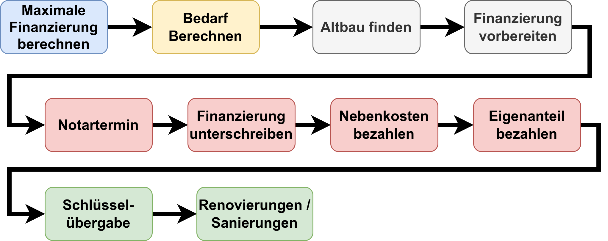

Wer sich zum ersten Mal über ein Eigenheim Gedanken macht ist erst mal überfordert.
Es gibt einfach zu viele Themen, die man abdecken muss. Daher hier mal eine
Schritt-für-Schritt Anleitung.

Ich bin kein Profi, sondern nur ein interessierter Laie, der sich 2022 intensiv
mit dem Thema Hausbau / Hauskauf und Finanzierung auseinandergesetzt hat.

Ich rede nur von freistehenden Einfamilienhäusern für den Eigenbedarf. Keine
Wohnungen, keine Mehrfamilienhäuser, keine Doppelhaushälften, kein Nießbrauchrecht,
keine Erbpacht, kein Denkmalschutz, keine Gewerbe-Einheiten, keine vermieteten
Einliegerwohnungen.

<figure class="wp-caption aligncenter img-thumbnail">

<figcaption class="text-center">Der Fahrplan zum Projekt Eigenheim - beim Altbau</figcaption>
</figure>

## 1. Maximale Finanzierung berechnen

Bei der Finanzierung gibt es erstaunlich wenige relevante Fragen:

1. **Eigenkapital**: Wie viel Geld kann man für das Haus direkt selbst bezahlen?
   Hier kann man ggf. bei einem Neubau das sog. "Muskelkapital" mit einbringen,
   wenn man ein paar Sachen in Eigenleistung erbringen kann. Ein Beispiel
   wären Malerarbeiten.
2. **Einkommen**: Die Bank lässt typischerweise ca. 1/3 des Netto-Einkommens als
   verfügbares Einkommen für einen Kredit zu.

Nun wird bei einem Annuitäten-Darlehen typischerweise eine 2%-Tilgung angenommen;
hinzu kommt die Zinszahlung.

Die Formel lautet:

$$
\begin{align}
\text{Finanzierungsbedarf}&=\text{Hauspreis} - \text{Eigenkapital}\\
\\
\text{Maximale Rate} &= (2\% + \text{Sollzins}) \cdot \text{maximale Finanzierung}\\
\Leftrightarrow \frac{\text{Nettojahresgehalt}}{3} &= \frac{2 + \text{Sollzins}}{100} \cdot \text{maximale Finanzierung}\\
\Leftrightarrow \text{maximale Finanzierung} &= \frac{\text{Nettojahresgehalt}}{3} \cdot  \frac{100}{2 + \text{Sollzins}}
\end{align}
$$

Man muss zusätzlich mindestens 11% des Kaufpreises als Eigenkapital mitbringen.
Das sind die Kaufnebenkosten. Wenn man nur diese bezahlt spricht man von einer
100%-Finanzierung.

Die maximale Rate mit 1/3 des Monatsgehalts anzusetzen kann natürlich auch
deutlich daneben liegen. Das hängt von den persönlichen Verpflichtungen ab.

**Beispiel**: Man kauft einen Altbau für 450k EUR. Dann kommen da nochmals 11% Kaufnebenkosten
(Makler, Notar, Grundbucheintrag, Grunderwerbssteuer) oben drauf. Also ca. 500k EUR.
Angenommen man bringt **150k EUR Eigenkapital** mit ein. Dann hat man einen
Finanzierungsbedarf von 350k EUR. In der Altersgruppe von 35-39 ist ein Haushalt
ohne Partner damit in den Top-20% ([faz.net](https://www.faz.net/aktuell/wirtschaft/wie-reich-bin-ich-vermoegen-im-vergleich-17016897.html)).

Wenn man also einen **350.000 EUR Kredit** aufnimmt und
einen **4% Zins** von bekommt, so muss man eine Rate von 6% von 350.000 pro Jahr
leisten können. Das sind 21k EUR / Jahr oder **1750 EUR/Monat**.

Damit die Bank einen solchen Kredit gibt, muss man also ein regelmäßiges Netto-Einkommen
von 3·1750 EUR/Monat = 5250 EUR/Monat vorweisen können. Das sind Brutto ca. 9100 EUR/Monat;
siehe [nettolohn.de](https://www.nettolohn.de/rechner/netto-brutto-ergebnis).
Damit zählt man als Vollzeit-Arbeitnehmer ohne Kinder zu den Top-3% ([iwkoeln.de](https://www.iwkoeln.de/fileadmin/user_upload/HTML/2019/einkommensverteilung/index.html)).

Mit dieser Rate würde man...

* Nach 1 Jahr: 343k EUR Restschuld
* Nach 2 Jahren: 336k EUR Restschuld
* Nach 3 Jahren: 328k EUR Restschuld
* Nach 5 Jahren: 303k EUR Restschuld
* Nach 10 Jahren: 264k EUR Restschuld
* Nach 15 Jahren: 206k EUR Restschuld
* Nach 20 Jahren: 136k EUR Restschuld
* Nach 25 Jahren: 50k EUR Restschuld
* Nach 28 Jahren: abbezahlt

Man sieht hier schon eine schöne weitere Sache: Über 35 bekommt man den Kredit
wohl eher nicht, weil man ihn in der Lebenszeit kaum abbezahlen kann.

**Wo bekomme ich die Finanzierung?**

Es gibt zwei Portale bieten kostenlos eine Finanzierungsvermittlung:

* [Dr Klein](https://www.drklein.de/)
* [Interhyp](https://www.interhyp.de/)

Die Portale bekommen bei der Vermittlung eine Provision von der Bank.

## 2. Flächenbedarf Berechnen

Bevor man das Haus plant, sollte man wissen, wie viel Haus man braucht. Hier
eine sehr grobe Einordnung:

* 47.7m²/Person ist 2021 der Durchschnitt in Deutschland ([Quelle](https://de.statista.com/statistik/daten/studie/36495/umfrage/wohnflaeche-je-einwohner-in-deutschland-von-1989-bis-2004/))
* 70m² für zwei Personen würde ich als komfortabel einordnen.
* 140m² für vier Personen funktioniert auch gut

Ob ein konkretes Haus allerdings für die gewünschte Personenzahl gut funktioniert
ist stark vom Schnitt der Wohnung / des Hauses abhängig.

Hier ein paar einzelne "ideale" Raumgrößen:

* **Eltern-Schlafzimmer** (12m² = 3m x 4m): Groß genug um ein Doppelbett mit Kommode
  aufzustellen, und gleichzeitig einen großen Kleiderschrank zu haben.
* **Kinder-Schlafzimmer** (16m² = 4m x 4m): Im Gegensatz zu den Eltern verbringt
  das Kind einen Großteil der Zeit im Kinderzimmer. Ein Schreibtisch muss hier
  Platz finden.
* **Essen+Wohnen** (40m²)
* **Kochen** (12m²)
* **Bad** (8m²)

## 3. Immobilie finden

Theoretisch kann man auch einen Neubau versuchen... aber das ist einfach viel
zu teuer. Zusätzlich sind Handwerker aktuell ziemlich rar. Und von Lieferzeiten
wollen wir mal gar nicht reden.

Beim Neubau ist man ca. bei 700k EUR, beim Altbau bei 500k EUR. Ist natürlich
extremst vereinfacht und ein unfairer vergleich, aber das soll ja auch nur eine
Größenordnung geben.

### Neubau

Bei einem Neubau muss man das Grundstück und das Haus bezahlen.
Die Grundstückspreise variieren sehr nach Region.

Man sollte bei einem Neubau mit 200k EUR fürs Grundstück und 500k EUR fürs
Haus rechnen.

#### Das Grundstück

Am oberen Ende: In München bezahlt man 2023 im Durchschnitt 3374 EUR/m² ([Quelle](https://www.aktuelle-grundstueckspreise.de/deutschland/bayern/muenchen-landeshauptstadt)), in Augsburg 1212 EUR/m² ([Quelle](https://www.aktuelle-grundstueckspreise.de/deutschland/bayern/augsburg-stadt)), und in Bayreuth 245 EUR/m² ([Quelle](https://www.aktuelle-grundstueckspreise.de/deutschland/bayern/bayreuth-stadt))

Am unteren Ende: In Hof bezahlt man 2023 im Durchschnitt 62 EUR/m² ([Quelle](https://www.aktuelle-grundstueckspreise.de/deutschland/bayern/hof-stadt)), Wunsiedel 49 EUR/m² ([Quelle](https://www.aktuelle-grundstueckspreise.de/deutschland/bayern/wunsiedel-i-fichtelgebirge)), und Lichtfels 89 EUR/m² ([Quelle](https://www.aktuelle-grundstueckspreise.de/deutschland/bayern/lichtenfels)).

Die Größe des Grundstücks bestimmt zusammen mit dem Bebauungsplan, wie groß das
Haus sein darf. Im Bebauungsplan legt die Stadt fest, wie viele Stockwerke man
bauen darf und wie viel Prozent der Grundfläche bebaut werden dürfen. Ich würde
das so einordnen:

* 250m² - 350m²: Kleine Grundstücke
* 350m² - 600m²: Mittelgroße Grundstücke
* 600m² - 1200m²: Große Grundstücke

Allein beim Grundstück ist man also irgendwo zwischen 12.500 EUR - 4 Millionen
EUR. Realistisch gesehen wird man unter 200k EUR kaum ein gutes Grundstück in
akzeptabler Lage finden - außer man akzeptiert das komplette Dorfleben fernab
von jeder Stadt.

Zusätzlich ist der Markt nicht liquide. Man findet kein Grundstück in genau der
gewünschten Größe / mit genau den gewünschten Maßen.

#### Das Haus

Die Kosten vom Haus sind von sehr vielen Faktoren abhängig:

* **Wohnfläche**: Je mehr Wohnfläche, desto mehr Wände müssen aufgestellt und gestrichen werden.
  Mehr Stromleitungen müssen verlegt und Steckdosen gesetzt werden. Mehr Fenster
  und Türen sind fällig.
* **Qualität**: Soll das Haus im Passivhaus-Standard
  ausgeführt werden oder nur ein KfW-55 Haus sein? Will man pro
  Zimmer eher 2 Steckdosen oder doch lieber 8? Will man die Wände Q1 / Q2 / Q3 / Q4
  gespachtelt haben?
* **Keller**: Will man einen Keller oder nur eine Bodenplatte?
* **Garage**: Soll eine Garage oder ein Carport gebaut werden?
* **Außenarbeiten**: Wird die Einfahrt geteert oder gepflastert? Wird der Garten
  gemacht?

Als Daumenregel bei mittlerer bis guter Qualität kann man mit 3500 EUR/m²
Wohnfläche rechnen. Baut man also ein Haus für zwei Erwachsene und zwei Kinder
mit 140m² so ist man für den Neubau bei 490.000 EUR. Ohne Grundstück.

### Altbau

Sucht man auf [immobilienscout24](https://www.immobilienscout24.de/) nach
Einfamilienhäusern in Bayern, so findet man im März 2023 [über 1000 Ergebnisse](https://www.immobilienscout24.de/Suche/de/bayern/einfamilienhaus-kaufen?price=10000.0-&livingspace=90.0-&energyefficiencyclasses=a,b,c,d,e,a_plus&fulltext=-Erbbauzins,%20-Erbbaurecht,%20-Erbbau,%20-Nie%C3%9Fbrauchbasis,%20-erbpacht,%20-Zwangsversteigerung&exclusioncriteria=projectlisting,foreclosure,unbuilthome&sorting=4&pagenumber=2).

Die Preise variiren von 165.000 EUR für 159m² Wohnfläche / 309m² Grundstück in
Freyung-Grafenau bis zu 10.9 Millionen EUR für 357m² Wohnfläche / 324m² Grundstück
in München (Altbogenhausen).

Ich würde sagen, dass man unter 300k EUR wohl nichts vernünftiges finden wird.
Ab 500k EUR findet man einiges; über 700k wird es leicht.

## 4. Finanzierung vorbereiten

Der Finanzierungsberater sagt was er braucht, aber mit folgendem muss man rechnen:

Über den/die Kreditnehmer:

* Die letzten drei Gehaltsnachweise
* Lohnsteuerbescheinigung
* Einkommenssteuerbescheid
* Schufa-Auskunft
* Nachweise über das Eigenkapital
* Kopie des Personalausweises

Über die Immobilie:

* Inserat
* Adresse
* Größe des Grundstücks
* Wohnfläche / Umbauter Raum
* Baujahr
* Energiebedarf laut Energieausweis
* Heizungs-Typ
* Letzte Modernisierung (Heizungsanlage, Fenster, Fassade, Dach)
* Ausstattung: einfach, marktüblich, oder gehoben?
* Garage: Wie viele Stellplätze? Ist es ein Carport?
* Besonderheiten: Denkmalschutz / Ensembleschutz / Erbbaurecht bzw. Erbpacht?
* Sind Altlasten auf dem Grundstück?
