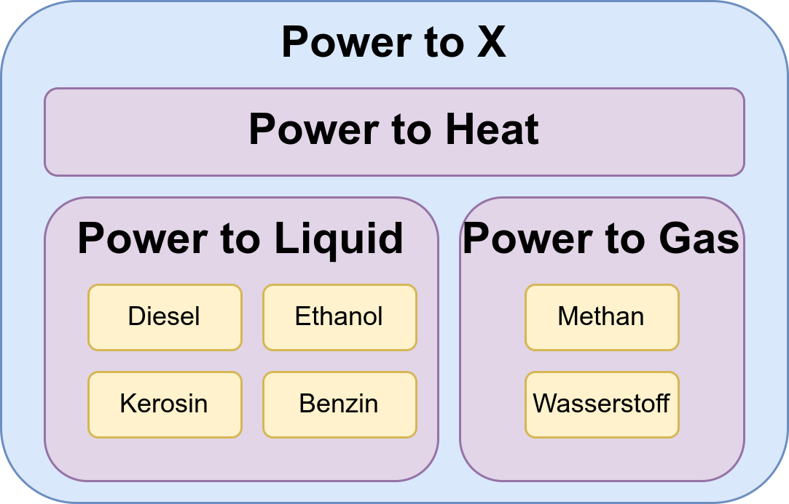

In der Debatte um nachhaltige Energiequellen und umweltfreundliche Mobilität
steht die Eignung von E-Fuels, insbesondere für den Individualverkehr, als
ineffiziente und teure Option fest. Die Kritiker von E-Fuels argumentieren, dass
diese synthetischen Kraftstoffe aufgrund ihrer hohen Kosten und geringen
Effizienz im Vergleich zu Elektrofahrzeugen mit Batterietechnologien für PKWs
ungeeignet sind. Zudem ist die großflächige Produktion von E-Fuels aufgrund der
begrenzten Verfügbarkeit von erneuerbaren Energien und anderen notwendigen
Ressourcen eine Herausforderung.

In diesem Artikel werden wir die Problematik rund um E-Fuels näher beleuchten
und untersuchen, warum sie als ineffiziente und teure Lösung für die
Individualmobilität gelten. Dabei werden wir uns mit den Schwierigkeiten der
E-Fuel-Produktion auseinandersetzen, die Effizienzprobleme in den verschiedenen
Produktionsstufen aufzeigen und die Kostentreiber analysieren. Abschließend
werden wir die Rolle von E-Fuels in einer nachhaltigen Mobilitätszukunft
bewerten und mögliche Alternativen zur Dekarbonisierung des Verkehrssektors
aufzeigen.

2023 sind folgende PKW-Arten in Deutschland zugelassen:<small><a href="#ref6" name="anchor6">[6]</a></small>

* 30,6 Millionen Benzin-PKW
* 14,4 Millionen Diesel-PKW
* 2,3 Millionen Hybrid-PKW
* 1,0 Millionen Elektro-PKW
* 0,3 Millionen Flüssiggas-PKW (auch Autogas oder LPG genannt)
* 0,1 Millionen Erdgas-PKW (CNG)

## E-Fuels und Power-to-X

In der Diskussion rund um E-Fuels gibt es häufig Verwirrung und Vermischungen verschiedener Begriffe. Daher möchte ich hier Klarheit schaffen:

Power-to-X bezieht sich auf die Umwandlung von elektrischer Energie in andere
Energieformen oder chemische Verbindungen. Dies kann zum Beispiel die Umwandlung
in Wärme (Power-to-Heat), ein Gas (Power-to-Gas) oder eine Flüssigkeit
(Power-to-Liquid) sein.

<figure>
    
    <figcaption>Power-to-X: Power-to-Liquid, Power-to-Gas und Power-to-Heat</figcaption>
</figure>

Zudem gibt es unterschiedliche Anwendungsfälle, die wie folgt differenziert
werden können:

* Power-to-Fuel: Hierbei wird die erzeugte Energie für die Mobilität genutzt.
  Typischerweise handelt es sich dabei um Power-to-Liquid, also die Herstellung
  von Benzin oder Diesel. Alternativ kann auch Erdgas oder Wasserstoff erzeugt
  werden.
* Power-to-Chemicals: In diesem Fall sollen chemische Verbindungen wie Methanol
  oder Ammoniak hergestellt werden. Bei Ammoniak spricht man dann spezifisch von
  "Power-to-Ammonia".
* Power-to-Heat: Dieser Anwendungsfall betrifft die Erzeugung von Wärme,
  beispielsweise für die Beheizung von Wohnungen.

Durch die Unterscheidung dieser Anwendungsfälle lassen sich die verschiedenen
Aspekte von E-Fuels und Power-to-X besser einordnen und verstehen.

E-Fuels, von "electrofuel", bezeichnen also synthetische Kraftstoffe, die
mittels elektrischem Strom aus Wasser und Kohlenstoffdioxid (CO2) hergestellt
werden. Ein Kraftstoff ist ein Brennstoff, dessen chemische Energie durch
Verbrennung in Verbrennungskraftmaschinen in mechanische Energie umgewandelt
wird.

Mit E-Fuels will man also etwas antreiben. Es geht also insbesondere weder um
Wärme-Erzeugung noch um Power-to-Chemicals, also Industrieprozesse. Es geht um
Mobilität.

## Die Effizienz

Mit 15 kWh elektrischer Energie kann man mit verschiedenen Fahrzeugtypen
unterschiedlich weite Strecken zurücklegen:<small><a href="#ref2"
name="anchor2">[2]</a></small>

* 100 km mit einem Akku-Elektroauto
* 35 km mit einem Wasserstoffauto mit grünem Wasserstoff
* 15 km mit E-Fuels

Anders ausgedrückt: Elektroautos sind in Bezug auf die zurückgelegte Strecke pro
verbrauchter Energiemenge etwa siebenmal effizienter als Fahrzeuge, die E-Fuels
nutzen. Diese Effizienzunterschiede sind auf den Energieumwandlungsprozess und
die verschiedenen Antriebssysteme der Fahrzeuge zurückzuführen.
Batterieelektrische Fahrzeuge können die elektrische Energie direkt und
effizient nutzen, während Fahrzeuge mit Wasserstoff- und E-Fuel-Antrieb
zusätzliche Energieumwandlungsschritte erfordern, die mit Energieverlusten
einhergehen.

## Die Produktionskapazität

Ich zitiere hier einfach mal <a href="https://www.pik-potsdam.de/members/Ueckerdt">Falko Ueckerdt</a><small><a href="#ref7" name="anchor7">[7]</a></small>:

> E-Fuels sind wahrscheinlich noch lange knapp. Selbst wenn der Markthochlauf so
> schnell passiert wie beim Wachstumschampion Solar-Photovoltaik, würde das
> **globale Angebot** in 2035 nicht einmal ausreichen um die **unverzichtbaren
> deutschen Bedarfe** für Luftverkehr, Schifffahrt und Chemie zu decken.

Wir haben nicht genug E-Fuels. Weltweit! Und dann überlegen wir noch, den PKWs
zu erlauben, E-Fuels zu tanken. Irrsinn.

## Sind E-Fuels sinnvoll?

Hier muss man sehr klar unterscheiden. Wenn man von E-Fuels spricht, meint man
synthetisch hergestellte Kraftstoffe für die Mobilität. Man meint nicht genau
denselben Kraftstoff hergestellt für Industrieanwendungen. Die Frage, ob
Power-to-X sinnvoll ist, ist deutlich weiter gefasst. Darum geht es hier nicht.

Kraftstoffe unterscheiden sich in ihrer Energiedichte:

<table>
    <thead>
        <tr>
            <th>Treibstoff</th>
            <th>Gravimetrische Energiedichte</th>
            <th>Volumetrische Energiedichte</th>
        </tr>
    </thead>
    <tbody>
        <tr>
            <td>Diesel<small><a href="#ref8" name="anchor8">[8]</a></small></td>
            <td>11.83 kWh/kg</td>
            <td>10.00 kWh/L</td>
        </tr>
        <tr>
            <td>Kerosin (Jet-A1)<small><a href="#ref9" name="anchor9">[9]</a></small></td>
            <td>11.9 kWh/kg</td>
            <td>9.5 kWh/L</td>
        </tr>
        <tr>
            <td>Benzin (Super E10)</td>
            <td>12.11 kWh/kg<small><a href="#ref8" name="anchor8">[8]</a></small></td>
            <td>8.76 kWh/L<small><a href="#ref12" name="anchor12">[12]</a></small></td>
        </tr>
        <tr>
            <td>Ethanol</td>
            <td>?</td>
            <td>5.90 kWh/L<small><a href="#ref12" name="anchor12">[12]</a></small></td>
        </tr>
        <tr>
            <td>Wasserstoff<small><a href="#ref8" name="anchor8">[8]</a></small></td>
            <td>33.33 kWh/kg</td>
            <td>3.0 kWh/m³</td>
        </tr>
        <tr>
            <td>Akkus<small><a href="#ref10" name="anchor10">[10]</a>, <a href="#ref11" name="anchor11">[11]</a></small></td>
            <td>0.06 - 0.28 kWh/kg</td>
            <td>0.18 - 0.50 kWh/m³</td>
        </tr>
    </tbody>
</table>

Wofür sollte man also E-Fuels einsetzen?

* ❌ PKWs: Es gibt jetzt schon viele Elektroautos. Ja, die Reichweite könnte
           noch besser sein. Allerdings kann man auch überall Elektroautos
           laden, also ist das nicht wirklich ein Argument.
* ❓ LKWs / Busse: [Volvo FL/FE/FM/FMX/FH Electric](https://www.volvotrucks.de/de-de/trucks/alternative-antriebe/elektro-lkw.html), [MAN eTruck](https://www.man.eu/de/de/lkw/emobilitaet-im-truck/emobilitaet-im-truck.html) und [Tesla Semi](https://www.auto-motor-und-sport.de/elektroauto/tesla-semi-truck-2022-daten-fotos-marktstart-elektro-lkw-reichweite/) sind batterieelektrische LKW. Es gibt zusätzlich noch Wasserstoff-LKW.
* ❓ Schiffe: [Containerschiffe](https://edison.media/erleben/niederlaender-bauen-containerschiff-mit-elektromotor/20904566.html) können wohl auch mit Batterie-Antrieb betrieben werden. Die [Yara Birkeland](https://de.wikipedia.org/wiki/Yara_Birkeland) wurde im April 2022 in Betrieb genommen ([Video](https://www.youtube.com/watch?v=kJiYEG99LVI)).
* ✅ Flugzeuge: Die Energiedichte ist einfach zu gering für große Flugzeuge.
  Es gibt z.B. den vollelektrischen [eDA40](https://www.aerokurier.de/elektroflug/elektroflug-im-test-lufthansa-aviation-training-setzt-auf-eda40/), aber es ist
  absehbar, dass Batterieflugzeuge nie im großen Stil funktionieren werden.

Dass die FDP sich so sehr für E-Fuels einsetzt, hat nach [Lindners und Wissings
Kontakten zu Porsche](https://www.abgeordnetenwatch.de/recherchen/informationsfreiheit/antrag-abgelehnt-lindners-sms-mit-porsche-chef-blume-bleiben-unter-verschluss)
schon ein Geschmäckle. Schauen wir mal, wer Aufsichtsratsposten nach der
Politik-Karriere bekommt.

Update von November 2025: [Lindner wird stellvertretender Vorstandsvorsitzender der Autoland AG](https://www.tagesschau.de/inland/lindner-wechsel-autobranche-100.html)

## Warum ein Verbrenner-Verbot wichtig wäre

Angesichts der drängenden Herausforderungen durch den Klimawandel und des damit
verbundenen Bedarfs nach einer Reduktion der CO2-Emissionen wird das Verbot von
Verbrennungsmotoren immer dringlicher. Verbrennungsmotoren tragen maßgeblich zur
Erderwärmung bei, und ihre Fortführung steht im Widerspruch zu den globalen
Klimazielen.

E-Fuels, die als mögliche Alternative zu fossilen Brennstoffen diskutiert
werden, sind jedoch nicht in ausreichenden Mengen sicher produzierbar. Außerdem
verursacht die Produktion von E-Fuels hohe Kosten.

Ein Verbot von Verbrennungsmotoren würde eine schnelle Marktlenkung bewirken,
die weit effektiver wäre als die alleinige Schaffung von Preisanreizen. So
könnte die Elektromobilität als effiziente Alternative schneller etabliert
werden. Wenn wir jetzt nicht entschieden gegen Verbrennungsmotoren vorgehen,
werden sie noch lange im Einsatz bleiben und eine substanzielle Umstellung des
Verkehrssektors erschweren.

Infolgedessen könnten wir gezwungen sein, E-Fuels gerade wegen ihrer
Kostennachteile zu subventionieren, um den Klimazielen zumindest teilweise
gerecht zu werden – eine wenig nachhaltige Lösung angesichts der drängenden
Notwendigkeit, den Klimawandel einzudämmen und unsere Mobilität
umweltfreundlicher zu gestalten. Die FDP bereitet das schon vor.<small><a href="#ref1" name="anchor1">[1]</a></small>
Neben den 1,9 Milliarden Euro
an Förderung für die Entwicklung von E-Fuels<small><a href="#ref3" name="anchor3">[3]</a></small>, versteht sich. Wir reden hier von 310 Milliarden€ an
zusätzlichen Kosten.<small><a href="#ref4" name="anchor4">[4]</a></small>
Bei 45,8 Millionen Benzin-/Diesel-PKW macht das fast 6769€ an Subventionen
für jeden einzelnen Verbrenner-PKW.

## Wer ist gegen E-Fuels für PKW?

* [Das Fraunhofer-Institut für System- und Innovationsforschung](https://www.isi.fraunhofer.de/de/presse/2023/presseinfo-05-efuels-nicht-sinnvoll-fuer-pkw-und-lkw.html)
* Die Grünen: [Synthetische Kraftstoffe](https://www.gruene-bundestag.de/parlament/bundestagsreden/synthetische-kraftstoffe) (Cem Özdemir, 2021)
* SPD:
    * Detlef Müller: [Verbrenner-Aus: Kein Weg an E-Mobilität vorbei](https://www.spdfraktion.de/presse/statements/verbrenner-kein-weg-e-mobilitaet-vorbei), 2022.
* Audi:
    * [Audi in der Offensive: neues Elektro-Einstiegsmodell, neue Namen und neue Verbrenner](https://www.autobild.de/artikel/markus-duesmann-ceo-audi-und-oliver-hoffmann-cto-audi-zukunft-von-audi.-e-autos.-e-fuels.-verbrenner-verbot.-modellbezeichnungen.-22597021.html)

## Wer ist für E-Fuels für PKW?

* FDP: [Weg für E-Fuels in Deutschland ist frei](https://www.fdp.de/weg-fuer-e-fuels-deutschland-ist-frei) (28.02.2023)
    * Volker Wissing
    * Christian Lindner: "[...] Künftig dürfen in 🇩🇪 Verbrenner mit #eFuels betankt werden. Diese Technologieoffenheit brauchen wir auf Dauer." ([Tweet, 28.02.2023](https://twitter.com/c_lindner/status/1630507548821409794))
    * Bettina Stark-Watzinger: "[...] Deshalb setzen wir uns weiter für #eFuels ein. Wir schaffen jetzt die rechtliche Grundlage, damit sie auch normal an der Tankstelle getankt werden können." ([Tweet, 28.02.2023](https://twitter.com/starkwatzinger/status/1630510237886078977))
    * Judith Skudelny: [Positionspapier: "Synthetische Kraftstoffe"](https://www.judith-skudelny.de/positionspapier-synthetische-kraftstoffe), 2020; [Durchbruch für die klimaneutrale Mobilität](https://www.tagesspiegel.de/politik/durchbruch-fur-die-klimaneutrale-mobilitat-ampel-parteien-einigen-sich-auf-zulassung-von-e-fuels-fur-verbrenner-9428078.html), 2023.
* SPD: In der Diskussion um E-Fuels hat der Kanzler Olaf Scholz den
  Verkehrsminister Wissing gewähren lassen.<small><a href="#ref4" name="anchor4">[4]</a></small>
* ADAC: [Synthetische Kraftstoffe: Sind E-Fuels die Zukunft der Mobilität?](https://www.adac.de/verkehr/tanken-kraftstoff-antrieb/alternative-antriebe/synthetische-kraftstoffe/), 2023
* Volkswagen: [Volkswagen will künftig auch auf E-Fuels setzen](https://efuel-today.com/volkswagen-will-kuenftig-auch-auf-e-fuels-setzen/)
    * Porsche ist seit 2012 Teil des Volkswagen-Konzerns (die Übernahme wurde 2009 vereinbart)

## Fazit

Die FDP betreibt hier eine absurde Politik aus Ideologiegründen. Ja, es wäre
wünschenswert, wenn man den Markt das regeln lassen könnte und wir alle frei
Entscheidungen treffen könnten. <a href="https://de.wikipedia.org/wiki/Rahmen%C3%BCbereinkommen_der_Vereinten_Nationen_%C3%BCber_Klima%C3%A4nderungen">Seit 1992</a> hätte der Markt das regeln können, aber es haben die Anreize gefehlt. Nun
müssen wir schneller handeln, als es normale Preisanreize könnten.

Eine Möglichkeit, um dies zu erreichen, besteht darin, die Kosten auf die
Hersteller zu übertragen: Wenn ein Verbrennungsmotor verkauft wird, könnte der
Verkäufer verpflichtet werden, die Mehrkosten im Verbrauch im Vergleich zu einem
Elektroauto über die Lebensdauer des Fahrzeugs zu tragen.

Eine andere Möglichkeit besteht darin, die Kosten durch eine transparente
[Energieverbrauchskennzeichnung](https://de.wikipedia.org/wiki/Energieverbrauchskennzeichnung)
sichtbar zu machen. Hierbei sollte man die bestehenden Kraftstoffgruppen
([Pkw-EnVKV](https://www.gesetze-im-internet.de/pkw-envkv/BJNR103700004.html))
auflösen und stattdessen die benötigte Produktionskapazität in kWh pro 100 km
Fahrtstrecke angeben. In dieser Kennzeichnung sollten die Ineffizienzen bei der
Kraftstoffherstellung, bei der Übertragung der Elektrizität sowie
Batterieverluste berücksichtigt werden.

Beide Ansätze könnten dazu beitragen, den Übergang zu nachhaltigeren
Mobilitätslösungen zu beschleunigen.

## Quellen

* <a name="ref1" href="#anchor1">&uarr;</a> Dietmar Neuerer: [Lindner plant Steuervorteil für Autos mit synthetischen Kraftstoffen – SPD warnt vor „Lex E-Fuels“](https://www.handelsblatt.com/politik/deutschland/klimaschutz-lindner-plant-steuervorteil-fuer-autos-mit-synthetischen-kraftstoffen-spd-warnt-vor-lex-e-fuels/29059352.html), 07.04.2023
* <a name="ref2" href="#anchor2">&uarr;</a> [Wie wird Deutschlands Verkehr klimaneutral?](https://www.dw.com/de/wie-wird-deutschlands-verkehr-klimaneutral-elektromobil-umstieg-schiene-neutral-fliegen/a-55960044) auf dw.com, 17.12.2020
* <a name="ref3" href="#anchor3">&uarr;</a> [Förderung von E-Fuels und Biokraftstoffen](https://www.bundestag.de/presse/hib/kurzmeldungen-928500) auf bundestag.de, 05.01.2023.
* <a name="ref4" href="#anchor4">&uarr;</a> [Scholz springt Wissing beim Verbrenner-Streit zur Seite](https://www.n-tv.de/politik/Auch-Scholz-unterstuetzt-Wissing-nun-im-Streit-um-E-Fuels-article23987069.html) auf n-tv.de, 17.03.2023
* <a name="ref5" href="#anchor5">&uarr;</a> Dennis Fischer: [E-Fuels der „Champagner des Antriebs“? Einführung verschlingt astronomische Summe](https://www.merkur.de/wirtschaft/efuels-verbrenner-aus-eu-autos-studie-verkehr-kraftstoff-mobilitaet-wissing-zr-92179229.html) auf merkur.de, 31.03.2023.
* <a name="ref6" href="#anchor6">&uarr;</a> statista.com: [Anzahl der Personenkraftwagen in Deutschland nach Kraftstoffarten von 2017 bis 2023](https://de.statista.com/statistik/daten/studie/4270/umfrage/pkw-bestand-in-deutschland-nach-kraftstoffarten/), 2023.
* <a name="ref7" href="#anchor7">&uarr;</a> [E-Fuels wahrscheinlich noch lange knapp: PIK Analyse-Papier](https://www.pik-potsdam.de/de/aktuelles/nachrichten/e-fuels-wahrscheinlich-noch-lange-knapp-pik-analyse-papier) auf pik-potsdam.de, 21.03.2023
* <a name="ref8" href="#anchor8">&uarr;</a> [Brennwert](https://www.geothermie.de/bibliothek/lexikon-der-geothermie/b/brennwert.html) auf geothermie.de
* <a name="ref9" href="#anchor9">&uarr;</a> [Kerosin](https://www.chemie.de/lexikon/Kerosin.html) auf chemie.de
* <a name="ref10" href="#anchor10">&uarr;</a> [The 2022 State of Battery Technology](https://martinthoma.medium.com/the-2022-state-of-battery-technology-43f8cb8ece03) von Martin Thoma
* <a name="ref11" href="#anchor11">&uarr;</a> [Energiespeicher der Elektromobilität](https://www.bundestag.de/resource/blob/819220/31128d3d32638f43627fa8a99bd3cb83/WD-8-090-20-pdf-data.pdf) auf bundestag.de, 2020.
* <a name="ref12" href="#anchor12">&uarr;</a> [Was und warum die Verweigerung von E10 kostet](https://www.focus.de/auto/ratgeber/e10/was-und-warum-die-e10-verweigerung-kostet-benzinsorten-erklaert_id_2074559.html) auf focus.de, 2016.
* <a name="ref13" href="#anchor13">&uarr;</a> Wirtschaftsvereinigung Stahl: [Bedeutung von Erdgas für die Stahlindustrie und ihre Transformation](https://www.stahl-online.de/wp-content/uploads/20210526_Positionspapier_Erdgas_Stahlindustrie_WVStahl.pdf), 2021
* Umweltbundesamt: [Dekarbonisierung der Zementindustrie](https://www.umweltbundesamt.de/sites/default/files/medien/376/dokumente/factsheet_zementindustrie.pdf), 2020.
