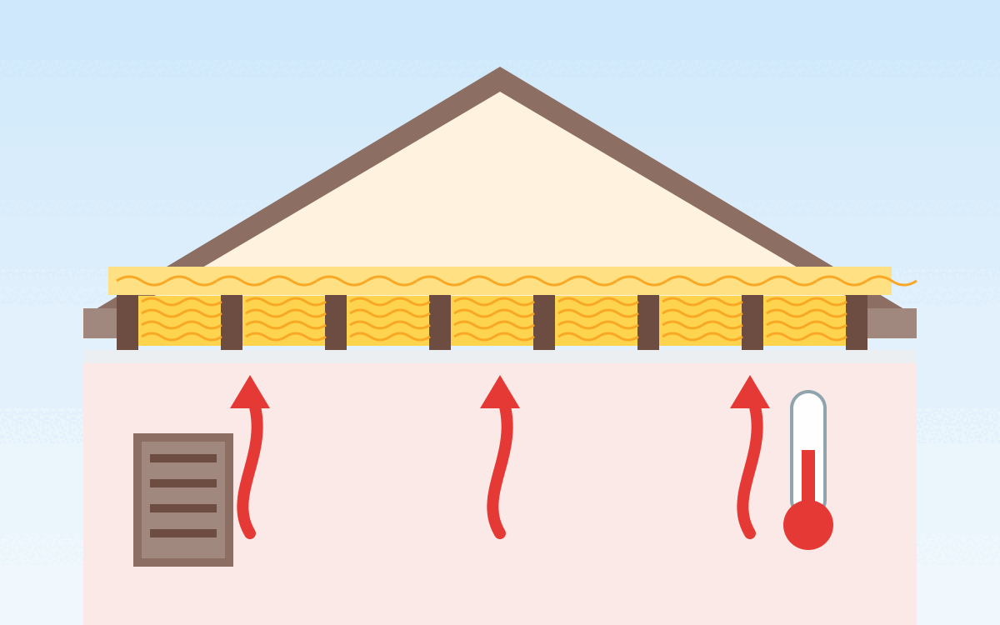

Dämmstoffe haben neben ihrer Dämmwirkung noch weitere relevante Eigenschaften:

* Preis
* Schimmelanfälligkeit
* Wasserdurchlässigkeit
* Wasserdampfdiffusionswiderstand: Gibt an, um welchen Faktor der Stoff
  diffusionsdichter ist als gleichdicke Luft. Der Wert kann nicht unter 1 liegen,
  geht aber beliebig hoch. Glas hat z.B. einen Wert von unendlich.
* Kapillaraktivität: Kann Feuchtigkeit wegtransportieren.
* Wasseraufnahme
* Brandklasse

## Anwendung

Anwendungsgebiete sind:

* Wände (innen)
* Wände (außen; auch: Fassade)
* Decken
* Dach (innen): Zwischensparren, Untersparren
* Dach (außen): Aufsparren

Je nach Anwendungsgebiet gibt es unterschiedliche Anforderungen an den Umgang mit
Feuchtigkeit und mechanischen Belastungen.

## Wärmeleitfähigkeit

* **λ-Wert** = W/(m·K): Je kleiner der Lambda-Wert, umso weniger Wärme lässt das Material bei
  gleicher Dicke passieren.
* **R-Wert** = d / λ = (m²·K) / W: Je höher der Wärmedurchlasswiderstand eines Bauteils, umso
  weniger lässt es Wärme entweichen.
* **U-Wert** = 1 / R = W/(m²·K): Je kleiner der U-Wert, umso besser ist der Wärmeschutz.

Den Lambda-Wert gibt man für Baustoffe an, den U-Wert für Bauteile.

Die Verlustleistung $Q$ (in Watt) berechnet sich aus:

* $U$: Dem U-Wert in W/(m²·K)
* $A$: Der Fläche des Bauteils in m²
* $\Delta T$: Der Temperaturdifferenz zwischen innen und außen in Kelvin

Die Normaußentemperatur beträgt in vielen Gegenden -13°C (oder wärmer). Wir wollen
+23°C erreichen, haben also $\Delta T = 36$.

## Beispiele

<table>
    <tr>
        <th>Baustoff</th>
        <th>Preis</th>
        <th>Brandschutzklasse</th>
        <th>Resistent gegen Insekten und Nagetiere</th>
        <th>Lambda (WLG)</th>
        <th>U-Wert (1cm)</th>
        <th>U-Wert (10cm)</th>
        <th>Dichte</th>
        <th>Energieverlust pro m&sup2; bei 10cm</th>
        <th>Wasser&shy;dampf&shy;diffusions&shy;widerstand µ</th>
        <th>Kapillar&shy;aktivität</th>
        <th>Weiteres</th>
    </tr>
    <tr>
        <td>Mineral&shy;wolle (Glaswolle als Rolle)</td>
        <td>9.50&nbsp;€/m² für 10cm</td>
        <td class="good">A1</td>
        <td class="good">✔</td>
        <td class="good">0.035&nbsp;W/mK</td>
        <td>3.5</td>
        <td>0.35</td>
        <td>...</td>
        <td>12.6 W/m&sup2;</td>
        <td>1</td>
        <td>0</td>
        <td>Saugt sich bei Nässe voll und trocknet nur langsam wieder. Dadurch kann sich Schimmel bilden<a class="footnote-ref" href="#fn:1">1</a> - gut, wenn es trocken ist, also nicht als Zwischensparrendämmung im Dach!<a class="footnote-ref" href="#fn:3">3</a></td>
    </tr>
    <tr>
        <td>Mineral&shy;faserplatten (Steinwolle als Platte)</td>
        <td><a href="https://www.bausep.de/isover-topdec-easyloft-dachbodendaemmung.html?361=675938">24&nbsp;€/m²</a></td>
        <td class="good">A1</td>
        <td class="good">✔</td>
        <td class="good">0.039&nbsp;W/mK</td>
        <td>3.9</td>
        <td>0.39</td>
        <td>150 kg/m&sup3;</td>
        <td>14 W/m&sup2;</td>
        <td>1</td>
        <td></td>
        <td class="good">verrottungsfest und unangreifbar von Fäulnis und Schimmel</td>
    </tr>
    <tr>
        <td>Mineral&shy;dämmplatten</td>
        <td><a href="https://www.bausep.de/multipor-tipwall-m4-mineraldaemmplatte.html?361=675938">40&nbsp;€/m² bei 10cm</a></td>
        <td class="good">A1</td>
        <td class="good">✔</td>
        <td class="good">0.042 - 0.045&nbsp;W/mK</td>
        <td>4.5</td>
        <td>0.45</td>
        <td>90 - 115 kg/m³</td>
        <td>16.2 W/m&sup2;</td>
        <td>2-5</td>
        <td>++</td>
        <td class="good">schimmelresistent; unverrottbar</td>
    </tr>
    <tr>
        <td>Kalziumsilikatplatte ("CaSi Klimaplatte")</td>
        <td>TODO €/m²</td>
        <td class="good">A1</td>
        <td class="good">✔</td>
        <td>0.070&nbsp;W/mK</td>
        <td>7</td>
        <td>0.7</td>
        <td>230 - 265kg/m&sup3;</td>
        <td>25.2 W/m&sup2;</td>
        <td>5-20</td>
        <td>+++</td>
        <td class="good">stark gegen Schimmel</td>
    </tr>
    <tr>
        <td>Poroton <abbr title="Poroton mit Perlite gefüllt">T7</abbr></td>
        <td><a href="https://www.baustoffshop.de/poroton-planziegel-t7-36-5-p-perlite.html">23&nbsp;€/m² bei 24.8cm Dicke</a></td>
        <td class="good">F 90-A</td>
        <td class="good">✔</td>
        <td>0.070&nbsp;W/(mK)</td>
        <td>7</td>
        <td>0.7</td>
        <td>550 kg/m&sup3;</td>
        <td>25.2 W/m&sup2;</td>
        <td>4-5</td>
        <td>✔</td>
        <td></td>
    </tr>
    <tr>
        <td>Polyurethan Hartschaum (PUR)</td>
        <td>19&nbsp;€/m² bei 10cm</td>
        <td>B2</td>
        <td class="bad">✘<a class="footnote-ref" href="#fn:1">1</a></td>
        <td class="good">0.023&nbsp;W/mK</td>
        <td>2 - 4</td>
        <td>0.2 - 0.4</td>
        <td>...</td>
        <td>10.8 W / m&sup2;</td>
        <td>60</td>
        <td></td>
        <td></td>
    </tr>
    <tr>
        <td>Expandiertes Polystyrol (EPS), Extrudiertes Polystyrol (XPS), Polystyrol ("Styropor")</td>
        <td>17&nbsp;€/m² für 12cm</td>
        <td>B1 - B2</td>
        <td class="bad">✘<a class="footnote-ref" href="#fn:1">1</a></td>
        <td class="good">0.032 - 0.040 W/mK</td>
        <td>3.2 - 4</td>
        <td>0.32 - 0.4</td>
        <td>31 - 39 kg/m&sup3;</td>
        <td>13.0 W/m&sup2;</td>
        <td>60 - 150</td>
        <td></td>
        <td></td>
    </tr>
    <tr>
        <td>Holzfaserdämmplatten</td>
        <td>23&nbsp;€/m² für 10cm Dicke</td>
        <td class="bad">E</td>
        <td class="good">✔<a class="footnote-ref" href="#fn:2">2</a></td>
        <td class="good">0.040&nbsp;W/mK</td>
        <td>4.0</td>
        <td>0.40</td>
        <td>250 kg/m³</td>
        <td>14.4 W/m&sup2;</td>
        <td>5-10</td>
        <td></td>
        <td class="good">resistent gegen Verrottung/Pilzbefall<a class="footnote-ref" href="#fn:2">2</a></td>
    </tr>
    <tr>
        <td>Beton</td>
        <td>TODO €/m²</td>
        <td class="good">A1</td>
        <td class="good">✔</td>
        <td class="bad">1.4&nbsp;W/mK</td>
        <td>140</td>
        <td>14</td>
        <td>...</td>
        <td>504 W/m&sup2;</td>
        <td>70 – 150</td>
        <td></td>
        <td></td>
    </tr>
</table>

Wenn man jetzt ein 11m × 11m Haus hat, sich überlegt, ein Geschoss (2,5m) mit ca.
20% Fenstern zu dämmen und man aktuell einen U-Wert von 1.7 W/(m²·K) hat,
dann wäre der Verlust aktuell bei

$$4 \cdot 11\text{m} \cdot 2.5\text{m} \cdot 0.8 \cdot 1.7\frac{W}{\text{m}^2 \cdot K} \cdot 36 K = 5.4 kW$$

Das könnte mit einer 10cm XPS-Platte, die auf die Mauer aufgebracht wird, reduziert werden. Der neue
U-Wert kann über die R-Werte berechnet werden:

$$U_{neu} =\frac{1}{R_1 + R_2} = \frac{1}{\frac{1}{U_1} + \frac{1}{U_2}}$$

also:

$$\frac{1}{\frac{1}{1.7} + \frac{1}{0.35}} = 0.3$$

Würde man 20cm aufbringen:

$$\frac{1}{\frac{1}{1.7} + \frac{1}{0.175}} = 0.16$$

Bei den 88m² Fläche (4 · 11m · 2,5m · 0,8) und 36K Temperaturdifferenz ist die Wärmeverlustleistung:

* U-Wert 1.7: 5.4 kW
* U-Wert 0.3: 0.95 kW
* U-Wert 0.16: 0.5 kW

Bei angenommenen 10 Tagen mit dieser Kälte und weiteren 20 Tagen, um für die vielen
weniger kalten Tage zu rechnen, die dennoch Wärmeverlust haben, also 720h:

* U-Wert 1.7: 5.4 kW · 720h = 3888 kWh
* U-Wert 0.3: 0.95 kW · 720h =  684 kWh
* U-Wert 0.16: 0.5 kW · 720h = 360 kWh

Heizöl kostet aktuell ca. 1.13€/L und bringt 9.8 kWh/L, d.h. 0.12€/kWh:

* U-Wert 1.7: $5.4 kW \cdot 720h \cdot 0.12 \frac{EUR}{kWh}= 467€$
* U-Wert 0.3: $0.95 kW \cdot 720h \cdot 0.12 \frac{EUR}{kWh} =  82€$
* U-Wert 0.16: $0.5 kW \cdot 720h \cdot 0.12 \frac{EUR}{kWh}=  43€$

## Dämmung am eigenen Haus

Ich möchte mein Haus besser dämmen, um Energie zu sparen. Hier sammle ich ein paar Ideen dazu.

<figure class="wp-caption aligncenter img-thumbnail">
    
    <figcaption class="text-center">Mit Claude AI generierte Illustration: Dämmung der obersten Geschossdecke zwischen und über den Balken</figcaption>
</figure>

### U-Werte

Es gibt drei Arten von Wärmeverlusten:

* Teilchenbewegung:
    * Wärmeleitung (Konduktion): Gut ist hier z.B. EPS/XPS/Mineralwolle/Holzfasern. Wenn man allerdings z.B. nur lose Holzfasern hat, könnte man durch Wärmeströmung (Luftzug) Wärme verlieren.
    * Wärmeströmung (Konvektion): Wärmeabtransport durch Luftbewegung. Das ist z.B. bei einer Mülltüte nicht der Fall. Dennoch dämmt eine Mülltüte nicht, da Konduktion und Radiation dominieren.
* Wärmestrahlung (Radiation): Kann man z.B. mit einer Aluminiumbeschichtung reduzieren.

Die Begriffe λ-Wert, R-Wert und U-Wert sind oben erklärt. Hier die wichtigsten U-Werte für verschiedene Bauteile:

<table>
    <thead>
        <tr>
        <th rowspan="2">Bauteil</th>
        <th colspan="4" style="text-align:center;">U-Wert (W/(m²·K))</th>
        </tr>
        <tr>
        <th><a href="https://de.wikipedia.org/wiki/Effizienzhaus">KfW-55</a></th>
        <th><a href="https://de.wikipedia.org/wiki/Passivhaus">Passivhaus</a></th>
        <th><a href="https://de.wikipedia.org/wiki/Niedrigenergiehaus">Niedrigenergiehaus</a></th>
        <th>Mein Haus</th>
        </tr>
    </thead>
    <tbody>
        <tr>
        <td>Außenwand</td>
        <td>0.20</td>
        <td>0.15<a class="footnote-ref" href="#fn:5">5</a></td>
        <td>0.30</td>
        <td>1.39</td>
        </tr>
        <tr>
        <td>Oberste Geschossdecke</td>
        <td>0.14<a class="footnote-ref" href="#fn:4">4</a></td>
        <td>0.10</td>
        <td>0.20</td>
        <td>?</td>
        </tr>
        <tr>
        <td>Kellerwand</td>
        <td>0.25<a class="footnote-ref" href="#fn:4">4</a></td>
        <td>0.15<a class="footnote-ref" href="#fn:5">5</a></td>
        <td>0.40</td>
        <td>5 (36cm Beton)</td>
        </tr>
    </tbody>
</table>

### Oberste Geschossdecke

#### Dachboden-Decke

Mein Dachboden hat ca. 10.40m x 4.74m, davon muss die Dachbodentreppe mit 120cm x 70cm
und der Schornstein mit 98x42cm abgezogen werden. Es sind Dielen auf den Balken.

Das sind ca. 48m² Fläche. Bei zwei Lagen brauche ich also ca. 100m² Dämmung.

Da die Raumhöhe zu gering ist, kann man den Dachboden nicht als Wohnraum nutzen.
Im besten Fall kann man ihn als Lagerraum nutzen.

Der Dachboden ist unbeheizt: Im Sommer wird es sehr heiß, im Winter sehr kalt.
Bei den Giebeln gibt es jeweils eine kleine Öffnung für die Belüftung.

Aus diesem Grund will ich Glaswoll-Rollenmatten (λ=0.035 W/(m·K)) mit insgesamt
40cm Dicke verlegen. Das ergibt einen U-Wert von U=λ/d=0.035/0.4=0.0875 W/(m²·K).

Unter den Balken sind 15cm Platz, der Balken ist 20cm hoch. Also würde ich eine
15cm dicke Matte und eine 20cm dicke Matte nehmen.

Optionen:

* 16cm Glaswolle (λ=0.032 W/(m·K)) Rolle: 15.20€/m²: https://www.bausep.de/aktion-dachbodendaemmung-wlg-032-glaswolle.html?361=675956
    * Dämmständer: https://www.bausep.de/isocell-woodyfix-daemmstaender.html?361=676385
* 16cm Glaswolle (λ=0.035 W/(m·K)) Rolle: 15.53€/m²: https://www.baustoffshop.de/knauf-insulation-kerndammrolle-ti-kd-435-n385-00063-grp.html
* 18cm Glaswolle (λ=0.035 W/(m·K)) 125cm x 60cm für 22.69€: https://www.baustoffshop.de/knauf-insulation-kerndammplatte-tp-kd-432-n385-00048-grp.html

#### Dachbodentreppe

Maßnahmen:

1. 200€ [DOLLE Bodentreppe wärmegedämmt U-Wert 1,16 120 x 70 cm](https://www.amazon.de/Bodentreppe-w%C3%A4rmeged%C3%A4mmt-Leiternteil-Dachbodenluke-Dachbodentreppe/dp/B07CPPKKLL/): Ob das so viel besser ist als meine alte Treppe, in die ich manuell Styropor eingelegt habe?
2. Dachboden-Treppen-Isolierabdeckung: Ich brauche 67cm x 117cm x 35cm (Innenmaße der Luke), also: 2x 35x117 + 2x 35x67 + 117x67.
    * https://www.amazon.de/Dachbodentreppen-Isolierabdeckung-T%C3%BCrabdeckung-Energiesparende-Rei%C3%9Fverschluss/dp/B0CT5FHZ7C/ 140x67, 23.50€, Verkauf von wendry, 448g, eine Bewertung, mit Reißverschluss
    * https://www.amazon.de/Dachbodentreppe-Dachbodentreppen-Isolationsabdeckung-Energiesparend-Rei%C3%9Fverschluss/dp/B0DNMZDMDL/ 140x67, 28.59€, Verkauf von shangbaiyi store, 440g, keine Bewertung
    * https://www.amazon.de/Ollewiellan-Isolierfolie-Reflexionsfolie-Alu-Luftpolsterfolie-Gew%C3%A4chsh%C3%A4user/dp/B0D69S8TG8/ : 1m x 10m x 3mm, 30.99€

### Kellerwände

### Außenwand zur Garage

Mit 32cm EPS (λ=0.035 W/(m·K)) kommt man auf einen U-Wert von 0.11 W/(m²·K).

TODO: Wie groß ist die Fläche?

* https://www.bausep.de/fassadenplatte-eps-wdv-neo-032-1000-x-500-mm.html?361=675965 - 24.44€/m² bei WLS 032 mit 20cm

### Sockel unter Tür

TODO: Tutorial für Sockeldämmung

* Klebe- und Armierungsmörtel?
* Maueranker? / Schlagdübel?
* Putz?
* Armierungsgewebe?
* Auf Boden oder auf Sockelschiene kleben?

* https://www.bausep.de/sockeldaemmplatte-eps-035-500-x-1000-mm.html?361=675965 33.40€/m² bei 20cm, WLS 035
* https://www.bausep.de/ursa-xps-d-n-iii-l-perimeterdaemmung-mit-stufenfalz.html : 19.20€/m² bei 12cm WLS 036
* https://www.baustoffshop.de/knauf-dammplatte-eps-standard-035-weiss-1000x500-mm.html : 36.60€/m² bei 40cm WLS 035

## Einzelnachweise

[^1]: n-tv.de: [Welcher Dämmstoff ist wofür geeignet?](https://www.n-tv.de/ratgeber/Welcher-Daemmstoff-ist-wofuer-geeignet-article21401269.html), 2019.
[^2]: architekt-riebler.at: [Holzfaser-Dämmplatten](http://www.architekt-riebler.at/energieeffizienz/waermedaemmungen/holzfaserdaemmung)
[^3]: Der Fachwerker: [Finger weg von diesen 3 Dämmstoffen!](https://www.youtube.com/watch?v=4iHTrwrfsIs)
[^4]: KfW: [Anlage zum Merkblatt Energieeffizient Bauen](https://www.kfw.de/PDF/Download-Center/F%C3%B6rderprogramme-(Inlandsf%C3%B6rderung)/PDF-Dokumente/6000003465_M_153_EEB_TMA_2018_04.pdf) auf kfw.de, 01.01.2020.
[^5]: [Qualitätsanforderungen an Passivhäuser](https://passiv.de/de/02_informationen/02_qualitaetsanforderungen/02_qualitaetsanforderungen.htm) auf passiv.de, abgerufen am 02.11.2025.
