Ich habe mir einen Altbau gekauft, aber ein Neubau wäre schon echt cool. In
diesem Artikel sammle ich mal ein paar Ideen, wie für mich das perfekte Haus
aussehen würde. Und ich habe mal mit Bing Image Creator gespielt um zu schauen
wie gut ich meine Vorstellungen visualisieren kann.

Kernideen bei meinem Traum-Neubau sind **autarkie** und **wenig Arbeit**.
Das Haus soll möglichst ohne Wartung und mit geringem Reinigungsaufwand bewohnt
werden können. Und es soll auch alles nicht riesig sein; also sagen wir mal so
um die 120m² - 160m² Wohnfläche.

## Grundprinzipien

Ein Neubau sollte Sicherheit bieten und möglichst wenig Arbeit machen. Das
heißt:

* **Autarkie**: Insbesondere die Abhängigkeit von Energiepreisen sollte
  minimiert werden.
* **Wartungsarmut**: Wenn man schon was neues baut, dann will man nicht direkt
  ärger mit Wartung und Reparaturen haben.
* **Altersgerechtigkeit**: Man gewöhnt sich ans Haus - und sollte nicht
  ausziehen müssen, wenn man älter wird.

## Wandaufbau

Moderne Wandaufbauten von Passivhäusern müssen hohe Dämmwerte (U-Wert ≤
0,15&nbsp;W/m²K) erreichen, luftdicht sein und Wärmebrücken vermeiden.

## Technik

* PV-Anlage mit Inselfunktion, damit man für Stromausfälle etwas gewappnet ist.
* Trinkwasser- und Grauwasser-Leitungen. Die Grauwasser-Leitungen gehen zu den
  Toiletten. Ein Großteil des Wasserbedarfs ist dort.
* Wasserbehälter für Regenwasser. Damit kann man dann das Garten- und
  Toilettenwasser befüllen.
* Wasserhähne mit Wandmontage. Damit sind die Spritzwasser-Flächen leichter zu
  reinigen.
* Beleuchtung: E14 und E27 sind zu bevorzugen. Alles was leicht austauschbar
  ist, ist ok. LED stripes sehen zwar toll aus, sind aber schwer auszutauschen.
* Platz in jedem Stockwerk für einen Staubsaugroboter.
* Verschiebbare Holz-Laden zum Sonnenschutz an der Außenfassade
* Regen-Notüberlauf an der Regenrinne, damit bei Verstopfung / zu viel Regen das
  Wasser geordnet abgeleitet wird.

### Heizung

<figure class="wp-caption aligncenter img-thumbnail">
    <a href="../images/2024/01/heat-pump.jpg">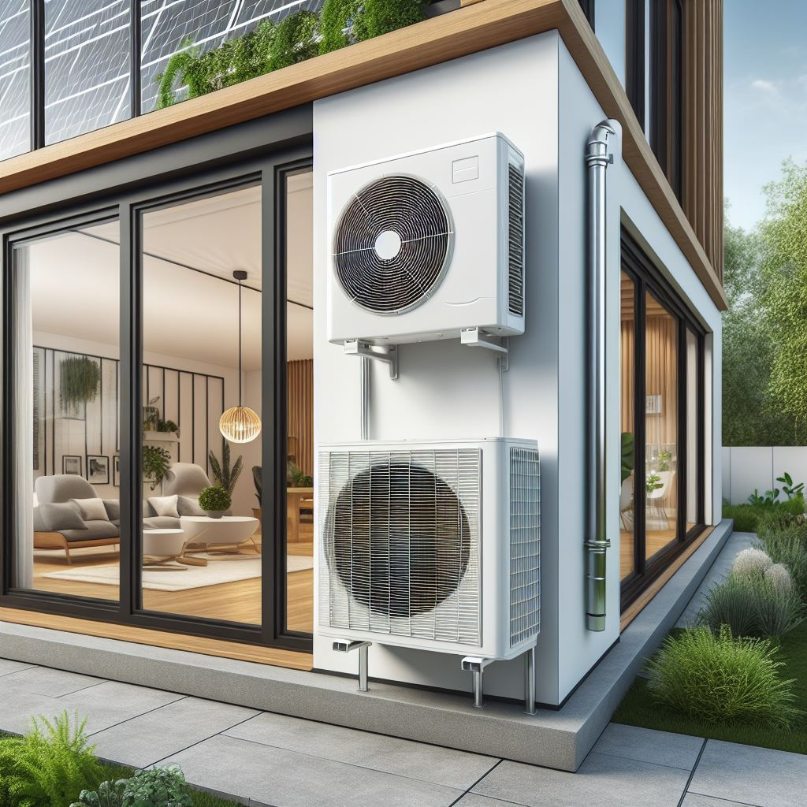</a>
    <figcaption class="text-center">Wärmepumpe</figcaption>
</figure>

Eine Luft-Wasser-Wärmepumpe sorgt für warmes Brauchwasser und versorgt die
Fußbodenheizung.

Ein Hygienespeicher kann als zusätzlicher Speicher für Warmwasser dienen: Der
Heizstab erhitzt das Wasser im Hygienespeicher. Wenn man dann Warmwasser
benötigt, wird Trinkwasser in einem Rohr durch den Hygienespeicher geführt und
so erwärmt.

Es gibt keine Öl-, Gas-, oder Holz-Heizung. Das heißt es gibt auch keinen Schornstein.
Daher gibt es auch keine Kosten für Schornsteinfeger.

Wenn man ein Kaminfeuer genießt, kann man auch ohne Schornstein einen Kamin auf
Ethanol-Basis haben. Ein Liter Ethanol hat einen Brennwert von 5.9 kWh/L. Ein
Neubau hat eine Heizlast von max. 50 Watt/m². Weil Ethanol so leicht entzündlich
ist darf man maximal 20L lagern. Für 120m² wären das nicht mal ein Tag. Für
Notfälle ist das also eher nicht geeignet.

Alternativen zur Luft-Wasser-Wärmepumpe:

* Luft-Luft-WP: Erwärmt leider nicht das Brauchwasser. Man könnte zusätzlich
  eine Brauchwasserwärmepumpe einbauen, aber das sorgt für mehr Arbeit. Die
  Luft-Luft-WP (Klimasplitgeräte) können noch kühlen, aber das sollte man mit
  sinnvoller verschattung auch schaffen.
* Infrarot-Heizung: Besticht durch die Tatsache, dass sie in der Anschaffung
  günstig ist, leicht ersetzt werden kann, und keine Wartung benötigt. Die
  Lebensdauer ist auch gut. Gut für kleine Räume die meistens kühler sein
  können, z.B. Toilette oder Badezimmer.

### Smart Home

<figure class="wp-caption aligncenter img-thumbnail">
    
    <figcaption class="text-center">Smart Home</figcaption>
</figure>

* Ethernet-Buchse in jedem Raum
* Temperatur-, Feuchtigkeits, und Anwesenheits-Sensor (Radar) in jedem Raum.
  Wenn niemand im Raum ist soll das Licht ausgehen.
* Öffnungs-Sensoren an jedem Fenster und jeder Tür: Wenn Fenster offen sind soll
  die Klimaanlage aus gehen.
* Möglichkeit die Rolladen via Smart Home zu steuern
* Smart Home erfasst verbrauch automatisch und schickt Warnung bei unerwartetem
  höherem Verbrauch.
* Home Assistant im lokalen Betrieb

## Sicherheit

* Einbruch: RC-Standard; Kameras rund ums Haus
* Hochwasserschutz: Rückstauklappen
* Elektrizität und Blitzschlag: FI-Schalter, Sicherungen ... alles Standard?
* Feuer: Rauchmelder und in jedem Stockwerk einen Feuerlöscher

## Türen

<figure class="wp-caption aligncenter img-thumbnail">
    <a href="../images/2024/01/haustuer.jpg">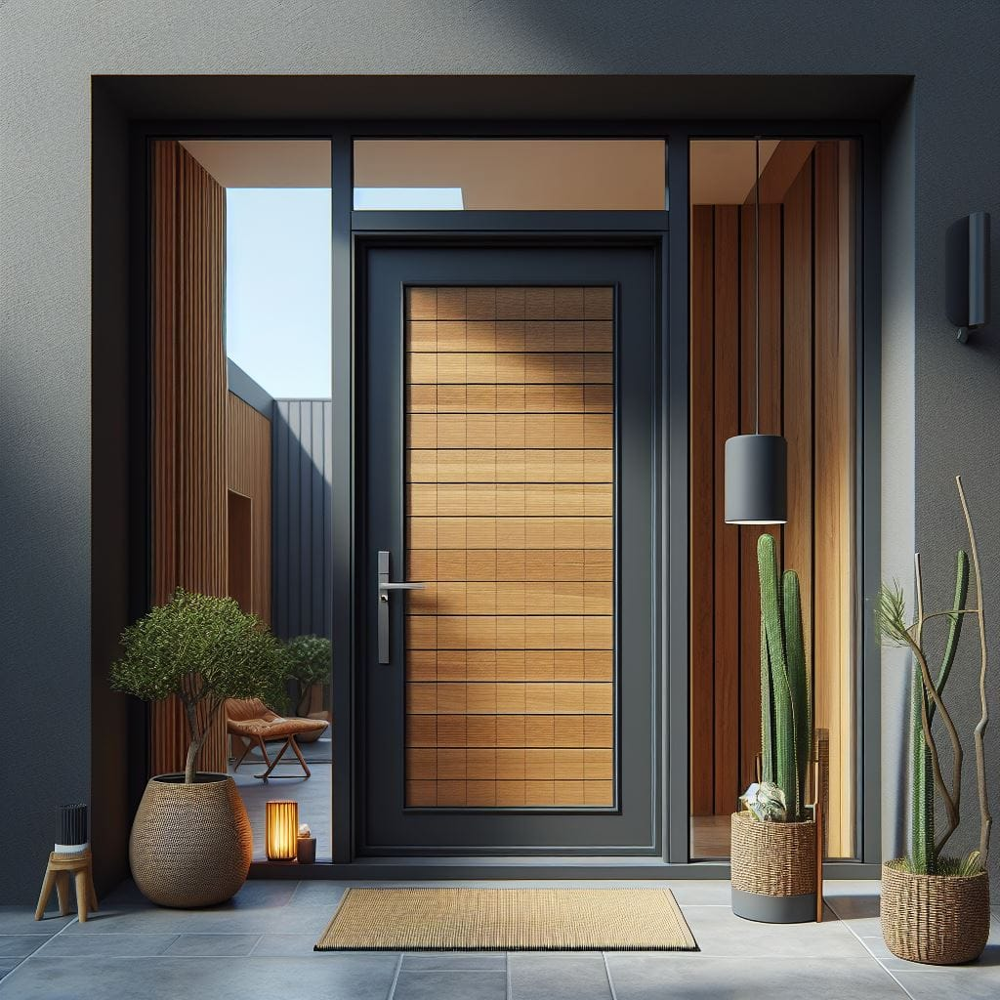</a>
    <figcaption class="text-center">Haustür</figcaption>
</figure>

Haustür:

* Aus Aluminium
* Bolzen zum Verschluss
* mechanisches Automatik-Schloss
* Türspion

Innentüren:

* Vollspan: Deutlich hochwertiger als Röhrenspan; hat bessere
  Schallschutz-Werte.
* CPL (Continuous Pressure Laminate) ist eine widerstandsfähige Beschichtung.
* Hohe Türen
* Verdeckte Bänder

## Boden

Fliesen bieten den Vorteil, dass man eine Fußbodenheizung einbauen kann. Da ich
eher auf Split-Klimaanlagen setzen würde, ist dieser Vorteil nicht wichtig.
Mit kalibrierten und rektifizierten Fliesen erreicht man kleine Fugengrößen. Das
erleichtert die Reinigung. Abriebsklasse 4 oder 5 sorgt dafür, dass man keine
Kratzer bekommt - bei Feinsteinzeug wäre das immer der Fall. Brandklasse A1.
Die Rutschklasse gibt an wie glatt / rutschig die Fliese ist.

Parkett muss regelmäßig gewachst und gebonert werden. Manche sind von Parkett
begeistert; ich verstehe nicht wieso.

Was bei Fliesen die Abriebklasse ist, ist bei Vinyl wohl die Nutzklasse.

Vinyl oder großflächige Fliesen. Eben etwas das Wasserresistent ist und leicht
zu reinigen ist.

Alternativen:

* Teppich: Fest verbauter Teppich wird dreckig und kann man dann nicht reinigen.
* Echtholzparkett: Französisches Fischgrät-Eichenparkett im Schlafzimmer, weil
  es Fußwarm ist und der Boden im Schlafzimmer nur gering belastet wird.
* Klickparkett
* Laminat

### Fugenloser Boden

Fugenlose Böden kennt man eigentlich nur aus Garagen, Kellern, und Kaufhäusern.
Man kann sie aber auch im Wohnbereich nutzen. Die Optionen sind:

* Gießen: Kunstharzbeläge
    * Epoxidharz (z.B. Murface Industrial)
    * Acryl (z.B. Murface Mono)
    * Polyurethan (PU)
* Spachteln:  Steinteppich (Marmor- bzw. Quarzkies)
* Gießen und spachteln möglich: Mineralischer Spachtelboden
    * Zement+Quarzsand
    * Microzement (Zement + Harze), auch Beton Ciré genannt. Nicht geeignet für
      dauernasse Böden (Badezimmer)!

Alle Methoden benötigen einen ebenen Untergrund, welcher durch eine Nivelliermasse
hergestellt wird. Ggf. ist eine Grundierung nötig.

Die Spachtel-Methoden benötigen eine Versiegelung.

### Klassisch

Zusammenaddiert durch alle Schichten der Fußbodenheizung sollte der
Wärmedurchlasswiderstand einen Richtwert von max. 0,15 m2K/W nicht
überschreiten.

<table>
  <thead>
    <tr>
        <th></th>
        <th>Feinsteinzeug Fliese</th>
        <th>Parkett</th>
        <th>Kork</th>
        <th>Laminat</th>
        <th>Vinyl</th>
        <th>Linoleum</th>
    </tr>
  </thead>
  <tbody>
    <tr>
      <th>Aufbau und Kommentare</th>
      <td></td>
      <td></td>
      <td></td>
      <td>Laminat ist sehr trittlaut, dh man benötigt eine Dämmschicht. Es kommt nur
  bedingt mit Feuchtigkeit klar.</td>
      <td>Gibt es als "loses" Vinyl (billig), Klickvinyl (medium), und Hartvinyl
  (teuer, auch SPC-Vinyl genannt). Schwere Gegenstände können Druckstellen
  hinterlassen. Modernere Variante des PVC.</td>
      <td>Kann bei viel Nässe verrotten; besteht hauptsächlich aus Leinöl und Naturharzen</td>
    </tr>
    <tr>
        <th>Preis</th>
        <td>25&euro;/m&sup2; (21,49&nbsp;&euro;&nbsp;/ m&sup2; -&nbsp;70 &euro;&nbsp;/ m&sup2;)</td>
        <td>30 &euro;/m&sup2; - 60&euro;/m&sup2;</td>
        <td>40&euro;/m&sup2; (16.50&euro;/m&sup2; - 47&euro;/m&sup2;)</td>
        <td>16&euro;/m&sup2; (10&euro;/m&sup2; - 25&euro;/m&sup2;)</td>
        <td>26&euro;/m&sup2; (20&euro; - 60&euro;)</td>
        <td>24&euro;/m&sup2;</td>
    </tr>
    <tr>
        <th>Brandklasse</th>
        <td class="good">A1</td>
        <td class="bad">Cfl-s1 / Dfl-s1</td>
        <td>B2</td>
        <td class="bad">Cfl-s1</td>
        <td>Bfl-s1</td>
        <td class="bad">Cfl-s1</td>
    </tr>
    <tr>
        <th>St&auml;rke</th>
        <td>11mm</td>
        <td>11.5mm</td>
        <td>10.5mm</td>
        <td>8mm</td>
        <td>3.5 mm - 4mm</td>
        <td>2.5 mm</td>
    </tr>
    <tr>
        <th>Fu&szlig;bodenheizung geeignet</th>
        <td class="good">Ja (Wärmedurchlasswiederstand 0,012)</td>
        <td>M&ouml;glich (Wärmedurchlasswiederstand 0,04 - 0,15)</td>
        <td class="bad">Sehr eingeschr&auml;nkt (Wärmedurchlasswiederstand 0,13)</td>
        <td>M&ouml;glich (Wärmedurchlasswiederstand 0,010)</td>
        <td>M&ouml;glich (Wärmedurchlasswiederstand 0,015)</td>
        <td>Ja (Wärmedurchlasswiederstand 0,010 – 0,04)</td>
    </tr>
    <tr>
        <th>Optik</th>
        <td>Vielf&auml;ltig</td>
        <td>Einseitig</td>
        <td class="bad">Sehr einseitig</td>
        <td class="good">Beliebig</td>
        <td class="good">Beliebig</td>
        <td>TODO</td>
    </tr>
    <tr>
        <th>Kratz-Robustheit</th>
        <td class="good">Sehr gut</td>
        <td>Befriedigend</td>
        <td class="bad">Ausreichend</td>
        <td>Gut</td>
        <td>Gut</td>
        <td>TODO</td>
    </tr>
    <tr>
        <th>Wasser-Robustheit</th>
        <td class="good">extrem wasserabweisend</td>
        <td></td>
        <td>wasserfest + wasserabweisend</td>
        <td>nur bei Feuchtraumlaminat</td>
        <td>typischerweise wasserfest, wasserdicht möglich mit vollflächiger Verklebung</td>
        <td>TODO</td>
    </tr>
    <tr>
        <th>Flecken-Robustheit (Wein)</th>
        <td class="good">Sehr gut</td>
        <td>Ausreichend</td>
        <td class="bad">Mangelhaft</td>
        <td>Befriedigend</td>
        <td>Gut</td>
        <td>TODO</td>
    </tr>
    <tr>
        <th><a href="https://de.wikipedia.org/wiki/W%C3%A4rmeleitf%C3%A4higkeit">Wärmeleitfähigkeit</a> λ*</th>
        <td class="bad">1.05 W/(mK)</td>
        <td class="good">0.11 - 0.21 W/(mK)</td>
        <td class="good">0.079 W/(mK)</td>
        <td class="good">0.17 W/(mK)</td>
        <td class="good">0.17 W/(mK)</td>
        <td class="good">0.17 W/(mK)</td>
    </tr>
  </tbody>
</table>

Weitere:

* PVC: Kommt besser mit Feuchtigkeit klar, aber eine Dampfsperre wird empfohlen.
  Enthält Weichmacher und bei Feuer gibt es giftige Gase. Da Vinyl als moderne
  Variante gilt habe ich es nicht aufgenommen.

Bei Feinsteinzeug-Fließen:

* Durchgefärbt
* Rektifiziert / kalibriert
* Härtegrad

## Gebäudehülle / Fassade

* Großer Dachüberstand, damit man trocken ums Haus herum laufen kann. Damit ist
  die Fassade auch geschützt.
* Möglichst keine Dachfenster
    * Blöd wenn es schneit
    * Es kann rein regnen
    * Teuer - sowohl die Anschaffung, als auch die Reparatur
    * Insektengitter sind schlecht
* Zentrale Lüftung mit Pollenfilter und Wärmerückgewinnung
* Kein Kamin, d.h. keine Kaminkehrer-Kosten. Damit gibts auch keinen Holzofen
  und kein Öl oder Gas.
* Das Grundstück soll vom Haus aus leicht abfallen, damit Regen/Schmelzwasser
  weggeleitet wird.
* Wände relativ dick, damit man keine zusätzlichen Dämmstoffe braucht. Das
  sollte gut für die Wohngesundheit, gut gegen die Hitze im Sommer und für die
  Kälte im Winter, sowie gut für den Schallschutz sein. Damit ist der Wandaufbau
  recht einfach: Außenputz, Wand (z.B. Ziegel oder Poroton?), Kalk-Putz mit
  Kalk-Farbe.

<figure class="wp-caption aligncenter img-thumbnail">
    <a href="../images/2024/01/house.jpg">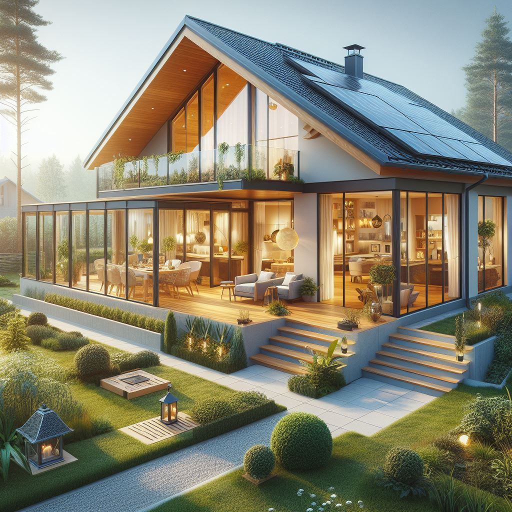</a>
    <figcaption class="text-center">Ein Neubau mit Satteldach und großen Glasflächen, einer Photovoltaik-Anlage, großem Dachüberstand, und schönem Garten</figcaption>
</figure>

### Fenster

* Rolländen: Überall und elektrisch, ohne verbindung nach innen. Aber mit einem
  manuellen Notbetrieb, der von innen erreichbar ist (durchs geöffnete Fenster)
* 3-fach verglast
* Insekten-Rollo (Plissee) in den Fenstern
* Rollos:
    * Solar-Rollos ohne Gurt, aber mit Akku + USB-C-Ladebuchse: Keine Verbindung
    von außen nach innen, keine Kabel.
    * Die Steuerung über einen Funktaster nahe am Fenster. Der Taster sollte mit
    dem Rollo gekoppelt sein und eine Neuverkoppelung sollte über einen Knopf
    bei der Ladebuchse möglich sein. Als offener Standard wäre Zigbee Sub-GHz
    geeignet:
        * Sub-GHz => kommt besser durch Wände
        * Zigbee: Offener Standard der im SmartHome-Bereich üblich ist
        * Mesh-Networking: More stable
    * App-Steuerung

## Küche

<figure class="wp-caption aligncenter img-thumbnail">
    <a href="../images/2023/12/beautiful-kitchen-white-gold.jpg">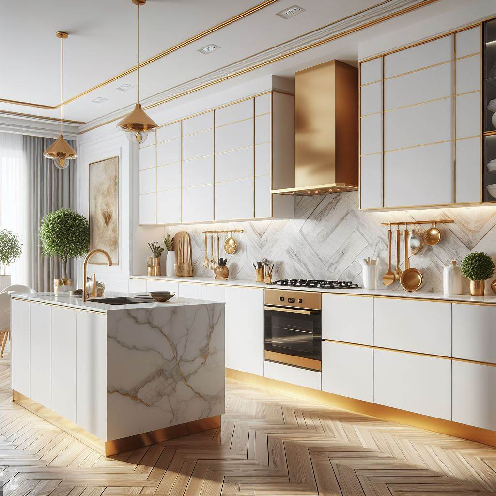</a>
    <figcaption class="text-center">Küche</figcaption>
</figure>

* **Spülbecken**: Flächenbündig oder Unterbaubecken. Im Gegensatz zum Einbau-Spüle
  kann man hier besser reinigen.
* **Herd**:
    * Flächenbündig: Selbes Argument wie beim Spülbecken.
    * Induktionsherd: Sehr geringes Brandrisiko, kein Rauch oder Abgase
    * Umluft-Abzug (keine Abluft): Obwohl Abluft sicherlich besser funktioniert,
      bedeutet es eine schlechtere Wärmedämmung und der Schornsteinfeger muss
      regelmäßig kommen.
* **Backofen**:
    * Ober-Unterhitze, Heißluft, Grill
    * Backauszug
    * 60x60cm: 67L Garraum
    * Mikrowellen-Funktion: z.B. [Bosch HMG6764B1 Serie 8](https://www.bosch-home.com/de/produktliste/kochen-backen/herde-backoefen/einbaubackoefen/HMG6764B1#/Togglebox=accessories/Togglebox=manuals/Togglebox=accessoriesOthers/), [Siemens HM636GNS1 iQ700](https://www.siemens-home.bsh-group.com/de/produktliste/kochen-backen/backoefen-herde/backoefen-mit-mikrowelle/HM636GNS1#/Togglebox=accessories/Togglebox=manuals/Togglebox=accessoriesOthers/)
    * Dampf-Garer
* **Arbeitsplatte**: Aus
  [Beton](https://homewithstefani.com/diy-concrete-countertops/) (auch in
  [Marmor-Optik](https://www.youtube.com/watch?v=4537Eh2ZNys)), weil es sonst
  mit dem flächenbündigen Einbau schwer wird. Aus Keramik würde wohl auch gehen,
  aber da würde ich mir sorgen machen, dass was kaputt geht - Dekton ist da wohl
  besser, aber auch viel teurer. Beton ist auch günstiger als Keramik. Quartz
  fühlt sich besser an als Keramik.
* **Dunstabzug**: In die Herdplatte hinein. Das kann man (hoffentlich) besser
  reinigen.
* **Appliance Garage**: Ein "Versteck" für so etwas wie den Wasserkocher,
  Reiskocher, Toaster. Einfach damit es ordentlich aussieht.

Luxus:

* Kücheninsel: Herd auf der Insel, damit man beim Kochen in den Raum sehen kann.

## Badezimmer

* **Badewanne**: Ein bisschen Luxus muss sein.
* **Toilette**: Hängend. Optimalerweise so, dass ein Wischroboter durch kann.
  Mit Bidet-Funktion (mit warmen Wasser). Beheizter Sitz.
* **Wände und Böden**: Microcement. Keine Fugen im Nassbereich.
* Beheizbarer Handtuchhalter
* **Dusche**: Bodengleich, mit Regendusche und Handbrause. Mit Ablage für
  Shampoo und Duschgel. Mit Sitzgelegenheit. Mit Dusch-WC. Nieschen-Dusche mit
  Pendeltür. Mindestens 90x90cm, besser 120x120cm. Eine Revisionsdusche, also
  eine Dusche bei der man ohne großen Aufwand an die Rohre kommt.

<figure class="wp-caption aligncenter img-thumbnail">
    <a href="../images/2024/01/bathroom.jpg">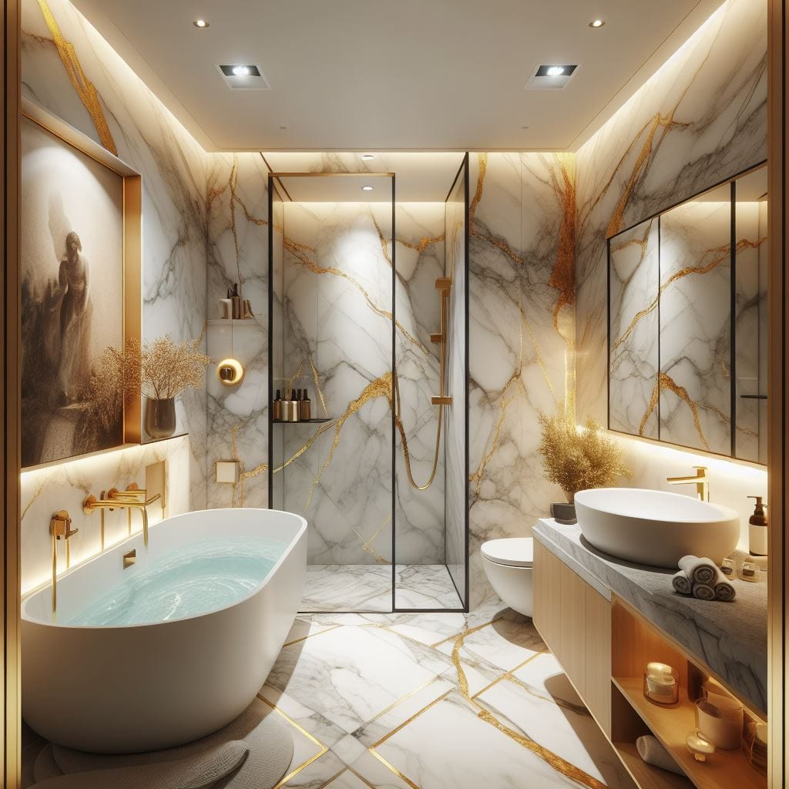</a>
    <figcaption class="text-center">Badezimmer</figcaption>
</figure>

<figure class="wp-caption aligncenter img-thumbnail">
    
    <figcaption class="text-center">Smart Mirror mit Wettervorhersage und Uhr</figcaption>
</figure>

Einrichtung:

* **Handtücher**: 600 g/m² oder mehr, waschbar bei 60°C oder mehr; Walkfrottier

## Wohnzimmer

<figure class="wp-caption aligncenter img-thumbnail">
    <a href="../images/2024/01/living-room.jpg">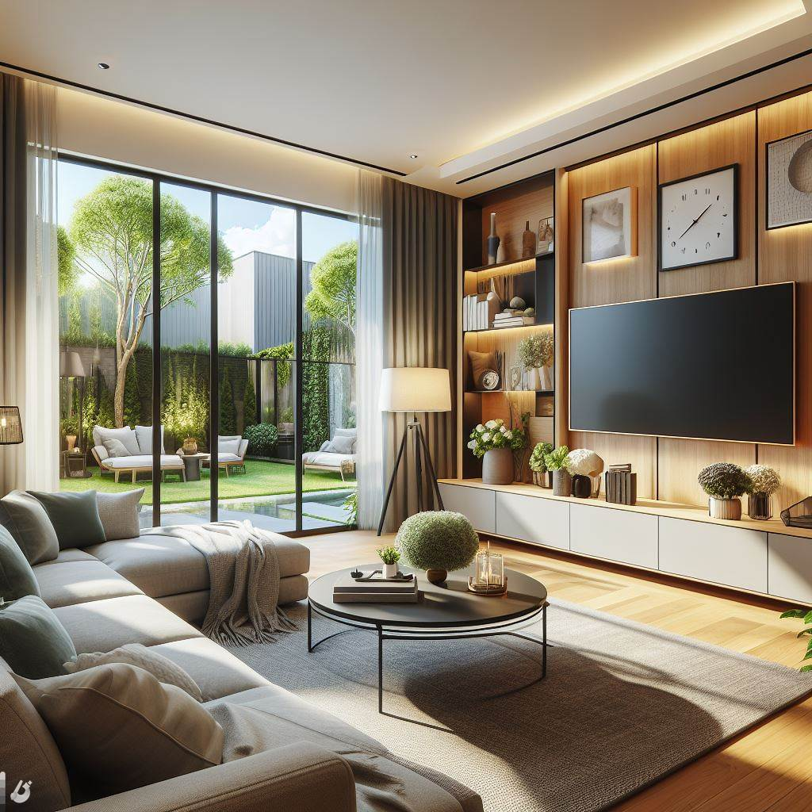</a>
    <figcaption class="text-center">Wohnzimmer</figcaption>
</figure>

* Sitzfenster
* Wohnwand mit Fernseher und Sofa / Couch
* TV: Wandmontage, versteckte Kabel

## Schlafzimmer

* Integrierter "schwebender" Nachttisch; macht die Reinigung leichter

<figure class="wp-caption aligncenter img-thumbnail">
    <a href="../images/2024/01/sleeping-room.jpg">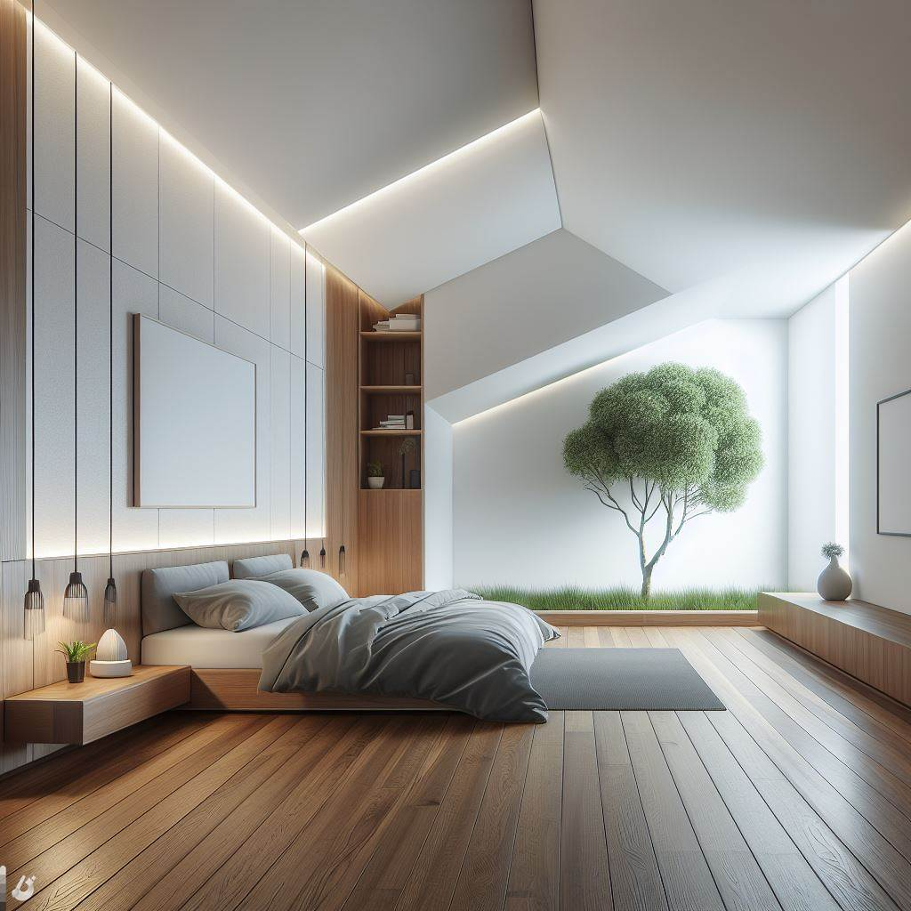</a>
    <figcaption class="text-center">Schlafzimmer</figcaption>
</figure>

## Büro

<figure class="wp-caption aligncenter img-thumbnail">
    
    <figcaption class="text-center">Büro</figcaption>
</figure>

Genug Platz für einen Schreibtisch mit Laptop und zweitem Bildschirm sowie ein
paar Aktenordner. Muss nicht groß sein.

## Kinderzimmer

<figure class="wp-caption aligncenter img-thumbnail">
    
    <figcaption class="text-center">Kinderzimmer</figcaption>
</figure>

* Sollte relativ groß sein, weil Kinder dort ja doch recht viel Zeit verbringen
* Schreibtisch, Bett, Kleiderschrank, und Stauraum müssen Platz haben

## Gästezimmer

<figure class="wp-caption aligncenter img-thumbnail">
    <a href="../images/2024/01/guest-room.jpg">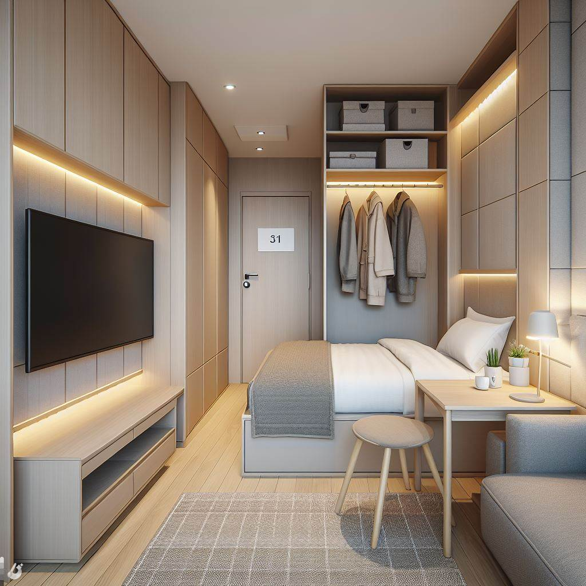</a>
    <figcaption class="text-center">Gästezimmer</figcaption>
</figure>

## Garage

<figure class="wp-caption aligncenter img-thumbnail">
    <a href="../images/2024/01/garage.jpg">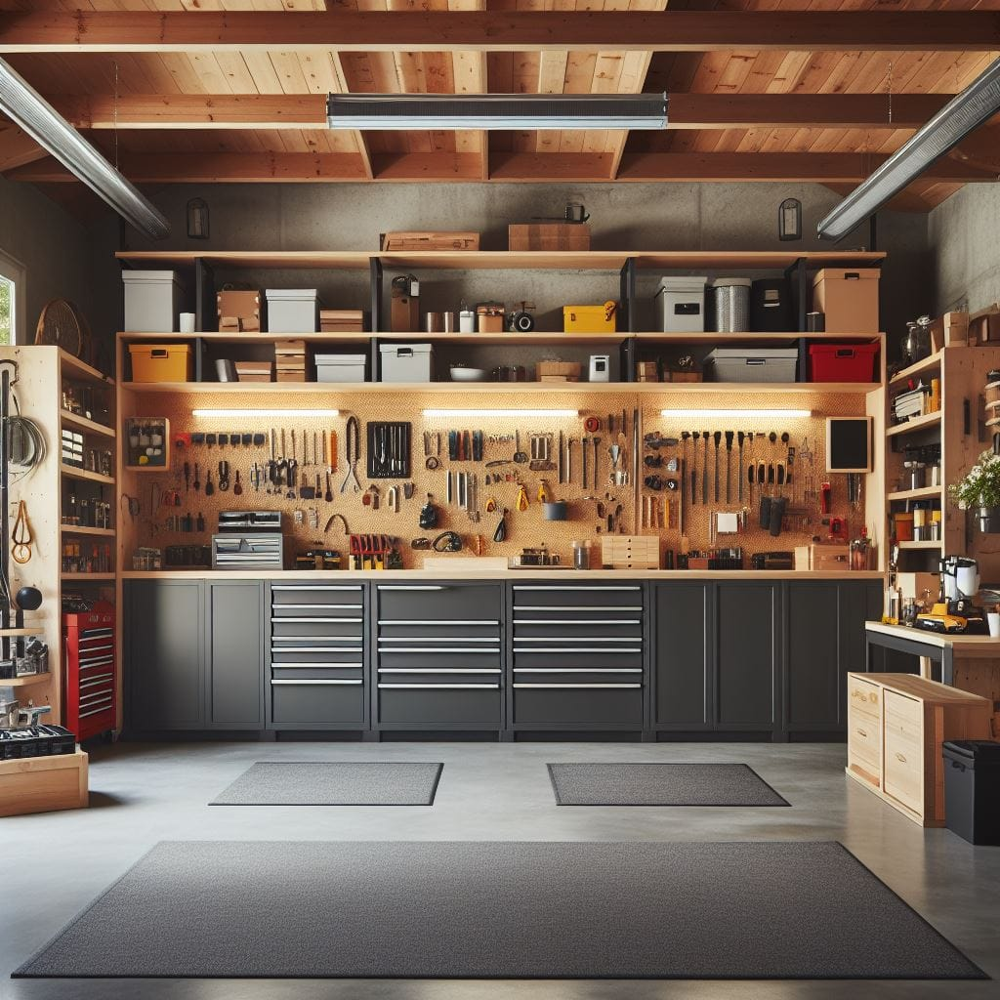</a>
    <figcaption class="text-center">Garage</figcaption>
</figure>

Man muss ein paar Sachen unterbringen können

* Werkzeug fürs Auto / Fahrrad
* Ersatzschläuche
* Gartenwerkzeug
* Stecktafel ("Pegboard") zur Lagerung vom Werkzeug; https://makerworld.com/en/models/134882#profileId-146324; https://www.franks-shed.com/

Ein Waschbecken wäre auch gut. Und natürlich Steckdosen. Eine Wallbox.

## Garten

Eine Chill-Area mit Whirlpool hat schon was, obwohl ich den Energiebedarf nicht so toll finde.

<figure class="wp-caption aligncenter img-thumbnail">
    <a href="../images/2024/01/haus-whirlpool.jpg">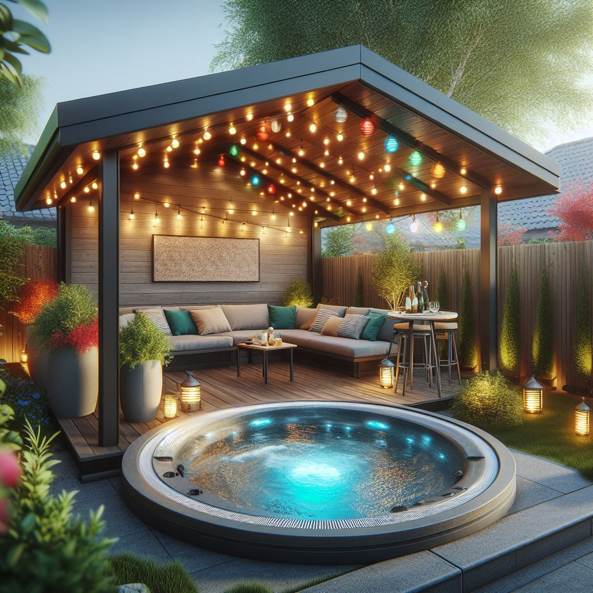</a>
    <figcaption class="text-center">Whirlpool</figcaption>
</figure>

Ein "sunken Firepit" am Pool ist auch cool:

<figure class="wp-caption aligncenter img-thumbnail">
    
    <figcaption class="text-center">Sunken Firepit</figcaption>
</figure>

Und natürlich viele Hochbeete.

<figure class="wp-caption aligncenter img-thumbnail">
    <a href="../images/2024/01/hochbeet.jpg">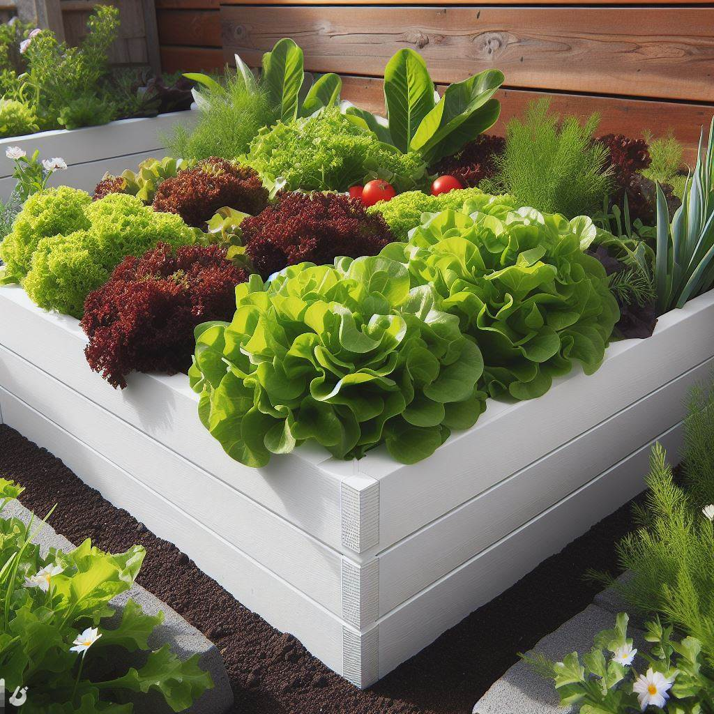</a>
    <figcaption class="text-center">Hochbeet</figcaption>
</figure>

<figure class="wp-caption aligncenter img-thumbnail">
    <a href="../images/2024/01/garden-beds.jpg">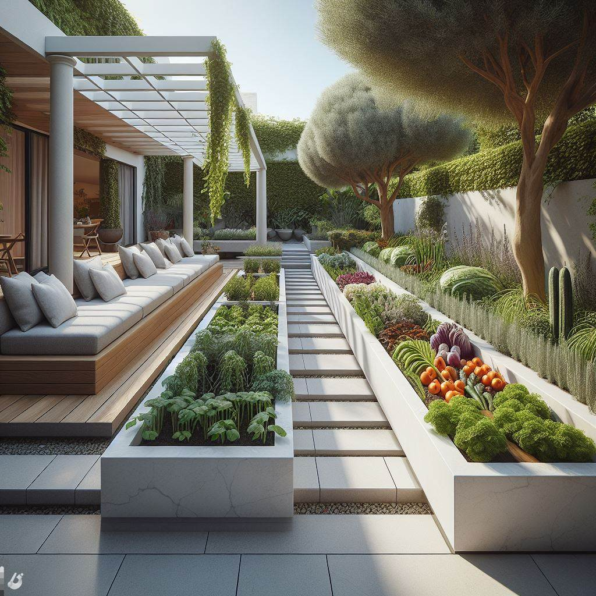</a>
    <figcaption class="text-center">Hochbeet</figcaption>
</figure>

Mit Glasbrocken (Gambionen) in Türkis und LEDs kann man sehr schöne Sachen machen (Wege, Kräuterspirale, Mauern)

## Vorratskeller

<figure class="wp-caption aligncenter img-thumbnail">
    <a href="../images/2024/01/vorratskeller.jpg">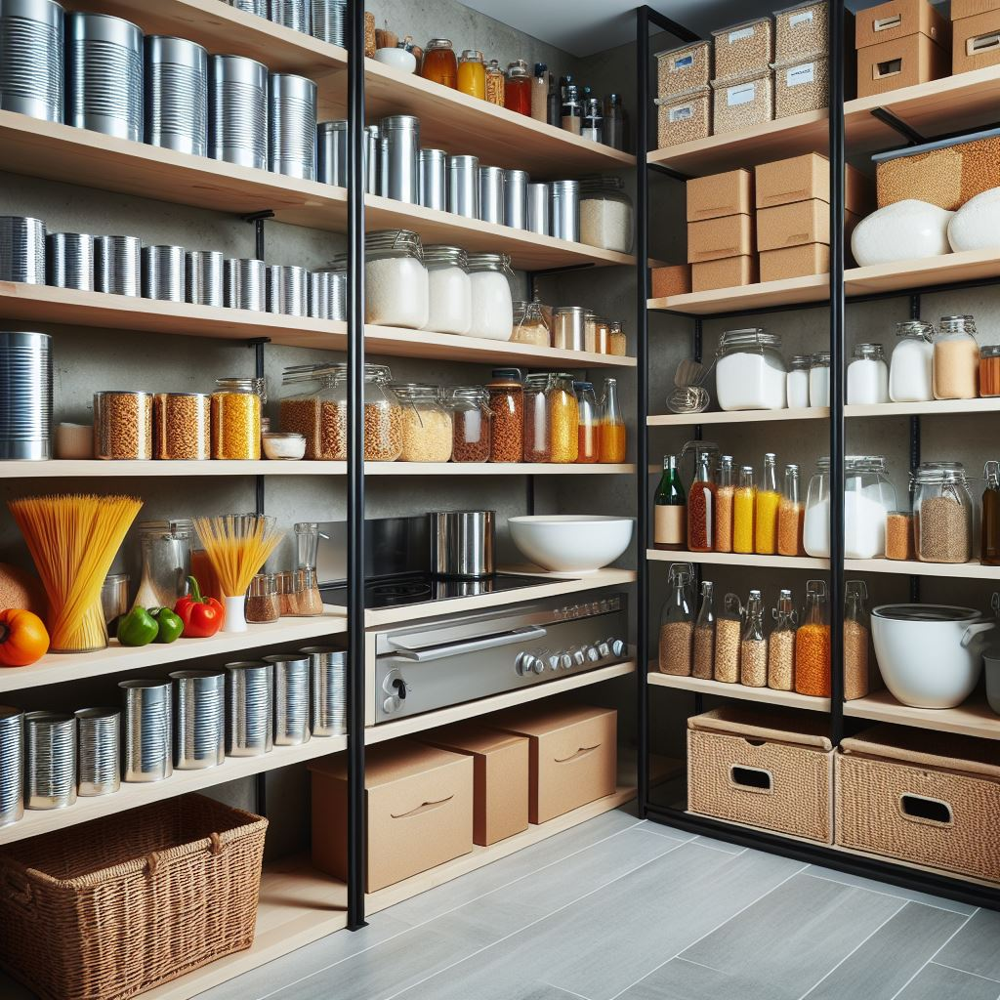</a>
    <figcaption class="text-center">Geordneter Vorratskeller mit Dosen, Nudeln, Mehl, Reis, Einmachgläsern, Öl, Wasserflaschen</figcaption>
</figure>

<figure class="wp-caption aligncenter img-thumbnail">
    
    <figcaption class="text-center">Vorräte</figcaption>
</figure>

* Bundesamt für Bevölkerungsschutz und Katastrophenhilfe: [Essen und Trinken bevorraten](https://www.bbk.bund.de/DE/Warnung-Vorsorge/Vorsorge/Bevorraten/bevorraten_node.html)

## Waschzimmer

* Platz für eine Waschmaschine und einen Trockner
* Wasser-Ablauf im Boden, falls mal was kaputt geht

## Besondere Räume

Meine Frau findet Ankleidezimmer toll:

<figure class="wp-caption aligncenter img-thumbnail">
    
    <figcaption class="text-center">Ankleidezimmer</figcaption>
</figure>

Wintergarten ist auch nice, aber ich bin mir nicht sicher was die Feuchtigkeit angeht.

Und eine Anliegerwohnung ist insgesamt eine gute Idee, z.B. um mit zwei
Generationen im Haus leben zu können.

## Einordnung

<table>
    <thead>
        <tr>
            <th>Kategorie</th>
            <th>Einfach</th>
            <th>Standard</th>
            <th>Gehobene Ausstattung</th>
        </tr>
    </thead>
    <tbody>
        <tr>
            <th>Bodenbeläge</th>
            <td>Alter Teppich, einfacher Linoleum</td>
            <td>Laminat, einfacher Teppich</td>
            <td>Echtholzparkett (z.B. Bauwerk), Natursteinfliesen, Feinsteinzeug (z.B. Villeroy & Boch), großformatige Fließen</td>
        </tr>
        <tr>
            <th>Wände/Decken</th>
            <td>Alte Tapeten, einfacher Putz, Risse</td>
            <td>Raufaser, glatt verputzt (Q2-Spachtelung)</td>
            <td>Glatte Wände (Q3-Q4 Spachtelung), Stuckarbeiten, Designer-Tapeten (z.B. Rasch)</td>
        </tr>
        <tr>
            <th>Heizung</th>
            <td>Einzelöfen, elektrische Direktheizungen (Nachtspeicheröfen, Heizlüfter, Infrarot-Heizung)</td>
            <td>Zentralheizung (Öl/Gas)</td>
            <td>Fußbodenheizung, moderne Heizsysteme wie Wärmepumpen (z.B. Viessmann)</td>
        </tr>
        <tr>
            <th>Fenster</th>
            <td>Einfachverglasung, veraltete Fensterrahmen</td>
            <td>Doppelverglasung, Kunststoffrahmen</td>
            <td>Dreifachverglasung, Fensterrahmen aus Holz oder Aluminium (z.B. Schüco)</td>
        </tr>
        <tr>
            <th>Sanitäre Anlagen</th>
            <td>Alte, abgenutzte Sanitäreinrichtungen</td>
            <td>Standard-Badewanne und Waschbecken, PVC-Rohre</td>
            <td>Designer-Armaturen und -Waschbecken (z.B. Grohe, Duravit), Whirlpool, bodengleiche Duschen, Edelstahl-Rohre</td>
        </tr>
        <tr>
            <th>Küche</th>
            <td>Einfache Küchenzeile, veraltete Geräte</td>
            <td>Einbauküche mit Standardgeräten</td>
            <td>Einbauküche mit Markengeräten (z.B. Miele, Siemens), Arbeitsplatten aus Naturstein oder Quarzkomposit (z.B. Silestone)</td>
        </tr>
        <tr>
            <th>Türen</th>
            <td>Einfache, hohle Türen, veraltete Schlösser</td>
            <td>Röhrenspan-Türen, Standard-Holztüren</td>
            <td>Vollspan-Türen, Massivholztüren, Türen mit Designbeschlägen (z.B. FSB)</td>
        </tr>
        <tr>
            <td>Elektrik</td>
            <td>Alte Verkabelung, wenige Steckdosen</td>
            <td>Standard-Verkabelung, ausreichende Steckdosen</td>
            <td>Smart-Home-Systeme (z.B. KNX), umfassende Elektroinstallationen mit vielen Steckdosen und Beleuchtungskonzepten</td>
        </tr>
        <tr>
            <td>Außenanlagen</td>
            <td>Vernachlässigter Garten, einfacher Betonweg</td>
            <td>Gepflegter Garten, einfache Terrasse</td>
            <td>Professionell angelegter Garten, Terrasse mit Naturstein oder Feinsteinzeug, Außenbeleuchtung (z.B. Licht im Garten)</td>
        </tr>
        <tr>
            <td>Energieeffizienz</td>
            <td>Schlechte Dämmung, hohe Energiekosten</td>
            <td>Durchschnittliche Dämmung, Energieverbrauch &gt;100 kWh/m²a</td>
            <td>Sehr gute Dämmung (z.B. Mineralwolle, Zellulose), niedriger Energieverbrauch (&lt;50 kWh/m²a),  energetisch optimierte Bauweise, Solaranlagen (z.B. SolarWorld)</td>
        </tr>
    </tbody>
</table>

## Einzelnachweise

[^1] selfio.de: [Ratgeber Fußbodenheizung & BodenbelagRatgeber Fußbodenheizung & Bodenbelag](https://www.selfio.de/heizung/fussbodenheizung/ratgeber/fussbodenheizung-bodenbelag/)
[^2] Der Bauladen: [Korkinfo](https://www.bauladen-kirchheim.de/boden/kork3.htm)
[^3] VBG: [Bodenbeläge – Fußbodenmaterial](https://www.vbg.de/SharedDocs/Medien-Center/DE/Faltblatt/Themen/Arbeitsstaetten_gestalten/fi_boden_fussboden.pdf?__blob=publicationFile&v=9)
