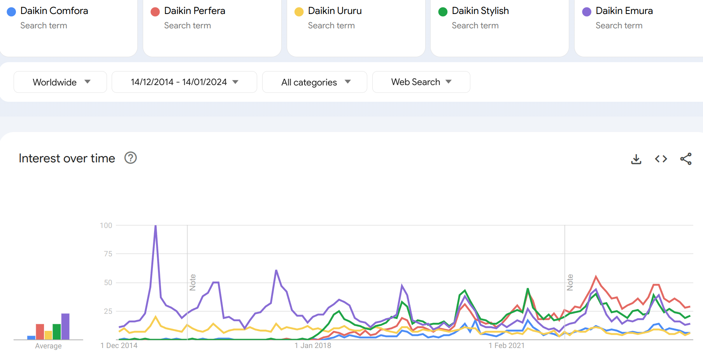

Bei mir ist die Heizung am 26. Dezember ausgefallen. Es war am Ende eine
Kleinigkeit und leicht zu beheben, aber nun mache ich mir Gedanken, wie ich
von der Öl-Heizung wegkomme.

Split-Klimaanlagen haben für mich einen besonderen Charme:

1. **Geringe Anschaffungskosten**: Das einzelne
2. **Geringe Betriebskosten**
3. **Dezentral**: Mehrere Geräte zu haben bedeutet, dass es unwahrscheinlicher wird, dass alle auf einmal ausfallen.
4. **Kühlen**: Im Gegensatz zu anderen Heizsystemen kann man mit den Klimaanlagen halt auch kühlen

## Allgemeines

* TODO: Schalltechnische Entkopplung: Wie funktioniert das, wenn das Gerät an
  der Wand montiert ist?
* Heizleistung: Achtung! Bei niedrigeren Temperaturen sinkt die Heizleistung!

## Betriebskosten

Der SCOP (Seasonal Coefficient of Performance) gibt die Effizienz der Klimaanlage fürs Heizen an. Der SEER macht dasselbe fürs Kühlen.

Mein Haus hat einen geschätzten Heizbedarf von 17400 kWh/a, also ca. 1800L Öl
pro Jahr. Nur fürs Heizen. Für Warmwasser kommen 600-800kWh pro Jahr und Person
dazu.

Das Wohnzimmer macht vermutlich 1/3 des Gesamtbedarfs aus, also 5800 kWh/a.

<table>
    <thead>
    <tr>
        <th>SCOP</th>
        <th>Betriebskosten</th>
        <th>20 Jahre</th>
        <th>Delta zum vorhergehenden</th>
        <th>Heizöl-Ersparnis*</th>
        <th>Kommentar</th>
    </tr>
    </thead>
    <tbody>
    <tr>
        <td>1.0</td>
        <td>1740.00 €/a</td>
        <td class="highlight">34800.00&nbsp;€</td>
        <td>-</td>
        <td class="bad">-20595.92&nbsp;€</td>
        <td>Das wären die Betriebskosten mit einer Stromdirektheizung wie Infrarot oder einem Heizlüfter</td>
    </tr>
    <tr>
        <td class="highlight">3.0</td>
        <td>580.00&nbsp;€/a</td>
        <td>11600.00&nbsp;€</td>
        <td>Δ = 23200.00&nbsp;€</td>
        <td>2604.08&nbsp;€</td>
        <td>Ich finde aktuell keine Klimaanlage, die so schlecht ist. Trotzdem würde sie 2604€ im Vergleich zum Heizöl sparen. Ohne PV.</td>
    </tr>
    <tr>
        <td>4.0</td>
        <td>435.00&nbsp;€/a</td>
        <td>8700.00&nbsp;€</td>
        <td>Δ = 2900.00&nbsp;€</td>
        <td>5504.08&nbsp;€</td>
        <td></td>
    </tr>
    <tr>
        <td>4.5</td>
        <td>386.67&nbsp;€/a</td>
        <td>7733.40&nbsp;€</td>
        <td>Δ = 966.60&nbsp;€</td>
        <td class="highlight">6470.68&nbsp;€</td>
        <td>Die schlechteste Klimaanlage in meiner Liste hat eine SCOP von 4.5 und würde daher 6470.68&nbsp;€ gegenüber dem Heizöl einsparen.</td>
    </tr>
    <tr>
        <td>4.8</td>
        <td>362.50&nbsp;€/a</td>
        <td>7250.00&nbsp;€</td>
        <td>Δ = 483.40&nbsp;€</td>
        <td>6954.08&nbsp;€</td>
        <td></td>
    </tr>
    <tr>
        <td>5.0</td>
        <td>348.00&nbsp;€/a</td>
        <td>6960.00&nbsp;€</td>
        <td>Δ = 290.00&nbsp;€</td>
        <td>7244.08&nbsp;€</td>
        <td></td>
    </tr>
    <tr>
        <td class="highlight">5.1</td>
        <td>341.18&nbsp;€/a</td>
        <td>6823.60&nbsp;€</td>
        <td>Δ = 136.40&nbsp;€</td>
        <td>7380.48&nbsp;€</td>
        <td>Das scheint ein typischer SCOP zu sein</td>
    </tr>
    <tr>
        <td>5.2</td>
        <td>334.62&nbsp;€/a</td>
        <td>6692.40&nbsp;€</td>
        <td>Δ = 131.20&nbsp;€</td>
        <td>7511.68&nbsp;€</td>
        <td></td>
    </tr>
    <tr>
        <td>5.3</td>
        <td>328.30&nbsp;€/a</td>
        <td>6566.00&nbsp;€</td>
        <td>Δ = 126.40&nbsp;€</td>
        <td>7638.08&nbsp;€</td>
        <td></td>
    </tr>
    <tr>
        <td>5.4</td>
        <td>322.22&nbsp;€/a</td>
        <td>6444.40&nbsp;€</td>
        <td>Δ = 121.60&nbsp;€</td>
        <td>7760.08&nbsp;€</td>
        <td></td>
    </tr>
    <tr>
        <td>5.5</td>
        <td>316.36&nbsp;€/a</td>
        <td>6327.20&nbsp;€</td>
        <td>Δ = 117.20&nbsp;€</td>
        <td>7876.88&nbsp;€</td>
        <td></td>
    </tr>
    <tr>
        <td>5.8</td>
        <td>300.00&nbsp;€/a</td>
        <td>6000.00&nbsp;€</td>
        <td>Δ = 327.20&nbsp;€</td>
        <td>8204.08&nbsp;€</td>
        <td></td>
    </tr>
    <tr>
        <td>5.9</td>
        <td>294.92&nbsp;€/a</td>
        <td>5898.40&nbsp;€</td>
        <td>Δ = 101.60&nbsp;€</td>
        <td>8305.68&nbsp;€</td>
        <td></td>
    </tr>
    <tr>
        <td>6.7</td>
        <td>259.71&nbsp;€/a</td>
        <td>5194.03&nbsp;€</td>
        <td>Δ = 704.37&nbsp;€</td>
        <td>9010.05&nbsp;€</td>
        <td>Die MSZ-LN35VG erreicht diesen Wert angeblich</td>
    </tr>
    </tbody>
</table>

Die 20-Jahreskosten geben den Preis an, den man zum Heizen mit dieser Anlage
verwenden wird. Wenn die Anlage länger hält, natürlich mehr.

Beim Heizöl mit 1,20€/L wäre ich bei 710,20€/a und 14204€ in 20 Jahren.

## Dimensionierung

Als Daumenregel: Anzahl Quadratmeter des Raumes ⋅ 80 W/m² = Benötigte Heizleistung

Besser: Heizlastberechnung

## Förderung
Liste der förderfähigen Wärmepumpenanlagen: https://www.bafa.de/SharedDocs/Downloads/DE/Energie/beg_waermepumpen_anlagenliste.html

Förderung über Umfeldmaßnahme (bis zu 40%, max. 60k€ pro Kalenderjahr!)
Zuerst Antrag stellen!!!!!

## Split-Klimaanlagen

https://www.akkudoktor.net/forum/heizungssysteme/split-klimas-in-schweden/

1. Panasonic - 20644 Beiträge
2. Mitsubishi Electric - 8749 Beiträge
3. Toshiba - 7222 Beiträge
4. Fujitsu - 5650 Beiträge
5. Daikin - 4712 Beiträge
6. Sanyo - 3099 Beiträge

### Panasonic

Etherea CS-Z35ZKEW + CU-Z35ZKE:

* [1238€](https://www.climamarket.eu/de/split-panasonic-cs-z35xkew-cu-z35xke)
* SEER / SCOP: 9.50 / 5.20
* Heizleistung: 4.0 kW
* Empfohlene Fläche: 25 - 35 m²
* Kältemittel: R-32
* Wifi: Inklusive

### LG

* [LG ThinQ Android App](https://play.google.com/store/apps/details?id=com.lgeha.nuts&hl=en_US)
* [LG AC Smart Diagnosis](https://play.google.com/store/apps/details?id=com.lge.android.rac.buzzer&hl=de&gl=US)

LG Inverter, Deluxe Dualcool, Wandgeräte, DC12RH NSJ + DC12RH UL2:

* [2950 €](https://www.klimageraete24.com/klimaanlagen--klimageraete--inverter--vrv--heizen--waermepumpen-/klimaanlage-mit-montage/lg-inverter-deluxe-dualcool-wandgeraete-dc12rh-nsj-dc12rh-ul2-fuer-ca-25m-35m-inkl-montage.html) mit Montage
* SCOP: 4.6
* SEER: 7.6
* Nennheizleistung 4.0 kW
* R32

### Samsung

* [Samsung Electronics](https://de.wikipedia.org/wiki/Samsung_Electronics)
    * Gründung 1969
    * Sitz: Südkorea
    * Mitarbeiter: 270.000
    * Umsatz: 210 Mrd. EUR (2022)
* [Smart Things](https://www.samsung.com/in/support/home-appliances/how-to-connect-your-samsung-smart-ac-to-the-smartthings-app/): [SmartThings](https://play.google.com/store/apps/details?id=com.samsung.android.oneconnect&hl=de_CH)
* [Android Technician App](https://play.google.com/store/apps/details?id=com.samsung.kato&hl=gsw&gl=US)

Wind-Free Elite AR09CXCAAWKN + AR09TXCAAWKX:

* [2162€](https://www.klimaworld.com/samsung-monosplit-klimaanlage-wind-free-elite-2-5-kw.html)
* SCOP: 5.1 (-15 °C bis 24 °C)
* SEER: 8.8 (-10 °C bis 46 °C)
* Mit Bewegungssensor, [Produktseite](https://www.samsung.com/at/business/climate/windfree/)
* Heizleistung: 3.2 kW (0.80 - 7.10)

### Toshiba

* [Toshiba](https://de.wikipedia.org/wiki/Toshiba)
    * Gründung: 1875
    * Sitz: Japan
    * Mitarbeiter: 116.224
    * Umsatz: 21 Mrd. Euro (2021)
* [Toshiba Home AC Control](https://play.google.com/store/apps/details?id=com.toshibatctc.SmartAC&hl=de_AT)

Edge RAS-B13G3KVSG-E + RAS-13J2AVSG-E1

* [1146€](https://www.climamarket.eu/de/split-toshiba-edge-w-13)
* SEER / SCOP: 8.6 / 5.10
* Heizleistung: 4.2 kW
* Kältemittel: R-32
* WLAN: inklusive

Haori RAS-B13N4KVRG-E + RAS-13J2AVSG-E1:

* [1.511 €](https://www.climamarket.eu/de/split-toshiba-ras-b13n4kvrg-e-ras-13j2avsg-e1)
* SEER / SCOP: 8.6 / 5.10
* Heizleistung: 4.2 kW
* Empfohlene Fläche: 25 - 35 m²
* Kältemittel: R-32
* WLAN: inklusive

## Mitsubishi

* [Mitsubishi Electric](https://de.wikipedia.org/wiki/Mitsubishi_Electric)
    * Gründung 1921
    * Sitz: Japan
    * Mitarbeiter: 149.655
    * Umsatz: 38.1 Mrd. EUR ()
* Control
    * [Home Assistant](https://www.home-assistant.io/integrations/melcloud/)
    * [Android App: MELCloud](https://play.google.com/store/apps/details?id=mitsubishi.wifi.android.mitsubishiwifiapp&hl=en_US)
* Namen wie MSZ-EF35VGK-W oder MSZ-EF35VGK-B:
    * Block 1
        * MSZ: Mitsubishi Split-Zone; das Innengerät
        * MUZ: Mitsubishi Unit Zone; das Außengerät
    * Block 2
        * Präfix: Design-Serie
            * [RW](https://www.mitsubishi-les.com/de-de/msz-rw-8259.html): SCOP bis 5.2/SEER bis 11.2
            * [LN](https://www.mitsubishi-les.com/de-de/msz-ln-1896.html): SCOP bis 5.2/ SEER bis 10.5 (Diamond Wandgeräte)
            * [AY](https://www.mitsubishi-les.com/de-de/msz-ay-8256.html): SCOP bis 4.8/SEER bis 8.7
            * [FT](https://www.mitsubishi-les.com/de-de/msz-ft-8258.html): SCOP bis 4.8/SEER bis 8.6
            * [EF](https://www.mitsubishi-les.com/de-de/msz-ef-1915.html): SCOP bis 4.7/SEER bis 9.1 (PREMIUM DESIGN-WANDGERÄTE; auch [Kirigamine ZEN](https://innovations.mitsubishi-les.com/files/pdf/de/ME-M-Serie-MSZ-EF-Broschuere-DE.pdf) genannt)
            * [AP](https://www.mitsubishi-les.com/de-de/msz-ap-8320.html): SCOP bis 4.6/SEER bis 7.4
            * [HR](https://www.mitsubishi-les.com/de-de/dam-upload/aktionsflyer-cool-clever-fuer-fachhaendler.pdf?rev=199063): SCOP 4.3
        * 25/35 steht für die Kühlleistung, also 2.5 kW oder 3.5 kW
        * Suffix: VGK/VG2/VGW: Invertertechnologie und andere technische Merkmale
    * Suffix: Farbe des Innengeräts
        * W: Natural White
        * B: Onyx Black
        * V: Pearl White
        * R: Ruby Red

MUZ/MSZ-EF35VGK-W:

* [1350€](https://www.climamarket.eu/de/split-klimaanlage-mitsubishi-electric-msz-ef35vgk-w-muz-ef35vg) - [1420 €](https://www.climamarket.eu/de/split-klimaanlage-mitsubishi-electric-msz-ef35vgk-b-muz-ef35vg)
* SEER / SCOP: 8.8 / 5.6
* Heizleistung: 4.0 kW
* WLAN: inklusive
* Empfohlene Fläche: 25 - 35 m²

MUZ/MSZ-AY25VGK

* [1215€](https://www.klimaworld.com/mitsubishi-klimaanlagen-set-muz-msz-ap25vgk-2-5-kw-1.html)
* SCOP: 4.8 (Einsatzgrenze Heizen -20 °C bis 24 °C)
* SEER: 8.7 (Einsatzgrenze Kühlen -10 °C bis 46 °C)
* Energieleistung Heizen G: 2.4 kW

MUZ/MSZ-LN35VG2:

* [2494€](https://www.klimaworld.com/mitsubishi-klimaanlage-muz-ln35vg-msz-ln35vg-5m-easy-quick.html) ([2109€ ohne Easy-quick](https://www.klimaworld.com/mitsubishi-monosplit-klimaanlage-ln35vg2-3-5-kw.html))
* SCOP: 5.1 (-15 °C bis 24 °C)
* SEER: 9.5 (-10 °C bis 46 °C)
* Energieleistung Heizen G: 3.6kW
* IP24
* MELCloud via WiFi Adapter serienmäßig

**MUZ/MSZ-LN35VG**

* [1713€](https://www.climamarket.eu/de/mitsubishi-electric-split-msz-ln35vgw) - [1851€](https://www.climamarket.eu/de/mitsubishi-electric-split-msz-ln35vgv) - [2800€](https://kuehlungsprofi.de/produkt/split-klimaanlage-mitsubishi-electric-msz-ln35vgv-muz-ln35vg/)
* SEER / SCOP: 9.5 / 6.7 🤯
* Heizleistung: 4.0kW
* Kältemittel: R-32
* Wifi: Inklusive

### NEXA Energy E

* [733€](https://www.klimaworld.com/split-klimaanlage-nexa-9000-btu-2-9-kw-r32-inkl-6m-leitung-1.html) ([967€](https://www.klimaworld.com/split-klimaanlage-nexa-energy-e-2-9-kw-r32-inkl-kaltemittelleitung-1.html) mit Quick-Connect)
* SCOP: 4.5
* SEER: 4.2
* Energieleistung Heizen G: 2.93
* Arbeitstemperatur kühlen +16~32°C ⚠️ Wir hatten schon 35°C; gerade dann will man kühlen
* Arbeitstemperatur heizen -15~24 °C

### Gree

* [Gree Electric Appliances](https://de.wikipedia.org/wiki/Gree_Electric_Appliances)
    * Gründung: 1993
    * Sitz: China
    * Mitarbeiter: 23.000
* [Android App](https://play.google.com/store/apps/details?id=com.gree.greeplus&hl=de&gl=US)

SOYAL 9 GWH09AKC-K6DNA1A:

* [1892€](https://www.klimaworld.com/gree-monosplit-klimaanlage-g-tech-9-2-7-kw-quick-connect-1.html)
* SCOP: 5.1 (A+++, -25 °C bis +24 °C)
* SEER: 9.4 (A+++, -15 °C bis +52 °C)
* Energieleistung Heizen G: 3.0kW

SOYAL 12 GWH12AKC-K6DNA1A

* [2294€](https://www.klimaworld.com/gree-monosplit-klimaanlage-fairy-black-12-3-5-kw-quick-connect-1.html)
* SCOP: 5.1 (A+++, -25 °C bis +24 °C)
* SEER: 9.0 (A+++, -15 °C bis +52 °C)
* Energieleistung Heizen G: 3.2kW

### Giatsu

* [376€](https://www.climamarket.eu/de/split-klimaanlage-giatsu-gia-s12ar2b-r32-i-gia-s12ar2b-r32-o)
* SEER / SCOP: 6.1 / 4.0
* Heizleistung: 3.80 kW
* Kältemittel: R-32

### Haier

* [Haier](https://de.wikipedia.org/wiki/Haier)
    * Gründung: 1984
    * Sitz: China
    * Mitarbeiter: 70.000

* [757€](https://www.climamarket.eu/de/split-klimaanlage-haier-as35s2sf1fa-wh-1u35s2sm1fa)
* SEER / SCOP: 8.50 / 4.60
* Heizleistung: 4.20 kW

## Daikin

* [Daikin Industries](https://de.wikipedia.org/wiki/Daikin_Industries):
    * Gründung 1924
    * Sitz: Japan
    * Mitarbeiter: 88.698
    * Umsatz: 23 Mrd. Euro (2021)
* Control:
    * [Android App](https://play.google.com/store/apps/details?id=eu.daikin.remoapp&hl=de&gl=US)
    * [Home Assistant](https://www.home-assistant.io/integrations/daikin/):
      Daikin has removed their local API in newer products. They offer a cloud
      API accessible only under NDA, which is incompatible with open source.
* Modellbezeichnungen, z.B. FTXP35N5V1B / RXJ20A5V1B ([Nomenclature](https://www.daikinac.com/content/assets/Uploads/PM-DCRG.pdf)):
    * Reihe
        * [Perfera](https://www.daikin.de/de_de/privatkunden/produkte-und-beratung/produktkategorien/waermepumpen/luft-luft-waermepumpen/perfera-wandgeraet.html): Seit 2021 auf dem Markt
        * [Perfera Cold Region](https://www.daikin.de/de_de/privatkunden/produkte-und-beratung/produktkategorien/waermepumpen/luft-luft-waermepumpen/perfera-wandgeraet-cold-region.html)
        * [Stylish](https://www.daikin.de/de_de/privatkunden/produkte-und-beratung/produktkategorien/waermepumpen/luft-luft-waermepumpen/stylish.html): Seit 2017 auf dem Markt, Reddot Award; standardmäßig mit einem Online Controller ausgestattet; Thermo-und Bewegungssensor
        * [Ururu Sarara](https://www.daikin.de/de_de/privatkunden/produkte-und-beratung/produktkategorien/waermepumpen/luft-luft-waermepumpen/ururu-sarara.html): Markteinführung 2018; Entfeuchtung, selbstreinigender Filter
        * [Comfora](https://www.daikin.de/de_de/privatkunden/produkte-und-beratung/produktkategorien/klimaanlagen/comfora.html): Seit 2018 auf dem Markt
        * [Emura 3](https://www.daikin.de/de_de/pressemeldungen/Emura3.html): Markteinführung 2016.
    * Innengerät (FTX): High-Efficiency Wall-Mounted Ductless Heat Pump System
        * Anbringungsart:
            * F: Innengerät
            * FT/CT: Wandmontage
            * FD/CD: Slim Duct
        * Systemtyp:
            * X: Wärmepumpe mit hoher Effizienz
            * F: Deckenmontage
            * K: Cooling only
        * Effizienz:
            *
        * Modellreihe
            * TXP
            * TXJ
            * TXA
        * Kälteleistung
            * 20: 2.0 kW
            * 35: 3.5 kW
        * Suffix: Farbe des Innengeräts
            * W: White
            * B: Black
    * Außengeräte (R): Air-Cooled Outdoor Unit, z.B. RXP35M / RXJ20A5V1B / RXA20A9
        * X: Heat Pump (K wäre nur zum Kühlen)
        * Effizienz:
            * N: Standard
            * _: Mid (Blank)
            * L : Low Ambient
            * S: High
            * G: Highest
        * Zahl:
            * 20: 20.000 BTU/h
            * 35: 35.000 BTU/h
        * Major Design Category: A
        * Power Supply
            * V1: Einphasig
* Support gut ([ronnie auf YouTube](https://www.youtube.com/watch?v=TjIAc9yl-ng))

<figure class="wp-caption aligncenter img-thumbnail">
    
    <figcaption class="text-center">Suchaktivität in Google Trends bzgl. der Daikin Modellreihen</figcaption>
</figure>

### Daikin Comfora

FTXP35N5V1B + RXP35M:

* [939€](https://www.climamarket.eu/de/daikin-split-txp35m)
* SEER / SCOP: 6.62 / 4.64
* Heizleistung: 4.0 kW
* Kältemittel: R-32

### Daikin Emura 3 Wandgerät

FTXJ20A2V1BW + RXJ20A5V1B:

* [3292€](https://www.klimageraete24.com/klimaanlagen--klimageraete--inverter--vrv--heizen--waermepumpen-/klimaanlage-mit-montage/daikin-inverter-emura3-wandgeraet-ftxj20mw-rxj20m-fuer-ca-10m-20m-inkl-montage.html) inkl. Montage
* SCOP (-10°C): 5.15
* Heizleistung: 2.02kW
* SEER: 8.75
* R-32 (675)

FTXJ25AW + RXJ25M:

* [3750€](https://www.klimageraete24.com/klimaanlagen--klimageraete--inverter--vrv--heizen--waermepumpen-/klimaanlage-mit-montage/daikin-inverter-emura3-wandgeraet-ftxj25mw-rxj25m-fuer-ca-15m-25m-inkl-montage.html) inkl. Montage
* SCOP (-10°C): 5.15 (A+++)
* SEER: 8.74
* Deklarierte Leistung bei -10 °C: 2.07 kW

FTXJ35AB + RXJ35A:

* [2050€](https://www.climamarket.eu/de/split-daikin-txj35aw) - [2110€](https://www.climamarket.eu/de/split-daikin-txj35ab) - [2770€](https://www.klimaworld.com/daikin-emura-3-klimaanlage-ftxj35aw-rxj35a-mattweiss-3-4-kw-1.html)
* SCOP (-10°C): 5.15 (A+++)
* SEER: 8.74
* Heizleistung: 4.0 kW
* Wifi: Sprachsteuerung via Alexa oder Google Assistant
* Kältemittel: R-32

### Daikin Stylish

<iframe width="560" height="315" src="https://www.youtube.com/embed/F5NVM-djpAo" title="YouTube video player" frameborder="0" allow="accelerometer; autoplay; clipboard-write; encrypted-media; gyroscope; picture-in-picture; web-share" allowfullscreen></iframe>

3 Farben:

* Silber
* Weiß
* Blackwood

FTXA20+RXA20A9:

[1890€](https://www.klimaworld.com/daikin-stylish-klimaanlage-ftxa20-rxa20a-2-0-kw.html)

* SCOP: 5.15 (A+++)
* SEER: 8.75
* Energieleistung Heizen G: 2.5 kW

FTXA25+RXA25A9:

* [2090€](https://www.klimaworld.com/daikin-stylish-klimaanlage-set-ftxa25-rxa25a-2-5-kw.html)
* SCOP (-10°C): 5.15 (A+++)
* SEER: 8.74
* Energieleistung Heizen G in kW: 3.0 kW

FTXA25BS + RXA25A:

* [3640€](https://www.klimageraete24.com/klimaanlagen--klimageraete--inverter--vrv--heizen--waermepumpen-/klimaanlage-mit-montage/daikin-inverter-stylish-wandgeraet-ftxa25bs-rxa25a-fuer-ca-15m-25m-inkl-montage.html) inkl. Montage
* SCOP (-10°C): 5.15 (A+++)
* SEER: 8.74
* Deklarierte Leistung bei -10 °C: 2.3 kW

FTXA25BB + RXA25A:

* [3580€](https://www.klimageraete24.com/klimaanlagen--klimageraete--inverter--vrv--heizen--waermepumpen-/klimaanlage-mit-montage/daikin-inverter-stylish-wandgeraet-ftxa25bb-rxa25a-fuer-ca-15m-25m-inkl-montage.html) inkl. Montage
* SCOP (-10°C): 5.15 (A+++)
* SEER: 8.74
* Deklarierte Leistung bei -10 °C: 2.3 kW

FTXA35+RXA35A9:

* [2390€](https://www.klimaworld.com/daikin-stylish-klimaanlage-set-ftxa35-rxa35a-3-4-kw.html)
* SCOP (-10°C): 5.15 (A+++)
* SEER: 8.73 (A+++)
* Energieleistung Heizen G in kW: 4.0 kW

### DAIKIN Perfera

<iframe width="560" height="315" src="https://www.youtube.com/embed/6YfMXII6ZSg" title="YouTube video player" frameborder="0" allow="accelerometer; autoplay; clipboard-write; encrypted-media; gyroscope; picture-in-picture; web-share" allowfullscreen></iframe>

Features:

* 2-Zonen Bewegungssensor + 3D Luftstrom

[Erfahrungen und Probleme](https://www.akkudoktor.net/forum/heizungssysteme/daikin-perfera-erfahrungen-und-probleme/):

* Bedarfssteuerung: Man muss mehr manuell eingreifen als erhofft
* Probleme bei zu kleinen Räumen

FTXM25R+RXM25R9

* [1538€](https://www.klimaworld.com/daikin-professional-r-32-klimaanlage-set-ftxm25n-rxm25n9-2-5-kw.html)
* SCOP: 5.1 (A+++)
* SEER: 8.65 (A+++)
* Energieleistung Heizen G in kW: 2.8 kW
* Sprachsteuerung via Amazon Alexa oder Google Assistant möglich.

FTXM35R+RXM35R9

* [1196€](https://www.climamarket.eu/de/split-klimaanlage-daikin-ftxm35r-rxm35r) - [1636€](https://www.klimaworld.com/catalog/product/view/id/87937/s/daikin-professional-r-32-klimaanlage-set-ftxm35n-rxm35n9-3-4-kw/) bzw. [3065 €](https://www.klimageraete24.com/klimaanlagen--klimageraete--inverter--vrv--heizen--waermepumpen-/klimaanlage-mit-montage/daikin-inverter-perfera-wandgeraet-ftxm35r-rxm35r-fuer-ca-25m-35m-inkl-montage.html) mit Montage
* SCOP (-10°C): 5.1 (A+++)
* SEER: 8.65 (A+++)
* Energieleistung Heizen G in kW: 4.0 kW
* Heizleistung: 2.35 kW
* Wifi: Sprachsteuerung via Amazon Alexa oder Google Assistant möglich.
* R-32 (GWP=675)

### DAIKIN Perfera Cold Region

FTXTM30R+RXTM30R:

* [2217€](https://www.klimaworld.com/daikin-r32-klimaanlage-perfera-cold-region-ftxtm30m-rxtm30n-3-0-kw-quick-connect.html) mit Quick-Connect
* SCOP: 5.12 (-25~18)
* SEER: 7.6 (-10~46 °C)

FTXTM40R + RXTM40R:

* [1969€](https://www.breeze24.com/klimaanlagen/klimaanlage-sets/monosplit-und-multisplit-set/monosplit/wandgeraet/daikin-set-wandgeraet-perfera-cold-region-4-0-kw-ftxtm40r-rxtm40r-hyper-heating-r32) - [2427€](https://www.klimaworld.com/daikin-r32-klimaanlage-perfera-cold-region-ftxtm40m-rxtm40n-4-0-kw.html)
* SCOP: 5.3 (A+++)
* SEER: 7.7 (A++)
* Energieleistung Heizen G: 4.0 kW

FTXTM40R+RXTM40R: [2427€](https://www.klimaworld.com/daikin-r32-klimaanlage-perfera-cold-region-ftxtm40m-rxtm40n-4-0-kw.html)

### DAIKIN Ururu Sarara

<iframe width="560" height="315" src="https://www.youtube.com/embed/4vJW7DJC4xw" title="YouTube video player" frameborder="0" allow="accelerometer; autoplay; clipboard-write; encrypted-media; gyroscope; picture-in-picture; web-share" allowfullscreen></iframe>

FTXZ25N+RXZ25N:

* [3530€](https://www.klimaworld.com/daikin-klimaanlage-ururu-sarara-ftxz35n-rxz35n-5kw-mit-quick-connect-1.html) mit Quick-Connect
* **SCOP: 5.9**
* **SEER: 9.54**
* Energieleistung Heizen G: 3.6 kW
* Arbeitstemperatur kühlen -10~43°C
* Arbeitstemperatur heizen -20~18 °C

FTXZ35N+RXZ35N:

* [3838€](https://www.klimaworld.com/daikin-klimaanlage-ururu-sarara-ftxz35n-rxz35n-5kw-mit-quick-connect.html) mit Quick-Connect
* SCOP: 5.73
* SEER: 9
* Energieleistung Heizen G: 5.0 kW
* Arbeitstemperatur kühlen -10~43°C
* Arbeitstemperatur heizen -20~18 °C

FTXZ50N+RXZ50N:

* [3993€](https://www.klimaworld.com/daikin-klimaanlage-ururu-sarara-r-32-ftxz50n-rxz50n-5kw.html) ([4438€ mit Quick-Connect](https://www.klimaworld.com/daikin-klimaanlage-ururu-sarara-ftxz50n-rxz50n-5kw-mit-quick-connect.html))
* SCOP: 5.5
* SEER: 8.6
* Energieleistung Heizen G: 5.0 kW
* Arbeitstemperatur heizen -20~18 °C
* Arbeitstemperatur kühlen -10~43°C

## Weiteres

* Stiftung Warentest: [19 Klimageräte Splitgeräte 06/2021, 06/2022, 05/2023](https://www.test.de/Klimageraete-im-Test-4722766-0/)
* Klimaanlagen (Luft-Luft Wärmepumpen) und Lüftungsanlagen sind zwei Paar
  Schuhe. Man kann mit der Klimaanlage Feuchtigkeit aus der Luft nehmen, aber
  die CO2-Konzentration/Schadstoffbelastung wird dadurch nicht geändert.
* Truhengeräte haben eine schlechtere Effizienz als Wandgeräte
